# فصل اول: Hello, C#! Welcome, .NET

در این فصل نخست، اهداف ما عبارتند از: راه‌اندازی محیط توسعه؛ درک شباهت‌ها و تفاوت‌های میان NET. مدرن، NET Core.، NET Framework.، Mono، Xamarin و NET Standard.؛ ایجاد ساده‌ترین برنامه ممکن با 12 #C و 8 NET. با استفاده از ویرایشگرهای کد گوناگون؛ و در نهایت، آشنایی با مکان‌های مناسب برای جستجوی راهنمایی.

این فصل موضوعات زیر را پوشش می‌دهد:

* معرفی این کتاب و محتوای آن
* راه‌اندازی محیط توسعه‌
* آشنایی با NET.
* ساخت برنامه‌های کنسول (Console Apps) با استفاده از Visual Studio 2022
* ساخت برنامه‌های کنسول با استفاده از Visual Studio Code
* بهره‌گیری مناسب از مخزن GitHub این کتاب
* جستجو برای راهنمایی

**معرفی این کتاب و محتوای آن**
بیایید کار را با معرفی راه‌حل‌های کد و ساختار این کتاب به شما آغاز کنیم.

**دریافت راه‌حل‌های کد برای این کتاب**
مخزن (Repository) گیت‌هابِ این کتاب حاوی راه‌حل‌هایی در قالب پروژه‌های کامل نرم‌افزاری برای تمام وظایف کدنویسی و تمرین‌هاست که در لینک زیر قابل دسترسی می‌باشد:
<https://github.com/markjprice/cs12dotnet8>

پس از مراجعه به مخزن GitHub در مرورگر وب خود، کلید . (نقطه) را روی صفحه‌کلید فشار دهید، یا به‌صورت دستی در نوار آدرس، com. را به dev. تغییر دهید تا با استفاده از قابلیت GitHub Codespaces، مخزن را به یک ویرایشگر کد زنده (Live Code Editor) مبتنی بر Visual Studio Code تبدیل کنید؛ همان‌طور که در شکل ۱.۱ نشان داده شده است:

 <div align="center">

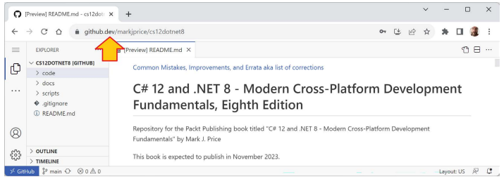
</div>

در ادامه ترجمه متن ارائه شده با لحن و ساختار کتاب درخواستی آمده است:

ما یک فایل PDF در اختیار شما قرار می‌دهیم که شامل تصاویر رنگی از اسکرین‌شات‌ها و نمودارهای استفاده شده در این کتاب است. شما می‌توانید این فایل را از آدرس <https://packt.link/gbp/9781837635870> دانلود کنید.
اجرای ویژوال استودیو کد (Visual Studio Code) در مرورگر وب، در کنار ویرایشگر کد محلی انتخابی خود، هنگام انجام وظایف کدنویسی این کتاب بسیار عالی است. شما می‌توانید کدهای خود را با کدهای پاسخ (Solution) مقایسه کرده و در صورت نیاز، بخش‌هایی را به راحتی کپی و پیست (Copy and Paste) کنید.

برای به دست آوردن کدهای حل‌تمرین (Solution Code) این کتاب، نیازی به استفاده از Git یا دانستن چیزی درباره آن ندارید.
شما می‌توانید با استفاده از لینک مستقیم زیر، یک فایل ZIP شامل تمام کدهای حل‌تمرین را دانلود کرده و سپس فایل ZIP را در سیستم فایل محلی خود استخراج (Extract) کنید:
<https://github.com/markjprice/cs12dotnet8/archive/refs/heads/main.zip>.

**اصطلاحات دات‌نت استفاده شده در این کتاب**
در سراسر این کتاب، من از اصطلاح **«دات‌نت مدرن» (Modern .NET)** برای اشاره به .NET 8 و پیشینیان آن مانند .NET 6 که ریشه در .NET Core دارند، استفاده می‌کنم. من از اصطلاح **«دات‌نت قدیمی» (Legacy .NET)** برای اشاره به .NET Framework، Mono، Xamarin و .NET Standard استفاده می‌کنم.
دات‌نت مدرن، یکپارچه‌سازی (unification) آن پلتفرم‌ها و استانداردهای قدیمی است.

**ساختار و سبک این کتاب**
پس از این فصل اول، کتاب می‌تواند به سه بخش تقسیم شود: زبان، کتابخانه‌ها و توسعه وب.
ابتدا دستور و واژگان زبان C#؛ دوم، انواع (Types) موجود در کتابخانه‌های دات‌نت برای ساخت ویژگی‌های برنامه؛ و سوم، اصول وب‌سایت‌های چندسکویی، سرویس‌ها و برنامه‌های مرورگر که می‌توانید با استفاده از C# و دات‌نت آن‌ها را بسازید.

بیشتر افراد مباحث پیچیده را با تقلید و تکرار بهتر از خواندن توضیح دقیق نظری یاد می‌گیرند؛ بنابراین، من شما را در طول این کتاب با توضیحات دقیق از هر مرحله تحت فشار قرار نخواهم داد. ایده این است که شما را به نوشتن کد و دیدن اجرای آن وادار کنم.
نیازی نیست که فوراً از تمام جزئیات ریز و درشت مطلع باشید. این چیزی است که با زمان و ساخت برنامه‌های خودتان و فراتر رفتن از آنچه هر کتابی می‌تواند به شما بیاموزد، به دست می‌آید.

به قلم ساموئل جانسون، نویسنده دیکشنری انگلیسی در سال ۱۷۵۵، من مرتکب «چند اشتباه آشکار و پوچی‌های خنده‌دار شده‌ام که از هیچ اثری با این پیچیدگی مبرا نیست». من مسئولیت کامل این موارد را بر عهده می‌گیرم و امیدوارم چالش تلاش من برای «مهار طوفان» با نوشتن این کتاب درباره فناوری‌های سریعاً در حال تکامل مانند C# و .NET، و برنامه‌هایی که می‌توانید با آن‌ها بسازید را درک کنید.

اگر شکایتی نسبت به این کتاب دارید، لطفاً قبل از نوشتن نقد منفی در آمازون با من تماس بگیرید. نویسندگان نمی‌توانند به نظرات آمازون پاسخ دهند، بنابراین من نمی‌توانم با شما تماس بگیرم تا مشکل را حل کنم و به شما کمک کنم یا به بازخورد شما گوش دهم و سعی کنم در چاپ بعدی بهتر عمل کنم. لطفاً سوال خود را در کانال Discord این کتاب در آدرس <https://packt.link/csharp12dotnet8> بپرسید، یا به من در آدرس <markjprice@gmail.com> ایمیل بزنید، یا مسئله‌ای (Issue) در مخزن گیت‌هاب کتاب در لینک زیر مطرح کنید:
<https://github.com/markjprice/cs12dotnet8/issues>.

**مباحث پوشش داده شده در این کتاب**
مباحث زیر در این کتاب پوشش داده شده‌اند:

* **اصول زبان:** ویژگی‌های اساسی زبان C#، از اعلان متغیرها تا نوشتن توابع و برنامه‌نویسی شیءگرا.
* **اصول کتابخانه:** ویژگی‌های اساسی کتابخانه کلاس پایه (Base Class Library) دات‌نت و همچنین برخی بسته‌های (Package) مهم اختیاری برای کارهای رایج مانند دسترسی به پایگاه داده.
* **اصول توسعه وب:** ویژگی‌های اساسی فریم‌ورک ASP.NET Core برای توسعه وب‌سایت و سرویس وب در سمت سرور و سمت کلاینت.

**مباحث پوشش داده شده در کتاب Apps and Services with .NET 8**
مباحث زیر در کتاب همراهی با عنوان «برنامه‌ها و سرویس‌ها با دات‌نت ۸» (Apps and Services with .NET 8) موجود است:

* **داده‌ها:** SQL Server، Azure Cosmos DB.
* **کتابخانه‌های تخصصی:** تاریخ‌ها، زمان‌ها، مناطق زمانی و بین‌المللی‌سازی؛ کتابخانه‌های شخص ثالث رایج برای مدیریت تصویر، ثبت وقایع (Logging)، نگاشت و تولید PDF‌ها؛ چندوظیفگی و همروندی (Multitasking and concurrency) و بسیاری دیگر.
* **سرویس‌ها:** کشینگ (Caching)، صف‌بندی (Queuing)، سرویس‌های پس‌زمینه، gRPC، GraphQL، Azure Functions، SignalR و APIهای حداقلی (Minimal APIs).
* **رابط‌های کاربری:** ASP.NET Core، Blazor و .NET MAUI.

**سلام C#! به .NET خوش آمدید!**
این کتاب، «C# 12 و .NET 8 - اصول توسعه چندسکویی مدرن»، بهتر است به صورت خطی، فصل به فصل خوانده شود، زیرا مهارت‌ها و دانش اساسی را تدریجی می‌سازد.
کتاب همراه، «Apps and Services with .NET 8»، را می‌توان بیشتر شبیه به یک کتاب آشپزی (Cookbook) مطالعه کرد، بنابراین اگر به ویژه به ساخت سرویس‌های gRPC علاقه دارید، می‌توانید آن فصل را بدون خواندن فصول قبلی در مورد سرویس‌های API حداقلی مطالعه کنید.

برای دیدن فهرستی از تمام کتاب‌هایی که با انتشارات پکت (Packt) منتشر کرده‌ام، می‌توانید از لینک زیر استفاده کنید:
<https://subscription.packtpub.com/search?query=mark+j.+price>
فهرستی مشابه در آمازون نیز موجود است:
<https://www.amazon.com/Mark-J-Price/e/B071DW3QGN/>
شما می‌توانید کتاب‌های مرا در وب‌سایت‌های دیگر فروش کتاب نیز جستجو کنید.

**راه‌اندازی محیط توسعه خود**
قبل از شروع برنامه‌نویسی، به یک ویرایشگر کد برای C# نیاز خواهید داشت. مایکروسافت خانواده‌ای از ویرایشگرهای کد و محیط‌های توسعه یکپارچه (IDE) را ارائه می‌دهد که شامل موارد زیر است:

* Visual Studio 2022 برای ویندوز
* Visual Studio Code برای ویندوز، مک یا لینوکس
* Visual Studio Code برای وب یا GitHub Codespaces

اشخاص ثالث ویرایشگرهای کد C# خود را نیز ایجاد کرده‌اند، برای مثال JetBrains Rider که برای ویندوز، مک یا لینوکس موجود است اما دارای هزینه لایسنس است. JetBrains Rider در میان توسعه‌دهندگان دات‌نت باتجربه محبوب است.

**هشدار!** اگرچه JetBrains شرکتی فوق‌العاده با محصولات عالی است، هم Rider و هم افزونه ReSharper برای ویژوال استودیو نرم‌افزار هستند، و تمام نرم‌افزارها دارای باگ و رفتارهای عجیب و غریب هستند. برای مثال، آن‌ها ممکن است خطاهایی مانند "Cannot resolve symbol" (نمی‌تواند نماد را حل کند) را در صفحات Razor (Razor Pages)، نمای‌های Razor (Razor views) و کامپوننت‌های Blazor نشان دهند. با این حال، شما می‌توانید آن فایل‌ها را بسازید و اجرا کنید زیرا مشکل واقعی وجود ندارد. اگر افزونه پشتیبانی از Unity را نصب کرده باشید، در مورد عملیات Boxing (که یک مشکل واقعی برای توسعه‌دهندگان بازی Unity است) به شما اخطار می‌دهد، اما در پروژه‌هایی که Unity نیستند، این اخطار اعمال نمی‌شود.

**انتخاب ابزار و نوع برنامه مناسب برای یادگیری**
بهترین ابزار و نوع برنامه برای یادگیری C# و .NET چیست؟
هنگام یادگیری، بهترین ابزار ابزاری است که به شما در نوشتن کد و پیکربندی کمک می‌کند اما آنچه در واقع در پشت صحنه اتفاق می‌افتد را پنهان نمی‌کند. IDEها رابط‌های کاربری گرافیکی فراهم می‌کنند که استفاده از آن‌ها دوستانه است، اما آن‌ها در زیر کار چه کاری برای شما انجام می‌دهند؟ یک ویرایشگر کد پایه‌تر که در حالی که به نوشتن کد کمک می‌کند به عملکرد نزدیک‌تر است، در دوران یادگیری می‌تواند بهتر باشد.

با این حال، می‌توان استدلال کرد که بهترین ابزار، همان چیزی است که قبلاً با آن آشنا هستید یا ابزاری که شما یا تیم شما به عنوان ابزار توسعه روزانه از آن استفاده خواهید کرد. به همین دلیل، می‌خواهم آزاد باشید تا هر ویرایشگر کد یا IDE سی‌شارپی را که می‌خواهید برای تکمیل وظایف کدنویسی این کتاب انتخاب کنید، از جمله Visual Studio Code، Visual Studio 2022 یا حتی JetBrains Rider.
در این کتاب، من دستورالعمل‌های دقیق گام‌به‌گام را در فصل ۱ برای ایجاد چندین پروژه هم در Visual Studio 2022 برای ویندوز و هم در Visual Studio Code ارائه می‌دهم. لینک‌هایی به دستورالعمل‌های آنلاین برای سایر ویرایشگرهای کد نیز وجود دارد، همانطور که در لینک زیر نشان داده شده است:
<https://github.com/markjprice/cs12dotnet8/blob/main/docs/code-editors/README.md>.
در فصول بعدی، من فقط نام پروژه‌ها را همراه با دستورالعمل‌های کلی ارائه می‌دهم، بنابراین می‌توانید از هر ابزاری که ترجیح می‌دهید استفاده کنید.

بهترین نوع برنامه برای یادگیری ساختارهای زبان C# و بسیاری از کتابخانه‌های دات‌نت، برنامه‌ای است که با کدهای اضافی برنامه حواس شما را پرت نکند. برای مثال، نیازی به ایجاد یک برنامه دسکتاپ کامل ویندوز یا یک وب‌سایت فقط برای یادگیری نحوه نوشتن دستور switch وجود ندارد.
به همین دلیل، معتقدم بهترین روش برای یادگیری مباحث C# و دات‌نت در فصل‌های ۱ تا ۱۱، ساخت برنامه‌های کنسولی (Console Apps) است. سپس، در فصل‌های ۱۲ تا ۱۶، وب‌سایت‌ها، سرویس‌ها و برنامه‌های مرورگر وب را خواهید ساخت.

**مزایا و معایب افزونه Polyglot Notebooks**
افزونه Polyglot Notebooks برای Visual Studio Code مکانی آسان و ایمن برای نوشتن قطعات کد ساده جهت آزمایش و یادگیری فراهم می‌کند. برای مثال، دانشمندان داده از آن‌ها برای تحلیل و مصورسازی داده‌ها استفاده می‌کنند. دانشجویان از آن‌ها برای یادگیری نحوه نوشتن قطعات کوچک کد برای ساختارهای زبان و کاوش APIها استفاده می‌کنند.
Polyglot Notebooks به شما امکان می‌دهد یک فایل نوت‌بوک (Notebook) واحد ایجاد کنید که سلول‌هایی (Cells) از مارک‌داون (متوند غنی‌سازی شده) و کد با استفاده از C# و زبان‌های مرتبط دیگر مانند PowerShell، F# و SQL (برای پایگاه‌های داده) را ترکیب می‌کند. این افزونه این کار را با میزبانی یک نمونه از موتور .NET Interactive انجام می‌دهد.

نام قدیمی و منسوخ شده برای این افزونه، «.NET Interactive Notebooks» بود اما زیرا محدود به زبان‌های دات‌نت مانند C# و F# نیست، نام آن تغییر کرد. این افزونه شناسه اصلی خود یعنی ms-dotnettools.dotnet-interactive-vscode را حفظ کرده است.

Polyglot Notebooks دارای محدودیت‌هایی است:

* نمی‌توان از آن برای ایجاد وب‌سایت‌ها، سرویس‌ها و برنامه‌ها استفاده کرد.
* شما نمی‌توانید از متدهای کلاس Console مانند ReadLine یا ReadKey برای دریافت ورودی از کاربر استفاده کنید. (اما روش‌های جایگزینی وجود دارد که اگر تمرین اختیاریِ فقط-آنلاین را در پایان این فصل انجام دهید، یاد خواهید گرفت.)
* نوت‌بوک‌ها نمی‌توانند آرگومان (Argument) دریافت کنند.
* به شما اجازه نمی‌دهد که فضای نام (Namespace) خود را تعریف کنید.
* هنوز هیچ ابزار اشکال‌زدایی (Debugging) ندارد.

در پایان این فصل، فرصتی خواهید داشت تا یک تمرین اختیاری را برای تمرین استفاده از Polyglot Notebits تکمیل کنید.

**ویژوال استودیو کد برای توسعه چندسکویی**
مدرن‌ترین و سبک‌ترین ویرایشگر کد موجود برای انتخاب، و تنها ویرایشگر مایکروسافت که چندسکویی است، Visual Studio Code است. این برنامه می‌تواند روی تمام سیستم‌عامل‌های رایج اجرا شود، از جمله ویندوز، macOS و بسیاری از انواع لینوکس مانند Red Hat Enterprise Linux (RHEL) و اوبونتو.
ویژوال استودیو کد گزینه خوبی برای توسعه مدرن چندسکویی است زیرا مجموعه گسترده و رو به رشدی از افزونه‌ها را برای پشتیبانی از بسیاری از زبان‌ها فراتر از C# دارد. مهم‌ترین افزونه برای توسعه‌دهندگان C# و دات‌نت، **C# Dev Kit** است که در ژوئن ۲۰۲۳ به عنوان نسخه پیش‌نمایش منتشر شد، زیرا ویژوال استودیو کد را از یک ویرایشگر کد عمومی به ابزاری بهینه‌شده برای توسعه‌دهندگان C# و دات‌نت تبدیل می‌کند.

**اطلاعات بیشتر:** شما می‌توانید در مورد افزونه C# Dev Kit در اطلاعیه رسمی در لینک زیر بخوانید:
<https://devblogs.microsoft.com/visualstudio/announcing-csharp-dev-kit-for-visual-studio-code/>.

به دلیل چندسکویی و سبک بودن، ویژوال استودیو کد و افزونه‌هایش را می‌توان روی تمام پلتفرم‌هایی که برنامه‌های شما در آن‌ها مستقر می‌شوند نصب کرد تا اصلاحات سریع باگ‌ها و موارد دیگر انجام شود. انتخاب ویژوال استودیو کد به این معنی است که یک توسعه‌دهنده می‌تواند از یک ویرایشگر کد چندسکویی برای توسعه برنامه‌های چندسکویی استفاده کند. ویژوال استودیو کد از پردازنده‌های ARM پشتیبانی می‌کند به طوری که می‌توانید روی کامپیوترهای Apple Silicon و کامپیوترهای Raspberry Pi توسعه دهید.

ویژوال استودیو کد پشتیبانی قوی از توسعه وب دارد، اگرچه در حال حاضر پشتیبانی ضعیفی از توسعه موبایل و دسکتاپ دارد.
ویژوال استودیو کد به دور از هر شک و شبهه محبوب‌ترین ویرایشگر کد یا IDE است، به طوری که بیش از ۷۳٪ از توسعه‌دهندگان حرفه‌ای در نظرسنجی Stack Overflow 2023 آن را انتخاب کرده‌اند که می‌توانید آن را در لینک زیر مطالعه کنید:
<https://survey.stackoverflow.co/2023/>.

**GitHub Codespaces برای توسعه در ابر (Cloud)**
GitHub Codespaces یک محیط توسعه کاملاً پیکربندی‌شده مبتنی بر ویژوال استودیو کد است که می‌تواند در محیطی میزبانی‌شده در ابر راه‌اندازی (Spun up) شود و از طریق هر مرورگر وبی به آن دسترسی پیدا کرد. این مخازن Git، افزونه‌ها و یک رابط خط فرمان داخلی را پشتیبانی می‌کند تا بتوانید از هر دستگاهی ویرایش، اجرا و تست کنید.
**اطلاعات بیشتر:** شما می‌توانید در لینک زیر اطلاعات بیشتری در مورد GitHub Codespaces کسب کنید:
<https://github.com/features/codespaces>.

**Visual Studio 2022 برای توسعه عمومی**
Visual Studio 2022 برای ویندوز می‌تواند اکثر انواع برنامه‌ها را ایجاد کند، از جمله برنامه‌های کنسولی، وب‌سایت‌ها، سرویس‌های وب و برنامه‌های دسکتاپ. اگرچه می‌توانید از Visual Studio 2022 برای ویندوز برای نوشتن یک برنامه موبایل چندسکویی استفاده کنید، اما همچنان برای کامپایل کردن آن به macOS و Xcode نیاز دارید.
این برنامه تنها روی ویندوز 10 نسخه 1909 یا جدیدتر (Home، Professional، Education یا Enterprise)؛ یا روی ویندوز 11 نسخه 21H2 یا جدیدتر (Home، Pro، Pro Education، Pro for Workstations، Enterprise یا Education) اجرا می‌شود. Windows Server 2016 و نسخه‌های بعدی نیز پشتیبانی می‌شوند. سیستم‌عامل‌های 32 بیتی و حالت S ویندوز پشتیبانی نمی‌شوند.

**هشدار!** Visual Studio 2022 برای مک به طور رسمی از .NET 8 پشتیبانی نمی‌کند و در اوت ۲۰۲۴ به پایان عمر خود (End-of-life) خواهد رسید. اگر از Visual Studio 2022 برای مک استفاده می‌کرده‌اید، باید به Visual Studio Code برای مک، JetBrains Rider برای مک، یا استفاده از Visual Studio 2022 برای ویندوز در یک ماشین مجازی روی کامپیوتر محلی خود یا در ابر با استفاده از فناوری‌هایی مانند Microsoft Dev Box سوئیچ کنید. اطلاعیه بازنشستگی را می‌توانید در اینجا بخوانید: <https://devblogs.microsoft.com/visualstudio/visual-studio-for-mac-retirementannouncement/>.

**آنچه من استفاده کردم**
برای نوشتن و تست کدهای این کتاب، من از سخت‌افزار و نرم‌افزار زیر استفاده کردم:

* Visual Studio 2022 برای ویندوز روی:
  * ویندوز 11 روی لپ‌تاپ HP Spectre (Intel)
* Visual Studio Code روی:
  * macOS روی دسکتاپ Mac mini (M1) با پردازنده Apple Silicon
  * ویندوز 11 روی لپ‌تاپ HP Spectre (Intel)
* JetBrains Rider روی:
  * macOS روی دسکتاپ Mac mini (M1) با پردازنده Apple Silicon
  * ویندوز 11 روی لپ‌تاپ HP Spectre (Intel)

امیدوارم شما هم به انواع سخت‌افزارها و نرم‌افزارها دسترسی داشته باشید، زیرا دیدن تفاوت‌های پلتفرم‌ها درک شما از چالش‌های توسعه را عمیق‌تر می‌کند، اگرچه هر یک از ترکیبات بالا برای یادگیری اصول C# و .NET و نحوه ساخت برنامه‌ها و وب‌سایت‌های عملی کافی است.

شما می‌توانید یاد بگیرید که چگونه با استفاده از یک Raspberry Pi 400 که سیستم‌عامل Ubuntu Desktop 64-bit دارد با C# و .NET کد بنویسید، با خواندن یک مقاله اضافه که من در لینک زیر نوشته‌ام:
<https://github.com/markjprice/cs12dotnet8/tree/main/docs/raspberry-pi-ubuntu64>.

**استقرار چندسکویی (Deploying cross-platform)**
انتخاب ویرایشگر کد و سیستم‌عامل شما برای توسعه، محدودکننده مکانی که کد شما در آن مستقر (Deploy) می‌شود نیست.
.NET 8 از پلتفرم‌های زیر برای استقرار پشتیبانی می‌کند:

* **ویندوز:** ویندوز 10 نسخه 1607 یا جدیدتر. ویندوز 11 نسخه 22000 یا جدیدتر. Windows Server 2012 R2 SP1 یا جدیدتر. Nano Server نسخه 1809 یا جدیدتر.
* **مک:** macOS Catalina نسخه 10.15 یا جدیدتر و در شبیه‌ساز Rosetta 2 x64.
* **لینوکس:** Alpine Linux 3.17 یا جدیدتر. Debian 11 یا جدیدتر. Fedora 37 یا جدیدتر. openSUSE 15 یا جدیدتر. Oracle Linux 8 یا جدیدتر. RHEL 8 یا جدیدتر. SUSE Enterprise Linux 12 SP2 یا جدیدتر. Ubuntu 20.04 یا جدیدتر.
* **اندروید:** API 21 یا جدیدتر.
* **iOS و tvOS:** 11.0 یا جدیدتر.
* **Mac Catalyst:** 10.15 یا جدیدتر. 11.0 یا جدیدتر روی ARM64.

**هشدار!** پشتیبانی دات‌نت از ویندوز 7 و 8.1 در ژانویه ۲۰۲۳ به پایان رسید: <https://github.com/dotnet/core/issues/7556>.

پشتیبانی از Windows Arm64 در .NET 5 و نسخه‌های بعدی به این معنی است که می‌توانید روی دستگاه‌های Windows Arm مانند Microsoft Windows Dev Kit 2023 (که قبلاً با نام Project Volterra شناخته می‌شد) و Surface Pro X توسعه دهید و کدهای خود را روی آن‌ها مستقر کنید.
شما می‌توانید آخرین سیستم‌عامل‌ها و نسخه‌های پشتیبانی‌شده را در لینک زیر بررسی کنید:
<https://github.com/dotnet/core/blob/main/release-notes/8.0/supported-os.md>.

**دانلود و نصب Visual Studio 2022**
بسیاری از توسعه‌دهندگان حرفه‌ای دات‌نت در کارهای روزانه توسعه خود از Visual Studio 2022 برای ویندوز استفاده می‌کنند. حتی اگر تصمیم دارید برای انجام وظایف کدنویسی این کتاب از Visual Studio Code استفاده کنید، ممکن است بخواهید خود را با Visual Studio 2022 برای ویندوز نیز آشنا کنید. تا زمانی که مقدار قابل توجهی کد با یک ابزار ننوشته باشید، واقعاً نمی‌توانید قضاوت کنید که آیا آن نیازهای شما را برطرف می‌کند یا خیر.
اگر کامپیوتر ویندوزی ندارید، می‌توانید از این بخش صرف‌نظر کرده و به بخش بعدی بروید که در آن Visual Studio Code را روی macOS یا لینوکس دانلود و نصب خواهید کرد.

از اکتبر ۲۰۱۴، مایکروسافت نسخه‌ای با کیفیت حرفه‌ای از ویژوال استودیو را به صورت رایگان در اختیار دانشجویان، مشارکت‌کنندگان متن‌باز و افراد قرار داده است. این نسخه Community Edition نامیده می‌شود. هر یک از نسخه‌ها برای این کتاب مناسب هستند. اگر هنوز آن را نصب نکرده‌اید، بیایید الان این کار را انجام دهیم:

1. نسخه 17.8 یا جدیدتر مایکروسافت ویژوال استودیو 2022 برای ویندوز را از لینک زیر دانلود کنید: <https://visualstudio.microsoft.com/downloads/>.
2. نصب‌کننده را اجرا کنید تا نصب آغاز شود.
3. در تب Workloads (محورهای کاری)، موارد زیر را انتخاب کنید:
    * توسعه ASP.NET و وب (ASP.NET and web development).
    * توسعه دسکتاپ دات‌نت (.NET desktop development) (زیرا این شامل برنامه‌های کنسولی می‌شود).
    * توسعه دسکتاپ با C++ با تمام اجزای پیش‌فرض (Desktop development with C++) (زیرا این کار امکان انتشار برنامه‌های کنسولی و سرویس‌های وب را فراهم می‌کند که سریع‌تر شروع به کار می‌کنند و ردپای حافظه (Memory footprint) کمتری دارند).
4. روی Install کلیک کنید و صبر کنید تا نصب‌کننده نرم‌افزارهای انتخابی را دریافت و نصب کند.
5. زمانی که نصب کامل شد، روی Launch کلیک کنید.
6. بار اولی که Visual Studio را اجرا می‌کنید، از شما خواسته می‌شود که وارد شوید (Sign in). اگر حساب مایکروسافت دارید، می‌توانید از آن حساب استفاده کنید. اگر ندارید، در لینک زیر برای یک حساب جدید ثبت‌نام کنید: <https://signup.live.com/>.
7. بار اولی که Visual Studio را اجرا می‌کنید، از شما خواسته می‌شود که محیط خود را پیکربندی کنید. برای Development Settings (تنظیمات توسعه)، گزینه Visual C# را انتخاب کنید. برای رنگ‌بندی (Color theme)، من آبی (Blue) را انتخاب کردم، اما شما می‌توانید هر چیزی را که می‌پسندید انتخاب کنید.
8. اگر می‌خواهید میانبرهای صفحه‌کلید خود را سفارشی کنید، به مسیر Tools | Options… بروید و سپس بخش Keyboard را انتخاب کنید.

**میانبرهای صفحه‌کلید برای Visual Studio 2022 ویندوز**
در این کتاب، من از نشان دادن میانبرهای صفحه‌کلید خودداری می‌کنم، زیرا اغلب سفارشی‌سازی می‌شوند. جایی که آن‌ها در ویرایشگرهای کد ثابت و به طور رایج استفاده می‌شوند، من سعی می‌کنم آن‌ها را نشان دهم.
اگر می‌خواهید میانبرهای صفحه‌کلید خود را شناسایی و سفارشی کنید، می‌توانید طبق لینک زیر این کار را انجام دهید:
<https://learn.microsoft.com/en-us/visualstudio/ide/identifying-and-customizingkeyboard-shortcuts-in-visual-studio>.

**دانلود و نصب Visual Studio Code**
ویژوال استودیو کد در طی سال‌های گذشته به سرعت بهبود یافته و با محبوبیت خود مایکروسافت را به طرز خوشایندی شگفت‌زده کرده است. اگر شجاع هستید و دوست دارید در لبه تکنولوژی (Bleeding edge) زندگی کنید، نسخه Insiders وجود دارد که بیلد روزانه نسخه بعدی است.
حتی اگر قصد دارید فقط از Visual Studio 2022 برای ویندوز برای توسعه استفاده کنید، توصیه می‌کنم Visual Studio Code را دانلود و نصب کنید و وظایف کدنویسی این فصل را با آن انجام دهید، و سپس تصمیم بگیرید که آیا می‌خواهید برای بقیه کتاب فقط به استفاده از Visual Studio 2022 ادامه دهید یا خیر.

حالا بیایید Visual Studio Code، .NET SDK و افزونه C# Dev Kit را دانلود و نصب کنیم:

1. نسخه Stable یا نسخه Insiders ویژوال استودیو کد را از لینک زیر دانلود و نصب کنید: <https://code.visualstudio.com/>.
    **اطلاعات بیشتر:** اگر برای نصب Visual Studio Code به کمک بیشتری نیاز دارید، می‌توانید راهنمای تنظیمات رسمی را در لینک زیر بخوانید: <https://code.visualstudio.com/docs/setup/setup-overview>.
2. .NET SDK را برای نسخه 8.0 و حداقل یک نسخه دیگر مانند 6.0 یا 7.0 از لینک زیر دانلود و نصب کنید: <https://www.microsoft.com/net/download>.
    در دنیای واقعی، بسیار بعید است که فقط یک نسخه .NET SDK روی کامپیوتر خود نصب داشته باشید. برای یادگیری نحوه کنترل اینکه کدام نسخه .NET SDK برای ساخت یک پروژه استفاده می‌شود، ما نیاز به نصب چندین نسخه داریم. .NET 6، .NET 7 و .NET 8 در زمان انتشار در نوامبر 2023 نسخه‌های پشتیبانی‌شده هستند. شما می‌توانید چندین SDK را به صورت همزمان (Side by side) به طور ایمن نصب کنید. جدیدترین SDK برای ساخت پروژه‌های شما استفاده خواهد شد.
3. برای نصب افزونه C# Dev Kit با رابط کاربری، باید ابتدا برنامه Visual Studio Code را اجرا کنید.
4. در Visual Studio Code، روی آیکون Extensions کلیک کنید یا به مسیر View | Extensions بروید.
5. C# Dev Kit یکی از محبوب‌ترین افزونه‌های موجود است، بنابراین باید آن را در بالای لیست ببینید، یا می‌توانید C# را در کادر جستجو وارد کنید.
    C# Dev Kit به افزونه C# نسخه 2.0 یا بعد از آن وابستگی دارد، بنابراین نیازی نیست که افزونه C# را به صورت جداگانه نصب کنید. توجه داشته باشید که افزونه C# نسخه 2.0 یا بعد از آن دیگر از OmniSharp استفاده نمی‌کند زیرا میزبان پروتکل جدید خدمات زبان (LSP) را دارد. C# Dev Kit همچنین وابستگی‌هایی به ابزار نصب .NET برای نویسندگان افزونه (Extension Authors) و IntelliCode برای افزونه‌های C# Dev Kit دارد، بنابراین آن‌ها نیز نصب خواهند شد.
6. روی Install کلیک کنید و صبر کنید تا بسته‌های پشتیبان دانلود و نصب شوند.

**تمرین خوب:** مطمئن شوید که توافق‌نامه مجوز (License agreement) مربوط به C# Dev Kit را می‌خوانید. این مجوز محدودکننده‌تری نسبت به افزونه C# دارد: <https://aka.ms/vs/csdevkit/license>.

**نصب سایر افزونه‌ها**
در فصل‌های بعدی این کتاب، شما از افزونه‌های بیشتری برای Visual Studio Code استفاده خواهید کرد. اگر می‌خواهید همین حالا آن‌ها را نصب کنید، تمام افزونه‌هایی که ما استفاده خواهیم کرد در جدول ۱.۱ نشان داده شده‌اند:

| نام و شناسه افزونه | توضیحات |
| :--- | :--- |
| **C# Dev Kit**<br>ms-dotnettools.csdevkit | افزونه رسمی سی‌شارپ از طرف مایکروسافت. کدهای خود را با یک solution explorer مدیریت کنید و کدهای خود را با کشف و اجرای یکپارچه تست‌های واحد (unit test) تست کنید. شامل افزونه‌های C# و IntelliCode for C# Dev Kit می‌شود. |
| **C#**<br>ms-dotnettools.csharp | پشتیبانی از ویرایش سی‌شارپ، شامل هایلایت کردن نحو (syntax highlighting)، IntelliSense، رفتن به تعریف (Go To Definition)، پیدا کردن تمام ارجاعات (Find All References)، پشتیبانی از اشکال‌زدایی (debugging) برای .NET، و پشتیبانی از پروژه‌های csproj در ویندوز، macOS و لینوکس. |
| **IntelliCode for C# Dev Kit**<br>ms-dotnettools.vscodeintellicode-csharp | ویژگی‌های توسعه‌ی کمکی هوش مصنوعی را برای توسعه‌دهندگان پایتون، تایپ‌اسکریپت/جاوااسکریپت، سی‌شارپ و جاوا فراهم می‌کند. |
| **MSBuild project tools**<br>tintoy.msbuild-project-tools | IntelliSense را برای فایل‌های پروژه MSBuild فراهم می‌کند، شامل تکمیل خودکار (autocomplete) برای ... |

**جدول ۱.۱:** افزونه‌های Visual Studio Code استفاده شده در این کتاب

**مدیریت افزونه‌های Visual Studio Code در خط فرمان**
شما می‌توانید یک افزونه Visual Studio Code را در خط فرمان (command prompt) یا ترمینال نصب کنید، همان‌طور که در جدول ۱.۲ نشان داده شده است:

| دستور | توضیحات |
| :--- | :--- |
| `code --list-extensions` | لیست افزونه‌های نصب شده را نمایش می‌دهد. |
| `code --install-extension` | افزونه مشخص شده را نصب می‌کند. |
| `code --uninstall-extension` | افزونه مشخص شده را حذف می‌کند. |

**جدول ۱.۲:** دستورات برای لیست کردن، نصب و حذف افزونه‌ها

به عنوان مثال، برای نصب افزونه C# Dev Kit، دستور زیر را در خط فرمان وارد کنید:
`code --install-extension ms-dotnettools.csdevkit`

من اسکریپت‌های PowerShell را برای نصب و حذف افزونه‌های Visual Studio Code در جدول قبل ایجاد کرده‌ام. شما می‌توانید آن‌ها را در لینک زیر پیدا کنید:
<https://github.com/markjprice/cs12dotnet8/tree/main/scripts/extension-scripts/>

**درک نسخه‌های Visual Studio Code**
مایکروسافت تقریباً هر ماه یک نسخه جدید با ویژگی‌های جدید (feature version) از Visual Studio Code و نسخه‌های رفع باگ (bug-fix) را با فرکانس بیشتری منتشر می‌کند. برای مثال:
• نسخه ۱.۷۹.۰، انتشار ویژگی‌های ماه می ۲۰۲۳
• نسخه ۱.۷۹.۱، انتشار رفع باگ ماه می ۲۰۲۳

نسخه استفاده شده در این کتاب ۱.۸۲.۱، انتشار رفع باگ اوت ۲۰۲۳ است، اما نسخه Visual Studio Code از اهمیت کمتری نسبت به نسخه افزونه C# Dev Kit یا C# که نصب می‌کنید، برخوردار است. من افزونه C# نسخه ۲.۸.۲۳ یا بالاتر و C# Dev Kit نسخه ۰.۵.۱۵۰ یا بالاتر را توصیه می‌کنم. در حالی که افزونه C# الزامی نیست، اما IntelliSense را هنگام تایپ، پیمایش کد و ویژگی‌های اشکال‌زدایی را فراهم می‌کند، بنابراین نصب و به‌روز نگه داشتن آن برای پشتیبانی از آخرین ویژگی‌های زبان سی‌شارپ بسیار مفید است.

**میانبرهای صفحه کلید برای Visual Studio Code**
اگر می‌خواهید میانبرهای صفحه کلید خود را برای Visual Studio Code شخصی‌سازی کنید، می‌توانید این کار را انجام دهید، همان‌طور که در لینک زیر نشان داده شده است:
<https://code.visualstudio.com/docs/getstarted/keybindings>

من توصیه می‌کنم که یک فایل PDF از میانبرهای صفحه کلید Visual Studio Code را برای سیستم عامل خود از لیست زیر دانلود کنید:
• ویندوز: <https://code.visualstudio.com/shortcuts/keyboard-shortcuts-windows.pdf>
• macOS: <https://code.visualstudio.com/shortcuts/keyboard-shortcuts-macos.pdf>
• لینوکس: <https://code.visualstudio.com/shortcuts/keyboard-shortcuts-linux.pdf>

**درک .NET**

«کسانی که نمی‌توانند گذشته را به یاد آورند، محکومند آن را تکرار کنند.» – جرج سانتایانا

NET.، .NET Core، .NET Framework و Xamarin پلتفرم‌های مرتبط و همپوشانی برای توسعه‌دهندگان هستند که برای ساخت برنامه‌ها و سرویس‌ها استفاده می‌شوند. اگر با تاریخچه .NET آشنا نیستید، من شما را با هر یک از این مفاهیم .NET در لینک زیر آشنا می‌کنم:
<https://github.com/markjprice/cs12dotnet8/blob/main/docs/ch01-dotnet-history.md>

**درک پشتیبانی از .NET**
نسخه‌های .NET یا پشتیبانی بلندمدت (LTS)، پشتیبانی استاندارد (STS) (که قبلاً به عنوان Current شناخته می‌شد)، یا پیش‌نمایش (Preview) هستند، همان‌طور که در لیست زیر توضیح داده شده است:

• انتشارهای LTS (پشتیبانی بلندمدت) گزینه خوبی برای برنامه‌هایی هستند که قصد ندارید به صورت مکرر آن‌ها را به‌روز کنید، اگرچه باید زمان اجرای (runtime) .NET برای کد تولیدی خود را ماهانه به‌روز کنید. انتشارهای LTS توسط مایکروسافت به مدت ۳ سال پس از عرضه عمومی (GA)، یا ۱ سال پس از عرضه انتشار LTS بعدی، هر کدام که طولانی‌تر باشد، پشتیبانی می‌شوند.

• انتشارهای STS (پشتیبانی استاندارد) شامل ویژگی‌هایی هستند که ممکن است بر اساس بازخورد تغییر کنند. این‌ها گزینه خوبی برای برنامه‌هایی هستند که شما به طور فعال در حال توسعه آن‌ها هستید، زیرا دسترسی به آخرین بهبودها را فراهم می‌کنند. انتشارهای STS توسط مایکروسافت به مدت ۱۸ ماه پس از عرضه عمومی (GA)، یا ۶ ماه پس از عرضه انتشار STS یا LTS بعدی، هر کدام که طولانی‌تر باشد، پشتیبانی می‌شوند.

• انتشارهای Preview (پیش‌نمایش) برای تست عمومی هستند. این‌ها گزینه خوبی برای برنامه‌نویسان ماجراجو که می‌خواهند در لبه تکنولوژی (bleeding edge) زندگی کنند، یا نویسندگان کتاب‌های برنامه‌نویسی که نیاز به دسترسی زودهنگام به ویژگی‌های جدید زبان، کتابخانه‌ها و پلتفرم‌های برنامه و سرویس دارند، هستند. انتشارهای پیش‌نمایش معمولاً توسط مایکروسافت پشتیبانی نمی‌شوند، اما برخی از انتشارهای پیش‌نمایش یا نامزد انتشار (RC) ممکن است به عنوان "Go Live" اعلام شوند، به این معنی که توسط مایکروسافت در محیط تولید پشتیبانی می‌شوند.

انتشارهای STS و LTS در طول چرخه عمر خود، اصلاحیه‌های حیاتی (patch) را برای امنیت و قابلیت اطمینان دریافت می‌کنند.

**روش خوب (Good Practice):** شما برای دریافت پشتیبانی باید با آخرین اصلاحیه‌ها به‌روز باشید. برای مثال، اگر سیستم‌ای روی نسخه runtime 8.0.0 در حال اجرا باشد و سپس نسخه 8.0.1 منتشر شود، شما برای دریافت پشتیبانی باید نسخه ۸.۰.۱ را نصب کنید. این به‌روزرسانی‌ها در سه‌شنبه دوم هر ماه منتشر می‌شوند که به Patch Tuesday معروف است.

برای درک بهتر انتخاب‌های شما از انتشارهای STS و LTS، دیدن آن به صورت بصری کمک‌کننده است، با نوارهای سیاه ۳ ساله برای انتشارهای LTS، و نوارهای خاکستری ۱.۵ ساله برای انتشارهای STS، همان‌طور که در شکل ۱.۲ نشان داده شده است:

 <div align="center">

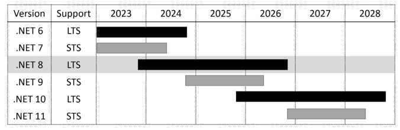
</div>

### چرخه حیات و پشتیبانی دات‌نت (NET.)

در طول عمر دات‌نت ۸، دو نسخه قدیمی‌تر به پایان عمر خود می‌رسند و دو نسخه جدید منتشر خواهند شد. من سعی کرده‌ام این موضوع را در نظر داشته باشم که ممکن است شما بخواهید هم‌زمان با مطالعه این کتاب از دات‌نت ۹ یا دات‌نت ۱۰ استفاده کنید؛ هرچند، بدیهی است که این کتاب نمی‌تواند ویژگی‌های جدید آن نسخه‌های آینده را پوشش دهد!

**پایان پشتیبانی** یا **پایان عمر (EOL)** به معنای تاریخی است که پس از آن، رفع باگ‌ها، به‌روزرسانی‌های امنیتی یا کمک‌های فنی دیگر از سوی مایکروسافت ارائه نخواهد شد.

اگر به پشتیبانی بلندمدت از سوی مایکروسافت نیاز دارید، همین امروز دات‌نت ۸ را انتخاب کنید و حتی پس از انتشار دات‌نت ۹ در سال ۲۰۲۴، به استفاده از آن ادامه دهید. دلیل این امر آن است که دات‌نت ۹ یک نسخه با پشتیبانی کوتاه (STS) خواهد بود و بنابراین پشتیبانی آن در مه ۲۰۲۶، یعنی قبل از پایان پشتیبانی دات‌نت ۸ (در نوامبر ۲۰۲۶)، به پایان خواهد رسید. اما به محض انتشار دات‌نت ۱۰، پروژه‌های دات‌نت ۸ خود را به آن ارتقا دهید. شما یک سال فرصت خواهید داشت تا قبل از اینکه دات‌نت ۸ به پایان عمر خود برسد، این کار را انجام دهید.

> **توصیه مهم (Good Practice):** به خاطر داشته باشید که در تمام نسخه‌ها، باید به نسخه‌های رفع باگ (Bug-fix releases) مانند نسخه ران‌تایم ۸.۰.۱ و نسخه ۸.۰.۱۰۱ از SDK (که انتظار می‌رود در دسامبر ۲۰۲۳ منتشر شوند) ارتقا دهید، زیرا این به‌روزرسانی‌ها به صورت ماهانه منتشر می‌شوند.

در زمان انتشار این مطلب در نوامبر ۲۰۲۳، تمام نسخه‌های دات‌نت مدرن به پایان عمر خود رسیده‌اند، به جز مواردی که در فهرست زیر آمده‌اند (مرتب‌شده بر اساس تاریخ پایان عمر):

* **دات‌نت ۷:** در تاریخ ۱۴ مه ۲۰۲۴ به پایان عمر خود می‌رسد.
* **دات‌نت ۶:** در تاریخ ۱۲ نوامبر ۲۰۲۴ به پایان عمر خود می‌رسد.
* **دات‌نت ۸:** در تاریخ ۱۰ نوامبر ۲۰۲۶ به پایان عمر خود می‌رسد.

شما می‌توانید بررسی کنید که در حال حاضر کدام نسخه‌های دات‌نت پشتیبانی می‌شوند و چه زمانی به پایان عمر خود می‌رسند، از طریق لینک زیر:
`https://github.com/dotnet/core/blob/main/releases.md`

### درک فازهای پشتیبانی دات‌نت

چرخه حیات یک نسخه از دات‌نت از چندین فاز عبور می‌کند که در طی آن‌ها سطوح مختلفی از پشتیبانی ارائه می‌شود، همان‌طور که در فهرست زیر شرح داده شده است:

* **پیش‌نمایش (Preview):** پشتیبانی نمی‌شود. نسخه‌های پیش‌نمایش ۱ تا ۷ دات‌نت ۸ از فوریه ۲۰۲۳ تا اوت ۲۰۲۳ در این فاز پشتیبانی قرار داشتند.
* **آماده اجرا (Go Live):** تا زمان انتشار عمومی (GA) پشتیبانی می‌شود، سپس بلافاصله از پشتیبانی خارج می‌شود؛ بنابراین باید به محض در دسترس قرار گرفتن نسخه نهایی، آن را ارتقا دهید. کاندیداهای انتشار ۱ و ۲ دات‌نت ۸ (Release Candidates) در سپتامبر و اکتبر ۲۰۲۳ در این فاز قرار داشتند.
* **فعال (Active):** دات‌نت ۸ از نوامبر ۲۰۲۳ تا مه ۲۰۲۶ در این فاز پشتیبانی خواهد بود.
* **نگهداری (Maintenance):** تنها با اصلاحات امنیتی برای ۶ ماه آخر عمر خود پشتیبانی می‌شود. دات‌نت ۸ از مه ۲۰۲۶ تا نوامبر ۲۰۲۶ در این فاز قرار خواهد گرفت.
* **پایان عمر (End-of-life):** پشتیبانی نمی‌شود. دات‌نت ۸ در نوامبر ۲۰۲۶ به پایان عمر خود می‌رسد.

### درک نسخه‌های «دات‌نت ران‌تایم» و «دات‌نت SDK»

اگر یک برنامه مستقل (Standalone) نساخته‌اید، **دات‌نت ران‌تایم (Runtime)** حداقل چیزی است که باید نصب کنید تا سیستم‌عامل بتواند یک برنامه دات‌نت را اجرا کند. **دات‌نت SDK** شامل دات‌نت ران‌تایم و همچنین کامپایلرها و سایر ابزارهای مورد نیاز برای ساخت کد و برنامه‌های دات‌نت است.

نسخه‌بندی دات‌نت ران‌تایم از **نسخه‌بندی معنایی (Semantic Versioning)** پیروی می‌کند؛ به این معنی که افزایش عدد اصلی (Major) نشان‌دهنده تغییرات ناسازگار (Breaking changes)، افزایش عدد فرعی (Minor) نشان‌دهنده ویژگی‌های جدید، و افزایش عدد پچ (Patch) نشان‌دهنده رفع باگ‌ها است.

نسخه‌بندی دات‌نت SDK از نسخه‌بندی معنایی پیروی نمی‌کند. اعداد اصلی و فرعی نسخه به نسخه ران‌تایمی که با آن منطبق است، گره خورده‌اند. عدد پچ از قراردادی پیروی می‌کند که نشان‌دهنده نسخه‌های اصلی و فرعی SDK است.

شما می‌توانید نمونه‌ای از این موضوع را در جدول ۱.۳ مشاهده کنید.

 <div align="center">

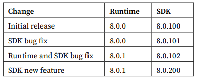
</div>

**لیست کردن و حذف نسخه‌های .NET**
به‌روزرسانی‌های Runtime دات‌نت با یک نسخه اصلی (major version) مانند 8.x سازگار هستند و انتشارهای به‌روزرسانی شده‌ی SDK دات‌نت قابلیت ساخت برنامه‌هایی که نسخه‌های قبلی Runtime را هدف قرار می‌دهند، حفظ می‌کنند که این امر امکان حذف امن نسخه‌های قدیمی را فراهم می‌کند.

شما می‌توانید ببینید که چه SDKها و Runtimeهایی در حال حاضر نصب شده‌اند با استفاده از دستورات زیر:
`dotnet --list-sdks`
`dotnet --list-runtimes`
`dotnet --info`

**روش خوب (Good Practice):** برای تسهیل وارد کردن دستورات در خط فرمان یا ترمینال، لینک زیر تمام دستورات را در سراسر کتاب به عنوان یک عبارت واحد لیست می‌کند که به راحتی می‌توان آن را کپی و پیست (Paste) کرد:
<https://github.com/markjprice/cs12dotnet8/blob/main/docs/command-lines.md>.

در ویندوز، برای حذف SDKهای دات‌نت از بخش Apps & features استفاده کنید.
در لینوکس، مکانیزم واحدی وجود ندارد، اما شما می‌توانید در لینک زیر اطلاعات بیشتری کسب کنید:
<https://learn.microsoft.com/en-us/dotnet/core/install/remove-runtime-sdk-versions?pivots=os-linux>

شما می‌توانید از یک ابزار شخص ثالث مانند Dots، مدیر SDK دوستانه‌ی دات‌نت، استفاده کنید که در لینک زیر یافت می‌شود:
<https://johnnys.news/2023/01/Dots-a-dotnet-SDK-manager>.
در زمان نگارش، شما باید برنامه را از سورس در مخزن گیت‌هاب آن بسازید، بنابراین من آن را فقط برای توسعه‌دهندگان پیشرفته توصیه می‌کنم.

**درک زبان میانی (IL)**
کامپایلر سی‌شارپ (به نام Roslyn) که توسط ابزار خط فرمان dotnet استفاده می‌شود، کد منبع (Source Code) سی‌شارپ شما را به کد زبان میانی (Intermediate Language - IL) تبدیل می‌کند و IL را در یک اسمبلی (یک فایل DLL یا EXE) ذخیره می‌کند. دستورات کد IL شبیه به دستورات زبان اسمبلی هستند که توسط ماشین مجازی دات‌نت، که CoreCLR نامیده می‌شود، اجرا می‌شوند.

در زمان اجرا، CoreCLR کد IL را از اسمبلی بارگذاری می‌کند، کامپایلر در لحظه (Just-In-Time - JIT) آن را به دستورات بومی (Native) CPU کامپایل می‌کند، و سپس توسط CPU روی ماشین شما اجرا می‌شود.

مزیت این فرآیند کامپایل دو مرحله‌ای این است که مایکروسافت می‌تواند Runtimeهای زبان مشترک (Common Language Runtimes - CLRs) را برای لینوکس و macOS، و همچنین برای ویندوز ایجاد کند. همان کد IL در همه جا اجرا می‌شود به دلیل مرحله دوم کامپایل، که کد را برای سیستم عامل بومی و مجموعه دستورالعمل‌های CPU تولید می‌کند.

صرف‌نظر از اینکه کد منبع به چه زبانی نوشته شده است، برای مثال، سی‌شارپ، ویژوال بیسیک، یا F#، تمام برنامه‌های دات‌نت از کد IL برای دستورات ذخیره شده در یک اسمبلی استفاده می‌کنند. مایکروسافت و دیگران ابزارهای دی‌اسمبلی (Disassembler) ارائه می‌دهند که می‌توانند یک اسمبلی را باز کرده و این کد IL را آشکار سازند، مانند افزونه ILSpy .NET Decompiler. شما در فصل ۷، بسته‌بندی و توزیع انواع دات‌نت، در این مورد بیشتر یاد خواهید گرفت.

**مقایسه فناوری‌های .NET**
ما می‌توانیم فناوری‌های فعلی دات‌نت را همان‌طور که در جدول ۱.۴ نشان داده شده است، خلاصه و مقایسه کنیم:

**جدول ۱.۴:** مقایسه فناوری‌های دات‌نت

| فناوری | توضیحات | سیستم‌عامل‌های میزبان |
| :--- | :--- | :--- |
| **Modern .NET** | مجموعه ویژگی‌های مدرن، با پشتیبانی کامل زبان C# 8 تا C# 12. می‌تواند برای مهاجرت (Port) برنامه‌های موجود یا ساخت برنامه‌ها و سرویس‌های دسکتاپ، موبایل و وب جدید استفاده شود. می‌تواند پلتفرم‌های قدیمی‌تر دات‌نت را هدف قرار دهد. | ویندوز، macOS، لینوکس، اندروید، iOS، tvOS، تایزن |
| **.NET Framework** | مجموعه ویژگی‌های قدیمی (Legacy) با پشتیبانی محدود از C# 8 و بدون پشتیبانی از C# 9 یا نسخه‌های بعدی. باید فقط برای نگهداری برنامه‌های موجود استفاده شود. | فقط ویندوز |
| **Xamarin** | فقط برنامه‌های موبایل و دسکتاپ. | اندروید، iOS، macOS |

**مدیریت چندین پروژه با استفاده از ویرایشگرهای کد**
Visual Studio 2022 برای ویندوز، JetBrains Rider، و حتی Visual Studio Code (با افزونه C# Dev Kit نصب شده) همگی مفهومی به نام Solution دارند که به شما اجازه می‌دهد چندین پروژه را همزمان باز کرده و مدیریت کنید. ما از یک Solution برای مدیریت دو پروژه استفاده خواهیم کرد که شما در این فصل ایجاد خواهید کرد.

**ساخت برنامه‌های کنسول با استفاده از Visual Studio 2022**
هدف این بخش نمایش نحوه ساخت یک برنامه کنسول با استفاده از Visual Studio 2022 برای ویندوز است.
اگر شما کامپیوتر ویندوزی ندارید یا می‌خواهید از Visual Studio Code استفاده کنید، می‌توانید این بخش را رد کنید زیرا کد یکی خواهد بود؛ فقط تجربه ابزار متفاوت است. اما من توصیه می‌کنم که این بخش را مرور کنید زیرا برخی از کدها و نحوه عملکرد برنامه‌های سطح بالا (Top-level programs) را توضیح می‌دهد، و این اطلاعات برای تمام ویرایشگرهای کد کاربرد دارد.

این بخش همچنین در مخزن گیت‌هاب (تا در صورت نیاز بتواند پس از انتشار به‌روزرسانی شود) در لینک زیر موجود است:
<https://github.com/markjprice/cs12dotnet8/blob/main/docs/code-editors/vs4win.md>

اگر می‌خواهید دستورالعمل‌های مشابهی برای استفاده از JetBrains Rider ببینید، آن‌ها در مخزن گیت‌هاب در لینک زیر موجود هستند:
<https://github.com/markjprice/cs12dotnet8/blob/main/docs/code-editors/rider.md>

**نوشتن کد با استفاده از Visual Studio 2022**
بیایید نوشتن کد را شروع کنیم:
۱. Visual Studio 2022 را شروع کنید. ممکن است یک تب Welcome (خوش‌آمدگویی) آزمایشی جدید ببینید که جعبه محاوره‌ای مدل قدیمی را جایگزین کرده است، همان‌طور که در شکل ۱.۳ نشان داده شده است.
۲. در تب Welcome، روی New Project کلیک کنید، یا اگر از نسخه‌ای با جعبه محاوره‌ای Modal Visual Studio 2022 استفاده می‌کنید، سپس در بخش Get started، روی Create a new project کلیک کنید:

 <div align="center">

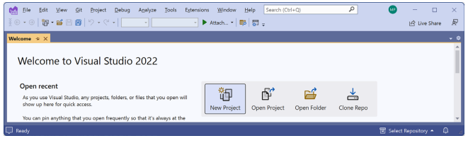
</div>

۳. در کادر محاوره‌ای Create a new project، زبان C# را انتخاب کنید تا الگوهای پروژه (Project Templates) فیلتر شوند، سپس عبارت console را در کادر Search for templates وارد کنید و Console App را انتخاب کنید؛ مطمئن شوید که الگوی پروژه cross-platform (چندسکویی) را انتخاب کرده‌اید، نه آن مربوط به .NET Framework که مخصوص ویندوز است، و همچنین الگوی پروژه C# را به جای زبان‌های دیگر مانند Visual Basic یا TypeScript انتخاب کرده‌اید، به طوری که مطابق شکل ۱.۴ انتخاب شود:

 <div align="center">

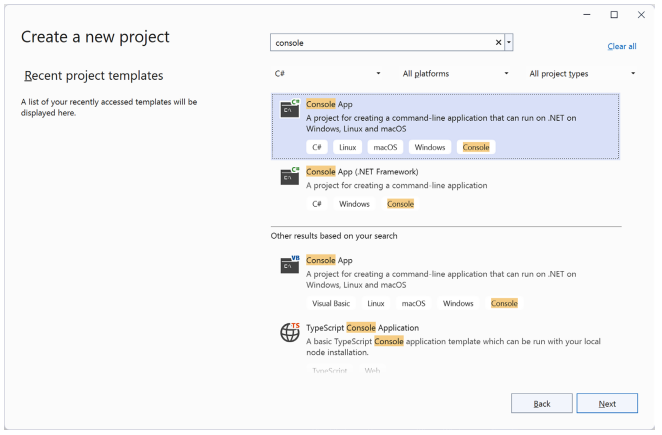
</div>

۴. روی Next کلیک کنید.

۵. در کادر محاوره‌ای Configure your new project، HelloCS را برای نام پروژه، C:\cs12dotnet8 را برای مکان (Location)، و Chapter01 را برای نام Solution وارد کنید.
اسکرین‌شات‌های بیشتری از Visual Studio 2022 هنگام ایجاد پروژه‌های جدید را می‌توانید در مخزن گیت‌هاب در لینک زیر بیابید:
<https://github.com/markjprice/cs12dotnet8/blob/main/docs/ch01-project-options.md>.

۶. روی Next کلیک کنید.

۷. در کادر محاوره‌ای Additional information، در لیست کشویی Framework، توجه داشته باشید که انتخاب‌های SDK دات‌نت شما نشان می‌دهد که آن نسخه Standard Term Support، Long Term Support، Preview یا خارج از پشتیبانی است، و سپس .NET 8.0 (Long Term Support) را انتخاب کنید.
شما می‌توانید به هر تعداد که بخواهید نسخه SDK دات‌نت نصب کنید. اگر نسخه SDK دات‌نت را ندارید، می‌توانید آن را از لینک زیر نصب کنید:
<https://dotnet.microsoft.com/en-us/download/dotnet>.

۸. گزینه انتخاب شده به نام Do not use top-level statements (از عبارات سطح بالا استفاده نشود) را پاک بگذارید. (بعداً در این فصل، شما یک برنامه کنسول ایجاد خواهید کرد که این گزینه را انتخاب می‌کند تا بتوانید تفاوت را ببینید.)

۹. گزینه انتخاب شده به نام Enable native AOT publish (فعال‌سازی انتشار بومی AOT) را پاک بگذارید. شما یاد خواهید گرفت که این گزینه چه کاری انجام می‌دهد در فصل ۷، بسته‌بندی و توزیع انواع دات‌نت.

۱۰. روی Create کلیک کنید.

۱۱. اگر Solution Explorer را نمی‌بینید، به مسیر View | Solution Explorer بروید.

۱۲. اگر کد نمایش داده نمی‌شود، در Solution Explorer، روی فایلی به نام Program.cs دابل-کلیک کنید تا آن را باز کنید، و توجه داشته باشید که Solution Explorer پروژه HelloCS را نشان می‌دهد، همان‌طور که در شکل ۱.۵ آمده است:

 <div align="center">

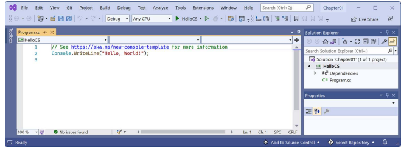
</div>

۱۳. در Program.cs، توجه داشته باشید که کد فقط شامل یک کامنت و یک دستور است، همان‌طور که در کد زیر نشان داده شده است:

```csharp
// See https://aka.ms/new-console-template for more information
Console.WriteLine("Hello, World!");
```

این الگو از قابلیت برنامه سطح بالا (top-level program) استفاده می‌کند که در C# 9 معرفی شده است و من بعداً در این فصل آن را توضیح خواهم داد. همان‌طور که کامنت موجود در کد می‌گوید، شما می‌توانید در لینک زیر اطلاعات بیشتری در مورد این الگو بخوانید:
<https://aka.ms/new-console-template>.

۱۴. در Program.cs، خط ۲ را به گونه‌ای اصلاح کنید که متنی که در کنسول نوشته می‌شود Hello, C#! باشد.

تمامی مثال‌های کد و دستوراتی که خواننده باید بررسی یا تایپ کند به صورت متن ساده (Plain text) نشان داده شده‌اند، بنابراین شما هرگز مجبور نخواهید بود کد یا دستورات را از یک اسکرین‌شات مانند شکل ۱.۵ بخوانید که ممکن است در چاپ خیلی کوچک یا خیلی کمرنگ باشد.

**کامپایل و اجرای کد با استفاده از Visual Studio**
وظیفه بعدی کامپایل و اجرای کد است:
۱. در Visual Studio، به مسیر Debug | Start Without Debugging بروید.

**روش خوب (Good Practice):** وقتی یک پروژه را در Visual Studio 2022 شروع می‌کنید، می‌توانید انتخاب کنید که یک اشکال‌زدا (debugger) متصل شود یا خیر. اگر نیازی به اشکال‌زدایی ندارید، بهتر است آن را متصل نکنید زیرا اتصال debugger نیازمند منابع بیشتری است و همه چیز را کند می‌کند. اتصال debugger همچنین شما را محدود به شروع فقط یک پروژه می‌کند. اگر می‌خواهید بیش از یک پروژه را اجرا کنید، هر کدام با یک debugger متصل، باید چندین نمونه (instance) از Visual Studio را شروع کنید. در نوار ابزار، دکمه مثلث توخالی سبز (در سمت راست HelloCS در نوار بالا شکل ۱.۵) را برای شروع بدون اشکال‌زدایی کلیک کنید به جای دکمه مثلث توپر سبز (در سمت چپ HelloCS در نوار بالا شکل ۱.۵)، مگر اینکه نیاز به اشکال‌زدایی داشته باشید.

۲. خروجی در پنجره کنسول نتیجه اجرای برنامه شما را نشان می‌دهد، همان‌طور که در شکل ۱.۶ آمده است:

 <div align="center">

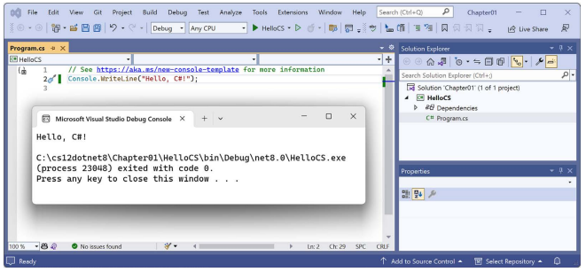
</div>

۳. برای بستن پنجره برنامه کنسول و بازگشت به Visual Studio، کلیدی را فشار دهید.

۴. به صورت اختیاری، پنل Properties را ببندید تا فضای عمودی بیشتری برای Solution Explorer ایجاد شود.

۵. روی پروژه HelloCS دابل-کلیک کنید و توجه داشته باشید که فایل پروژه HelloCS.csproj نشان می‌دهد که این پروژه هدف فریم‌ورک (target framework) خود را روی net8.0 تنظیم کرده است، همان‌طور که در شکل ۱.۷ نشان داده شده است.

۶. در نوار ابزار Solution Explorer، دکمه Show All Files را روشن کنید و توجه داشته باشید که پوشه‌های bin و obj که توسط کامپایلر تولید شده‌اند اکنون قابل مشاهده هستند، همان‌طور که در شکل ۱.۷ آمده است:

 <div align="center">

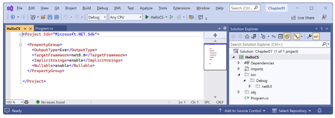
</div>

**درک پوشه‌ها و فایل‌های تولید شده توسط کامپایلر**
دو پوشه تولید شده توسط کامپایلر به نام‌های obj و bin ایجاد شدند، همان‌طور که در لیست زیر توضیح داده شده است:
• پوشه obj شامل یک فایل آبجکت کامپایل شده برای هر فایل کد منبع است. این آبجکت‌ها هنوز به یک فایل اجرایی نهایی پیوند (Link) داده نشده‌اند.
• پوشه bin شامل فایل اجرایی باینری (binary) برای برنامه یا کتابخانه کلاس است. ما در فصل ۷، بسته‌بندی و توزیع انواع دات‌نت، به این موضوع با جزئیات بیشتری نگاه خواهیم کرد.

شما نیازی ندارید که فعلاً داخل این پوشه‌ها را نگاه کنید یا فایل‌های آن‌ها را درک کنید (اما اگر کنجکاو هستید، آزادید که بگردید).
فقط آگاه باشید که کامپایلر برای انجام کار خود نیاز به ایجاد پوشه‌ها و فایل‌های موقت دارد. شما می‌توانید این پوشه‌ها و فایل‌های آن‌ها را حذف کنید و آن‌ها در دفعه بعد که پروژه را "می‌سازید" (Build) یا اجرا می‌کنید، به طور خودکار دوباره ایجاد خواهند شد. توسعه‌دهندگان اغلب این پوشه‌ها و فایل‌های موقت را برای "پاکسازی" (Clean) کردن یک پروژه حذف می‌کنند. Visual Studio حتی دستوری در منوی Build به نام Clean Solution دارد که برخی از این فایل‌های موقت را برای شما حذف می‌کند. دستور معادل در Visual Studio Code عبارت است از `dotnet clean`.

**درک برنامه‌های سطح بالا (Top-level programs)**
اگر قبلاً پروژه‌های قدیمی‌تر دات‌نت را دیده‌اید، ممکن است انتظار کد بیشتری داشتید، حتی فقط برای خروجی دادن یک پیام ساده. این پروژه حداقل دستورات را دارد زیرا برخی از کدهای مورد نیاز توسط کامپایلر زمانی که شما دات‌نت ۶ یا بعدتر را هدف قرار می‌دهید، برای شما نوشته می‌شود.

اگر پروژه را با SDK دات‌نت ۵ یا قبلی ایجاد می‌کردید، یا اگر گزینه انتخاب شده به نام Do not use top-level statements را انتخاب می‌کردید، فایل Program.cs دستورات بیشتری داشت، همان‌طور که در کد زیر نشان داده شده است:

```csharp
using System;

namespace HelloCS
{
  class Program
  {
    static void Main(string[] args)
    {
      Console.WriteLine("Hello, World!");
    }
  }
}
```

در طول کامپایل با SDK دات‌نت ۶ یا بعدتر، تمام کدهای boilerplate (استاندارد و تکراری) برای تعریف کلاس Program و متد Main آن تولید شده و دور دستوراتی که می‌نویسید پیچیده می‌شود.

این از قابلیتی استفاده می‌کند که در دات‌نت ۵ معرفی شد و به برنامه‌های سطح بالا (top-level programs) معروف است، اما تا دات‌نت ۶ مایکروسافت الگوی پروژه برای برنامه‌های کنسول را به‌طور پیش‌فرض برای استفاده از دستورات سطح بالا به‌روزرسانی نکرد. سپس در دات‌نت ۷ یا بعدتر، مایکروسافت گزینه‌هایی را برای استفاده از سبک قدیمی در صورت تمایل شما اضافه کرد:
• اگر از Visual Studio 2022 استفاده می‌کنید، گزینه انتخاب شده به نام Do not use top-level statements را انتخاب کنید.
• اگر از dotnet CLI در خط فرمان استفاده می‌کنید، یک سوئیچ اضافه کنید:
`dotnet new console --use-program-main`

**هشدار!** یک تفاوت عملکردی این است که کد تولید شده به صورت خودکار (auto-generated) یک namespace (فضای نام) تعریف نمی‌کند، بنابراین کلاس Program به صورت ضمنی در یک فضای نام خالی بدون نام تعریف می‌شود، به جای فضای نامی که با نام پروژه مطابقت داشته باشد.

**الزامات برنامه‌های سطح بالا**
نکات کلیدی که باید در مورد برنامه‌های سطح بالا به خاطر بسپارید عبارتند از:
• تنها می‌تواند یک فایل از این نوع در یک پروژه وجود داشته باشد.
• هر دستور using باید در بالای فایل باشد.
• اگر هر کلاس یا نوع دیگری را تعریف می‌کنید، باید در پایین فایل باشند.
• اگرچه اگر متد Main را به صورت صریح تعریف کنید باید نام آن را Main بگذارید، اما متد زمانی که توسط کامپایلر ایجاد می‌شود <Main>$ نامیده می‌شود.

**فضاهای نام وارد شده به صورت ضمنی (Implicitly imported namespaces)**
دستور `using System;` در بالای فایل، فضای نام System را وارد می‌کند (import). این باعث می‌شود دستور `Console.WriteLine` کار کند. چرا ما نیازی نداریم که آن را در پروژه خود وارد کنیم؟

حقه این است که ما هنوز هم نیاز داریم که فضای نام System را وارد کنیم، اما اکنون این کار با ترکیبی از قابلیت‌هایی که در C# 10 و دات‌نت ۶ معرفی شده‌اند، برای ما انجام می‌شود. بیایید ببینیم چگونه:

۱. در Solution Explorer، پوشه obj را گسترش دهید (Expand)، پوشه Debug را گسترش دهید، پوشه net8.0 را گسترش دهید و فایلی به نام HelloCS.GlobalUsings.g.cs را باز کنید.

۲. توجه داشته باشید که این فایل به طور خودکار توسط کامپایلر برای پروژه‌هایی که دات‌نت ۶ یا بعدتر را هدف قرار می‌دهند ایجاد می‌شود و از قابلیتی استفاده می‌کند که در C# 10 معرفی شده و به global namespace imports (واردات سراسری فضای نام) معروف است که برخی از فضاهای نام پرکاربرد مانند System را برای استفاده در تمام فایل‌های کد وارد می‌کند، همان‌طور که در کد زیر نشان داده شده است:

```csharp
// <autogenerated />
global using global::System;
global using global::System.Collections.Generic;
global using global::System.IO;
global using global::System.Linq;
global using global::System.Net.Http;
global using global::System.Threading;
global using global::System.Threading.Tasks;
```

۳. در Solution Explorer، روی دکمه Show All Files کلیک کنید تا پوشه‌های bin و obj مخفی شوند.

من در فصل بعد در مورد قابلیت واردات‌های ضمنی بیشتر توضیح خواهم داد. در حال حاضر، فقط توجه داشته باشید که یک تغییر مهم که بین دات‌نت ۵ و دات‌نت ۶ رخ داد این است که بسیاری از الگوهای پروژه، مانند الگوی برنامه‌های کنسول، از قابلیت‌های جدید SDK و زبان برای پنهان کردن آنچه واقعاً در حال رخ دادن است استفاده می‌کنند.

**آشکار کردن کد پنهان با پرتاب یک استثناء**
حالا بگذارید کشف کنیم که کد پنهان چگونه نوشته شده است:
۱. در Program.cs، پس از دستوری که پیام را خروجی می‌دهد، دستوری برای پرتاب یک استثناء جدید اضافه کنید، همان‌طور که در کد زیر نشان داده شده است:

```csharp
throw new Exception();
```

۲. در Visual Studio، به مسیر Debug | Start Without Debugging بروید. (پروژه را با اشکال‌زدایی (Debugging) شروع نکنید وگرنه استثناء توسط debugger گرفته می‌شود!)

۳. خروجی در پنجره کنسول نتیجه اجرای برنامه شما را نشان می‌دهد، از جمله اینکه یک کلاس Program پنهان توسط کامپایلر تعریف شده است که متدی به نام `<Main>$` دارد که پارامتری به نام args برای ارسال آرگومان‌ها دارد، همان‌طور که در شکل ۱.۸ آمده است:

 <div align="center">

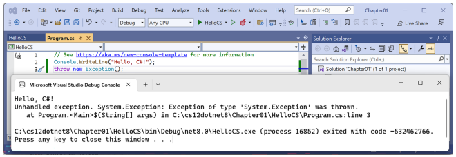
</div>

۴. برای بستن پنجره برنامه کنسول و بازگشت به Visual Studio، کلیدی را فشار دهید.

**آشکار کردن فضای نام برای کلاس Program**
حالا بگذارید کشف کنیم که کلاس Program در چه فضای نامی تعریف شده است:
۱. در Program.cs، قبل از دستوری که استثناء را پرتاب می‌کند، دستوراتی برای دریافت نام فضای نام کلاس Program اضافه کنید و سپس آن را در کنسول بنویسید، همان‌طور که در کد زیر نشان داده شده است:

```csharp
string name = typeof(Program).Namespace ?? "None!";
Console.WriteLine($"Namespace: {name}");
```

`??` عملگر ادغام با تهی (null-coalescing operator) است. دستور اول یعنی، «اگر فضای نام Program null باشد، None! را برگردان؛ در غیر این صورت، نام را برگردان.» شما در طول کتاب توضیحات بیشتری در مورد این کلیدواژه‌ها و عملگرها خواهید دید. در حال حاضر، فقط کد را وارد کرده و اجرا کنید تا ببینید چه کاری انجام می‌دهد.

۲. در Visual Studio، به مسیر Debug | Start Without Debugging بروید.

۳. خروجی در پنجره کنسول نتیجه اجرای برنامه شما را نشان می‌دهد، از جمله اینکه کلاس Program پنهان بدون فضای نام تعریف شده است، همان‌طور که در خروجی زیر آمده است:

```
Namespace: None!
```

۴. برای بستن پنجره برنامه کنسول و بازگشت به Visual Studio، کلیدی را فشار دهید.

---

### افزودن دومین پروژه با استفاده از Visual Studio 2022

بیایید یک پروژه دوم به Solution (سولوشن) خود اضافه کنیم تا نحوه کار با چندین پروژه را بررسی کنیم:

۱. در Visual Studio، به مسیر **File | Add | New Project…** بروید.

> **هشدار!**
> مرحله فوق یک پروژه جدید را به Solution موجود اضافه می‌کند. به مسیر **File | New | Project…** نروید، زیرا این گزینه برای ایجاد یک پروژه و Solution جدید استفاده می‌شود (اگرچه کادر محاوره‌ای آن یک منوی کشویی برای انتخاب افزودن به Solution موجود نیز دارد).

۲. در کادر محاوره‌ای **Add a new project**، در بخش **Recent project templates**، گزینه **Console App [C#]** را انتخاب کرده و سپس روی **Next** کلیک کنید.

۳. در کادر محاوره‌ای **Configure your new project**، برای **Project name**، نام `AboutMyEnvironment` را وارد کنید، **Location** را همان `C:\cs12dotnet8\Chapter01` باقی بگذارید و سپس روی **Next** کلیک کنید.

۴. در کادر محاوره‌ای **Additional information**، گزینه **.NET 8.0 (Long Term Support)** را انتخاب کرده و تیک گزینه **Do not use top-level statements** را بزنید.

> **هشدار!**
> اطمینان حاصل کنید که تیک گزینه **Do not use top-level statements** را زده‌اید تا بتوانیم سبک قدیمی‌تر `Program.cs` را مشاهده کنیم.

۵. روی **Create** کلیک کنید.

۶. در پروژه `AboutMyEnvironment`، در فایل `Program.cs`، به دستوراتی که یک `namespace` مطابق با نام پروژه، یک کلاس `internal` به نام `Program`، و یک متد `static` به نام `Main` با پارامتری به نام `args` که هیچ مقداری برنمی‌گرداند (`void`) تعریف می‌کنند، توجه کنید؛ همان‌طور که در کد زیر نشان داده شده است:

```csharp
namespace AboutMyEnvironment
{
    internal class Program
    {
        static void Main(string[] args)
        {
            Console.WriteLine("Hello, World!");
        }
    }
}
```

۷. در `Program.cs`، در متد `Main`، دستور `Console.WriteLine` موجود را با دستوراتی برای چاپ دایرکتوری فعلی، نسخه سیستم‌عامل، و فضای نام کلاس `Program` جایگزین کنید، همان‌طور که در کد زیر نشان داده شده است:

```csharp
Console.WriteLine(Environment.CurrentDirectory);
Console.WriteLine(Environment.OSVersion.VersionString);
Console.WriteLine("Namespace: {0}", typeof(Program).Namespace);
```

۸. در **Solution Explorer**، روی Solutionِ **'Chapter01'** راست‌کلیک کرده و سپس **Configure Startup Projects…** را انتخاب کنید.

۹. در کادر محاوره‌ای **Solution ‘Chapter01’ Property Pages**، مقدار **Startup Project** را روی **Current selection** تنظیم کرده و سپس روی **OK** کلیک کنید.

۱۰. در **Solution Explorer**، روی پروژه `AboutMyEnvironment` (یا هر فایل یا پوشه‌ای درون آن) کلیک کنید، و توجه داشته باشید که Visual Studio با پررنگ (bold) کردن نام پروژه، نشان می‌دهد که `AboutMyEnvironment` اکنون پروژه آغازین (startup project) است.

> **تمرین خوب:**
> من این روش تنظیم پروژه آغازین را توصیه می‌کنم زیرا جابجایی بین پروژه‌های آغازین را بسیار آسان می‌کند؛ تنها با کلیک کردن روی یک پروژه (یا هر فایلی در یک پروژه) آن را به پروژه آغازین تبدیل می‌کنید. اگرچه می‌توانید روی یک پروژه راست‌کلیک کرده و آن را به عنوان پروژه آغازین تنظیم کنید، اما اگر بخواهید پروژه دیگری را اجرا کنید، باید دوباره آن را به صورت دستی تغییر دهید. کلیک کردن ساده در هر جای پروژه آسان‌تر است. در اکثر فصل‌ها، شما فقط نیاز به اجرای یک پروژه در هر زمان خواهید داشت. در فصل ۱۴، *ساخت و مصرف وب‌سرویس‌ها*، به شما نشان خواهم داد که چگونه چندین پروژه آغازین را پیکربندی کنید.

۱۱. به مسیر **Debug | Start Without Debugging** بروید تا پروژه `AboutMyEnvironment` را اجرا کنید، و به نتیجه توجه کنید، همان‌طور که در خروجی زیر و در شکل ۱.۹ نشان داده شده است:

```text
C:\cs12dotnet8\Chapter01\AboutMyEnvironment\bin\Debug\net8.0
Microsoft Windows NT 10.0.22621.0
Namespace: AboutMyEnvironment
```

 <div align="center">

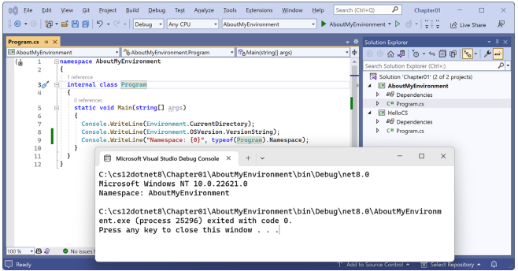
</div>

ویندوز ۱۱ صرفاً یک نام تجاری است. نام رسمی آن Windows NT است و شماره نسخه اصلی آن هنوز ۱۰ است! اما نسخه پچ (Patch version) آن ۲۲۰۰۰ یا بالاتر است.

۱۲. هر کلیدی را فشار دهید تا پنجره برنامه کنسول بسته شود و به Visual Studio بازگردید.

هنگامی که از Visual Studio 2022 برای ویندوز جهت اجرای یک برنامه کنسول استفاده می‌کنید، برنامه را از پوشه `<projectname>\bin\Debug\net8.0` اجرا می‌کند. مهم است که این موضوع را زمانی که در فصل‌های بعدی با فایل‌سیستم کار می‌کنیم، به خاطر بسپارید. هنگامی که از Visual Studio Code، یا دقیق‌تر بگوییم، از `dotnet CLI` استفاده می‌کنید، رفتار متفاوتی دارد، همان‌طور که در شرف دیدن آن هستید.

---

### ساخت برنامه‌های کنسول با استفاده از Visual Studio Code

هدف این بخش، نمایش نحوه ساخت یک برنامه کنسول با استفاده از Visual Studio Code و `dotnet CLI` است.

اگر هرگز نمی‌خواهید Visual Studio Code یا ابزار خط فرمان dotnet را امتحان کنید، لطفاً با خیال راحت از این بخش بگذرید و سپس با بخش *استفاده مفید از مخزن GitHub برای این کتاب* ادامه دهید.
دستورالعمل‌ها و تصاویر این بخش برای ویندوز هستند، اما اقدامات مشابه با Visual Studio Code در انواع macOS و لینوکس نیز کار خواهند کرد. تفاوت‌های اصلی مربوط به اقدامات بومی خط فرمان مانند حذف یک فایل خواهد بود: هم دستور و هم مسیر احتمالاً در ویندوز یا macOS و لینوکس متفاوت است. خوشبختانه، خود ابزار `dotnet CLI` و دستورات آن در تمام پلتفرم‌ها یکسان هستند.

#### نوشتن کد با استفاده از Visual Studio Code

بیایید نوشتن کد را شروع کنیم!

۱. ابزار مورد علاقه خود برای کار با فایل‌سیستم را باز کنید، برای مثال File Explorer در ویندوز یا Finder در مک.

۲. به درایو `C:` خود در ویندوز، پوشه کاربری خود در macOS یا لینوکس (مال من `markjprice` و `home/markjprice` نام دارد)، یا هر دایرکتوری یا درایوی که می‌خواهید پروژه‌های خود را در آن ذخیره کنید، بروید.

۳. یک پوشه جدید به نام `cs12dotnet8` ایجاد کنید. (اگر بخش مربوط به Visual Studio 2022 را تکمیل کرده‌اید، این پوشه از قبل وجود دارد.)

۴. در پوشه `cs12dotnet8`، یک پوشه جدید به نام `Chapter01-vscode` ایجاد کنید.

> اگر بخش مربوط به Visual Studio 2022 را تکمیل نکرده‌اید، می‌توانید نام این پوشه را `Chapter01` بگذارید، اما من فرض می‌کنم که می‌خواهید هر دو بخش را تکمیل کنید و بنابراین نیاز به استفاده از یک نام غیرتکراری دارید.

۵. در پوشه `Chapter01-vscode`، خط فرمان (command prompt) یا ترمینال را باز کنید. برای مثال، در ویندوز، روی پوشه راست‌کلیک کرده و سپس **Open in Terminal** را انتخاب کنید.

۶. در خط فرمان یا ترمینال، از `dotnet CLI` برای ایجاد یک Solution جدید به نام `Chapter01` استفاده کنید، همان‌طور که در دستور زیر نشان داده شده است:

```bash
dotnet new sln --name Chapter01
```

> شما می‌توانید از سوئیچ `-n` یا `--name` برای تعیین نام استفاده کنید. پیش‌فرض با نام پوشه مطابقت خواهد داشت، برای مثال `Chapter01-vscode`.

۷. به نتیجه توجه کنید، همان‌طور که در خروجی زیر نشان داده شده است:

```text
The template "Solution File" was created successfully.
```

۸. در خط فرمان یا ترمینال، از `dotnet CLI` برای ایجاد یک زیرپوشه و پروژه جدید برای یک برنامه کنسول به نام `HelloCS` استفاده کنید، همان‌طور که در دستور زیر نشان داده شده است:

```bash
dotnet new console --output HelloCS
```

> شما می‌توانید از سوئیچ `-o` یا `--output` برای تعیین نام پوشه و پروژه استفاده کنید. دستور `dotnet new console` به طور پیش‌فرض آخرین نسخه .NET SDK شما را هدف قرار می‌دهد. برای هدف قرار دادن یک نسخه متفاوت، از سوئیچ `-f` یا `--framework` برای تعیین فریم‌ورک هدف استفاده کنید. برای مثال، برای هدف قرار دادن .NET 6، از دستور زیر استفاده کنید:
> `dotnet new console -f net6.0`

۹. در خط فرمان یا ترمینال، از `dotnet CLI` برای افزودن پروژه به Solution استفاده کنید، همان‌طور که در دستور زیر نشان داده شده است:

```bash
dotnet sln add HelloCS
```

۱۰. به نتایج توجه کنید، همان‌طور که در خروجی زیر نشان داده شده است:

```text
Project `HelloCS\HelloCS.csproj` added to the solution.
```

۱۱. در خط فرمان یا ترمینال، Visual Studio Code را اجرا کرده و پوشه جاری که با `.` (نقطه) مشخص شده است را باز کنید، همان‌طور که در دستور زیر نشان داده شده است:

```bash
code .
```

۱۲. اگر با پیام *?Do you trust the authors of the files in this folder* مواجه شدید، تیک گزینه **Trust the authors of all files in the parent folder ‘cs12dotnet8’** را بزنید و سپس روی **Yes, I trust the authors** کلیک کنید.

۱۳. در Visual Studio Code، در بخش **EXPLORER**، در نمای پوشه **CHAPTER01-VSCODE**، پوشه `HelloCS` را باز کنید (expand)، و خواهید دید که ابزار خط فرمان dotnet دو فایل `HelloCS.csproj` و `Program.cs`، و پوشه‌های `bin` و `obj` را ایجاد کرده است، همان‌طور که در شکل ۱.۱۰ نشان داده شده است.

 <div align="center">

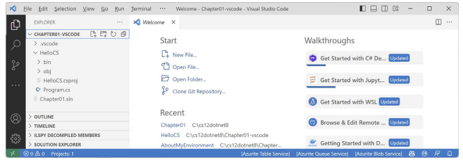
</div>

۱۴. به مسیر **View | Output** بروید.

۱۵. در قاب **OUTPUT**، گزینه **C# Dev Kit** را انتخاب کنید و توجه داشته باشید که ابزار، Solution را شناسایی و پردازش کرده است، همان‌طور که در شکل ۱.۱۱ نشان داده شده است:

 <div align="center">

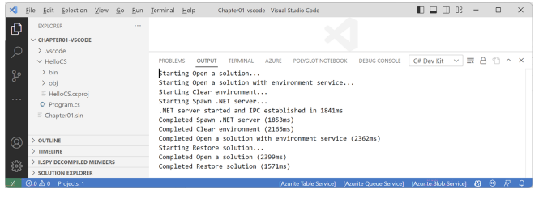
</div>

۱۶. در پایین بخش **EXPLORER**، به **SOLUTION EXPLORER** توجه کنید.

۱۷. **SOLUTION EXPLORER** را بگیرید و به بالای قاب **EXPLORER** بکشید و آن را باز (expand) کنید.

۱۸. در **SOLUTION EXPLORER**، پروژه `HelloCS` را باز کنید و سپس روی فایلی به نام `Program.cs` کلیک کنید تا در پنجره ویرایشگر باز شود.

۱۹. در `Program.cs`، خط ۲ را تغییر دهید تا متنی که در کنسول نوشته می‌شود بگوید: `!Hello, C#`.

> **تمرین خوب:**
> به مسیر **File | Auto Save** بروید. فعال‌سازی این گزینه (toggle) شما را از دردسرِ به یاد داشتنِ ذخیره کردنِ فایل‌ها پیش از هر بار بازسازی (rebuild) برنامه نجات می‌دهد.

#### کامپایل و اجرای کد با استفاده از dotnet CLI

وظیفه بعدی کامپایل و اجرای کد است:

۱. در **SOLUTION EXPLORER**، روی هر فایلی در پروژه `HelloCS` راست‌کلیک کرده و **Open In Integrated Terminal** را انتخاب کنید.

۲. در **TERMINAL**، دستور زیر را وارد کنید: `dotnet run`.

۳. خروجی در پنجره **TERMINAL** نتیجه اجرای برنامه شما را نشان خواهد داد، همان‌طور که در شکل ۱.۱۲ دیده می‌شود:

 <div align="center">

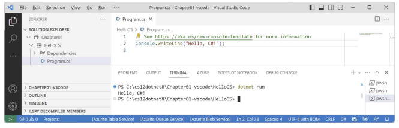
</div>

۴. در `Program.cs`، بعد از دستوری که پیام را چاپ می‌کند، دستوراتی اضافه کنید تا نامِ فضای نام (namespace) کلاس `Program` را بگیرد، آن را در کنسول بنویسد، و سپس یک استثنای (exception) جدید پرتاب کند، همان‌طور که در کد زیر نشان داده شده است:

```csharp
string name = typeof(Program).Namespace ?? "None!";
Console.WriteLine($"Namespace: {name}");
throw new Exception();
```

۵. در **TERMINAL**، دستور زیر را وارد کنید: `dotnet run`.

> در **TERMINAL**، می‌توانید کلیدهای جهت‌نمای بالا و پایین را فشار دهید تا بین دستورات قبلی پیمایش کنید و سپس قبل از زدن Enter برای اجرای آن‌ها، با کلیدهای چپ و راست دستور را ویرایش کنید.

۶. خروجی در پنجره **TERMINAL** نتیجه اجرای برنامه شما را نشان می‌دهد، از جمله اینکه یک کلاس `Program` مخفی توسط کامپایلر تعریف شده است که متدی به نام `$` دارد (که پارامتری به نام `args` برای دریافت آرگومان‌ها دارد)، و اینکه این کلاس فاقد فضای نام (namespace) است، همان‌طور که در خروجی زیر مشاهده می‌کنید:

```text
Hello, C#!
Namespace: None!
Unhandled exception. System.Exception: Exception of type 'System.Exception' was thrown.
at Program.$(String[] args) in C:\cs12dotnet8\Chapter01-vscode\HelloCS\Program.cs:line 7
```

---

### افزودن دومین پروژه با استفاده از Visual Studio Code

بیایید پروژه دومی اضافه کنیم تا نحوه کار با چندین پروژه را بررسی کنیم:

۱. در **TERMINAL**، با دستور زیر به دایرکتوری `Chapter01-vscode` تغییر مسیر دهید:

```bash
cd ..
```

۲. در **TERMINAL**، دستور زیر را وارد کنید تا یک پروژه برنامه کنسول جدید به نام `AboutMyEnvironment` با استفاده از سبک قدیمی‌تر (غیر top-level) ایجاد کنید:

```bash
dotnet new console -o AboutMyEnvironment --use-program-main
```

> **تمرین خوب:**
> هنگام وارد کردن دستورات در **TERMINAL** مراقب باشید. پیش از وارد کردن دستوراتی که ممکن است مخرب باشند، مطمئن شوید که در پوشه صحیح قرار دارید!

۳. در **TERMINAL**، از `dotnet CLI` برای افزودن پوشه پروژه جدید به Solution استفاده کنید:

```bash
dotnet sln add AboutMyEnvironment
```

۴. به نتایج توجه کنید:

```text
Project `AboutMyEnvironment\AboutMyEnvironment.csproj` added to the solution.
```

۵. در **SOLUTION EXPLORER**، در پروژه `AboutMyEnvironment`، فایل `Program.cs` را باز کنید و سپس در متد `Main`، دستور موجود را تغییر دهید تا دایرکتوری فعلی، رشته نسخه سیستم‌عامل، و فضای نام کلاس `Program` را چاپ کند:

```csharp
Console.WriteLine(Environment.CurrentDirectory);
Console.WriteLine(Environment.OSVersion.VersionString);
Console.WriteLine("Namespace: {0}", typeof(Program).Namespace);
```

۶. در **SOLUTION EXPLORER**، روی هر فایلی در پروژه `AboutMyEnvironment` راست‌کلیک کرده و **Open In Integrated Terminal** را انتخاب کنید.

۷. در **TERMINAL**، دستور زیر را برای اجرای پروژه وارد کنید: `dotnet run`.

۸. به خروجی در پنجره **TERMINAL** توجه کنید، همان‌طور که در زیر و در شکل ۱.۱۳ نشان داده شده است:

```text
C:\cs12dotnet8\Chapter01-vscode\AboutMyEnvironment
Microsoft Windows NT 10.0.22621.0
Namespace: AboutMyEnvironment
```

 <div align="center">

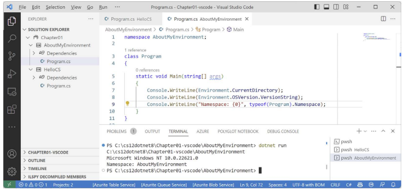
</div>

> وقتی چندین پنجره ترمینال باز می‌کنید، می‌توانید با کلیک روی نام آن‌ها در پنل سمت راستِ **TERMINAL**، بین آن‌ها جابجا شوید. به‌صورت پیش‌فرض، نام آن‌ها یکی از پوسته‌های رایج مانند pwsh ،powershell ،zsh یا bash خواهد بود. می‌توانید راست‌کلیک کرده و **Rename** را انتخاب کنید تا نام دیگری تنظیم کنید.

هنگام استفاده از Visual Studio Code، یا دقیق‌تر بگویم، استفاده از `dotnet CLI` برای اجرای یک برنامه کنسول، برنامه از پوشه `<projectname>` اجرا می‌شود. اما هنگام استفاده از Visual Studio 2022 برای ویندوز، برنامه از پوشه `<projectname>\bin\Debug\net8.0` اجرا می‌شود.
بسیار مهم است که وقتی در فصل‌های بعدی با فایل‌سیستم کار می‌کنیم، این نکته را به خاطر بسپارید.

اگر قرار بود برنامه را روی macOS Ventura اجرا کنید، سیستم‌عامل محیط متفاوت بود، همان‌طور که در خروجی زیر نشان داده شده است:

```text
Unix 13.5.2
```

> **تمرین خوب:**
> اگرچه کد منبع، مانند فایل‌های `.csproj` و `.cs` یکسان است، اما پوشه‌های `bin` و `obj` که به‌طور خودکار توسط کامپایلر تولید می‌شوند، ممکن است عدم تطابق‌هایی داشته باشند که منجر به خطا شود. اگر می‌خواهید یک پروژه واحد را هم در Visual Studio 2022 و هم در Visual Studio Code باز کنید، قبل از باز کردن پروژه در ویرایشگر دیگر، پوشه‌های موقت `bin` و `obj` را حذف کنید. این مشکل احتمالی دلیلی است که از شما خواستم در این فصل پوشه متفاوتی برای پروژه‌های Visual Studio Code ایجاد کنید.

#### خلاصه مراحل برای Visual Studio Code

برای ایجاد یک Solution و پروژه‌ها با استفاده از Visual Studio Code، این مراحل را دنبال کنید:

۱. یک پوشه برای Solution ایجاد کنید، مثلاً `Chapter01`.
۲. یک فایل Solution در پوشه ایجاد کنید: `dotnet new sln`
۳. یک پوشه و پروژه با استفاده از قالب ایجاد کنید: `dotnet new console -o HelloCS`
۴. پوشه و پروژه آن را به Solution اضافه کنید: `dotnet sln add HelloCS`
۵. مراحل ۳ و ۴ را برای ایجاد و افزودن هر پروژه دیگر تکرار کنید.
۶. پوشه حاوی Solution را با استفاده از Visual Studio Code باز کنید: `code .`

### خلاصه‌ای از سایر انواع پروژه‌های استفاده شده در این کتاب

پروژه **Console App** (برنامه کنسول) تنها یک نوع از قالب‌های پروژه است. در این کتاب، شما همچنین با استفاده از قالب‌های پروژه زیر، پروژه‌هایی را ایجاد خواهید کرد، همان‌طور که در جدول ۱.۵ نشان داده شده است:

| **Visual Studio 2022** | **dotnet new** | **JetBrains Rider - Type** |
| :--- | :--- | :--- |
| Console App | `console` | Console Application |
| Class Library | `classlib` | Class Library |
| xUnit Test Project | `xunit` | Unit Test Project - xUnit |
| ASP.NET Core Empty | `web` | ASP.NET Core Web Application - Empty |
| Razor Class Library | `razorclasslib` | ASP.NET Core Web Application - Razor Class Library |
| ASP.NET Core Web App (Model-View-Controller) | `mvc` | ASP.NET Core Web Application - Web App (Model-View-Controller) |
| ASP.NET Core Web API | `webapi` | ASP.NET Core Web Application - Web API |
| ASP.NET Core Web API (native AOT) | `webapiaot` | ASP.NET Core Web Application - Web API (native AOT) |
| Blazor Web App | `blazor` | ASP.NET Core Web Application - Blazor Web App |

*جدول ۱.۵: نام قالب‌های پروژه برای ویرایشگرهای کد مختلف*

مراحل افزودن هر نوع پروژه جدید به یک Solution یکسان است. تنها نامِ نوعِ قالبِ پروژه متفاوت است و گاهی اوقات برخی سوئیچ‌های خط فرمان برای کنترل گزینه‌ها تغییر می‌کنند. اگر این سوئیچ‌ها و گزینه‌ها با مقادیر پیش‌فرض متفاوت باشند، من همیشه مشخص خواهم کرد که چه باشند.
خلاصه‌ای از پیش‌فرض‌ها، گزینه‌ها و سوئیچ‌های قالب پروژه را می‌توانید در اینجا بیابید:
[https://github.com/markjprice/cs12dotnet8/blob/main/docs/ch01-project-options.md](https://github.com/markjprice/cs12dotnet8/blob/main/docs/ch01-project-options.md)

---

### استفاده مفید از مخزن GitHub برای این کتاب

گیت (Git) یک سیستم مدیریت کد منبع است که به طور گسترده استفاده می‌شود. گیت‌هاب (GitHub) شرکتی، وب‌سایتی و یک برنامه دسکتاپ است که مدیریت Git را آسان‌تر می‌کند. مایکروسافت در سال ۲۰۱۸ گیت‌هاب را خریداری کرد، بنابراین این پلتفرم به یکپارچگی نزدیک‌تر با ابزارهای مایکروسافت ادامه خواهد داد.

من یک مخزن (Repository) گیت‌هاب برای این کتاب ایجاد کرده‌ام و از آن برای موارد زیر استفاده می‌کنم:

* برای ذخیره کدهای Solution کتاب که پس از تاریخ انتشار چاپی قابل نگهداری و به‌روزرسانی باشند.
* برای ارائه مطالب اضافی که کتاب را گسترش می‌دهند، مانند اصلاحیه‌ها (errata fixes)، بهبودهای کوچک، لیست لینک‌های مفید، و بخش‌های اختیاری درباره موضوعاتی که در کتاب چاپی جا نمی‌شدند.
* برای فراهم کردن مکانی جهت تماس خوانندگان با من، در صورتی که مشکلاتی با کتاب داشته باشند.

> **تمرین خوب:**
> اکیداً توصیه می‌کنم که همه خوانندگان پیش از اقدام به انجام هرگونه وظیفه کدنویسی در این کتاب، صفحات مربوط به اصلاحیه‌ها (errata)، بهبودها، تغییرات پس از انتشار و خطاهای رایج را مرور کنند. شما می‌توانید آن‌ها را در لینک زیر بیابید:
> [https://github.com/markjprice/cs12dotnet8/blob/main/docs/errata/errata.md](https://github.com/markjprice/cs12dotnet8/blob/main/docs/errata/errata.md)

#### درک کد Solution در GitHub

کد Solution موجود در مخزن گیت‌هاب برای این کتاب شامل پوشه‌هایی برای هر فصل است که می‌توانند با هر یک از ویرایشگرهای کد زیر باز شوند:

* **Visual Studio 2022** یا **JetBrains Rider**: فایل Solution با پسوند `.sln` را باز کنید.
* **Visual Studio Code**: پوشه‌ای که حاوی فایل Solution است را باز کنید.

فصل‌های ۱ تا ۱۱ هرکدام فایل Solution مخصوص به خود را دارند که به نام `ChapterXX.sln` نام‌گذاری شده است (که در آن XX شماره فصل است). فصل‌های ۱۲ تا ۱۵ یک فایل Solution واحد به نام `PracticalApps.sln` را به اشتراک می‌گذارند.

تمام کدهای Solution در لینک زیر قابل دسترسی هستند:
[https://github.com/markjprice/cs12dotnet8/tree/main/code](https://github.com/markjprice/cs12dotnet8/tree/main/code)

> **تمرین خوب:**
> اگر نیاز دارید، به این فصل بازگردید تا نحوه ایجاد و مدیریت چندین پروژه در ویرایشگر کد انتخابی خود را یادآوری کنید. مخزن گیت‌هاب دستورالعمل‌های گام‌به‌گام برای سه ویرایشگر کد (Visual Studio 2022، Visual Studio Code و JetBrains Rider) را به همراه تصاویر اضافی ارائه می‌دهد:
> [https://github.com/markjprice/cs12dotnet8/tree/main/docs/code-editors/](https://github.com/markjprice/cs12dotnet8/tree/main/docs/code-editors/)

#### طرح مسائل (Raising issues) مربوط به کتاب

اگر در دنبال کردن هر یک از دستورالعمل‌های این کتاب گیر کردید، یا اگر اشتباهی در متن یا کدِ Solutionها پیدا کردید، لطفاً یک Issue در مخزن گیت‌هاب ثبت کنید:

۱. از مرورگر مورد علاقه خود برای رفتن به لینک زیر استفاده کنید:
[https://github.com/markjprice/cs12dotnet8/issues](https://github.com/markjprice/cs12dotnet8/issues)

۲. روی **New Issue** کلیک کنید.

۳. تا حد امکان جزئیاتی را وارد کنید که به من در تشخیص مسئله کمک کند. برای مثال:

* عنوان بخش خاص، شماره صفحه و شماره مرحله.
* ویرایشگر کد شما، مثلاً Visual Studio 2022، Visual Studio Code یا چیز دیگر، شامل شماره نسخه.
* هر مقدار از کد و پیکربندی شما که فکر می‌کنید مرتبط و ضروری است.
* توصیفی از رفتار مورد انتظار و رفتاری که تجربه کرده‌اید.
* تصاویر (می‌توانید فایل‌های تصویری را به داخل کادر Issue بکشید و رها کنید).

موارد زیر اهمیت کمتری دارند اما ممکن است مفید باشند:

* سیستم‌عامل شما، مثلاً Windows 11 64-bit یا macOS Ventura نسخه ۱۳.۵.۲.
* سخت‌افزار شما، مثلاً Intel، Apple Silicon یا پردازنده ARM.

من همیشه نمی‌توانم بلافاصله به Issueها پاسخ دهم. اما می‌خواهم همه خوانندگانم با کتاب من موفق باشند، بنابراین اگر بتوانم بدون دردسرِ زیاد به شما (و دیگران) کمک کنم، با کمال میل این کار را انجام خواهم داد.

#### ارائه بازخورد به من

اگر مایلید بازخورد کلی‌تری درباره کتاب به من بدهید، یا به آدرس `markjprice@gmail.com` ایمیل بزنید یا سوال خود را در کانال دیسکورد (Discord) کتاب بپرسید. شما می‌توانید بازخورد را به‌صورت ناشناس ارائه دهید، یا اگر مایل به دریافت پاسخ از طرف من هستید، می‌توانید یک آدرس ایمیل ارائه دهید. من از این آدرس ایمیل فقط برای پاسخ به بازخورد شما استفاده خواهم کرد.

لطفاً با استفاده از دعوت‌نامه زیر، در دیسکورد به من و هم‌خوانندگان خود بپیوندید:
[https://packt.link/csharp12dotnet8](https://packt.link/csharp12dotnet8)

توصیه می‌کنم لینک فوق را به بوک‌مارک‌های مورد علاقه خود اضافه کنید. من مشتاقم از خوانندگانم درباره آنچه در کتاب دوست دارند، و همچنین پیشنهادات برای بهبود و نحوه کارشان با C# و .NET بشنوم، پس تعارف نکنید. لطفاً در تماس باشید!
پیشاپیش بابت بازخوردهای متفکرانه و سازنده شما سپاسگزارم.

#### اجتناب از اشتباهات رایج

پس از کار با وظایف گام‌به‌گام در این کتاب، خوانندگان اغلب به‌طور مستقل عمل می‌کنند و سعی می‌کنند کدهای مشابهی بنویسند، اما گاهی به مشکلاتی برمی‌خورند و یا یک Issue در مخزن گیت‌هاب ثبت می‌کنند یا سوالی در کانال دیسکورد کتاب ارسال می‌کنند. از این طریق، من متوجه برخی اشتباهات رایج شده‌ام، بنابراین صفحه‌ای را در مخزن نگهداری می‌کنم تا این دام‌های احتمالی و نحوه رفع آن‌ها را برجسته و توضیح دهم:
[https://github.com/markjprice/cs12dotnet8/blob/main/docs/errata/common-mistakes.md](https://github.com/markjprice/cs12dotnet8/blob/main/docs/errata/common-mistakes.md)

---

### دانلود کد Solution از مخزن GitHub

اگر فقط می‌خواهید تمام فایل‌های Solution را بدون استفاده از Git دانلود کنید، روی دکمه سبز رنگ **Code** کلیک کرده و سپس **Download ZIP** را انتخاب کنید، همان‌طور که در شکل ۱.۱۴ نشان داده شده است:

 <div align="center">

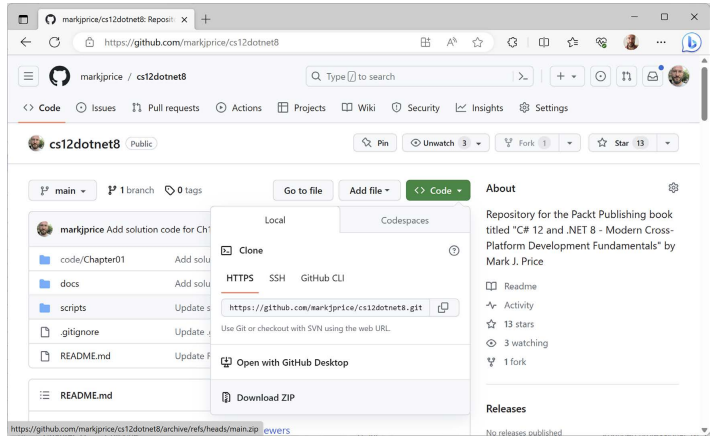
</div>

> **تمرین خوب:**
> بهتر است کدهای Solution را در یک مسیر پوشه کوتاه، مانند `C:\cs12dotnet8\` یا `C:\book\` کلون یا دانلود کنید تا از تجاوز فایل‌های تولید شده توسط بیلد (build-generated files) از حداکثر طول مسیر جلوگیری شود. همچنین باید از کاراکترهای خاص مانند `#` اجتناب کنید. برای مثال، از نام پوشه‌ای مانند `C:\C# projects\` استفاده نکنید. این نام پوشه ممکن است برای یک پروژه برنامه کنسول ساده کار کند، اما به محض اینکه شروع به افزودن ویژگی‌هایی کنید که به طور خودکار کد تولید می‌کنند، احتمالاً با مشکلات عجیبی روبرو خواهید شد. نام پوشه‌های خود را کوتاه و ساده نگه دارید.

---

### استفاده از Git با Visual Studio Code و خط فرمان

Visual Studio Code دارای یکپارچگی (integration) با Git است، اما از نصبِ Gitِ سیستم‌عامل شما استفاده می‌کند، بنابراین پیش از اینکه بتوانید از این ویژگی‌ها استفاده کنید، باید ابتدا Git نسخه 2.0 یا بالاتر را نصب کنید. می‌توانید Git را از لینک زیر نصب کنید:
[https://git-scm.com/download](https://git-scm.com/download)

اگر دوست دارید از یک رابط کاربری گرافیکی (GUI) استفاده کنید، می‌توانید GitHub Desktop را از لینک زیر دانلود کنید:
[https://desktop.github.com](https://desktop.github.com)

#### کلون کردن مخزن کدِ Solutionِ کتاب

بیایید مخزن کدِ Solutionِ کتاب را کلون (Clone) کنیم. در مراحل زیر، شما از ترمینال Visual Studio Code استفاده خواهید کرد، اما می‌توانید دستورات را در هر خط فرمان یا پنجره ترمینالی وارد کنید:

۱. یک پوشه به نام `Repos-vscode` در پوشه کاربری (User) یا پوشه Documents خود، یا هر جایی که می‌خواهید مخازن Git خود را ذخیره کنید، ایجاد کنید.

۲. پوشه `Repos-vscode` را در خط فرمان یا ترمینال باز کنید و سپس دستور زیر را وارد نمایید:

```bash
git clone https://github.com/markjprice/cs12dotnet8.git
```

> توجه داشته باشید که کلون کردن تمام Solutionهای همه فصل‌ها حدود یک دقیقه یا بیشتر طول می‌کشد، پس لطفاً صبور باشید.

---

### جستجو برای راهنمایی (Help)

این بخش تماماً درباره نحوه یافتن اطلاعات باکیفیت درباره برنامه‌نویسی در وب است.

#### خواندن مستندات در Microsoft Learn

منبع قطعی برای دریافت راهنمایی درباره ابزارها و پلتفرم‌های توسعه‌دهندگان مایکروسافت، در مستندات فنی موجود در **Microsoft Learn** قرار دارد و می‌توانید آن را در لینک زیر بیابید:
[https://learn.microsoft.com/en-us/docs](https://learn.microsoft.com/en-us/docs)

#### لینک‌های مستندات در این کتاب

مستندات رسمی مایکروسافت برای .NET باید تمام نسخه‌ها را پوشش دهد. نسخه پیش‌فرضی که در مستندات نمایش داده می‌شود، همیشه جدیدترین نسخه GA (عرضه عمومی) است. برای مثال، بین نوامبر ۲۰۲۳ تا نوامبر ۲۰۲۴، نسخه پیش‌فرض .NET که در صفحات مستندات نمایش داده می‌شود ۸.۰ خواهد بود. بین نوامبر ۲۰۲۴ تا نوامبر ۲۰۲۵، نسخه پیش‌فرض .NET نسخه ۹.۰ خواهد بود.

لینک زیر بسته به تاریخ فعلی، به‌طور خودکار به نسخه جاری هدایت می‌شود:
[https://learn.microsoft.com/en-us/dotnet/api/system.diagnostics.codeanalysis.stringsyntaxattribute](https://learn.microsoft.com/en-us/dotnet/api/system.diagnostics.codeanalysis.stringsyntaxattribute)

برای مشاهده صفحه مستندات به‌طور خاص برای .NET 7، عبارت `?view=net-7.0` را به انتهای لینک اضافه کنید. برای مثال، از لینک زیر استفاده کنید:
[https://learn.microsoft.com/en-us/dotnet/api/system.diagnostics.codeanalysis.stringsyntaxattribute?view=net-7.0](https://learn.microsoft.com/en-us/dotnet/api/system.diagnostics.codeanalysis.stringsyntaxattribute?view=net-7.0)

تمام لینک‌های مستندات در این کتاب نسخه خاصی را مشخص نمی‌کنند، بنابراین پس از نوامبر ۲۰۲۴، صفحات مستندات مربوط به .NET 9.0 را نمایش خواهند داد. اگر می‌خواهید مستندات را مجبور کنید تا نسخه مربوط به .NET 8.0 را نمایش دهد، عبارت `?view=net-8.0` را به انتهای لینک اضافه کنید.

شما می‌توانید بررسی کنید که یک ویژگی .NET از چه نسخه‌هایی پشتیبانی می‌کند، این کار با افزودن `#applies-to` به انتهای لینک انجام می‌شود، برای مثال:
[https://learn.microsoft.com/en-us/dotnet/api/system.diagnostics.codeanalysis.stringsyntaxattribute#applies-to](https://learn.microsoft.com/en-us/dotnet/api/system.diagnostics.codeanalysis.stringsyntaxattribute#applies-to)

بنابراین می‌توانیم ببینیم که ویژگی (Attribute) `StringSyntax` تنها در .NET 7 یا بالاتر در دسترس است.

#### دریافت راهنمایی برای ابزار dotnet

در خط فرمان، می‌توانید از ابزار `dotnet` درباره دستوراتش راهنمایی بخواهید. سینتکس آن به این صورت است:
`dotnet help <command>`

این کار باعث می‌شود مرورگر وب شما صفحه‌ای را در مستندات درباره دستور مشخص شده باز کند. دستورات رایج dotnet شامل `new`، `build`، `run` و بسیاری دیگر هستند.

> **هشدار!**
> دستور `dotnet help new` با .NET Core 3.1 تا .NET 6 کار می‌کرد، اما در .NET 7 یا بالاتر خطا برمی‌گرداند:
> `Specified command 'new' is not a valid SDK command. Specify a valid SDK command. For more information, run dotnet help.`
> امیدواریم که آن‌ها به‌زودی این باگ را رفع کنند!

نوع دیگری از راهنمایی، مستندات خط فرمان است. این روش از سینتکس زیر پیروی می‌کند:
`dotnet <command> -?|-h|--help`

برای مثال، `dotnet new -?` یا `dotnet new -h` یا `dotnet new --help` مستنداتی درباره دستور `new` را در خط فرمان چاپ می‌کند.

همان‌طور که اکنون انتظار دارید، `dotnet help help` یک مرورگر وب را برای دستور help باز می‌کند، و `dotnet help -h` مستندات مربوط به دستور help را در خط فرمان چاپ می‌کند!

بیایید چند مثال را امتحان کنیم:

۱. برای باز کردن مستندات رسمی در پنجره مرورگر وب برای دستور `dotnet build`، دستور زیر را در خط فرمان یا ترمینال Visual Studio Code وارد کنید و به صفحه‌ای که در مرورگر باز می‌شود توجه کنید، همان‌طور که در شکل ۱.۱۵ نشان داده شده است:

```bash
dotnet help build
```

 <div align="center">

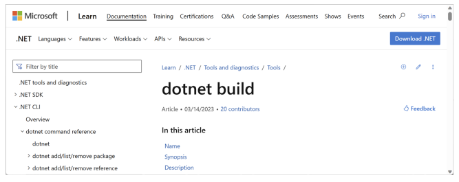
</div>

۲. برای دریافت خروجی راهنمایی در خط فرمان، از پرچم `-?` یا `-h` یا `--help` استفاده کنید، همان‌طور که در دستور زیر نشان داده شده است:

```bash
dotnet build -?
```

۳. شما خروجی جزئی زیر را مشاهده خواهید کرد:

```text
Description: .NET Builder
Usage: dotnet build [ <PROJECT | SOLUTION>...] [options]

Arguments:
  <PROJECT | SOLUTION>  The project or solution file to operate on. If a 
file is not specified, the command will search the current directory for 
one.

Options:
  --ucr, --use-current-runtime         Use current runtime as the target 
runtime.
  -f, --framework <FRAMEWORK>          The target framework to build for. 
The target framework must also be specified in the project file.
...
  -?, -h, --help                       Show command line help.
```

۴. هر دو نوع درخواست راهنمایی را برای دستورات زیر تکرار کنید: `add`، `help`، `list`، `new` و `run`، با یادآوری اینکه `new` ممکن است به دلیل باگی که در .NET 7 ایجاد شده، صفحه وب خود را نشان ندهد.

---

### دریافت تعاریف (Definitions) انواع و اعضای آن‌ها

یکی از مفیدترین ویژگی‌های یک ویرایشگر کد، **Go To Definition** (کلید F12) است. این ویژگی در Visual Studio Code، Visual Studio 2022 و JetBrains Rider در دسترس است. این ویژگی با خواندن متادیتا (metadata) در اسمبلیِ کامپایل شده، نشان می‌دهد که تعریف عمومی (public definition) آن نوع (type) یا عضو (member) چگونه است. برخی ابزارها، مانند **ILSpy .NET Decompiler**، حتی از روی متادیتا و کد IL مهندسی معکوس انجام می‌دهند تا کد را به C# یا زبان دیگری برای شما بازگردانند.

یک ویژگی مشابه و مرتبط، **Go To Implementation** (کلید Ctrl + F12) نام دارد. به جای خواندن متادیتا یا دی‌کامپایل کردن، اگر کد منبع با استفاده از ویژگی اختیاریِ "لینک منبع" (source link) تعبیه شده باشد، این گزینه کد منبع واقعی را نشان می‌دهد.

> **هشدار!**
> ویژگی **Go To Definition** باید به متادیتای دی‌کامپایل شده برای یک عضو یا نوع برود. اما اگر قبلاً "لینک منبع" (source link) را مشاهده کرده باشید، آنگاه به لینک منبع می‌رود.
> ویژگی **Go To Implementation** باید به پیاده‌سازی لینک منبع برای یک عضو یا نوع برود. اما اگر لینک منبع را غیرفعال کرده باشید، آنگاه به متادیتای دی‌کامپایل شده می‌رود.

بیایید ببینیم چگونه از ویژگی **Go To Definition** استفاده کنیم:

۱. در ویرایشگر کد مورد علاقه خود، Solution/پوشه با نام `Chapter01` را باز کنید.
اگر از **Visual Studio 2022** استفاده می‌کنید:

* به مسیر **Tools | Options** بروید.
* در کادر جستجو، عبارت `navigation to source` را وارد کنید.
* گزینه **Text Editor | C# | Advanced** را انتخاب کنید.
* تیک گزینه **Enable navigation to Source Link and Embedded sources** را بردارید و سپس روی **OK** کلیک کنید، همان‌طور که در شکل ۱.۱۶ نشان داده شده است:

 <div align="center">

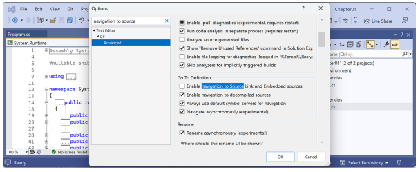
</div>

تعاریف می‌توانند از روی متادیتا مهندسی معکوس شوند یا اگر فعال باشد، از کد منبع اصلی بارگذاری شوند. شخصاً، من کد حاصل از متادیتا را مفیدتر می‌دانم، همان‌طور که در شرف دیدن آن هستید. در پایان این بخش، سعی کنید گزینه **Source Link** را دوباره روشن کنید تا تفاوت را ببینید.

۲. در پروژه `HelloCS`، در پایین فایل `Program.cs`، دستور زیر را برای تعریف یک متغیر عدد صحیح (integer) به نام `z` وارد کنید:

```csharp
int z;
```

۳. روی `int` کلیک کنید، سپس راست‌کلیک کرده و در Visual Studio 2022 یا Visual Studio Code گزینه **Go To Definition** را انتخاب کنید. در JetBrains Rider، مسیر **Go to | Go to Declaration or Usages** را انتخاب نمایید.

۴. در پنجره کدی که ظاهر می‌شود، می‌توانید ببینید که نوع داده `int` چگونه تعریف شده است، همان‌طور که در شکل ۱.۱۷ نشان داده شده است:

 <div align="center">

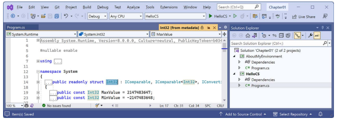
</div>

شما می‌توانید ببینید که `int`:

* با استفاده از کلمه کلیدی `struct` تعریف شده است.
* در اسمبلی `System.Runtime` قرار دارد.
* در فضای نام `System` قرار دارد.
* نام آن `Int32` است.
* بنابراین نام مستعاری برای نوع `System.Int32` است.
* اینترفیس‌هایی مانند `IComparable` را پیاده‌سازی می‌کند.
* دارای مقادیر ثابت برای مقادیر ماکزیمم و مینیمم خود است.
* دارای متدهایی مانند `Parse` است. (در شکل ۱.۱۷ قابل مشاهده نیست.)

در حال حاضر، ویژگی **Go To Definition** برای شما چندان مفید نیست زیرا هنوز نمی‌دانید معنی تمام این اطلاعات چیست. تا پایان بخش اول این کتاب، که شامل فصل‌های ۲ تا ۶ است و زبان C# را به شما می‌آموزد، به اندازه کافی دانش خواهید داشت که این ویژگی بسیار کاربردی شود.

۵. در پنجره ویرایشگر کد، به پایین اسکرول کنید تا متد `Parse` را با یک پارامتر `string` واحد پیدا کنید، همان‌طور که در کد زیر نشان داده شده است:

```csharp
public static Int32 Parse(string s)
```

۶. کد را باز (expand) کنید و توضیحات (comments) که این متد را مستند کرده‌اند مرور کنید، همان‌طور که در شکل ۱.۱۸ نشان داده شده است:

 <div align="center">

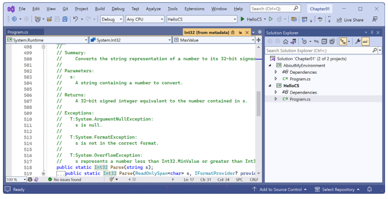
</div>

در توضیحات، خواهید دید که مایکروسافت موارد زیر را مستند کرده است:

* یک خلاصه (summary) که متد را توصیف می‌کند.
* پارامترهایی مانند مقدار `string` که می‌توان به متد پاس داد.
* مقدار بازگشتیِ متد، شامل نوع داده آن.
* سه استثنا (exception) که ممکن است در صورت فراخوانی این متد رخ دهند، شامل `ArgumentNullException` ،`FormatException` و `OverflowException`.

اکنون می‌دانیم که می‌توانیم تصمیم بگیریم فراخوانی این متد را در یک دستور `try` قرار دهیم و چه استثناهایی را بگیریم (catch). امیدوارم برای یادگیری معنی همه این‌ها بی‌تاب شده باشید! کمی دیگر صبر کنید. شما تقریباً در انتهای این فصل هستید و در فصل بعد، به جزئیات زبان C# شیرجه خواهید زد. اما ابتدا، بیایید ببینیم کجا می‌توانیم به دنبال کمک بگردیم.

---

### پیکربندی نکات درون‌خطی (Inline) یا Inlay Hints

در سراسر کدهای این کتاب، هنگام فراخوانی یک متد، من اغلب پارامترهای نام‌دار (named parameters) را به‌طور صریح مشخص می‌کنم تا به خواننده در یادگیری آنچه در جریان است کمک کنم. برای مثال، من نام‌های پارامترهای `format` و `arg0` را در کد زیر مشخص کرده‌ام:

```csharp
Console.WriteLine(format: "Value is {0}.", arg0: 19.8);
```

نکات درون‌خطی (Inline hints)، که به آن‌ها Inlay hints نیز می‌گویند، نام پارامترها را بدون اینکه نیاز باشد آن‌ها را تایپ کنید، نشان می‌دهند، همان‌طور که در شکل ۱.۱۹ دیده می‌شود:

 <div align="center">

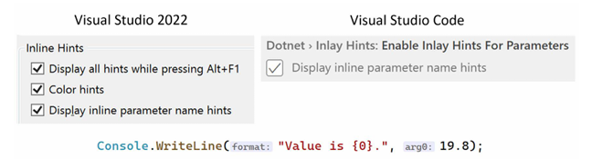
</div>

اکثر ویرایشگرهای کد این ویژگی را دارند که می‌توانید آن را به‌طور دائم یا تنها زمانی که ترکیبی از کلیدها مانند `Alt + F1` یا `Ctrl` نگه داشته شده‌اند، فعال کنید:

* **در Visual Studio 2022:** به مسیر **Tools | Options** بروید، به **Text Editor | C# | Advanced** بروید، به پایین اسکرول کنید تا به بخش **Inline Hints** برسید، تیک گزینه **Display inline parameter hint names** را بزنید و سپس روی **OK** کلیک کنید.
* **در Visual Studio Code:** به مسیر **File | Preferences | Settings** بروید، عبارت `inlay` را جستجو کنید، فیلتر `C#` را انتخاب کنید و سپس تیک گزینه **Display inline parameter name hints** را بزنید.
* **در JetBrains Rider:** در **Settings**، به مسیر **Editor | Inlay Hints | C# | Parameter Name Hints** بروید.

