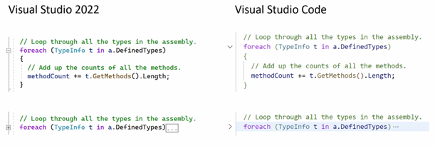
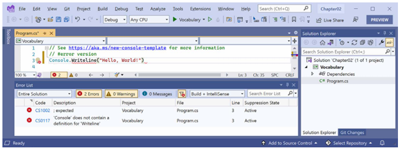

# فصل دوم: Speaking C #

این فصل تماماً در مورد مبانی زبان برنامه‌نویسی C# است. در طول این فصل، یاد خواهید گرفت که چگونه با استفاده از دستور زبان (grammar) C# دستورات (statements) را بنویسید، و همچنین با برخی از واژگان رایجی که هر روز استفاده خواهید کرد، آشنا می‌شوید. علاوه بر این، تا پایان فصل، در دانستن نحوه ذخیره و کار با اطلاعات در حافظه کامپیوتر خود به صورت موقت، احساس اطمینان خواهید کرد.

این فصل موضوعات زیر را پوشش می‌دهد:

* معرفی زبان C#
* کشف نسخه کامپایلر C# شما
* درک دستور زبان و واژگان C#
* کار با متغیرها
* کاوش بیشتر درباره برنامه‌های کنسول
* درک async و await

### معرفی زبان C #

این بخش از کتاب درباره زبان C# است—دستور زبان و واژگانی که هر روز برای نوشتن کد منبع (source code) برنامه‌های خود استفاده خواهید کرد.

زبان‌های برنامه‌نویسی شباهت‌های زیادی به زبان‌های انسانی دارند، با این تفاوت که در زبان‌های برنامه‌نویسی، شما می‌توانید کلمات خودتان را بسازید، درست مثل دکتر زوس (Dr. Seuss)!
در کتابی که دکتر زوس در سال ۱۹۵۰ نوشت، *اگر من باغ‌وحش را اداره می‌کردم* (If I Ran the Zoo)، او چنین بیان می‌کند:
> «و آنگاه، فقط برای اینکه به آن‌ها نشان دهم، به کا-ترو (Ka-Troo) سفر خواهم کرد و یک ایت-کاچ (It-Kutch)، یک پریپ (Preep) و یک پرو (Proo)، یک نرکل (Nerkle)، یک نرد (Nerd) و یک سیرساکر (Seersucker) را هم با خود خواهم آورد!»

#### نسخه‌ها و ویژگی‌های زبان C #

این بخش از کتاب زبان برنامه‌نویسی C# را پوشش می‌دهد و عمدتاً برای مبتدیان نوشته شده است، بنابراین موضوعات بنیادی را که همه توسعه‌دهندگان باید بدانند، از جمله تعریف متغیرها، ذخیره داده‌ها و چگونگی تعریف انواع داده سفارشی، پوشش می‌دهد.

این کتاب ویژگی‌های زبان C# را از نسخه ۱ تا آخرین نسخه، یعنی ۱۲، پوشش می‌دهد. اگر قبلاً با نسخه‌های قدیمی‌تر C# آشنایی دارید و مشتاقید تا درباره ویژگی‌های جدید در آخرین نسخه‌های C# بدانید، من با فهرست کردن نسخه‌های زبان و ویژگی‌های مهم جدید آن‌ها در زیر، به همراه شماره فصل و عنوان موضوعی که می‌توانید در آنجا درباره آن‌ها بیاموزید، پرش به بخش‌های مختلف را برای شما آسان‌تر کرده‌ام. شما می‌توانید این اطلاعات را در مخزن GitHub در لینک زیر مطالعه کنید:
[https://github.com/markjprice/cs12dotnet8/blob/main/docs/ch02-features.md](https://github.com/markjprice/cs12dotnet8/blob/main/docs/ch02-features.md)

#### درک استانداردهای C #

در طول سال‌ها، مایکروسافت چندین نسخه از C# را به نهادهای استانداردسازی ارسال کرده است، همان‌طور که در جدول ۲.۱ نشان داده شده است:

| C# version | ECMA standard | ISO/IEC standard |
| :--- | :--- | :--- |
| 1.0 | ECMA-334:2003 | ISO/IEC 23270:2003 |
| 2.0 | ECMA-334:2006 | ISO/IEC 23270:2006 |
| 5.0 | ECMA-334:2017 | ISO/IEC 23270:2018 |
| 6.0 | ECMA-334:2022 | ISO/IEC 23270:2022 |

*جدول ۲.۱: استانداردهای ECMA برای C#*

استاندارد ECMA برای C# 7.3 هنوز یک پیش‌نویس است. پس حتی فکرش را هم نکنید که نسخه‌های ۸ تا ۱۲ C# چه زمانی ممکن است استاندارد ECMA شوند! مایکروسافت در سال ۲۰۱۴ C# را متن‌باز (open source) کرد. شما می‌توانید آخرین سند استاندارد C# را در لینک زیر مطالعه کنید:
[https://learn.microsoft.com/en-us/dotnet/csharp/language-reference/specifications](https://learn.microsoft.com/en-us/dotnet/csharp/language-reference/specifications)

مفیدتر از استانداردهای ECMA از نظر عملی، مخازن عمومی GitHub برای باز نگه داشتن کار روی C# و فناوری‌های مرتبط تا حد امکان است، همان‌طور که در جدول ۲.۲ نشان داده شده است:

| Description | Link |
| :--- | :--- |
| C# language design | [https://github.com/dotnet/csharplang](https://github.com/dotnet/csharplang) |
| Compiler implementation | [https://github.com/dotnet/roslyn](https://github.com/dotnet/roslyn) |
| Standard to describe the language | [https://github.com/dotnet/csharpstandard](https://github.com/dotnet/csharpstandard) |

*جدول ۲.۲: مخازن عمومی GitHub برای C#*

### کشف نسخه کامپایلر C# شما

کامپایلر زبان .NET برای C# و ویژوال بیسیک، که به نام **Roslyn** نیز شناخته می‌شود، همراه با یک کامپایلر جداگانه برای F#، به عنوان بخشی از .NET SDK توزیع می‌شود. برای استفاده از یک نسخه خاص از C#، باید حداقل آن نسخه از .NET SDK را نصب داشته باشید، همان‌طور که در جدول ۲.۳ نشان داده شده است:

| .NET SDK | Roslyn compiler | Default C# language |
| :--- | :--- | :--- |
| 1.0 | 2.0-2.2 | 7.0 |
| 1.1 | 2.3-2.4 | 7.1 |
| 2.1.2 | 2.6-2.7 | 7.2 |
| 2.1.200 | 2.8-2.10 | 7.3 |
| 3.0 | 3.0-3.4 | 8.0 |
| 5.0 | 3.8 | 9.0 |
| 6.0 | 4.0 | 10.0 |
| 7.0 | 4.4 | 11.0 |
| 8.0 | 4.8 | 12.0 |

*جدول ۲.۳: نسخه‌های .NET SDK و نسخه‌های کامپایلر C# آن‌ها*

هنگامی که کتابخانه‌های کلاس (class libraries) ایجاد می‌کنید، می‌توانید انتخاب کنید که علاوه بر نسخه‌های .NET مدرن، .NET Standard را نیز هدف قرار دهید (target). آن‌ها دارای نسخه‌های پیش‌فرض زبان C# هستند، همان‌طور که در جدول ۲.۴ نشان داده شده است:

| .NET Standard | C# |
| :--- | :--- |
| 2.0 | 7.3 |
| 2.1 | 8.0 |

*جدول ۲.۴: نسخه‌های .NET Standard و نسخه‌های پیش‌فرض کامپایلر C# آن‌ها*

> اگرچه برای دسترسی به نسخه خاصی از کامپایلر باید حداقل نسخه‌ای از .NET SDK را نصب کرده باشید، اما پروژه‌هایی که ایجاد می‌کنید می‌توانند نسخه‌های قدیمی‌تر .NET را هدف قرار دهند و همچنان از نسخه مدرن کامپایلر استفاده کنند. برای مثال، اگر .NET 7 SDK یا بالاتر را نصب کرده باشید، می‌توانید از ویژگی‌های زبان C# 11 در یک برنامه کنسول که .NET Core 3.0 را هدف قرار می‌دهد، استفاده کنید.

#### نحوه دریافت خروجی نسخه SDK

بیایید ببینیم چه نسخه‌هایی از .NET SDK و کامپایلر زبان C# را در دسترس دارید:

۱. در ویندوز، **Windows Terminal** یا **Command Prompt** را اجرا کنید. در macOS، **Terminal** را اجرا کنید.
۲. برای تعیین اینکه کدام نسخه از .NET SDK را در دسترس دارید، دستور زیر را وارد کنید:

```bash
dotnet --version
```

۳. توجه داشته باشید که نسخه در زمان انتشار این کتاب `8.0.100` است، که نشان می‌دهد این نسخه اولیه SDK بدون هیچ‌گونه رفع باگ یا ویژگی جدیدی تا آن لحظه است، همان‌طور که در خروجی زیر نشان داده شده است:

```text
8.0.100
```

#### فعال‌سازی کامپایلر یک نسخه خاص زبان

ابزارهای توسعه مانند Visual Studio و رابط خط فرمان dotnet فرض می‌کنند که شما می‌خواهید به طور پیش‌فرض از آخرین نسخه اصلی (major version) کامپایلر زبان C# استفاده کنید. قبل از انتشار C# 8، نسخه C# 7 آخرین نسخه اصلی بود و به طور پیش‌فرض استفاده می‌شد. برای استفاده از بهبودهای موجود در نسخه‌های میانی (point release) مانند ۷.۱، ۷.۲ یا ۷.۳، شما مجبور بودید یک... [ادامه متن در بخش بعد]

> **هشدار!**
> برخی از ویژگی‌های زبان C# به تغییرات در کتابخانه‌های زیرین .NET وابسته هستند. حتی اگر از آخرین SDK با آخرین کامپایلر استفاده کنید، ممکن است نتوانید از تمام ویژگی‌های جدید زبان در حالی که نسخه قدیمی‌تری از .NET را هدف قرار داده‌اید، استفاده کنید. برای مثال، C# 11 کلمه کلیدی `required` را معرفی کرد، اما نمی‌توان از آن در پروژه‌ای که .NET 6 را هدف قرار می‌دهد استفاده کرد، زیرا آن ویژگی زبانی به ویژگی‌های (Attributes) جدیدی نیاز دارد که فقط در .NET 7 موجود هستند. خوشبختانه، اگر سعی کنید از ویژگی C# که پشتیبانی نمی‌شود استفاده کنید، کامپایلر به شما هشدار می‌دهد. فقط برای آن احتمال آماده باشید.

---

#### نمایش نسخه کامپایلر

ما کار را با نوشتن کدی آغاز می‌کنیم که نسخه کامپایلر را نمایش می‌دهد:

۱. اگر فصل ۱، *سلام، C# ! خوش آمدی، .NET !* را تکمیل کرده‌اید، پس از قبل پوشه `cs12dotnet8` را دارید. اگر نه، باید آن را ایجاد کنید.

۲. از ویرایشگر کد مورد نظر خود برای ایجاد یک پروژه جدید استفاده کنید، همان‌طور که در لیست زیر تعریف شده است:

* **قالب پروژه:** Console App [C#] / console
* **فایل پروژه و پوشه:** Vocabulary
* **فایل Solution و پوشه:** Chapter02
* **Do not use top-level statements:** تیک نخورده باشد (غیرفعال)
* **Enable native AOT publish:** تیک نخورده باشد (غیرفعال)

> **تمرین خوب:**
> اگر فراموش کرده‌اید چگونه، یا فصل قبل را تکمیل نکرده‌اید، دستورالعمل‌های گام‌به‌گام برای ایجاد یک Solution با چندین پروژه در فصل ۱، *سلام، C# ! خوش آمدی، .NET !* ارائه شده است.

۳. در پروژه `Vocabulary`، در فایل `Program.cs`، بعد از توضیحات (comment)، دستوری اضافه کنید تا نسخه C# را به عنوان یک خطا نشان دهد، همان‌طور که در کد زیر آمده است:

```csharp
#error version
```

۴. برنامه کنسول را اجرا کنید:

* اگر از **Visual Studio 2022** استفاده می‌کنید، به مسیر **Debug | Start Without Debugging** بروید. هنگامی که از شما خواسته شد ادامه دهید و آخرین بیلد موفق را اجرا کنید، روی **No** کلیک کنید.
* اگر از **Visual Studio Code** استفاده می‌کنید، در یک ترمینال برای پوشه `Vocabulary`، دستور `dotnet run` را وارد کنید. توجه داشته باشید که ما انتظار خطای کامپایلر را داریم، پس وقتی آن را دیدید وحشت نکنید!

۵. توجه داشته باشید که نسخه کامپایلر و نسخه زبان به عنوان پیام خطای کامپایلر شماره `CS8304` ظاهر می‌شود، همان‌طور که در شکل ۲.۱ نشان داده شده است:

 <div align="center">


</div>

پیام خطا در پنجره **PROBLEMS** در Visual Studio Code یا پنجره **Error List** در Visual Studio می‌گوید:
`Compiler version: '4.8.0...' with language version default (12.0).`

۶. دستوری که باعث خطا شده است را کامنت کنید (غیرفعال کنید)، همان‌طور که در کد زیر نشان داده شده است:

```csharp
// #error version
```

۷. توجه داشته باشید که پیام‌های خطای کامپایلر ناپدید می‌شوند.

### درک دستور زبان و واژگان C #

بیایید با نگاهی به مبانی دستور زبان (grammar) و واژگان (vocabulary) در C# شروع کنیم. در طول این فصل، شما چندین برنامه کنسول ایجاد خواهید کرد که هر کدام ویژگی‌های مرتبط زبان C# را نشان می‌دهند.

#### درک دستور زبان C #

دستور زبان C# شامل دستورات (statements) و بلوک‌ها (blocks) است. برای مستندسازی کد خود، می‌توانید از توضیحات (comments) استفاده کنید.

> **تمرین خوب:**
> توضیحات (Comments) نباید تنها راهی باشند که کد خود را مستند می‌کنید. انتخاب نام‌های معقول برای متغیرها و توابع، نوشتن تست‌های واحد (unit tests)، و ایجاد مستندات واقعی، راه‌های دیگری برای مستندسازی کد شما هستند.

#### دستورات (Statements)

در زبان انگلیسی، ما پایان یک جمله را با نقطه مشخص می‌کنیم. یک جمله می‌تواند از چندین کلمه و عبارت تشکیل شده باشد، که ترتیب کلمات بخشی از دستور زبان است. برای مثال، در انگلیسی می‌گوییم "the black cat".
صفت، یعنی `black`، قبل از اسم، یعنی `cat` می‌آید. در حالی که دستور زبان فرانسوی ترتیب متفاوتی دارد؛ صفت بعد از اسم می‌آید: "le chat noir".
آنچه مهم است از این موضوع برداشت کنید این است که **ترتیب اهمیت دارد**.

C# پایان یک دستور را با نقطه ویرگول (semicolon) `;` مشخص می‌کند. یک دستور می‌تواند از چندین نوع، متغیر و عبارت (expression) تشکیل شده باشد که از توکن‌ها (tokens) ساخته شده‌اند. هر توکن توسط فضای خالی (white space) یا یک توکن دیگر که به وضوح متفاوت است، مانند یک عملگر (operator)، مثلاً `=` یا `+`، جدا می‌شود.

برای مثال، در دستور زیر، `decimal` یک نوع (type)، `totalPrice` یک متغیر، و `subtotal + salesTax` یک عبارت است:

```csharp
decimal totalPrice = subtotal + salesTax;
```

این عبارت از یک عملوند (operand) به نام `subtotal`، یک عملگر `+`، و عملوند دیگری به نام `salesTax` ساخته شده است. ترتیب عملوندها و عملگرها اهمیت دارد زیرا ترتیب بر معنی و نتیجه تأثیر می‌گذارد.

#### توضیحات (Comments)

توضیحات روش اصلی مستندسازی کد شما برای افزایش درک نحوه کارکرد آن هستند، تا سایر توسعه‌دهندگان بتوانند آن را بخوانند، یا حتی خودتان وقتی ماه‌ها بعد به آن برمی‌گردید، بتوانید آن را بخوانید.

> در فصل ۴، *نوشتن، اشکال‌زدایی و تست توابع*، درباره توضیحات XML که با سه اسلش `///` شروع می‌شوند و با ابزاری برای تولید صفحات وب جهت مستندسازی کد شما کار می‌کنند، یاد خواهید گرفت.

شما می‌توانید با استفاده از دو اسلش `//` توضیحاتی برای تشریح کد خود اضافه کنید. کامپایلر همه چیز را بعد از `//` تا پایان خط نادیده می‌گیرد، همان‌طور که در کد زیر نشان داده شده است:

```csharp
// Sales tax must be added to the subtotal.
var totalPrice = subtotal + salesTax;
```

برای نوشتن توضیحات چندخطی، از `/*` در ابتدا و `*/` در انتهای توضیح استفاده کنید، همان‌طور که در کد زیر نشان داده شده است:

```csharp
/* This is a multi-line comment. */
```

اگرچه `/* */` بیشتر برای توضیحات چندخطی استفاده می‌شود، اما برای درج توضیح در وسط یک دستور نیز مفید است، همان‌طور که در کد زیر نشان داده شده است:

```csharp
decimal totalPrice = subtotal /* for this item */ + salesTax;
```

> **تمرین خوب:**
> کدِ خوب طراحی شده، شامل امضاهای تابع با پارامترهای خوش‌نام و کپسوله‌سازی کلاس، می‌تواند تا حدودی خود-مستند (self-documenting) باشد. وقتی می‌بینید که توضیحات و تشریحات بیش از حدی در کد خود قرار می‌دهید، از خود بپرسید: آیا می‌توانم این کد را بازنویسی (refactor) کنم تا بدون توضیحات طولانی قابل درک‌تر شود؟

ویرایشگر کد شما دستوراتی برای آسان‌تر کردن افزودن و حذف کاراکترهای توضیحات دارد، همان‌طور که در لیست زیر نشان داده شده است:

* **Visual Studio 2022:** به مسیر **Edit | Advanced | Comment Selection** یا **Uncomment Selection** بروید.
* **Visual Studio Code:** به مسیر **Edit | Toggle Line Comment** یا **Toggle Block Comment** بروید.
* **JetBrains Rider:** به مسیر **Code | Comment with Line Comment** یا **Comment with Block Comment** بروید.

> **تمرین خوب:**
> شما با افزودن متن توصیفی در بالا یا بعد از دستورات کد، کد را **توضیح می‌دهید (Comment)**.
> شما با افزودن کاراکترهای توضیحات قبل یا اطراف دستورات، کد را **کامنت می‌کنید (Comment out)** تا آن‌ها را غیرفعال کنید.
> **Uncommenting** به معنای حذف کاراکترهای توضیحات است.

---

#### بلوک‌ها (Blocks)

در زبان انگلیسی، ما شروع یک پاراگراف جدید را با شروع یک خط جدید نشان می‌دهیم. C# یک بلوک کد را با استفاده از کروشه، `{ }` نشان می‌دهد. بلوک‌ها با یک اعلان (declaration) شروع می‌شوند تا مشخص کنند چه چیزی در حال تعریف است. برای مثال، یک بلوک می‌تواند شروع و پایان بسیاری از ساختارهای زبانی را تعریف کند، از جمله فضاهای نام (namespaces)، کلاس‌ها، متدها، یا دستوراتی مانند `foreach`.

شما در ادامه این فصل و فصل‌های بعدی درباره فضاهای نام، کلاس‌ها و متدها بیشتر یاد خواهید گرفت، اما برای معرفی مختصر برخی از آن مفاهیم در حال حاضر:

* یک **namespace** (فضای نام) شامل انواعی مانند کلاس‌ها است تا آن‌ها را با هم گروه‌بندی کند.
* یک **class** (کلاس) شامل اعضای یک شیء (object)، از جمله متدها است.
* یک **method** (متد) شامل دستوراتی است که عملی را که یک شیء می‌تواند انجام دهد، پیاده‌سازی می‌کند.

ویرایشگرهای کد مانند Visual Studio 2022 و Visual Studio Code ویژگی کارآمدی برای جمع کردن (collapse) و باز کردن (expand) بلوک‌ها با تغییر وضعیت `[-]` یا `[+]` یا یک نماد فلش رو به پایین یا راست در زمانی که مکان‌نمای ماوس خود را روی حاشیه سمت چپ کد می‌برید، ارائه می‌دهند، همان‌طور که در شکل ۲.۲ نشان داده شده است:

 <div align="center">


</div>

#### ناحیه‌ها (Regions)

شما می‌توانید نواحی برچسب‌دار (labeled regions) خود را در اطراف هر دستوراتی که می‌خواهید تعریف کنید و سپس اکثر ویرایشگرهای کد به شما اجازه می‌دهند آن‌ها را به همان روش بلوک‌ها جمع و باز کنید، همان‌طور که در کد زیر نشان داده شده است:

```csharp
#region Three variables that store the number 2 million.
int decimalNotation = 2_000_000;
int binaryNotation = 0b_0001_1110_1000_0100_1000_0000;
int hexadecimalNotation = 0x_001E_8480;
#endregion
```

به این ترتیب، نواحی می‌توانند به عنوان بلوک‌های کامنت شده (commented blocks) در نظر گرفته شوند که می‌توانند جمع شوند تا خلاصه‌ای از آنچه بلوک انجام می‌دهد را نشان دهند. من از بلوک‌های `#region` در سراسر کدهای Solution در مخزن گیت‌هاب استفاده خواهم کرد، به خصوص برای فصل‌های اولیه قبل از اینکه شروع به تعریف توابعی کنیم که به عنوان نواحی طبیعی قابل جمع شدن عمل می‌کنند، اما آن‌ها را در کتاب چاپی نشان نخواهم داد تا در فضا صرفه‌جویی شود. از قضاوت خود برای تصمیم‌گیری در مورد استفاده از نواحی در کد خود استفاده کنید.

#### مثال‌هایی از دستورات و بلوک‌ها

در یک برنامه کنسول ساده که از ویژگی برنامه سطح بالا (top-level program) استفاده نمی‌کند، من تعدادی توضیحات به دستورات و بلوک‌ها اضافه کرده‌ام، همان‌طور که در کد زیر نشان داده شده است:

```csharp
using System; // A semicolon indicates the end of a statement.
namespace Basics
{ // An open brace indicates the start of a block.
    class Program
    {
        static void Main(string[] args)
        {
            Console.WriteLine("Hello World!"); // A statement.
        }
    }
} // A close brace indicates the end of a block.
```

توجه داشته باشید که C# از سبک کروشه‌ای استفاده می‌کند که در آن هر دو کروشه باز و بسته در خط خودشان هستند و در یک سطح دندانه‌گذاری (indentation) قرار دارند، همان‌طور که در کد زیر نشان داده شده است:

```csharp
if (x < 3)
{
    // Do something if x is less than 3.
}
```

سایر زبان‌ها مانند جاوا اسکریپت از کروشه استفاده می‌کنند اما آن‌ها را متفاوت فرمت‌دهی می‌کنند. آن‌ها کروشه باز را در انتهای دستور اعلان قرار می‌دهند، همان‌طور که در کد زیر نشان داده شده است:

```csharp
if (x < 3) {
    // Do something if x is less than 3.
}
```

شما می‌توانید از هر سبکی که ترجیح می‌دهید استفاده کنید زیرا کامپایلر اهمیتی نمی‌دهد. گاهی اوقات، برای صرفه‌جویی در فضای عمودی در یک کتاب چاپی، من از سبک کروشه جاوا اسکریپت استفاده می‌کنم، اما عمدتاً به سبک کروشه C# پایبند هستم. من به جای چهار فاصله رایج‌تر، از دو فاصله برای دندانه‌گذاری استفاده می‌کنم زیرا کد من در یک کتاب چاپ خواهد شد و بنابراین عرض باریکی در دسترس دارد.

> **اطلاعات بیشتر:** قراردادهای رسمی سبک کدنویسی را می‌توانید در لینک زیر بیابید:
> [https://learn.microsoft.com/en-us/dotnet/csharp/fundamentals/coding-style/coding-conventions](https://learn.microsoft.com/en-us/dotnet/csharp/fundamentals/coding-style/coding-conventions)

صرف نظر از هر دستورالعمل رسمی، توصیه می‌کنم که از هر استانداردی که توسط تیم توسعه شما اتخاذ شده است پیروی کنید، مگر اینکه یک توسعه‌دهنده تنها باشید، که در این صورت تا زمانی که کد شما کامپایل می‌شود، می‌توانید از هر قراردادی که دوست دارید استفاده کنید. اما با ثابت‌قدم بودن در یک روش، با خودِ آینده‌تان مهربان باشید!

> **تمرین خوب:**
> سبک کروشه‌ای که در مستندات رسمی مایکروسافت استفاده می‌شود، رایج‌ترین سبک برای C# است. برای مثال، دستور `for` را در لینک زیر ببینید:
> [https://learn.microsoft.com/en-us/dotnet/csharp/language-reference/statements/iteration-statements](https://learn.microsoft.com/en-us/dotnet/csharp/language-reference/statements/iteration-statements)

#### فرمت‌دهی کد با استفاده از فضای خالی (White Space)

فضای خالی شامل کاراکترهای فاصله (space)، تب (tab) و خط جدید (newline) است. شما می‌توانید از فضای خالی برای فرمت‌دهی کد خود به هر شکلی که دوست دارید استفاده کنید زیرا فضای خالی اضافی هیچ تأثیری بر کامپایلر ندارد. چهار دستور زیر همگی معادل هستند:

```csharp
int sum = 1 + 2; // Most developers would prefer this format.
int sum=1+ 2; // One statement over three lines.
int sum= 1 +2;int sum=1+2; // Two statements on one line.
```

تنها کاراکتر فضای خالیِ مورد نیاز در دستورات فوق، فاصله‌ای بین `int` و `sum` است تا به کامپایلر بگوید آن‌ها توکن‌های جداگانه‌ای هستند. هر کاراکتر فضای خالی واحد، مثلاً یک فاصله، تب یا خط جدید قابل قبول خواهد بود.

> **اطلاعات بیشتر:** شما می‌توانید تعریف رسمی فضای خالی C# را در لینک زیر بخوانید:
> [https://learn.microsoft.com/en-us/dotnet/csharp/language-reference/language-specification/lexical-structure#634-white-space](https://learn.microsoft.com/en-us/dotnet/csharp/language-reference/language-specification/lexical-structure#634-white-space)

### درک واژگان C #

واژگان C# از کلمات کلیدی (keywords)، کاراکترهای نمادین (symbol characters) و انواع (types) تشکیل شده است.

برخی از کلمات کلیدی رزرو شده و از پیش تعریف شده که در این کتاب خواهید دید و مکرراً استفاده خواهید کرد شامل `using`، `namespace`، `class`، `static`، `int`، `string`، `double`، `bool`، `if`، `switch`، `break`، `while`، `do`، `for`، `foreach`، `this` و `true` هستند.

برخی از کاراکترهای نمادین که خواهید دید شامل `"`، `'`، `+`، `-`، `*`، `/`، `%`، `@` و `$` هستند.

کلمات کلیدیِ زمینه‌ای (contextual keywords) دیگری وجود دارند که فقط در یک زمینه خاص معنای ویژه‌ای دارند، مانند `and`، `or`، `not`، `record` و `init`. با این حال، این بدان معناست که تنها حدود ۱۰۰ کلمه کلیدی واقعی C# در زبان وجود دارد.

> **تمرین خوب:**
> کلمات کلیدی C# از حروف تمام کوچک استفاده می‌کنند. اگرچه می‌توانید از حروف تمام کوچک برای نام‌های نوعِ (type names) خودتان استفاده کنید، اما نباید این کار را انجام دهید. با C# 11 و بالاتر، اگر این کار را انجام دهید، کامپایلر هشداری می‌دهد، همان‌طور که در خروجی زیر نشان داده شده است:
> `Warning CS8981 The type name 'person' only contains lower-cased ascii characters. Such names may become reserved for the language.`

#### مقایسه زبان‌های برنامه‌نویسی با زبان‌های انسانی

زبان انگلیسی بیش از ۲۵۰,۰۰۰ کلمه متمایز دارد، پس C# چطور با داشتن تنها حدود ۱۰۰ کلمه کلیدی کارش راه می‌افتد؟ علاوه بر این، چرا یادگیری C# با وجود داشتن تنها ۰.۰۴۱۶٪ از تعداد کلمات زبان انگلیسی اینقدر دشوار است؟

یکی از تفاوت‌های کلیدی بین یک زبان انسانی و یک زبان برنامه‌نویسی این است که توسعه‌دهندگان باید بتوانند "کلمات" جدید با معانی جدید تعریف کنند. جدا از (حدود) ۱۰۰ کلمه کلیدی در زبان C#، این کتاب به شما درباره برخی از صدها هزار "کلمه" که سایر توسعه‌دهندگان تعریف کرده‌اند، آموزش خواهد داد، اما شما همچنین یاد خواهید گرفت که چگونه "کلمات" خودتان را تعریف کنید.

برنامه‌نویسان در سراسر جهان باید انگلیسی یاد بگیرند زیرا اکثر زبان‌های برنامه‌نویسی از کلمات انگلیسی مانند "if" و "break" استفاده می‌کنند. زبان‌های برنامه‌نویسی وجود دارند که از سایر زبان‌های انسانی مانند عربی استفاده می‌کنند، اما آن‌ها نادر هستند. اگر به یادگیری بیشتر علاقه‌مندید، این ویدیوی یوتیوب نمایشی از یک زبان برنامه‌نویسی عربی را نشان می‌دهد:
[https://youtu.be/dkO8cdwf6v8](https://youtu.be/dkO8cdwf6v8)

#### تغییر طرح رنگ برای سینتکس C #

به‌صورت پیش‌فرض، Visual Studio 2022 و Visual Studio Code کلمات کلیدی C# را به رنگ آبی نشان می‌دهند تا تشخیص آن‌ها از سایر کدها که به‌صورت پیش‌فرض سیاه هستند، آسان‌تر شود. هر دو ابزار به شما امکان می‌دهند طرح رنگ را سفارشی کنید.

در **Visual Studio 2022**:
۱. به مسیر **Tools | Options** بروید.
۲. در کادر محاوره‌ای **Options**، در بخش **Environment**، گزینه **Fonts and Colors** را انتخاب کنید و سپس آیتم‌های نمایشی که می‌خواهید سفارشی کنید را انتخاب نمایید. همچنین می‌توانید به جای مرور کردن، بخش مورد نظر را جستجو کنید.

در **Visual Studio Code**:
۱. به مسیر **File | Preferences | Theme | Color Theme** بروید. در macOS در منوی Code است.
۲. یک تم رنگی انتخاب کنید. جهت اطلاع، من از تم رنگی **Light+ (default light)** استفاده می‌کنم تا اسکرین‌شات‌ها در کتاب چاپی بهتر دیده شوند.

در **JetBrains Rider**:
۱. به مسیر **File | Settings | Editor | Color Scheme** بروید.

#### کمک برای نوشتن کد صحیح

ویرایشگرهای متنی ساده مانند Notepad کمکی به نوشتن انگلیسی صحیح نمی‌کنند. به همین ترتیب، Notepad کمکی به نوشتن C# صحیح هم نخواهد کرد. Microsoft Word می‌تواند با برجسته کردن غلط‌های املایی با خطوط موج‌دار قرمز به شما در نوشتن انگلیسی کمک کند (مثلاً Word می‌گوید که "icecream" باید ice-cream یا ice cream باشد) و خطاهای گرامری را با خطوط موج‌دار آبی نشان دهد (مانند اینکه یک جمله باید با حرف بزرگ شروع شود).

به‌طور مشابه، افزونه C# در Visual Studio 2022 و Visual Studio Code با برجسته کردن غلط‌های املایی، مانند اینکه نام متد باید `WriteLine` با L بزرگ باشد، و خطاهای گرامری، مانند اینکه دستورات باید با نقطه ویرگول پایان یابند، به شما در نوشتن کد C# کمک می‌کند.

افزونه C# دائماً آنچه را که تایپ می‌کنید تماشا می‌کند و با برجسته کردن مشکلات با خطوط موج‌دار رنگی، مانند Microsoft Word، به شما بازخورد می‌دهد. بیایید آن را در عمل ببینیم:

۱. در `Program.cs`، حرف L در متد `WriteLine` را به حروف کوچک تغییر دهید.
۲. نقطه ویرگول انتهای دستور را حذف کنید.
۳. در Visual Studio Code به مسیر **View | Problems** بروید؛ در Visual Studio 2022 به مسیر **View | Error List** بروید؛ یا در JetBrains Rider به مسیر **View | Tool Windows | Problems** بروید و توجه کنید که یک خط موج‌دار قرمز زیر اشتباهات کد ظاهر می‌شود و جزئیات نشان داده می‌شود، همان‌طور که در شکل ۲.۳ می‌بینید:

 <div align="center">


</div>

۴. دو خطای کدنویسی را اصلاح کنید.

#### وارد کردن (Importing) فضاهای نام

`System` یک فضای نام است، که شبیه آدرس برای یک نوع (type) است. برای اشاره دقیق به مکان یک نفر، ممکن است از `Oxford.HighStreet.BobSmith` استفاده کنید، که به ما می‌گوید به دنبال شخصی به نام Bob Smith در خیابان High Street در شهر Oxford بگردیم.

`System.Console.WriteLine` به کامپایلر می‌گوید که به دنبال متدی به نام `WriteLine` در نوعی به نام `Console` در فضای نامی به نام `System` بگردد.

برای ساده کردن کد ما، قالب پروژه Console App برای هر نسخه از .NET قبل از ۶.۰، دستوری را در بالای فایل کد اضافه می‌کرد تا به کامپایلر بگوید همیشه در فضای نام `System` به دنبال انواعی بگردد که با فضای نامشان پیشوند نشده‌اند، همان‌طور که در کد زیر نشان داده شده است:

```csharp
using System; // Import the System namespace.
```

ما به این کار **وارد کردن (importing) فضای نام** می‌گوییم. اثر وارد کردن یک فضای نام این است که تمام انواع موجود در آن فضای نام برای برنامه شما در دسترس خواهند بود، بدون اینکه نیاز باشد پیشوند فضای نام را وارد کنید. تمام انواع موجود در آن فضای نام در حالی که کد می‌نویسید در IntelliSense دیده خواهند شد.

#### وارد کردن ضمنی و سراسری فضاهای نام

به‌طور سنتی، هر فایل `.cs` که نیاز به وارد کردن فضاهای نام داشت، باید با دستورات `using` برای وارد کردن آن فضاهای نام شروع می‌شد. فضاهای نامی مانند `System` و `System.Linq` تقریباً در تمام فایل‌های `.cs` مورد نیاز هستند، بنابراین چند خط اول هر فایل `.cs` اغلب حداقل چند دستور `using` داشت، همان‌طور که در کد زیر نشان داده شده است:

```csharp
using System;
using System.Linq;
using System.Collections.Generic;
```

هنگام ایجاد وب‌سایت‌ها و سرویس‌ها با استفاده از ASP.NET Core، اغلب ده‌ها فضای نام وجود دارد که هر فایل باید وارد کند.

C# 10 ترکیب کلمه کلیدی جدیدی را معرفی کرد و .NET SDK 6 یک تنظیم پروژه جدید را معرفی کرد که با هم برای ساده کردن وارد کردن فضاهای نام رایج کار می‌کنند.

ترکیب کلمه کلیدی `global using` به این معنی است که شما فقط نیاز دارید یک فضای نام را در **یک** فایل `.cs` وارد کنید و آن در تمام فایل‌های `.cs` در دسترس خواهد بود، به جای اینکه مجبور باشید فضای نام را در بالای هر فایلی که به آن نیاز دارد وارد کنید.

شما می‌توانید دستورات `global using` را در فایل `Program.cs` قرار دهید، اما من توصیه می‌کنم یک فایل جداگانه برای آن دستورات با نامی مانند `GlobalUsings.cs` ایجاد کنید که محتویات آن تمام دستورات `global using` شما باشد، همان‌طور که در کد زیر نشان داده شده است:

```csharp
global using System;
global using System.Linq;
global using System.Collections.Generic;
```

> **تمرین خوب:**
> همان‌طور که توسعه‌دهندگان به این ویژگی جدید C# عادت می‌کنند، انتظار دارم یک قرارداد نام‌گذاری برای این فایل به استاندارد دفاکتو تبدیل شود. همان‌طور که خواهید دید، ویژگی مرتبطِ .NET SDK از یک قرارداد نام‌گذاری مشابه استفاده می‌کند.

هر پروژه‌ای که .NET 6 یا بالاتر را هدف قرار می‌دهد و بنابراین از کامپایلر C# 10 یا بالاتر استفاده می‌کند، یک فایل `<ProjectName>.GlobalUsings.g.cs` در پوشه `obj\Debug\net8.0` تولید می‌کند تا به‌طور ضمنی برخی از فضاهای نام رایج مانند `System` را به‌صورت سراسری وارد کند. لیست خاص فضاهای نامی که به‌صورت ضمنی وارد شده‌اند بستگی به SDK هدف شما دارد، همان‌طور که در جدول ۲.۶ نشان داده شده است:

| SDK | Implicitly imported namespaces |
| :--- | :--- |
| Microsoft.NET.Sdk | System<br>System.Collections.Generic<br>System.IO<br>System.Linq<br>System.Net.Http<br>System.Threading<br>System.Threading.Tasks |
| Microsoft.NET.Sdk.Web | Same as Microsoft.NET.Sdk and:<br>System.Net.Http.Json<br>Microsoft.AspNetCore.Builder<br>Microsoft.AspNetCore.Hosting<br>Microsoft.AspNetCore.Http<br>Microsoft.AspNetCore.Routing<br>Microsoft.Extensions.Configuration<br>Microsoft.Extensions.DependencyInjection<br>Microsoft.Extensions.Hosting<br>Microsoft.Extensions.Logging |
| Microsoft.NET.Sdk.Worker | Same as Microsoft.NET.Sdk and:<br>Microsoft.Extensions.Configuration<br>Microsoft.Extensions.DependencyInjection<br>Microsoft.Extensions.Hosting<br>Microsoft.Extensions.Logging |

*جدول ۲.۶: .NET SDKها و فضاهای نام ضمنی وارد شده آن‌ها*

بیایید فایل واردات ضمنیِ تولید شدهِ خودکارِ فعلی را ببینیم:

۱. در **Solution Explorer**، دکمه **Show All Files** را روشن کنید و توجه داشته باشید که پوشه‌های `bin` و `obj` تولید شده توسط کامپایلر اکنون قابل مشاهده هستند.

۲. در پروژه `Vocabulary`، پوشه `obj` را باز کنید، پوشه `Debug` را باز کنید، پوشه `net8.0` را باز کنید، و سپس فایلی به نام `Vocabulary.GlobalUsings.g.cs` را باز کنید.

> قرارداد نام‌گذاری برای این فایل `<ProjectName>.GlobalUsings.g.cs` است. به `g` برای `generated` (تولید شده) توجه کنید تا آن را از فایل‌های کدی که توسط توسعه‌دهنده نوشته شده‌اند متمایز کند.

۳. به یاد داشته باشید که این فایل به‌طور خودکار توسط کامپایلر برای پروژه‌هایی که .NET 6 و بالاتر را هدف قرار می‌دهند ایجاد می‌شود، و برخی از فضاهای نام رایج از جمله `System.Threading` را وارد می‌کند، همان‌طور که در کد زیر نشان داده شده است:

```csharp
// <autogenerated />
global using global::System;
global using global::System.Collections.Generic;
global using global::System.IO;
global using global::System.Linq;
global using global::System.Net.Http;
global using global::System.Threading;
global using global::System.Threading.Tasks;
```

۴. فایل `Vocabulary.GlobalUsings.g.cs` را ببندید.

۵. در **Solution Explorer**، فایل پروژه `Vocabulary.csproj` را باز کنید، و سپس ورودی‌های اضافی را به فایل پروژه اضافه کنید تا کنترل کنید کدام فضاهای نام به‌صورت ضمنی وارد شوند، همان‌طور که در نشانه‌گذاری (markup) زیر برجسته شده است:

```xml
<Project Sdk="Microsoft.NET.Sdk">

  <PropertyGroup>
    <OutputType>Exe</OutputType>
    <TargetFramework>net8.0</TargetFramework>
    <Nullable>enable</Nullable>
    <ImplicitUsings>enable</ImplicitUsings>
  </PropertyGroup>

  <ItemGroup>
    <Using Remove="System.Threading" />
    <Using Include="System.Numerics" />
    <Using Include="System.Console" Static="true" />
    <Using Include="System.Environment" Alias="Env" />
  </ItemGroup>

</Project>
```

> توجه داشته باشید که `<ItemGroup>` با `<ImportGroup>` متفاوت است. مطمئن شوید که از مورد صحیح استفاده می‌کنید! همچنین، توجه داشته باشید که ترتیب عناصر در یک گروه پروژه یا گروه آیتم اهمیتی ندارد. برای مثال، `<Nullable>` می‌تواند قبل یا بعد از `<ImplicitUsings>` باشد.

۶. تغییرات فایل پروژه را ذخیره کنید.

۷. پوشه `obj` را باز کنید، پوشه `Debug` را باز کنید، پوشه `net8.0` را باز کنید و فایلی به نام `Vocabulary.GlobalUsings.g.cs` را باز کنید.

۸. توجه داشته باشید که این فایل اکنون `System.Numerics` را به جای `System.Threading` وارد می‌کند، کلاس `Environment` وارد شده و با نام مستعار `Env` نام‌گذاری شده است، و ما کلاس `Console` را به‌صورت استاتیک وارد کرده‌ایم، همان‌طور که در کد زیر برجسته شده است:

```csharp
// <autogenerated />
global using global::System;
global using global::System.Collections.Generic;
global using global::System.IO;
global using global::System.Linq;
global using global::System.Net.Http;
global using global::System.Numerics;
global using global::System.Threading.Tasks;
global using Env = global::System.Environment;
global using static global::System.Console;
```

۹. در `Program.cs`، دستوری اضافه کنید تا پیامی از کامپیوتر را چاپ کند و توجه داشته باشید که چون ما کلاس `Console` را به‌صورت استاتیک وارد کرده‌ایم، می‌توانیم متدهای آن مانند `WriteLine` را بدون پیشوند `Console` فراخوانی کنیم، و می‌توانیم با استفاده از نام مستعار `Env` به کلاس `Environment` ارجاع دهیم، همان‌طور که در کد زیر نشان داده شده است:

```csharp
WriteLine($"Computer named {Env.MachineName} says \"No.\"");
```

۱۰. پروژه را اجرا کنید و به پیام توجه نمایید، همان‌طور که در خروجی زیر نشان داده شده است:

```text
Computer named DAVROS says "No."
```

> نام کامپیوتر شما متفاوت خواهد بود مگر اینکه کامپیوترهای خود را مانند من از روی شخصیت‌های *Doctor Who* نام‌گذاری کنید.

شما می‌توانید ویژگی فضاهای نام وارد شده به‌صورت ضمنی را برای تمام SDKها با حذف کامل عنصر `<ImplicitUsings>` از فایل پروژه، یا تغییر مقدار آن به `disable` غیرفعال کنید، همان‌طور که در نشانه‌گذاری زیر نشان داده شده است:

```xml
<ImplicitUsings>disable</ImplicitUsings>
```

> **تمرین خوب:**
> اگر بخواهید به صورت دستی یک فایل واحد با تمام دستورات `global using` ایجاد کنید، به جای اینکه احتمالاً یکی به‌صورت خودکار تولید شود و دیگران به‌صورت دستی ایجاد شوند، ممکن است این کار را انجام دهید. اما توصیه من این است که این ویژگی را فعال نگه دارید و فایل پروژه را تغییر دهید تا آنچه را که در فایل کلاسِ تولید شدهِ خودکار در سلسله‌مراتب پوشه `obj` گنجانده می‌شود، تغییر دهید.

---

### فعل‌ها متد هستند (Verbs are methods)

در زبان انگلیسی، فعل‌ها کلماتِ انجام‌دهنده یا کلماتِ کنشی هستند، مانند "run" (دویدن) و "jump" (پریدن). در C#، کلمات انجام‌دهنده یا کنشی، **متد** (Method) نامیده می‌شوند. صدها هزار متد در دسترس C# وجود دارد.

در انگلیسی، فعل‌ها نحوه نوشتن خود را بر اساس زمان انجام عمل تغییر می‌دهند. برای مثال، Amir در گذشته `was jumping` (داشت می‌پرید)، Beth در حال حاضر `jumps` (می‌پرد)، آن‌ها در گذشته `jumped` (پریدند)، و Charlie در آینده `will jump` (خواهد پرید).

در C#، متدهایی مانند `WriteLine` نحوه فراخوانی یا اجرای خود را بر اساس جزئیاتِ عمل تغییر می‌دهند. این کار **Overloading** (سربارگذاری) نامیده می‌شود، که در فصل ۵، *ساخت انواع اختصاصی خود با برنامه‌نویسی شیءگرا*، با جزئیات بیشتر به آن خواهیم پرداخت. اما فعلاً، مثال زیر را در نظر بگیرید:

```csharp
// Outputs the current line terminator.
// By default, this is a carriage-return and line feed.
Console.WriteLine();

// Outputs the greeting and the current line terminator.
Console.WriteLine("Hello Ahmed");

// Outputs a formatted number and date and the current line terminator.
Console.WriteLine("Temperature on {0:D} is {1}°C.", DateTime.Today, 23.4);
```

> وقتی تکه‌کدهایی را بدون دستورالعمل‌های گام‌به‌گام شماره‌گذاری شده نشان می‌دهم، انتظار ندارم که آن‌ها را به عنوان کد وارد کنید، بنابراین آن‌ها خارج از زمینه (context) اجرا نخواهند شد.

یک قیاس متفاوت و نه‌چندان دقیق این است که برخی فعل‌ها املای یکسانی دارند اما بسته به زمینه، اثرات متفاوتی دارند؛ برای مثال، شما می‌توانید یک بازی را ببازید (lose)، جای خود را در کتاب گم کنید (lose)، یا کلیدهای خود را گم کنید (lose).

### اسم‌ها انواع، متغیرها، فیلدها و ویژگی‌ها هستند

در انگلیسی، اسم‌ها نام‌هایی هستند که به چیزها اشاره می‌کنند. برای مثال، Fido نام یک سگ است. کلمه "dog" (سگ) به ما نوعِ چیزی را که Fido هست می‌گوید، و بنابراین برای دستور دادن به Fido برای آوردن توپ، از نام او استفاده می‌کنیم.

در C#، معادل‌های آن‌ها **انواع** (Types)، **متغیرها** (Variables)، **فیلدها** (Fields) و **ویژگی‌ها** (Properties) هستند. برای مثال:

* `Animal` و `Car` **نوع** (Type) هستند؛ آن‌ها اسم‌هایی برای دسته‌بندی چیزها هستند.
* `Head` و `Engine` ممکن است **فیلد** یا **ویژگی** باشند؛ آن‌ها اسم‌هایی هستند که به `Animal` و `Car` تعلق دارند.
* `Fido` و `Bob` **متغیر** هستند؛ آن‌ها اسم‌هایی برای اشاره به یک شیء خاص هستند.

ده‌ها هزار نوع در دسترس C# وجود دارد، هرچند آیا متوجه شده‌اید که من نگفتم "ده‌ها هزار نوع *در* C# وجود دارد"؟ تفاوت ظریف اما مهم است. زبان C# تنها چند کلمه کلیدی برای انواع دارد، مانند `string` و `int`، و به بیان دقیق، C# هیچ نوعی را *تعریف* نمی‌کند. کلمات کلیدی مانند `string` که شبیه انواع به نظر می‌رسند، **نام مستعار** (Alias) هستند که نشان‌دهنده انواعی هستند که توسط پلتفرمی که C# روی آن اجرا می‌شود، ارائه شده‌اند.

مهم است بدانید که C# نمی‌تواند به تنهایی وجود داشته باشد؛ در نهایت، این زبانی است که روی انواع مختلف .NET اجرا می‌شود. از نظر تئوری، کسی می‌تواند کامپایلری برای C# بنویسد که از پلتفرم متفاوتی، با انواع زیرین متفاوت استفاده کند. در عمل، پلتفرم برای C# همان .NET است که ده‌ها هزار نوع را برای C# فراهم می‌کند، از جمله `System.Int32` (که کلمه کلیدی `int` در C# نام مستعاری برای آن است)، و همچنین بسیاری از انواع پیچیده‌تر، مانند `System.Xml.Linq.XDocument`.

شایان ذکر است که اصطلاح **نوع** (Type) اغلب با **کلاس** (Class) اشتباه گرفته می‌شود. آیا تا به حال بازی ۲۰ سوالی را انجام داده‌اید، که به نام "حیوان، گیاه، یا جماد" نیز شناخته می‌شود؟ در بازی، همه چیز را می‌توان به عنوان حیوان، گیاه یا جماد دسته‌بندی کرد. در C#، هر نوع را می‌توان به عنوان یک `class` ،`struct` ،`enum` ،`interface` یا `delegate` دسته‌بندی کرد. شما در فصل ۶، *پیاده‌سازی اینترفیس‌ها و ارث‌بری کلاس‌ها*، یاد خواهید گرفت که این‌ها چه معنایی دارند.

به عنوان مثال، کلمه کلیدی `string` در C# یک `class` است، اما `int` یک `struct` است. بنابراین، بهتر است از اصطلاح **نوع** برای اشاره به هر دو استفاده شود.

### آشکار کردن گستره واژگان C #

ما می‌دانیم که بیش از ۱۰۰ کلمه کلیدی در C# وجود دارد، اما چه تعداد **نوع** وجود دارد؟ بیایید کدی بنویسیم تا بفهمیم چند نوع (و متدهای آن‌ها) در برنامه کنسول ساده ما برای C# در دسترس است. فعلاً نگران نباشید که این کد دقیقاً چگونه کار می‌کند، اما بدانید که از تکنیکی به نام **Reflection** (بازتاب) استفاده می‌کند:

۱. تمام دستورات موجود در `Program.cs` را کامنت کنید (Comment out).

۲. ما با وارد کردن فضای نام `System.Reflection` در بالای فایل `Program.cs` شروع می‌کنیم تا بتوانیم از برخی انواع در آن فضای نام مانند `Assembly` و `TypeName` استفاده کنیم، همان‌طور که در کد زیر نشان داده شده است:

```csharp
using System.Reflection; // To use Assembly, TypeName, and so on.
```

> **تمرین خوب:**
> ما می‌توانستیم از ویژگی‌های واردات ضمنی و `global using` برای وارد کردن این فضای نام برای تمام فایل‌های `.cs` در این پروژه استفاده کنیم، اما از آنجا که فقط یک فایل وجود دارد، بهتر است فضای نام را در همان فایلی که در آن مورد نیاز است وارد کنیم.

۳. دستوراتی بنویسید تا برنامه کنسولِ کامپایل شده را بگیرد و در تمام انواعی که به آن‌ها دسترسی دارد حلقه بزند، و نام‌ها و تعداد متدهای هر کدام را چاپ کند، همان‌طور که در کد زیر نشان داده شده است:

```csharp
// Get the assembly that is the entry point for this app.
Assembly? myApp = Assembly.GetEntryAssembly();

// If the previous line returned nothing then end the app.
if (myApp is null) return;

// Loop through the assemblies that my app references.
foreach (AssemblyName name in myApp.GetReferencedAssemblies())
{
    // Load the assembly so we can read its details.
    Assembly a = Assembly.Load(name);

    // Declare a variable to count the number of methods.
    int methodCount = 0;

    // Loop through all the types in the assembly.
    foreach (TypeInfo t in a.DefinedTypes)
    {
        // Add up the counts of all the methods.
        methodCount += t.GetMethods().Length;
    }

    // Output the count of types and their methods.
    WriteLine(
        "{0:N0} types with {1:N0} methods in {2} assembly.",
        arg0: a.DefinedTypes.Count(),
        arg1: methodCount,
        arg2: name.Name);
}
```

> `N0` به معنای N بزرگ به دنبال رقم صفر است. این به معنای N بزرگ به دنبال O بزرگ نیست. این یعنی "فرمت‌دهی یک عدد (N) با صفر (0) رقم اعشار."

۴. پروژه را اجرا کنید. شما تعداد واقعی انواع و متدهایی را که در ساده‌ترین برنامه هنگام اجرا روی سیستم‌عامل (OS) شما در دسترس هستند، خواهید دید. تعداد انواع و متدهای نمایش داده شده بسته به سیستم‌عاملی که استفاده می‌کنید متفاوت خواهد بود، همان‌طور که در خروجی زیر روی ویندوز نشان داده شده است:

```text
0 types with 0 methods in System.Runtime assembly.
41 types with 639 methods in System.Console assembly.
112 types with 1,190 methods in System.Linq assembly.
```

> چرا اسمبلی `System.Runtime` شامل صفر نوع است؟ این اسمبلی خاص است زیرا فقط شامل type-forwarders (ارسال‌کننده‌های نوع) است نه انواع واقعی. یک type-forwarder نشان‌دهنده نوعی است که خارج از .NET یا به دلایل پیشرفته دیگری پیاده‌سازی شده است.

۵. دستوراتی را به بالای فایل (بعد از وارد کردن فضای نام `System.Reflection`) اضافه کنید تا چند متغیر تعریف کنید، همان‌طور که در کد زیر نشان داده شده است:

```csharp
// Declare some unused variables using types in
// additional assemblies to make them load too.
System.Data.DataSet ds = new();
HttpClient client = new();
```

۶. برنامه کنسول را دوباره اجرا کنید و نتایج را مشاهده کنید، که باید شبیه به خروجی‌های زیر باشد:

```text
0 types with 0 methods in System.Runtime assembly.
406 types with 7,139 methods in System.Data.Common assembly.
425 types with 4,681 methods in System.Net.Http assembly.
41 types with 639 methods in System.Console assembly.
112 types with 1,190 methods in System.Linq assembly.
```

اکنون حس بهتری دارید از اینکه چرا یادگیری C# یک چالش است – زیرا انواع و متدهای بسیار زیادی برای یادگیری وجود دارد. متدها تنها یک دسته‌بندی از اعضایی هستند که یک نوع می‌تواند داشته باشد، و شما و سایر برنامه‌نویسان دائماً در حال تعریف انواع و اعضای جدید هستید!

#### مثالی از درخواست از ChatGPT برای توضیح کد

کدی که ما در پروژه `Vocabulary` نوشتیم مثال خوبی از زمانی است که ممکن است بخواهید از ChatGPT بخواهید چیزی را توضیح دهد. اگر دستوری به صورت "Explain the following code:" به دنبال کد وارد کنید، این چیزی است که در زمان نوشتن در جولای ۲۰۲۳ پاسخ داده است:

> "این کد C# تحلیلی از اسمبلی‌ها (اساساً کتابخانه‌ها یا ماژول‌ها) که توسط برنامه جاری ارجاع داده شده‌اند، انجام می‌دهد. این کد مجموع تعداد انواع و متدها را در هر اسمبلی ارجاع داده شده محاسبه می‌کند. بیایید کد را با جزئیات بیشتر بررسی کنیم:
>
> 1. فضای نام `System.Reflection` برای کار با اسمبلی‌ها، ماژول‌ها، انواع، متدها و غیره در زمان اجرا استفاده می‌شود.
> 2. نمونه‌های `System.Data.DataSet` و `HttpClient` تعریف شده‌اند اما استفاده نشده‌اند. توضیحات نشان می‌دهد که این‌ها برای اطمینان از بارگذاری اسمبلی‌های مربوطه برای تحلیل بعدی تعریف شده‌اند. ایجاد نمونه‌هایی از کلاس‌ها از اسمبلی‌های خاص می‌تواند باعث شود آن اسمبلی‌ها در حافظه بارگذاری شوند.
> 3. `Assembly.GetEntryAssembly()` اسمبلی‌ای را می‌گیرد که نقطه ورود برنامه است.
> 4. اگر `myApp` نال باشد (به این معنی که هیچ اسمبلی ورودی وجود ندارد، که در یک برنامه .NET که به طور عادی اجرا می‌شود غیرممکن است)، برنامه خارج می‌شود.
> 5. حلقه `foreach` روی هر نام اسمبلی در اسمبلی‌های ارجاع داده شده‌ی اسمبلی نقطه ورود، تکرار می‌شود.
> 6. `Assembly.Load(name)` یک اسمبلی را با توجه به نام اسمبلی بارگذاری می‌کند. این به شما امکان می‌دهد تا به صورت برنامه‌نویسی با اسمبلی تعامل داشته باشید.
> 7. یک متغیر شمارنده `methodCount` تعریف و با ۰ مقداردهی اولیه می‌شود. این برای شمارش تعداد کل متدها در اسمبلی استفاده می‌شود.
> 8. یک حلقه `foreach` تودرتوی دیگر سپس روی هر نوع در اسمبلی تکرار می‌شود.
> 9. برای هر نوع، تعداد متدها (`t.GetMethods().Length`) را می‌گیرد و به `methodCount` اضافه می‌کند.
> 10. در نهایت، تعداد انواع و متدهای آن‌ها در اسمبلی با استفاده از `WriteLine()` در کنسول چاپ می‌شود. مشخص‌کننده فرمت `{0:N0}` در رشته، یک جایگزین برای یک عدد است (0 به ایندکس آرگومان اشاره دارد، N برای فرمت عدد است، و 0 بعد از N تعداد ارقام اعشار را مشخص می‌کند).
>
> بنابراین، در اصل، این اسکریپت می‌شمارد که چند نوع و متد در هر اسمبلی که توسط برنامه ارجاع داده شده است وجود دارد. این ممکن است برای درک پیچیدگی یا اندازه وابستگی‌هایی که برنامه دارد مفید باشد."

و حالا بازگشت به مارکِ زنده و واقعی: این یک توضیح بسیار خوب بدون اشتباه یا توهم (hallucinations) است!

> **تمرین خوب:**
> ابزارهایی مانند GitHub Copilot و ChatGPT به‌ویژه برای برنامه‌نویسان در زمان یادگیری چیزهای جدید مفید هستند. و یک برنامه‌نویس خوب همیشه در حال یادگیری چیزهای جدید است! این ابزارها فقط برای نوشتن کد برای شما نیستند. آن‌ها می‌توانند کد موجود نوشته شده توسط دیگران را توضیح دهند و حتی اصلاحاتی را پیشنهاد کنند.

### کار با متغیرها

تمام برنامه‌ها داده‌ها را پردازش می‌کنند. داده‌ها وارد می‌شوند، داده‌ها پردازش می‌شوند، و سپس داده‌ها خارج می‌شوند. داده‌ها معمولاً از فایل‌ها، پایگاه‌های داده یا ورودی کاربر وارد برنامه ما می‌شوند، و می‌توانند به‌صورت موقت در **متغیرها** (Variables) قرار گیرند، که در حافظه برنامه در حال اجرا ذخیره خواهند شد. وقتی برنامه تمام می‌شود، داده‌های موجود در حافظه از بین می‌روند. داده‌ها معمولاً در فایل‌ها و پایگاه‌های داده، یا در صفحه نمایش یا چاپگر خروجی داده می‌شوند.

هنگام استفاده از متغیرها، باید ابتدا به این فکر کنید که متغیر چقدر فضا در حافظه اشغال می‌کند، و ثانیاً چقدر سریع می‌تواند پردازش شود. ما این را با انتخاب یک **نوع** (Type) مناسب کنترل می‌کنیم. می‌توانید انواع رایج ساده مانند `int` و `double` را به‌عنوان جعبه‌های ذخیره‌سازی با اندازه‌های مختلف در نظر بگیرید، جایی که یک جعبه کوچک‌تر حافظه کمتری می‌گیرد اما ممکن است در پردازش به آن سرعت نباشد؛ برای مثال، جمع کردن اعداد ۱۶ بیتی ممکن است به سرعتِ جمع کردن اعداد ۶۴ بیتی در یک سیستم‌عامل ۶۴ بیتی پردازش نشود. برخی از این جعبه‌ها ممکن است در نزدیکی هم چیده شوند، و برخی ممکن است در یک توده بزرگ دورتر پرتاب شوند.

#### نام‌گذاری چیزها و انتساب مقادیر

قراردادهای نام‌گذاری برای چیزها وجود دارد، و تمرین خوبی است که از آن‌ها پیروی کنید، همان‌طور که در جدول ۲.۷ نشان داده شده است:

| Naming convention | Examples | Used for |
| :--- | :--- | :--- |
| Camel case | `cost`, `orderDetail`, `dateOfBirth` | متغیرهای محلی، فیلدهای خصوصی. |
| Title case aka Pascal case | `String`, `Int32`, `Cost`, `DateOfBirth`, `Run` | انواع، فیلدهای غیرخصوصی، و سایر اعضا مانند متدها. |

*جدول ۲.۷: قراردادهای نام‌گذاری و موارد استفاده از آن‌ها*

برخی برنامه‌نویسان C# دوست دارند نام فیلدهای خصوصی را با یک زیرخط (underscore) پیشوند کنند، برای مثال `_dateOfBirth` به جای `dateOfBirth`. نام‌گذاری اعضای خصوصی از هر نوع به‌صورت رسمی تعریف نشده است زیرا آن‌ها خارج از کلاس قابل مشاهده نخواهند بود، بنابراین نوشتن آن‌ها با یا بدون پیشوند زیرخط هر دو معتبر هستند.

> **تمرین خوب:**
> پیروی از مجموعه‌ای ثابت از قراردادهای نام‌گذاری باعث می‌شود کد شما به‌راحتی توسط سایر توسعه‌دهندگان (و خودِ آینده‌تان!) قابل درک باشد.

بلوک کد زیر مثالی از تعریف یک متغیر محلیِ نام‌دار و انتساب یک مقدار به آن با نماد `=` را نشان می‌دهد. باید توجه داشته باشید که می‌توانید نام یک متغیر را با استفاده از کلمه کلیدی که در C# 6 معرفی شد، `nameof`، چاپ کنید:

```csharp
// Let the heightInMetres variable become equal to the value 1.88.
double heightInMetres = 1.88;
Console.WriteLine($"The variable {nameof(heightInMetres)} has the value {heightInMetres}.");
```

> **هشدار!**
> پیام داخل گیومه دوتایی در کد بالا به خط دوم شکسته شده است زیرا عرض صفحه چاپ شده بسیار باریک است. هنگام وارد کردن دستوری مانند این در ویرایشگر کد خود، تمام آن را در یک خط تایپ کنید.

در C# 12، کلمه کلیدی `nameof` اکنون می‌تواند به داده‌های نمونه (instance data) از یک زمینه استاتیک (static context) دسترسی داشته باشد. شما تفاوت بین داده‌های نمونه و استاتیک را در فصل ۵، *ساخت انواع اختصاصی خود با برنامه‌نویسی شیءگرا*، یاد خواهید گرفت.
