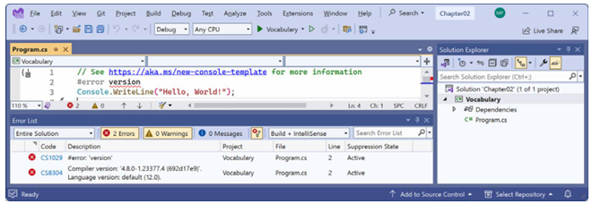

# فصل دوم: Speaking C #

این فصل تماماً در مورد مبانی زبان برنامه‌نویسی C# است. در طول این فصل، یاد خواهید گرفت که چگونه با استفاده از دستور زبان (grammar) C# دستورات (statements) را بنویسید، و همچنین با برخی از واژگان رایجی که هر روز استفاده خواهید کرد، آشنا می‌شوید. علاوه بر این، تا پایان فصل، در دانستن نحوه ذخیره و کار با اطلاعات در حافظه کامپیوتر خود به صورت موقت، احساس اطمینان خواهید کرد.

این فصل موضوعات زیر را پوشش می‌دهد:

* معرفی زبان C#
* کشف نسخه کامپایلر C# شما
* درک دستور زبان و واژگان C#
* کار با متغیرها
* کاوش بیشتر درباره برنامه‌های کنسول
* درک async و await

### معرفی زبان C #

این بخش از کتاب درباره زبان C# است—دستور زبان و واژگانی که هر روز برای نوشتن کد منبع (source code) برنامه‌های خود استفاده خواهید کرد.

زبان‌های برنامه‌نویسی شباهت‌های زیادی به زبان‌های انسانی دارند، با این تفاوت که در زبان‌های برنامه‌نویسی، شما می‌توانید کلمات خودتان را بسازید، درست مثل دکتر زوس (Dr. Seuss)!
در کتابی که دکتر زوس در سال ۱۹۵۰ نوشت، *اگر من باغ‌وحش را اداره می‌کردم* (If I Ran the Zoo)، او چنین بیان می‌کند:
> «و آنگاه، فقط برای اینکه به آن‌ها نشان دهم، به کا-ترو (Ka-Troo) سفر خواهم کرد و یک ایت-کاچ (It-Kutch)، یک پریپ (Preep) و یک پرو (Proo)، یک نرکل (Nerkle)، یک نرد (Nerd) و یک سیرساکر (Seersucker) را هم با خود خواهم آورد!»

#### نسخه‌ها و ویژگی‌های زبان C #

این بخش از کتاب زبان برنامه‌نویسی C# را پوشش می‌دهد و عمدتاً برای مبتدیان نوشته شده است، بنابراین موضوعات بنیادی را که همه توسعه‌دهندگان باید بدانند، از جمله تعریف متغیرها، ذخیره داده‌ها و چگونگی تعریف انواع داده سفارشی، پوشش می‌دهد.

این کتاب ویژگی‌های زبان C# را از نسخه ۱ تا آخرین نسخه، یعنی ۱۲، پوشش می‌دهد. اگر قبلاً با نسخه‌های قدیمی‌تر C# آشنایی دارید و مشتاقید تا درباره ویژگی‌های جدید در آخرین نسخه‌های C# بدانید، من با فهرست کردن نسخه‌های زبان و ویژگی‌های مهم جدید آن‌ها در زیر، به همراه شماره فصل و عنوان موضوعی که می‌توانید در آنجا درباره آن‌ها بیاموزید، پرش به بخش‌های مختلف را برای شما آسان‌تر کرده‌ام. شما می‌توانید این اطلاعات را در مخزن GitHub در لینک زیر مطالعه کنید:
[https://github.com/markjprice/cs12dotnet8/blob/main/docs/ch02-features.md](https://github.com/markjprice/cs12dotnet8/blob/main/docs/ch02-features.md)

#### درک استانداردهای C #

در طول سال‌ها، مایکروسافت چندین نسخه از C# را به نهادهای استانداردسازی ارسال کرده است، همان‌طور که در جدول ۲.۱ نشان داده شده است:

| C# version | ECMA standard | ISO/IEC standard |
| :--- | :--- | :--- |
| 1.0 | ECMA-334:2003 | ISO/IEC 23270:2003 |
| 2.0 | ECMA-334:2006 | ISO/IEC 23270:2006 |
| 5.0 | ECMA-334:2017 | ISO/IEC 23270:2018 |
| 6.0 | ECMA-334:2022 | ISO/IEC 23270:2022 |

*جدول ۲.۱: استانداردهای ECMA برای C#*

استاندارد ECMA برای C# 7.3 هنوز یک پیش‌نویس است. پس حتی فکرش را هم نکنید که نسخه‌های ۸ تا ۱۲ C# چه زمانی ممکن است استاندارد ECMA شوند! مایکروسافت در سال ۲۰۱۴ C# را متن‌باز (open source) کرد. شما می‌توانید آخرین سند استاندارد C# را در لینک زیر مطالعه کنید:
[https://learn.microsoft.com/en-us/dotnet/csharp/language-reference/specifications](https://learn.microsoft.com/en-us/dotnet/csharp/language-reference/specifications)

مفیدتر از استانداردهای ECMA از نظر عملی، مخازن عمومی GitHub برای باز نگه داشتن کار روی C# و فناوری‌های مرتبط تا حد امکان است، همان‌طور که در جدول ۲.۲ نشان داده شده است:

| Description | Link |
| :--- | :--- |
| C# language design | [https://github.com/dotnet/csharplang](https://github.com/dotnet/csharplang) |
| Compiler implementation | [https://github.com/dotnet/roslyn](https://github.com/dotnet/roslyn) |
| Standard to describe the language | [https://github.com/dotnet/csharpstandard](https://github.com/dotnet/csharpstandard) |

*جدول ۲.۲: مخازن عمومی GitHub برای C#*

### کشف نسخه کامپایلر C# شما

کامپایلر زبان .NET برای C# و ویژوال بیسیک، که به نام **Roslyn** نیز شناخته می‌شود، همراه با یک کامپایلر جداگانه برای F#، به عنوان بخشی از .NET SDK توزیع می‌شود. برای استفاده از یک نسخه خاص از C#، باید حداقل آن نسخه از .NET SDK را نصب داشته باشید، همان‌طور که در جدول ۲.۳ نشان داده شده است:

| .NET SDK | Roslyn compiler | Default C# language |
| :--- | :--- | :--- |
| 1.0 | 2.0-2.2 | 7.0 |
| 1.1 | 2.3-2.4 | 7.1 |
| 2.1.2 | 2.6-2.7 | 7.2 |
| 2.1.200 | 2.8-2.10 | 7.3 |
| 3.0 | 3.0-3.4 | 8.0 |
| 5.0 | 3.8 | 9.0 |
| 6.0 | 4.0 | 10.0 |
| 7.0 | 4.4 | 11.0 |
| 8.0 | 4.8 | 12.0 |

*جدول ۲.۳: نسخه‌های .NET SDK و نسخه‌های کامپایلر C# آن‌ها*

هنگامی که کتابخانه‌های کلاس (class libraries) ایجاد می‌کنید، می‌توانید انتخاب کنید که علاوه بر نسخه‌های .NET مدرن، .NET Standard را نیز هدف قرار دهید (target). آن‌ها دارای نسخه‌های پیش‌فرض زبان C# هستند، همان‌طور که در جدول ۲.۴ نشان داده شده است:

| .NET Standard | C# |
| :--- | :--- |
| 2.0 | 7.3 |
| 2.1 | 8.0 |

*جدول ۲.۴: نسخه‌های .NET Standard و نسخه‌های پیش‌فرض کامپایلر C# آن‌ها*

> اگرچه برای دسترسی به نسخه خاصی از کامپایلر باید حداقل نسخه‌ای از .NET SDK را نصب کرده باشید، اما پروژه‌هایی که ایجاد می‌کنید می‌توانند نسخه‌های قدیمی‌تر .NET را هدف قرار دهند و همچنان از نسخه مدرن کامپایلر استفاده کنند. برای مثال، اگر .NET 7 SDK یا بالاتر را نصب کرده باشید، می‌توانید از ویژگی‌های زبان C# 11 در یک برنامه کنسول که .NET Core 3.0 را هدف قرار می‌دهد، استفاده کنید.

#### نحوه دریافت خروجی نسخه SDK

بیایید ببینیم چه نسخه‌هایی از .NET SDK و کامپایلر زبان C# را در دسترس دارید:

۱. در ویندوز، **Windows Terminal** یا **Command Prompt** را اجرا کنید. در macOS، **Terminal** را اجرا کنید.
۲. برای تعیین اینکه کدام نسخه از .NET SDK را در دسترس دارید، دستور زیر را وارد کنید:

```bash
dotnet --version
```

۳. توجه داشته باشید که نسخه در زمان انتشار این کتاب `8.0.100` است، که نشان می‌دهد این نسخه اولیه SDK بدون هیچ‌گونه رفع باگ یا ویژگی جدیدی تا آن لحظه است، همان‌طور که در خروجی زیر نشان داده شده است:

```text
8.0.100
```

#### فعال‌سازی کامپایلر یک نسخه خاص زبان

ابزارهای توسعه مانند Visual Studio و رابط خط فرمان dotnet فرض می‌کنند که شما می‌خواهید به طور پیش‌فرض از آخرین نسخه اصلی (major version) کامپایلر زبان C# استفاده کنید. قبل از انتشار C# 8، نسخه C# 7 آخرین نسخه اصلی بود و به طور پیش‌فرض استفاده می‌شد. برای استفاده از بهبودهای موجود در نسخه‌های میانی (point release) مانند ۷.۱، ۷.۲ یا ۷.۳، شما مجبور بودید یک... [ادامه متن در بخش بعد]

> **هشدار!**
> برخی از ویژگی‌های زبان C# به تغییرات در کتابخانه‌های زیرین .NET وابسته هستند. حتی اگر از آخرین SDK با آخرین کامپایلر استفاده کنید، ممکن است نتوانید از تمام ویژگی‌های جدید زبان در حالی که نسخه قدیمی‌تری از .NET را هدف قرار داده‌اید، استفاده کنید. برای مثال، C# 11 کلمه کلیدی `required` را معرفی کرد، اما نمی‌توان از آن در پروژه‌ای که .NET 6 را هدف قرار می‌دهد استفاده کرد، زیرا آن ویژگی زبانی به ویژگی‌های (Attributes) جدیدی نیاز دارد که فقط در .NET 7 موجود هستند. خوشبختانه، اگر سعی کنید از ویژگی C# که پشتیبانی نمی‌شود استفاده کنید، کامپایلر به شما هشدار می‌دهد. فقط برای آن احتمال آماده باشید.

---

#### نمایش نسخه کامپایلر

ما کار را با نوشتن کدی آغاز می‌کنیم که نسخه کامپایلر را نمایش می‌دهد:

۱. اگر فصل ۱، *سلام، C# ! خوش آمدی، .NET !* را تکمیل کرده‌اید، پس از قبل پوشه `cs12dotnet8` را دارید. اگر نه، باید آن را ایجاد کنید.

۲. از ویرایشگر کد مورد نظر خود برای ایجاد یک پروژه جدید استفاده کنید، همان‌طور که در لیست زیر تعریف شده است:

* **قالب پروژه:** Console App [C#] / console
* **فایل پروژه و پوشه:** Vocabulary
* **فایل Solution و پوشه:** Chapter02
* **Do not use top-level statements:** تیک نخورده باشد (غیرفعال)
* **Enable native AOT publish:** تیک نخورده باشد (غیرفعال)

> **تمرین خوب:**
> اگر فراموش کرده‌اید چگونه، یا فصل قبل را تکمیل نکرده‌اید، دستورالعمل‌های گام‌به‌گام برای ایجاد یک Solution با چندین پروژه در فصل ۱، *سلام، C# ! خوش آمدی، .NET !* ارائه شده است.

۳. در پروژه `Vocabulary`، در فایل `Program.cs`، بعد از توضیحات (comment)، دستوری اضافه کنید تا نسخه C# را به عنوان یک خطا نشان دهد، همان‌طور که در کد زیر آمده است:

```csharp
#error version
```

۴. برنامه کنسول را اجرا کنید:

* اگر از **Visual Studio 2022** استفاده می‌کنید، به مسیر **Debug | Start Without Debugging** بروید. هنگامی که از شما خواسته شد ادامه دهید و آخرین بیلد موفق را اجرا کنید، روی **No** کلیک کنید.
* اگر از **Visual Studio Code** استفاده می‌کنید، در یک ترمینال برای پوشه `Vocabulary`، دستور `dotnet run` را وارد کنید. توجه داشته باشید که ما انتظار خطای کامپایلر را داریم، پس وقتی آن را دیدید وحشت نکنید!

۵. توجه داشته باشید که نسخه کامپایلر و نسخه زبان به عنوان پیام خطای کامپایلر شماره `CS8304` ظاهر می‌شود، همان‌طور که در شکل ۲.۱ نشان داده شده است:

 <div align="center">


</div>

پیام خطا در پنجره **PROBLEMS** در Visual Studio Code یا پنجره **Error List** در Visual Studio می‌گوید:
`Compiler version: '4.8.0...' with language version default (12.0).`

۶. دستوری که باعث خطا شده است را کامنت کنید (غیرفعال کنید)، همان‌طور که در کد زیر نشان داده شده است:

```csharp
// #error version
```

۷. توجه داشته باشید که پیام‌های خطای کامپایلر ناپدید می‌شوند.

### درک دستور زبان و واژگان C #

بیایید با نگاهی به مبانی دستور زبان (grammar) و واژگان (vocabulary) در C# شروع کنیم. در طول این فصل، شما چندین برنامه کنسول ایجاد خواهید کرد که هر کدام ویژگی‌های مرتبط زبان C# را نشان می‌دهند.

#### درک دستور زبان C #

دستور زبان C# شامل دستورات (statements) و بلوک‌ها (blocks) است. برای مستندسازی کد خود، می‌توانید از توضیحات (comments) استفاده کنید.

> **تمرین خوب:**
> توضیحات (Comments) نباید تنها راهی باشند که کد خود را مستند می‌کنید. انتخاب نام‌های معقول برای متغیرها و توابع، نوشتن تست‌های واحد (unit tests)، و ایجاد مستندات واقعی، راه‌های دیگری برای مستندسازی کد شما هستند.

#### دستورات (Statements)

در زبان انگلیسی، ما پایان یک جمله را با نقطه مشخص می‌کنیم. یک جمله می‌تواند از چندین کلمه و عبارت تشکیل شده باشد، که ترتیب کلمات بخشی از دستور زبان است. برای مثال، در انگلیسی می‌گوییم "the black cat".
صفت، یعنی `black`، قبل از اسم، یعنی `cat` می‌آید. در حالی که دستور زبان فرانسوی ترتیب متفاوتی دارد؛ صفت بعد از اسم می‌آید: "le chat noir".
آنچه مهم است از این موضوع برداشت کنید این است که **ترتیب اهمیت دارد**.

C# پایان یک دستور را با نقطه ویرگول (semicolon) `;` مشخص می‌کند. یک دستور می‌تواند از چندین نوع، متغیر و عبارت (expression) تشکیل شده باشد که از توکن‌ها (tokens) ساخته شده‌اند. هر توکن توسط فضای خالی (white space) یا یک توکن دیگر که به وضوح متفاوت است، مانند یک عملگر (operator)، مثلاً `=` یا `+`، جدا می‌شود.

برای مثال، در دستور زیر، `decimal` یک نوع (type)، `totalPrice` یک متغیر، و `subtotal + salesTax` یک عبارت است:

```csharp
decimal totalPrice = subtotal + salesTax;
```

این عبارت از یک عملوند (operand) به نام `subtotal`، یک عملگر `+`، و عملوند دیگری به نام `salesTax` ساخته شده است. ترتیب عملوندها و عملگرها اهمیت دارد زیرا ترتیب بر معنی و نتیجه تأثیر می‌گذارد.

#### توضیحات (Comments)

توضیحات روش اصلی مستندسازی کد شما برای افزایش درک نحوه کارکرد آن هستند، تا سایر توسعه‌دهندگان بتوانند آن را بخوانند، یا حتی خودتان وقتی ماه‌ها بعد به آن برمی‌گردید، بتوانید آن را بخوانید.

> در فصل ۴، *نوشتن، اشکال‌زدایی و تست توابع*، درباره توضیحات XML که با سه اسلش `///` شروع می‌شوند و با ابزاری برای تولید صفحات وب جهت مستندسازی کد شما کار می‌کنند، یاد خواهید گرفت.

شما می‌توانید با استفاده از دو اسلش `//` توضیحاتی برای تشریح کد خود اضافه کنید. کامپایلر همه چیز را بعد از `//` تا پایان خط نادیده می‌گیرد، همان‌طور که در کد زیر نشان داده شده است:

```csharp
// Sales tax must be added to the subtotal.
var totalPrice = subtotal + salesTax;
```

برای نوشتن توضیحات چندخطی، از `/*` در ابتدا و `*/` در انتهای توضیح استفاده کنید، همان‌طور که در کد زیر نشان داده شده است:

```csharp
/* This is a multi-line comment. */
```

اگرچه `/* */` بیشتر برای توضیحات چندخطی استفاده می‌شود، اما برای درج توضیح در وسط یک دستور نیز مفید است، همان‌طور که در کد زیر نشان داده شده است:

```csharp
decimal totalPrice = subtotal /* for this item */ + salesTax;
```

> **تمرین خوب:**
> کدِ خوب طراحی شده، شامل امضاهای تابع با پارامترهای خوش‌نام و کپسوله‌سازی کلاس، می‌تواند تا حدودی خود-مستند (self-documenting) باشد. وقتی می‌بینید که توضیحات و تشریحات بیش از حدی در کد خود قرار می‌دهید، از خود بپرسید: آیا می‌توانم این کد را بازنویسی (refactor) کنم تا بدون توضیحات طولانی قابل درک‌تر شود؟

ویرایشگر کد شما دستوراتی برای آسان‌تر کردن افزودن و حذف کاراکترهای توضیحات دارد، همان‌طور که در لیست زیر نشان داده شده است:

* **Visual Studio 2022:** به مسیر **Edit | Advanced | Comment Selection** یا **Uncomment Selection** بروید.
* **Visual Studio Code:** به مسیر **Edit | Toggle Line Comment** یا **Toggle Block Comment** بروید.
* **JetBrains Rider:** به مسیر **Code | Comment with Line Comment** یا **Comment with Block Comment** بروید.

> **تمرین خوب:**
> شما با افزودن متن توصیفی در بالا یا بعد از دستورات کد، کد را **توضیح می‌دهید (Comment)**.
> شما با افزودن کاراکترهای توضیحات قبل یا اطراف دستورات، کد را **کامنت می‌کنید (Comment out)** تا آن‌ها را غیرفعال کنید.
> **Uncommenting** به معنای حذف کاراکترهای توضیحات است.
