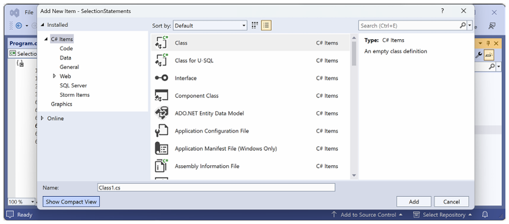
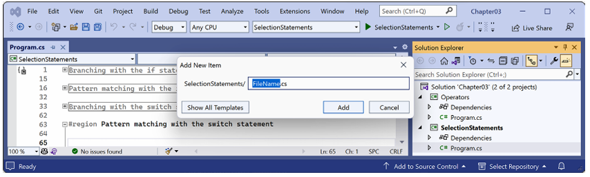

# فصل سوم: کنترل جریان، تبدیل انواع و مدیریت استثناها

این فصل تماماً درباره نوشتن کدی است که عملیات ساده روی متغیرها انجام می‌دهد، تصمیم‌گیری می‌کند، تطبیق الگو (pattern matching) انجام می‌دهد و دستورات یا بلوک‌ها را تکرار می‌کند. همچنین یاد خواهید گرفت که چگونه با آرایه‌ها برای ذخیره چندین مقدار کار کنید، چگونه مقادیر متغیر یا عبارت را از یک نوع به نوع دیگر تبدیل کنید، چگونه استثناها را مدیریت کنید و چگونه سرریز (overflow) را در متغیرهای عددی بررسی کنید.

این فصل موضوعات زیر را پوشش می‌دهد:

* عملیات روی متغیرها
* درک دستورات انتخاب (selection statements)
* درک دستورات تکرار (iteration statements)
* ذخیره چندین مقدار در یک آرایه
* تبدیل (Casting) و تبدیل انواع (Converting)
* مدیریت استثناها
* بررسی سرریز (Checking for overflow)

### عملیات روی متغیرها

عملگرها (Operators) عملیات ساده‌ای مانند جمع و ضرب را روی عملوندها (operands) مانند متغیرها و مقادیر لیترال اعمال می‌کنند. عملگرها مقدار جدیدی را برمی‌گردانند که نتیجه عملیات است و می‌تواند به یک متغیر اختصاص داده شود، و همچنین می‌توانند روی عملوندها تأثیر بگذارند.

#### درک عملگرهای دوتایی (Binary Operators)

بیشتر عملگرها دوتایی هستند، به این معنی که روی دو عملوند کار می‌کنند، همان‌طور که در شبه‌کد زیر نشان داده شده است:

```csharp
var resultOfOperation = firstOperand operator secondOperand;
```

مثال‌هایی از عملگرهای دوتایی شامل جمع و ضرب هستند، همان‌طور که در کد زیر نشان داده شده است:

```csharp
int x = 5;
int y = 3;
int resultOfAdding = x + y;
int resultOfMultiplying = x * y;
```

#### درک عملگرهای یگانه (Unary Operators)

برخی عملگرها یگانه هستند، به این معنی که روی یک عملوند تکی کار می‌کنند و می‌توانند قبل یا بعد از عملوند اعمال شوند، همان‌طور که در شبه‌کد زیر نشان داده شده است:

```csharp
var resultOfOperationAfter = onlyOperand operator;
var resultOfOperationBefore = operator onlyOperand;
```

مثال‌هایی از عملگرهای یگانه شامل افزاینده‌ها (incrementors) و بازیابی یک نوع یا اندازه آن به بایت هستند، همان‌طور که در کد زیر نشان داده شده است:

```csharp
int x = 5;
int postfixIncrement = x++;
int prefixIncrement = ++x;
Type theTypeOfAnInteger = typeof(int);
string nameOfVariable = nameof(x);
int howManyBytesInAnInteger = sizeof(int);
```

#### درک عملگرهای سه‌گانه (Ternary Operators)

یک عملگر سه‌گانه روی سه عملوند کار می‌کند، همان‌طور که در شبه‌کد زیر نشان داده شده است:

```csharp
var resultOfOperation = firstOperand firstOperator
  secondOperand secondOperator thirdOperand;
```

مثالی از یک عملگر سه‌گانه، عملگر شرطی `?:` است که مانند یک دستور `if` ساده شده عمل می‌کند. عملوند اول یک عبارت بولی است، عملوند دوم مقداری است که در صورت درست بودن (true) بازگردانده می‌شود، و عملوند سوم مقداری است که در صورت نادرست بودن (false) بازگردانده می‌شود، همان‌طور که در کد زیر نشان داده شده است:

```csharp
// Syntax of conditional operator.
var result = boolean_expression ? value_if_true : value_if_false;

// Example of conditional operator.
string result = x > 3 ? "Greater than 3" : "Less than or equal to 3";

// Equivalent using an if statement.
string result;
if (x > 3)
{
    result = "Greater than 3";
}
else
{
    result = "Less than or equal to 3";
}
```

توسعه‌دهندگان C# باتجربه‌تر تا حد امکان از عملگرهای سه‌گانه استفاده می‌کنند زیرا مختصر هستند و می‌توانند منجر به کدی تمیزتر شوند، البته وقتی به خواندن آن‌ها عادت کنید.

#### کاوش عملگرهای یگانه

دو عملگر یگانه رایج برای افزایش (`++`) و کاهش (`--`) یک عدد استفاده می‌شوند. بیایید کدی نمونه بنویسیم تا نحوه کار آن‌ها را نشان دهیم:

۱. اگر فصل‌های قبلی را تکمیل کرده باشید، پوشه `cs12dotnet8` را از قبل دارید. اگر نه، باید آن را ایجاد کنید.

۲. از ابزار کدنویسی مورد نظر خود برای ایجاد یک Solution و پروژه جدید استفاده کنید، همان‌طور که در لیست زیر تعریف شده است:

* **قالب پروژه:** Console App / console
* **فایل پروژه و پوشه:** Operators
* **فایل Solution و پوشه:** Chapter03
* **Do not use top-level statements:** تیک نخورده باشد (غیرفعال)
* **Enable native AOT publish:** تیک نخورده باشد (غیرفعال)

۳. در `Operators.csproj`، یک بخش `<ItemGroup>` جدید اضافه کنید تا `System.Console` را برای تمام فایل‌های C# با استفاده از ویژگی implicit usings .NET SDK به‌صورت استاتیک وارد کنید، همان‌طور که در نشانه‌گذاری زیر نشان داده شده است:

```xml
<ItemGroup>
  <Using Include="System.Console" Static="true" />
</ItemGroup>
```

۴. در `Program.cs`، دستورات موجود را حذف کنید و سپس دو متغیر عدد صحیح به نام‌های `a` و `b` تعریف کنید، `a` را برابر ۳ قرار دهید، `a` را افزایش دهید در حالی که نتیجه را به `b` اختصاص می‌دهید، و سپس مقادیر آن‌ها را چاپ کنید، همان‌طور که در کد زیر نشان داده شده است:

```csharp
#region Exploring unary operators
int a = 3;
int b = a++;
WriteLine($"a is {a}, b is {b}");
#endregion
```

> **تمرین خوب:**
> من توصیه می‌کنم دستورات مربوط به هر بخش را در `#region` و `#endregion` قرار دهید همان‌طور که در کد قبل نشان داده شده است تا بتوانید به راحتی بخش‌ها را جمع (collapse) کنید. اما من این کار را در وظایف کدنویسی آینده برای صرفه‌جویی در فضا نشان نخواهم داد.

۵. قبل از اجرای برنامه کنسول، از خود بپرسید: فکر می‌کنید مقدار `b` هنگام چاپ چه خواهد بود؟ وقتی به آن فکر کردید، کد را اجرا کنید و پیش‌بینی خود را با نتیجه واقعی مقایسه کنید، همان‌طور که در خروجی زیر نشان داده شده است:

```text
a is 4, b is 3
```

متغیر `b` مقدار ۳ دارد زیرا عملگر `++` **بعد از** انتساب اجرا می‌شود؛ این به عنوان **عملگر پسوندی (postfix operator)** شناخته می‌شود. اگر نیاز دارید که افزایش **قبل از** انتساب انجام شود، آنگاه از **عملگر پیشوندی (prefix operator)** استفاده کنید.

۶. دستورات را کپی و پیست کنید، و سپس آن‌ها را تغییر دهید تا متغیرها را تغییر نام دهید و از عملگر پیشوندی استفاده کنید، همان‌طور که در کد زیر نشان داده شده است:

```csharp
int c = 3;
int d = ++c; // Prefix means increment c before assigning it.
WriteLine($"c is {c}, d is {d}");
```

۷. کد را دوباره اجرا کنید و به نتیجه توجه کنید، همان‌طور که در خروجی زیر نشان داده شده است:

```text
a is 4, b is 3
c is 4, d is 4
```

> **تمرین خوب:**
> به دلیل سردرگمی بین پیشوند و پسوند برای عملگرهای افزایش و کاهش هنگام ترکیب با یک انتساب، طراحان زبان برنامه‌نویسی Swift تصمیم گرفتند پشتیبانی از این عملگر را در نسخه ۳ حذف کنند. توصیه من برای استفاده در C# این است که هرگز استفاده از عملگرهای `++` و `--` را با یک عملگر انتساب، `=` ترکیب نکنید. عملیات را به عنوان دستورات جداگانه انجام دهید.

#### کاوش عملگرهای حسابی دوتایی

افزایش و کاهش عملگرهای حسابی یگانه هستند. سایر عملگرهای حسابی معمولاً دوتایی هستند و به شما اجازه می‌دهند عملیات حسابی را روی دو عدد انجام دهید، همان‌طور که در زیر نشان داده شده است:

۱. دستوراتی اضافه کنید تا مقادیری را به دو متغیر عدد صحیح به نام‌های `e` و `f` تعریف و اختصاص دهید، و سپس پنج عملگر حسابی دوتایی رایج را روی دو عدد اعمال کنید، همان‌طور که در کد زیر نشان داده شده است:

```csharp
int e = 11;
int f = 3;
WriteLine($"e is {e}, f is {f}");
WriteLine($"e + f = {e + f}");
WriteLine($"e - f = {e - f}");
WriteLine($"e * f = {e * f}");
WriteLine($"e / f = {e / f}");
WriteLine($"e % f = {e % f}");
```

۲. کد را اجرا کنید و به نتیجه توجه کنید، همان‌طور که در خروجی زیر نشان داده شده است:

```text
e is 11, f is 3
e + f = 14
e - f = 8
e * f = 33
e / f = 3
e % f = 2
```

برای درک عملگرهای تقسیم `/` و باقی‌مانده `%` هنگامی که روی اعداد صحیح اعمال می‌شوند، باید به دوران دبستان فکر کنید. تصور کنید یازده آبنبات و سه دوست دارید.
چگونه می‌توانید آبنبات‌ها را بین دوستانتان تقسیم کنید؟ می‌توانید به هر یک از دوستانتان سه آبنبات بدهید، و دو تا باقی می‌ماند. آن دو آبنبات **باقی‌مانده** (modulus) هستند. اگر دوازده آبنبات داشتید، هر دوست چهار تا می‌گرفت و هیچی باقی نمی‌ماند، پس باقی‌مانده ۰ می‌شد.

۳. دستوراتی اضافه کنید تا مقداری را به یک متغیر `double` به نام `g` تعریف و اختصاص دهید تا تفاوت بین تقسیم اعداد حسابی (whole-number) و اعداد حقیقی (real-number) را نشان دهید، همان‌طور که در کد زیر نشان داده شده است:

```csharp
double g = 11.0;
WriteLine($"g is {g:N1}, f is {f}");
WriteLine($"g / f = {g / f}");
```

۴. کد را اجرا کنید و به نتیجه توجه کنید، همان‌طور که در خروجی زیر نشان داده شده است:

```text
g is 11.0, f is 3
g / f = 3.6666666666666665
```

اگر عملوند اول یک عدد ممیز شناور باشد، مانند `g` با مقدار `11.0`، آنگاه عملگر تقسیم یک مقدار ممیز شناور برمی‌گرداند، مانند `3.6666666666665`، نه یک عدد صحیح.

#### عملگرهای انتساب (Assignment Operators)

شما قبلاً از رایج‌ترین عملگر انتساب، `=` استفاده کرده‌اید.
برای مختصرتر کردن کد خود، می‌توانید عملگر انتساب را با سایر عملگرها مانند عملگرهای حسابی ترکیب کنید، همان‌طور که در کد زیر نشان داده شده است:

```csharp
int p = 6;
p += 3; // Equivalent to: p = p + 3;
p -= 3; // Equivalent to: p = p - 3;
p *= 3; // Equivalent to: p = p * 3;
p /= 3; // Equivalent to: p = p / 3;
```

#### عملگرهای ادغام نال (Null-coalescing Operators)

عملگرهای مرتبط با عملگرهای انتساب، عملگرهای ادغام نال هستند. گاهی اوقات، می‌خواهید یک متغیر را به یک نتیجه اختصاص دهید یا اگر متغیر `null` است، یک مقدار جایگزین اختصاص دهید. می‌توانید این کار را با استفاده از عملگرهای ادغام نال، `??` یا `??=` انجام دهید، همان‌طور که در کد زیر نشان داده شده است:

```csharp
string? authorName = ReadLine(); // Prompt user to enter an author name.

// The maxLength variable will be the length of authorName if it is
// not null, or 30 if authorName is null.
int maxLength = authorName?.Length ?? 30;

// The authorName variable will be "unknown" if authorName was null.
authorName ??= "unknown";
```

#### کاوش عملگرهای منطقی (Logical Operators)

عملگرهای منطقی روی مقادیر بولی (Boolean) عمل می‌کنند، بنابراین یا `true` برمی‌گردانند یا `false`. بیایید عملگرهای منطقی دوتایی را که روی دو مقدار بولی عمل می‌کنند (که به‌طور سنتی در ریاضیات `p` و `q` نامیده می‌شوند) بررسی کنیم:

۱. در `Program.cs`، دستوراتی اضافه کنید تا دو متغیر بولی `p` و `q` را با مقادیر `true` و `false` تعریف کنید، و سپس جداول درستی (truth tables) را که نتایج اعمال عملگرهای منطقی AND ،OR و XOR (exclusive OR) را نشان می‌دهند، چاپ کنید، همان‌طور که در کد زیر نشان داده شده است:

```csharp
bool p = true;
bool q = false;
WriteLine($"AND  | p     | q    ");
WriteLine($"p    | {p & p,-5} | {p & q,-5} ");
WriteLine($"q    | {q & p,-5} | {q & q,-5} ");
WriteLine();
WriteLine($"OR   | p     | q    ");
WriteLine($"p    | {p | p,-5} | {p | q,-5} ");
WriteLine($"q    | {q | p,-5} | {q | q,-5} ");
WriteLine();
WriteLine($"XOR  | p     | q    ");
WriteLine($"p    | {p ^ p,-5} | {p ^ q,-5} ");
WriteLine($"q    | {q ^ p,-5} | {q ^ q,-5} ");
```

> به یاد داشته باشید که `,-5` به معنای چپ‌چین کردن در ستونی با عرض پنج کاراکتر است.

۲. کد را اجرا کنید و به نتایج توجه کنید، همان‌طور که در خروجی زیر نشان داده شده است:

```text
AND  | p     | q
p    | True  | False
q    | False | False
OR   | p     | q
p    | True  | True
q    | True  | False
XOR  | p     | q
p    | False | True
q    | True  | False
```

برای عملگر منطقی **AND** (`&`)، هر دو عملوند باید `true` باشند تا نتیجه `true` شود. برای عملگر منطقی **OR** (`|`)، هر کدام از عملوندها می‌توانند `true` باشند تا نتیجه `true` شود. برای عملگر منطقی **XOR** (`^`)، هر کدام از عملوندها می‌توانند `true` باشند (اما نه هر دو!) تا نتیجه `true` شود.

#### کاوش عملگرهای منطقی شرطی (Conditional Logical Operators)

عملگرهای منطقی شرطی مانند عملگرهای منطقی هستند، اما شما از دو نماد به جای یکی استفاده می‌کنید، برای مثال `&&` به جای `&`، یا `||` به جای `|`.

در فصل ۴، *نوشتن، اشکال‌زدایی و تست توابع*، درباره توابع با جزئیات بیشتر یاد خواهید گرفت، اما من باید توابع را الان معرفی کنم تا عملگرهای منطقی شرطی را توضیح دهم، که به عنوان **عملگرهای بولی اتصال کوتاه (short-circuiting Boolean operators)** نیز شناخته می‌شوند.

یک تابع دستوراتی را اجرا می‌کند و سپس مقداری را برمی‌گرداند. آن مقدار می‌تواند یک مقدار بولی مانند `true` باشد که در یک عملیات بولی استفاده می‌شود. بیایید از عملگرهای منطقی شرطی استفاده کنیم:

۱. در انتهای `Program.cs`، دستوراتی بنویسید تا تابعی را تعریف کنید که پیامی را در کنسول می‌نویسد و `true` برمی‌گرداند، همان‌طور که در کد زیر نشان داده شده است:

```csharp
static bool DoStuff()
{
    WriteLine("I am doing some stuff.");
    return true;
}
```

> توابع محلی می‌توانند هر جایی در میان دستورات در `Program.cs` که از ویژگی برنامه سطح بالا استفاده می‌کند باشند، اما تمرین خوبی است که آن‌ها را در انتهای فایل قرار دهید.

۲. بعد از دستورات `WriteLine` قبلی، یک عملیات AND (`&`) روی متغیرهای `p` و `q`، و نتیجه فراخوانی تابع انجام دهید، همان‌طور که در کد زیر نشان داده شده است:

```csharp
WriteLine();
// Note that DoStuff() returns true.
WriteLine($"p & DoStuff() = {p & DoStuff()}");
WriteLine($"q & DoStuff() = {q & DoStuff()}");
```

۳. کد را اجرا کنید، نتیجه را مشاهده کنید، و توجه کنید که تابع دو بار فراخوانی شده است، یک بار برای `p` و یک بار برای `q`، همان‌طور که در خروجی زیر نشان داده شده است:

```text
I am doing some stuff.
p & DoStuff() = True
I am doing some stuff.
q & DoStuff() = False
```

۴. سه دستور را کپی و پیست کنید و سپس عملگرهای `&` را به عملگرهای `&&` تغییر دهید، همان‌طور که در کد زیر نشان داده شده است:

```csharp
WriteLine();
WriteLine($"p && DoStuff() = {p && DoStuff()}");
WriteLine($"q && DoStuff() = {q && DoStuff()}");
```

۵. کد را اجرا کنید، نتیجه را مشاهده کنید، و توجه کنید که تابع زمانی که با متغیر `p` ترکیب می‌شود اجرا می‌شود. اما زمانی که با متغیر `q` ترکیب می‌شود اجرا **نمی‌شود** زیرا متغیر `q` مقدار `false` دارد، بنابراین نتیجه در هر صورت `false` خواهد بود، پس نیازی به اجرای تابع نیست، همان‌طور که در خروجی زیر نشان داده شده است:

```text
I am doing some stuff.
p && DoStuff() = True
q && DoStuff() = False // DoStuff function was not executed!
```

> **تمرین خوب:**
> حالا می‌توانید ببینید چرا عملگرهای منطقی شرطی به عنوان اتصال کوتاه (short-circuiting) توصیف می‌شوند. آن‌ها می‌توانند برنامه‌های شما را کارآمدتر کنند، اما همچنین می‌توانند باگ‌های ظریفی را در مواردی که فرض می‌کنید تابع همیشه فراخوانی خواهد شد، ایجاد کنند. امن‌ترین کار این است که هنگام استفاده ترکیبی با توابعی که اثرات جانبی (side effects) دارند، از آن‌ها اجتناب کنید.

#### کاوش عملگرهای بیتی (Bitwise) و شیفت باینری (Binary Shift)

عملگرهای بیتی بیت‌های موجود در نمایش باینری یک عدد را مقایسه می‌کنند. هر بیت، یعنی مقدار ۰ (صفر) یا ۱ (یک)، به‌صورت جداگانه با بیت موجود در همان ستون مقایسه می‌شود.
عملگرهای شیفت باینری می‌توانند برخی محاسبات حسابی رایج را بسیار سریع‌تر از عملگرهای سنتی انجام دهند، برای مثال، هر ضرب در ضریبی از ۲.

بیایید عملگرهای بیتی و شیفت باینری را بررسی کنیم:

۱. در `Program.cs`، دستوراتی اضافه کنید تا دو متغیر عدد صحیح به نام‌های `x` و `y` با مقادیر ۱۰ و ۶ تعریف کنید، و سپس نتایج اعمال عملگرهای بیتی AND ،OR و XOR را چاپ کنید، همان‌طور که در کد زیر نشان داده شده است:

```csharp
WriteLine();
int x = 10;
int y = 6;
WriteLine($"Expression | Decimal | Binary");
WriteLine($"-------------------------------");
WriteLine($"x | {x,7} | {x:B8}");
WriteLine($"y | {y,7} | {y:B8}");
WriteLine($"x & y | {x & y,7} | {x & y:B8}");
WriteLine($"x | y | {x | y,7} | {x | y:B8}");
WriteLine($"x ^ y | {x ^ y,7} | {x ^ y:B8}");
```

> به یاد داشته باشید که `,7` به معنای راست‌چین کردن در ستونی با عرض هفت و `:B8` به معنای فرمت‌دهی در باینری با هشت رقم است.

۲. کد را اجرا کنید و به نتایج توجه کنید، همان‌طور که در خروجی زیر نشان داده شده است:

```text
Expression | Decimal | Binary
-------------------------------
x          |      10 | 00001010
y          |       6 | 00000110
x & y      |       2 | 00000010
x | y      |      14 | 00001110
x ^ y      |      12 | 00001100
```

برای `x & y`، تنها ستون بیت ۲ تنظیم شده است. برای `x | y`، ستون‌های بیت ۸، ۴ و ۲ تنظیم شده‌اند. برای `x ^ y`، ستون‌های ۸ و ۴ تنظیم شده‌اند.

۳. در `Program.cs`، دستوراتی اضافه کنید تا نتایج اعمال عملگر شیفت چپ برای جابجایی بیت‌های متغیر `x` به اندازه سه ستون، ضرب `x` در ۸، و شیفت راست بیت‌های متغیر `y` به اندازه یک ستون را چاپ کنید، همان‌طور که در کد زیر نشان داده شده است:

```csharp
// Left-shift x by three bit columns.
WriteLine($"x << 3 | {x << 3,7} | {x << 3:B8}");
// Multiply x by 8.
WriteLine($"x * 8 | {x * 8,7} | {x * 8:B8}");
// Right-shift y by one bit column.
WriteLine($"y >> 1 | {y >> 1,7} | {y >> 1:B8}");
```

۴. کد را اجرا کنید و به نتایج توجه کنید، همان‌طور که در خروجی زیر نشان داده شده است:

```text
x << 3     |      80 | 01010000
x * 8      |      80 | 01010000
y >> 1     |       3 | 00000011
```

نتیجه ۸۰ به این دلیل است که بیت‌ها در آن سه ستون به چپ شیفت داده شدند، بنابراین بیت‌های ۱ به ستون‌های ۶۴ و ۱۶ منتقل شدند، و ۶۴ + ۱۶ = ۸۰. این معادل ضرب در ۸ است، اما CPUها می‌توانند شیفت بیتی را سریع‌تر انجام دهند. نتیجه ۳ به این دلیل است که بیت‌های ۱ در `y` یک ستون به ستون‌های ۲ و ۱ شیفت داده شدند.

> **تمرین خوب:**
> به یاد داشته باشید که هنگام عملیات روی مقادیر صحیح، نمادهای `&` و `|` عملگرهای بیتی هستند، و هنگام عملیات روی مقادیر بولی مانند `true` و `false`، نمادهای `&` و `|` عملگرهای منطقی هستند.

ترجمه بخش‌های بعدی فصل سوم با همان سبک رسمی و آموزشی کتاب:

---

#### عملگرهای متفرقه (Miscellaneous operators)

`nameof` و `sizeof` عملگرهای راحتی هنگام کار با انواع هستند:

* `nameof` نام کوتاه (بدون فضای نام) یک متغیر، نوع یا عضو را به عنوان یک مقدار رشته‌ای برمی‌گرداند، که هنگام چاپ پیام‌های استثنا مفید است.
* `sizeof` اندازه به بایتِ انواع ساده را برمی‌گرداند، که برای تعیین کارایی ذخیره‌سازی داده مفید است. از نظر فنی، عملگر `sizeof` به یک بلوک کد ناامن (unsafe) نیاز دارد، اما اندازه‌های انواع مقداری با نام مستعار C#، مانند `int` و `double`، توسط کامپایلر به عنوان ثابت‌ها کدگذاری شده‌اند، بنابراین نیازی به بلوک ناامن ندارند.

برای مثال:

```csharp
int age = 50;
WriteLine($"The {nameof(age)} variable uses {sizeof(int)} bytes of memory.");
```

عملگرهای بسیار دیگری وجود دارند؛ برای مثال، نقطه بین یک متغیر و اعضای آن **عملگر دسترسی به عضو (member access operator)** نامیده می‌شود و پرانتزهای گرد در انتهای نام یک تابع یا متد **عملگر فراخوانی (invocation operator)** نامیده می‌شوند، همان‌طور که در کد زیر نشان داده شده است:

```csharp
int age = 50;
// How many operators in the following statement?
char firstDigit = age.ToString()[0];
// There are four operators:
// = is the assignment operator
// . is the member access operator
// () is the invocation operator
// [] is the indexer access operator
```

### درک دستورات انتخاب (Selection Statements)

هر برنامه‌ای باید بتواند از بین گزینه‌ها انتخاب کند و در مسیرهای کد مختلف شاخه‌گذاری کند. دو دستور انتخاب در C# عبارتند از `if` و `switch`. شما می‌توانید از `if` برای تمام کد خود استفاده کنید، اما `switch` می‌تواند کد شما را در برخی سناریوهای رایج ساده کند، مانند زمانی که یک متغیر واحد وجود دارد که می‌تواند چندین مقدار داشته باشد که هر کدام نیاز به پردازش متفاوتی دارند.

#### شاخه‌گذاری با دستور if

دستور `if` با ارزیابی یک عبارت بولی تعیین می‌کند که کدام شاخه دنبال شود. اگر عبارت `true` باشد، بلوک اجرا می‌شود. بلوک `else` اختیاری است و اگر عبارت `if` برابر با `false` باشد اجرا می‌شود. دستور `if` می‌تواند تودرتو باشد.

دستور `if` می‌تواند با سایر دستورات `if` به عنوان شاخه‌های `else if` ترکیب شود، همان‌طور که در کد زیر نشان داده شده است:

```csharp
if (expression1)
{
  // Executes if expression1 is true.
}
else if (expression2)
{
  // Executes if expression1 is false and expression2 is true.
}
else if (expression3)
{
  // Executes if expression1 and expression2 are false
  // and expression3 is true.
}
else
{
  // Executes if all expressions are false.
}
```

عبارت بولی هر دستور `if` مستقل از دیگران است و برخلاف دستورات `switch`، نیازی به ارجاع به یک مقدار واحد ندارد.

بیایید کدی بنویسیم تا دستورات انتخاب مانند `if` را بررسی کنیم:

۱. از ابزار کدنویسی مورد نظر خود برای افزودن یک پروژه جدید Console App / console به نام `SelectionStatements` به Solution `Chapter03` استفاده کنید.

> به یاد داشته باشید که `System.Console` را در فایل پروژه خود به‌صورت استاتیک وارد کنید. و اگر از Visual Studio 2022 استفاده می‌کنید، پروژه آغازین را روی انتخاب فعلی تنظیم کنید.

۲. در `Program.cs`، دستورات موجود را حذف کنید و سپس دستوراتی اضافه کنید تا بررسی کنید که آیا یک رمز عبور حداقل هشت کاراکتر طول دارد، همان‌طور که در کد زیر نشان داده شده است:

```csharp
string password = "ninja";

if (password.Length < 8)
{
    WriteLine("Your password is too short. Use at least 8 chars.");
}
else
{
    WriteLine("Your password is strong.");
}
```

۳. کد را اجرا کنید و به نتیجه توجه کنید، همان‌طور که در خروجی زیر نشان داده شده است:

```text
Your password is too short. Use at least 8 chars.
```

#### چرا همیشه باید از کروشه با دستورات if استفاده کنید

از آنجا که تنها یک دستور در داخل هر بلوک وجود دارد، کد قبلی می‌توانست بدون کروشه نوشته شود، همان‌طور که در کد زیر نشان داده شده است:

```csharp
if (password.Length < 8)
    WriteLine("Your password is too short. Use at least 8 chars.");
else
    WriteLine("Your password is strong.");
```

این سبک از دستور `if` باید اجتناب شود زیرا می‌تواند باگ‌های جدی ایجاد کند. یک مثال بدنام، باگ `#gotofail` در سیستم‌عامل iOS آیفون اپل است. به مدت ۱۸ ماه پس از انتشار iOS 6 در سپتامبر ۲۰۱۲، به دلیل یک دستور `if` بدون کروشه در کد رمزگذاری Secure Sockets Layer (SSL) خود، باگی داشت. این بدان معنا بود که هر کاربری که Safari، مرورگر وب دستگاه را اجرا می‌کرد و سعی می‌کرد به وب‌سایت‌های امن مانند بانک خود متصل شود، به درستی ایمن نبود زیرا یک بررسی مهم به طور تصادفی نادیده گرفته می‌شد.

فقط به این دلیل که می‌توانید کروشه‌ها را حذف کنید، به این معنا نیست که باید این کار را انجام دهید. کد شما بدون آن‌ها "کارآمدتر" نیست؛ در عوض، خواندن آن سخت‌تر، نگهداری آن کمتر و بالقوه خطرناک‌تر است.

#### تطبیق الگو (Pattern matching) با دستور if

ویژگی معرفی شده با C# 7 و بالاتر، تطبیق الگو است. دستور `if` می‌تواند از کلمه کلیدی `is` در ترکیب با تعریف یک متغیر محلی استفاده کند تا کد شما را ایمن‌تر کند:

۱. دستوراتی اضافه کنید تا اگر مقدار ذخیره شده در متغیر `o` یک `int` باشد، آن مقدار به متغیر محلی `i` اختصاص یابد، که سپس می‌تواند در داخل دستور `if` استفاده شود. این ایمن‌تر از استفاده از متغیر `o` است زیرا ما با اطمینان می‌دانیم که `i` یک متغیر `int` است و چیز دیگری نیست، همان‌طور که در کد زیر نشان داده شده است:

```csharp
// Add and remove the "" to change between string and int.
object o = "3";
int j = 4;

if (o is int i)
{
    WriteLine($"{i} x {j} = {i * j}");
}
else
{
    WriteLine("o is not an int so it cannot multiply!");
}
```

۲. کد را اجرا کنید و نتایج را مشاهده کنید، همان‌طور که در خروجی زیر نشان داده شده است:

```text
o is not an int so it cannot multiply!
```

۳. کاراکترهای گیومه دوتایی را از اطراف مقدار `"3"` حذف کنید تا مقدار ذخیره شده در متغیر `o` یک نوع `int` باشد نه یک نوع `string`.

۴. کد را دوباره اجرا کنید تا نتایج را مشاهده کنید، همان‌طور که در خروجی زیر نشان داده شده است:

```text
3 x 4 = 12
```

#### شاخه‌گذاری با دستور switch

دستور `switch` با دستور `if` متفاوت است زیرا `switch` یک عبارت واحد را با لیستی از چندین دستور `case` ممکن مقایسه می‌کند. هر دستور `case` مربوط به آن عبارت واحد است. هر بخش `case` باید با یکی از موارد زیر پایان یابد:

* کلمه کلیدی `break` (مانند `case 1` در کد زیر).
* کلمات کلیدی `goto case` (مانند `case 2` در کد زیر).
* نباید هیچ دستوری داشته باشند (مانند `case 3` در کد زیر).
* کلمه کلیدی `goto` که به یک برچسب نام‌گذاری شده ارجاع می‌دهد (مانند `case 5` در کد زیر).
* کلمه کلیدی `return` برای ترک تابع جاری (در کد نشان داده نشده است).

بیایید کدی بنویسیم تا دستورات `switch` را بررسی کنیم:

۱. کد زیر را برای یک دستور `switch` تایپ کنید. باید توجه داشته باشید که دستور ماقبل آخر برچسبی است که می‌توان به آن پرش کرد، و دستور اول یک عدد تصادفی بین ۱ و ۶ تولید می‌کند (عدد ۷ در کد کران بالای انحصاری است). شاخه‌های دستور `switch` بر اساس مقدار این عدد تصادفی هستند، همان‌طور که در کد زیر نشان داده شده است:

```csharp
// Inclusive lower bound but exclusive upper bound.
int number = Random.Shared.Next(minValue: 1, maxValue: 7);
WriteLine($"My random number is {number}");

switch (number)
{
    case 1:
        WriteLine("One");
        break; // Jumps to end of switch statement.
    case 2:
        WriteLine("Two");
        goto case 1;
    case 3: // Multiple case section.
    case 4:
        WriteLine("Three or four");
        goto case 1;
    case 5:
        goto A_label;
    default:
        WriteLine("Default");
        break;
} // End of switch statement.

WriteLine("After end of switch");

A_label:
WriteLine($"After A_label");
```

> **تمرین خوب:**
> می‌توانید از کلمه کلیدی `goto` برای پرش به `case` یا برچسب دیگر استفاده کنید. کلمه کلیدی `goto` توسط اکثر برنامه‌نویسان نکوهش می‌شود اما می‌تواند در برخی سناریوها راه‌حل خوبی برای منطق کد باشد. با این حال، باید به ندرت، اگر اصلاً، از آن استفاده کنید.

۲. کد را چندین بار اجرا کنید تا ببینید در موارد مختلف اعداد تصادفی چه اتفاقی می‌افتد.

> **تمرین خوب:**
> کلاس `Random` که ما برای تولید عدد تصادفی استفاده کردیم دارای متد `Next` است که به شما امکان می‌دهد کران پایین شامل (inclusive) و کران بالا غیرشامل (exclusive) را مشخص کنید و یک عدد شبه‌تصادفی تولید خواهد کرد. به جای ایجاد نمونه جدیدی از `Random` که thread-safe نیست، از .NET 6 به بعد می‌توانید از نمونه `Shared` استفاده کنید که thread-safe است بنابراین می‌توان از آن به‌صورت همزمان از هر نخی (thread) استفاده کرد.

#### افزودن یک آیتم جدید به یک پروژه با استفاده از Visual Studio 2022

نسخه ۱۷.۶ یا بالاتر Visual Studio 2022 دارای یک کادر محاوره‌ای ساده شده اختیاری برای افزودن یک آیتم جدید به پروژه است. پس از رفتن به مسیر **Project | Add New Item…**، یا راست‌کلیک روی پروژه در Solution Explorer و انتخاب **Add | New Item…**، کادر محاوره‌ای سنتی را خواهید دید، همان‌طور که در شکل ۳.۱ نشان داده شده است:

 <div align="center">


</div>

اگر روی دکمه **Show Compact View** کلیک کنید، به یک کادر محاوره‌ای ساده شده تغییر می‌کند، همان‌طور که در شکل ۳.۲ نشان داده شده است:

 <div align="center">


</div>

برای بازگشت به کادر محاوره‌ای عادی، روی دکمه **Show All Templates** کلیک کنید.

#### تطبیق الگو با دستور switch

مانند دستور `if`، دستور `switch` در C# 7 و بالاتر از تطبیق الگو پشتیبانی می‌کند. مقادیر `case` دیگر نیازی به مقادیر لیترال ندارند؛ آن‌ها می‌توانند الگو باشند. در C# 7 و بالاتر، کد شما می‌تواند بر اساس زیرنوعِ (subtype) یک کلاس به‌طور موجزتر شاخه‌گذاری کند، و می‌توانید یک متغیر محلی تعریف و مقداردهی کنید تا به ایمنی از آن استفاده کنید. علاوه بر این، دستورات `case` می‌توانند شامل یک کلمه کلیدی `when` برای انجام تطبیق الگوی خاص‌تر باشند.

بیایید مثالی از تطبیق الگو با دستور `switch` را با استفاده از سلسله‌مراتب کلاس سفارشی از حیوانات با ویژگی‌های مختلف ببینیم:

> شما در فصل ۵، *ساخت انواع اختصاصی خود با برنامه‌نویسی شیءگرا*، جزئیات بیشتری درباره تعریف کلاس‌ها یاد خواهید گرفت. فعلاً، باید بتوانید ایده را از خواندن کد دریافت کنید.

۱. در پروژه `SelectionStatements`، یک فایل کلاس جدید به نام `Animals.cs` اضافه کنید:

* در Visual Studio 2022، به مسیر **Project | Add New Item…** بروید یا `Ctrl + Shift + A` را فشار دهید، نام را تایپ کنید و سپس روی **Add** کلیک کنید.
* در Visual Studio Code، روی دکمه **New File…** کلیک کنید و نام را تایپ کنید.
* در JetBrains Rider، روی پروژه راست‌کلیک کرده و **Add | Class/Interface…** را انتخاب کنید.

۲. در `Animals.cs`، هر دستور موجودی را حذف کنید، و سپس سه کلاس تعریف کنید: یک کلاس پایه، `Animal`، و دو کلاس ارث‌بری شده، `Cat` و `Spider`، همان‌طور که در کد زیر نشان داده شده است:

```csharp
class Animal // This is the base type for all animals.
{
    public string? Name;
    public DateTime Born;
    public byte Legs;
}

class Cat : Animal // This is a subtype of animal.
{
    public bool IsDomestic;
}

class Spider : Animal // This is another subtype of animal.
{
    public bool IsPoisonous;
}
```

۳. در `Program.cs`، دستوراتی اضافه کنید تا آرایه‌ای از حیوانات نال‌پذیر (nullable) تعریف کنید، و سپس پیامی را بر اساس نوع و ویژگی‌هایی که هر حیوان دارد نشان دهید، همان‌طور که در کد زیر نشان داده شده است:

```csharp
var animals = new Animal?[]
{
    new Cat { Name = "Karen", Born = new(year: 2022, month: 8, day: 23), Legs = 4, IsDomestic = true },
    null,
    new Cat { Name = "Mufasa", Born = new(year: 1994, month: 6, day: 12) },
    new Spider { Name = "Sid Vicious", Born = DateTime.Today, IsPoisonous = true},
    new Spider { Name = "Captain Furry", Born = DateTime.Today }
};

foreach (Animal? animal in animals)
{
    string message;
    switch (animal)
    {
        case Cat fourLeggedCat when fourLeggedCat.Legs == 4:
            message = $"The cat named {fourLeggedCat.Name} has four legs.";
            break;
        case Cat wildCat when wildCat.IsDomestic == false:
            message = $"The non-domestic cat is named {wildCat.Name}.";
            break;
        case Cat cat:
            message = $"The cat is named {cat.Name}.";
            break;
        default: // default is always evaluated last.
            message = $"{animal.Name} is a {animal.GetType().Name}.";
            break;
        case Spider spider when spider.IsPoisonous:
            message = $"The {spider.Name} spider is poisonous. Run!";
            break;
        case null:
            message = "The animal is null.";
            break;
    }
    WriteLine($"switch statement: {message}");
}
```

> دستور `case` نشان داده شده در کد زیر:
> `case Cat fourLeggedCat when fourLeggedCat.Legs == 4:`
> همچنین می‌تواند با استفاده از سینتکس موجزترِ تطبیق الگوی ویژگی (property pattern-matching)، به صورت زیر نوشته شود:
> `case Cat { Legs: 4 } fourLeggedCat:`

۴. کد را اجرا کنید و توجه کنید که آرایه به نام `animals` تعریف شده است تا حاوی نوع `Animal?` باشد، بنابراین می‌تواند هر زیرنوعی از `Animal`، مانند `Cat` یا `Spider`، یا یک مقدار `null` باشد. در این کد، ما چهار نمونه از `Animal` از انواع مختلف با ویژگی‌های متفاوت و یک نمونه `null` ایجاد می‌کنیم، بنابراین نتیجه پنج پیام خواهد بود که هر یک از حیوانات را توصیف می‌کند، همان‌طور که در خروجی زیر نشان داده شده است:

```text
switch statement: The cat named Karen has four legs.
switch statement: The animal is null.
switch statement: The non-domestic cat is named Mufasa.
switch statement: The Sid Vicious spider is poisonous. Run!
switch statement: Captain Furry is a Spider.
```

#### ساده‌سازی دستورات switch با عبارات switch

در C# 8 یا بالاتر، می‌توانید دستورات `switch` را با استفاده از **عبارات switch** (switch expressions) ساده کنید.

اکثر دستورات `switch` بسیار ساده هستند، با این حال نیاز به تایپ زیادی دارند. عبارات `switch` طراحی شده‌اند تا کدی را که باید تایپ کنید ساده کنند و در عین حال همان هدف را در سناریوهایی که تمام موارد (cases) مقداری را برای تنظیم یک متغیر واحد برمی‌گردانند، بیان کنند. عبارات `switch` از یک لامبدا، `=>`، برای نشان دادن مقدار بازگشتی استفاده می‌کنند.

بیایید کد قبلی را که از دستور `switch` استفاده می‌کرد با استفاده از یک عبارت `switch` پیاده‌سازی کنیم تا بتوانید دو سبک را مقایسه کنید:

۱. در `Program.cs`، در انتها و داخل حلقه `foreach`، دستوراتی اضافه کنید تا پیام را بر اساس نوع و ویژگی‌هایی که حیوان دارد، با استفاده از یک عبارت `switch` تنظیم کنید، همان‌طور که در کد زیر نشان داده شده است:

```csharp
message = animal switch
{
    Cat fourLeggedCat when fourLeggedCat.Legs == 4
        => $"The cat named {fourLeggedCat.Name} has four legs.",
    Cat wildCat when wildCat.IsDomestic == false
        => $"The non-domestic cat is named {wildCat.Name}.",
    Cat cat
        => $"The cat is named {cat.Name}.",
    Spider spider when spider.IsPoisonous
        => $"The {spider.Name} spider is poisonous. Run!",
    null
        => "The animal is null.",
    _
        => $"{animal.Name} is a {animal.GetType().Name}."
};
WriteLine($"switch expression: {message}");
```

تفاوت‌های اصلی حذف کلمات کلیدی `case` و `break` است. کاراکتر زیرخط `_` برای نشان دادن مقدار بازگشتی پیش‌فرض استفاده می‌شود. این به عنوان **discard** (دور انداختنی) شناخته می‌شود.

۲. کد را اجرا کنید، و توجه کنید که نتیجه همانند قبل است.

### درک دستورات تکرار (Iteration Statements)

دستورات تکرار بلوکی از دستورات را یا تا زمانی که شرطی درست است تکرار می‌کنند (دستورات `while` و `for`) یا برای هر آیتم در یک مجموعه (دستور `foreach`). انتخاب اینکه از کدام دستور استفاده کنید بر اساس ترکیبی از سهولت درک برای حل مشکل منطقی و ترجیح شخصی است.

#### حلقه زدن با دستور while

دستور `while` یک عبارت بولی را ارزیابی می‌کند و تا زمانی که درست است به حلقه زدن ادامه می‌دهد. بیایید دستورات تکرار را بررسی کنیم:

۱. از ابزار کدنویسی مورد نظر خود استفاده کنید تا یک پروژه جدید Console App / console به نام `IterationStatements` به Solution `Chapter03` اضافه کنید.

۲. در `Program.cs`، دستورات موجود را حذف کنید و سپس دستوراتی اضافه کنید تا یک دستور `while` تعریف کنید که تا زمانی که یک متغیر عدد صحیح مقداری کمتر از ۱۰ دارد حلقه بزند، همان‌طور که در کد زیر نشان داده شده است:

```csharp
int x = 0;
while (x < 10)
{
    WriteLine(x);
    x++;
}
```

۳. کد را اجرا کنید و نتایج را مشاهده کنید، که باید اعداد ۰ تا ۹ باشد.

#### حلقه زدن با دستور do

دستور `do` مانند `while` است، با این تفاوت که عبارت بولی در پایین بلوک بررسی می‌شود به جای بالا، که به این معنی است که بلوک همیشه حداقل یک بار اجرا می‌شود، همان‌طور که در زیر نشان داده شده است:

۱. دستوراتی تایپ کنید تا یک حلقه `do` تعریف کنید، همان‌طور که در کد زیر نشان داده شده است:

```csharp
string? actualPassword = "Pa$$w0rd";
string? password;

do
{
    Write("Enter your password: ");
    password = ReadLine();
}
while (password != actualPassword);

WriteLine("Correct!");
```

۲. کد را اجرا کنید، و توجه کنید که مکرراً از شما خواسته می‌شود رمز عبور خود را وارد کنید تا زمانی که آن را به درستی وارد کنید.

۳. به عنوان یک چالش اختیاری، دستوراتی اضافه کنید تا کاربر فقط بتواند سه بار تلاش کند قبل از اینکه یک پیام خطا نمایش داده شود.

۴. در این مرحله، ممکن است بخواهید کد این بخش را کامنت کنید تا مجبور نباشید هر بار که برنامه کنسول را اجرا می‌کنید رمز عبور وارد کنید!

#### حلقه زدن با دستور for

دستور `for` مانند `while` است، با این تفاوت که موجزتر است. این دستور موارد زیر را ترکیب می‌کند:

* یک **عبارت مقداردهی اولیه** اختیاری، که یک بار در شروع حلقه اجرا می‌شود.
* یک **عبارت شرطی** اختیاری، که در هر تکرار در شروع حلقه اجرا می‌شود تا بررسی کند آیا حلقه باید ادامه یابد یا خیر. اگر عبارت `true` برگرداند یا وجود نداشته باشد، حلقه دوباره اجرا می‌شود.
* یک **عبارت تکرارکننده** (iterator) اختیاری، که در هر حلقه در پایین دستور اجرا می‌شود. این اغلب برای افزایش یک متغیر شمارنده استفاده می‌شود.

دستور `for` معمولاً با یک شمارنده عدد صحیح استفاده می‌شود. بیایید کدی را بررسی کنیم:

۱. یک دستور `for` تایپ کنید تا اعداد ۱ تا ۱۰ را چاپ کند، همان‌طور که در کد زیر نشان داده شده است:

```csharp
for (int y = 1; y <= 10; y++)
{
    WriteLine(y);
}
```

۲. کد را اجرا کنید تا نتیجه را مشاهده کنید، که باید اعداد ۱ تا ۱۰ باشد.

۳. یک دستور `for` دیگر اضافه کنید تا اعداد ۰ تا ۱۰ را با افزایش ۳ تایی چاپ کند:

```csharp
for (int y = 0; y <= 10; y += 3)
{
    WriteLine(y);
}
```

۴. کد را اجرا کنید تا نتیجه را مشاهده کنید، که باید اعداد ۰، ۳، ۶ و ۹ باشد.

۵. به‌صورت اختیاری، با تغییر عبارت مقداردهی اولیه، عبارت شرطی یا عبارت تکرارکننده آزمایش کنید تا اثرات آن‌ها را ببینید. فقط یک چیز را در هر زمان تغییر دهید تا بتوانید به وضوح اثر تولید شده را ببینید.

#### حلقه زدن با دستور foreach

دستور `foreach` کمی متفاوت از سه دستور تکرار قبلی است.
این دستور برای انجام بلوکی از دستورات روی هر آیتم در یک دنباله (sequence)، برای مثال، یک آرایه یا مجموعه استفاده می‌شود. هر آیتم معمولاً فقط خواندنی (read-only) است، و اگر ساختار دنباله در طول تکرار تغییر کند، برای مثال، با افزودن یا حذف یک آیتم، آنگاه یک استثنا پرتاب می‌شود.

مثال زیر را امتحان کنید:

۱. دستوراتی تایپ کنید تا آرایه‌ای از متغیرهای رشته‌ای ایجاد کنید و سپس طول هر کدام را چاپ کنید، همان‌طور که در کد زیر نشان داده شده است:

```csharp
string[] names = { "Adam", "Barry", "Charlie" };

foreach (string name in names)
{
    WriteLine($"{name} has {name.Length} characters.");
}
```

۲. کد را اجرا کنید و نتایج را مشاهده کنید.

#### درک نحوه عملکرد داخلی foreach

توسعه‌دهنده‌ای که نوعی را تعریف می‌کند که نشان‌دهنده چندین آیتم است، مانند یک آرایه یا مجموعه، باید اطمینان حاصل کند که برنامه‌نویس می‌تواند از دستور `foreach` برای برشمردن آیتم‌های آن نوع استفاده کند.

از نظر فنی، دستور `foreach` روی هر نوعی که از قوانین زیر پیروی کند کار خواهد کرد:

* نوع باید متدی به نام `GetEnumerator` داشته باشد که یک شیء برگرداند.
* شیء برگشتی باید دارای ویژگی‌ای به نام `Current` و متدی به نام `MoveNext` باشد.
* متد `MoveNext` باید مقدار `Current` را تغییر دهد و اگر آیتم‌های بیشتری برای برشمردن وجود دارد `true` برگرداند یا اگر آیتم‌های دیگری وجود ندارد `false` برگرداند.

اینترفیس‌هایی به نام `IEnumerable` و `IEnumerable<T>` وجود دارند که رسماً این قوانین را تعریف می‌کنند، اما از نظر فنی کامپایلر نیازی ندارد که نوع این اینترفیس‌ها را پیاده‌سازی کند.

کامپایلر دستور `foreach` در مثال قبل را به چیزی شبیه به شبه‌کد زیر تبدیل می‌کند:

```csharp
IEnumerator e = names.GetEnumerator();
while (e.MoveNext())
{
    string name = (string)e.Current; // Current is read-only!
    WriteLine($"{name} has {name.Length} characters.");
}
```

به دلیل استفاده از یک تکرارکننده و ویژگی فقط خواندنی `Current` آن، متغیر تعریف شده در یک دستور `foreach` نمی‌تواند برای تغییر مقدار آیتم جاری استفاده شود.

### ذخیره چندین مقدار در یک آرایه

هنگامی که نیاز به ذخیره چندین مقدار از یک نوع دارید، می‌توانید یک آرایه تعریف کنید. برای مثال، ممکن است زمانی که نیاز به ذخیره چهار نام در یک آرایه رشته‌ای دارید، این کار را انجام دهید.

#### کار با آرایه‌های تک‌بعدی

کدی که در ادامه می‌نویسید، حافظه‌ای برای آرایه‌ای جهت ذخیره چهار مقدار رشته‌ای اختصاص می‌دهد. سپس مقادیر رشته‌ای را در موقعیت‌های ایندکس ۰ تا ۳ ذخیره می‌کند (آرایه‌ها معمولاً دارای کران پایین صفر هستند، بنابراین ایندکس آخرین آیتم یک واحد کمتر از طول آرایه است).

می‌توانیم آرایه را به صورت جدول ۳.۱ تصور کنیم:

| 0 | 1 | 2 | 3 |
|---|---|---|---|
| Kate | Jack | Rebecca | Tom |

*جدول ۳.۱: تجسم آرایه‌ای از چهار مقدار رشته‌ای*

> **تمرین خوب:**
> فرض نکنید که همه آرایه‌ها از صفر شمارش می‌کنند. رایج‌ترین نوع آرایه در .NET آرایه `szArray` است، یک آرایه تک‌بعدی با ایندکس صفر، و این‌ها از سینتکس عادی `[]` استفاده می‌کنند. اما .NET همچنین `mdArray`، آرایه چندبعدی دارد، و آن‌ها مجبور نیستند کران پایین صفر داشته باشند. این‌ها به ندرت استفاده می‌شوند، اما باید بدانید که وجود دارند.

در نهایت، با استفاده از یک دستور `for` روی هر آیتم در آرایه حلقه می‌زند.

بیایید نگاهی به نحوه استفاده از آرایه بیندازیم:

۱. از ویرایشگر کد مورد نظر خود استفاده کنید تا یک پروژه جدید Console App / console به نام `Arrays` به Solution `Chapter03` اضافه کنید.

۲. در `Program.cs`، دستورات موجود را حذف کنید و سپس دستوراتی تایپ کنید تا آرایه‌ای از مقادیر رشته‌ای را تعریف و استفاده کنید:

```csharp
string[] names; // This can reference any size array of strings.

// Allocate memory for four strings in an array.
names = new string[4];

// Store items at these index positions.
names[0] = "Kate";
names[1] = "Jack";
names[2] = "Rebecca";
names[3] = "Tom";

// Loop through the names.
for (int i = 0; i < names.Length; i++)
{
    // Output the item at index position i.
    WriteLine($"{names[i]} is at position {i}.");
}
```

۳. کد را اجرا کنید و به نتیجه توجه کنید.

آرایه‌ها همیشه در زمان تخصیص حافظه اندازه ثابتی دارند، بنابراین باید قبل از نمونه‌سازی آن‌ها تصمیم بگیرید که چند آیتم می‌خواهید ذخیره کنید.

جایگزینی برای تعریف آرایه در سه مرحله بالا، استفاده از سینتکس مقداردهی اولیه آرایه (array initializer syntax) است:

۱. قبل از حلقه `for`، دستوری اضافه کنید تا آرایه‌ای مشابه را تعریف، تخصیص حافظه و مقداردهی اولیه کنید، همان‌طور که در کد زیر نشان داده شده است:

```csharp
// Alternative syntax for creating and initializing an array.
string[] names2 = { "Kate", "Jack", "Rebecca", "Tom" };
```

۲. حلقه `for` را تغییر دهید تا از `names2` استفاده کند، برنامه کنسول را اجرا کنید، و توجه کنید که نتایج یکسان هستند.
