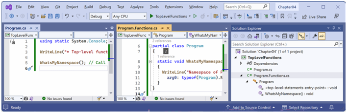
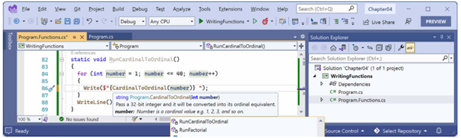
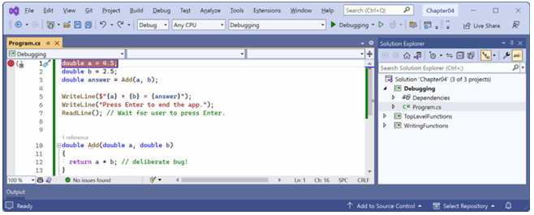
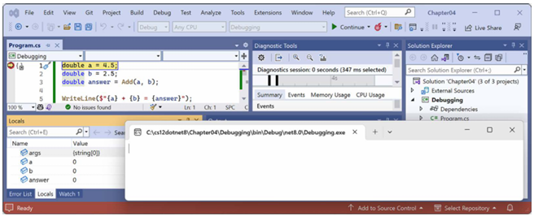
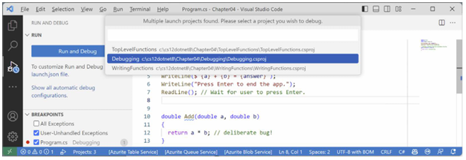
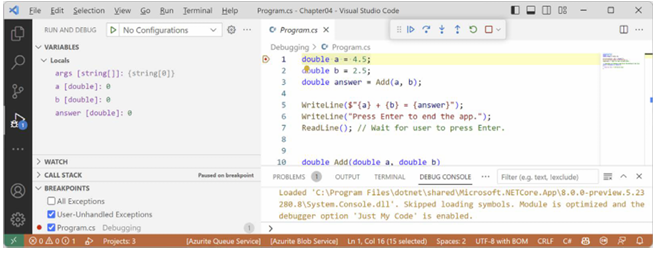
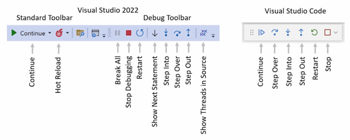
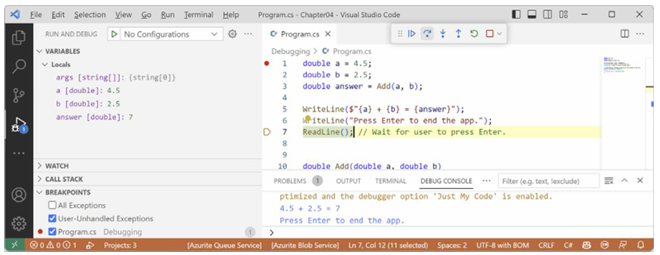

# فصل ۴: نوشتن، اشکال‌زدایی و تست توابع

این فصل درباره نوشتن توابع برای استفاده مجدد از کد، اشکال‌زدایی خطاهای منطقی در حین توسعه، لاگ کردن استثناها در زمان اجرا، تست واحد کد برای حذف باگ‌ها، و بهبود پایداری و قابلیت اطمینان است.

این فصل موضوعات زیر را پوشش می‌دهد:

* نوشتن توابع
* اشکال‌زدایی (Debugging) در حین توسعه
* بارگذاری مجدد داغ (Hot reloading) در حین توسعه
* لاگ کردن (Logging) در حین توسعه و زمان اجرا
* تست واحد (Unit testing)
* پرتاب و گرفتن استثناها در توابع

### نوشتن توابع

یک اصل بنیادی در برنامه‌نویسی **خودت را تکرار نکن (Don’t Repeat Yourself - DRY)** است. در حین برنامه‌نویسی، اگر دیدید که دارید دستورات مشابهی را بارها و بارها می‌نویسید، آن دستورات را به یک تابع تبدیل کنید.

توابع مانند برنامه‌های کوچکی هستند که یک وظیفه کوچک را تکمیل می‌کنند. برای مثال، ممکن است تابعی برای محاسبه مالیات فروش بنویسید و سپس از آن تابع در مکان‌های مختلفی در یک برنامه مالی استفاده مجدد کنید.

مانند برنامه‌ها، توابع معمولاً ورودی و خروجی دارند. آن‌ها گاهی اوقات به عنوان جعبه‌های سیاه توصیف می‌شوند، جایی که شما مواد خام را از یک طرف وارد می‌کنید و یک کالای تولید شده از طرف دیگر خارج می‌شود. پس از ایجاد و اشکال‌زدایی و تست کامل، نیازی نیست که درباره نحوه کار آن‌ها فکر کنید.

#### کاوش برنامه‌های سطح بالا، توابع و فضاهای نام

در فصل ۱، *سلام، C# ! خوش آمدی، .NET !*، یاد گرفتیم که از C# 10 و .NET 6، قالب پیش‌فرض پروژه برای برنامه‌های کنسول از ویژگی برنامه سطح بالا (top-level program) که با C# 9 معرفی شد استفاده می‌کند. هنگامی که شروع به نوشتن توابع می‌کنید، مهم است که درک کنید آن‌ها چگونه با کلاس `Program` تولید شده به‌صورت خودکار و متد `$` آن کار می‌کنند.

بیایید بررسی کنیم که ویژگی برنامه سطح بالا هنگام تعریف توابع چگونه کار می‌کند:

۱. از ابزار کدنویسی مورد نظر خود برای ایجاد یک Solution و پروژه جدید استفاده کنید، همان‌طور که در لیست زیر تعریف شده است:

* **قالب پروژه:** Console App / console
* **فایل پروژه و پوشه:** TopLevelFunctions
* **فایل Solution و پوشه:** Chapter04
* **Do not use top-level statements:** تیک نخورده باشد (غیرفعال).
* **Enable native AOT publish:** تیک نخورده باشد (غیرفعال).

۲. در `Program.cs`، دستورات موجود را حذف کنید، یک تابع محلی در انتهای فایل تعریف کنید، و آن را فراخوانی کنید، همان‌طور که در کد زیر نشان داده شده است:

```csharp
using static System.Console;

WriteLine("* Top-level functions example");

WhatsMyNamespace(); // Call the function.

void WhatsMyNamespace() // Define a local function.
{
    WriteLine("Namespace of Program class: {0}",
        arg0: typeof(Program).Namespace ?? "null");
}
```

> **تمرین خوب:**
> توابع نیازی نیست که در انتهای فایل باشند، اما این کار تمرین خوبی است تا اینکه آن‌ها را با سایر دستورات سطح بالا مخلوط کنید. انواع (Types)، مانند کلاس‌ها، باید در انتهای فایل `Program.cs` تعریف شوند نه در وسط فایل، وگرنه خطای کامپایلر `CS8803` را خواهید دید. بهتر است انواع مانند کلاس‌ها را در یک فایل جداگانه تعریف کنید.

۳. برنامه کنسول را اجرا کنید و توجه کنید که فضای نام برای کلاس `Program` برابر با `null` است، همان‌طور که در خروجی زیر نشان داده شده است:

```text
* Top-level functions example
Namespace of Program class: null
```

#### چه چیزی به‌صورت خودکار برای یک تابع محلی تولید می‌شود؟

کامپایلر به‌صورت خودکار یک کلاس `Program` با یک تابع `$` تولید می‌کند، سپس دستورات و تابع شما را به داخل متد `$` منتقل می‌کند (که باعث می‌شود تابع محلی شود)، و تابع را تغییر نام می‌دهد، همان‌طور که در کد زیر برجسته شده است:

```csharp
using static System.Console;

partial class Program
{
    static void $(String[] args)
    {
        WriteLine("* Top-level functions example");

        <$>g__WhatsMyNamespace|0_0(); // Call the function.

        void <$>g__WhatsMyNamespace|0_0() // Define a local function.
        {
            WriteLine("Namespace of Program class: {0}",
                arg0: typeof(Program).Namespace ?? "null");
        }
    }
}
```

برای اینکه کامپایلر بداند چه دستوراتی باید کجا بروند، باید قوانینی را دنبال کنید:

* دستورات `using` (وارد کردن) باید در بالای فایل `Program.cs` قرار گیرند.
* دستوراتی که در تابع `$` قرار می‌گیرند می‌توانند با توابع در وسط فایل `Program.cs` مخلوط شوند. هر تابعی به یک تابع محلی در متد `$` تبدیل خواهد شد.

نکته آخر مهم است زیرا توابع محلی محدودیت‌هایی دارند، مانند اینکه نمی‌توانند توضیحات XML برای مستندسازی داشته باشند.

> شما در شرف دیدن برخی از کلمات کلیدی C# مانند `static` و `partial` هستید، که به‌طور رسمی در فصل ۵، *ساخت انواع اختصاصی خود با برنامه‌نویسی شیءگرا* معرفی خواهند شد.

#### تعریف یک کلاس Program جزئی (partial) با یک تابع استاتیک

رویکرد بهتر این است که هر تابعی را در یک فایل جداگانه بنویسید و آن‌ها را به عنوان اعضای استاتیک کلاس `Program` تعریف کنید:

۱. یک فایل کلاس جدید به نام `Program.Functions.cs` اضافه کنید. نام این فایل در واقع اهمیتی ندارد اما استفاده از این قرارداد نام‌گذاری معقول است. می‌توانید نام فایل را `Gibberish.cs` بگذارید و همان رفتار را خواهد داشت.

۲. در `Program.Functions.cs`، هر دستور موجودی را حذف کنید و سپس دستوراتی اضافه کنید تا یک کلاس `Program` جزئی (partial) تعریف کنید. تابع `WhatsMyNamespace` را از `Program.cs` کات (cut) کرده و به `Program.Functions.cs` منتقل کنید، و سپس کلمه کلیدی `static` را به تابع اضافه کنید، همان‌طور که در کد زیر برجسته شده است:

```csharp
using static System.Console;

// Do not define a namespace so this class goes in the default empty namespace
// just like the auto-generated partial Program class.
partial class Program
{
    static void WhatsMyNamespace() // Define a static function.
    {
        WriteLine("Namespace of Program class: {0}",
            arg0: typeof(Program).Namespace ?? "null");
    }
}
```

۳. در `Program.cs`، تأیید کنید که تمام محتوای آن اکنون فقط سه دستور است، همان‌طور که در کد زیر نشان داده شده است:

```csharp
using static System.Console;

WriteLine("* Top-level functions example");

WhatsMyNamespace(); // Call the function.
```

۴. برنامه کنسول را اجرا کنید و توجه کنید که همان رفتار قبلی را دارد.

#### چه چیزی به‌صورت خودکار برای یک تابع استاتیک تولید می‌شود؟

هنگامی که از یک فایل جداگانه برای تعریف یک کلاس `Program` جزئی با توابع استاتیک استفاده می‌کنید، کامپایلر یک کلاس `Program` با یک تابع `$` تعریف می‌کند، و تابع شما را به عنوان عضوی از کلاس `Program` ادغام می‌کند، همان‌طور که در کد برجسته شده زیر نشان داده شده است:

```csharp
using static System.Console;

partial class Program
{
    static void $(String[] args)
    {
        WriteLine("* Top-level functions example");
        WhatsMyNamespace(); // Call the function.
    }

    static void WhatsMyNamespace() // Define a static function.
    {
        WriteLine("Namespace of Program class: {0}",
            arg0: typeof(Program).Namespace ?? "null");
    }
}
```

**Solution Explorer** نشان می‌دهد که فایل کلاس `Program.Functions.cs` شما `Program` جزئی خود را با کلاس `Program` جزئی تولید شده به‌صورت خودکار ادغام می‌کند، همان‌طور که در شکل ۴.۱ نشان داده شده است.

 <div align="center">


</div>

**روش صحیح (Good Practice):** هر تابعی را که قصد دارید در `Program.cs` فراخوانی کنید، در یک فایل جداگانه ایجاد کرده و آن‌ها را به‌صورت دستی درون یک کلاس `partial Program` تعریف نمایید. این کار باعث می‌شود که آن‌ها با کلاس `Program` که به‌صورت خودکار تولید می‌شود، در همان سطحِ متد `<Main>$` ادغام شوند، نه اینکه به‌صورت توابع محلی (Local Functions) درون متد `<Main>$` قرار بگیرند.

نکته مهم، توجه به عدم وجود تعریف فضای نام (Namespace) است. هم کلاس `Program` تولید شده به‌صورت خودکار و هم کلاس `Program` که صریحاً تعریف شده، هر دو در فضای نام پیش‌فرض (null namespace) قرار دارند.

> **هشدار!** برای کلاس `partial Program` خود فضای نام تعریف نکنید. اگر این کار را انجام دهید، در فضای نام متفاوتی قرار می‌گیرد و بنابراین با کلاس `partial Program` تولید شده به‌صورت خودکار ادغام نخواهد شد.

به‌صورت اختیاری، تمام متدهای استاتیک در کلاس `Program` می‌توانند صریحاً به‌صورت `private` تعریف شوند، اما این حالت پیش‌فرض است. از آنجا که تمام توابع درون خود کلاس `Program` فراخوانی می‌شوند، تعیین سطح دسترسی (Access Modifier) اهمیت چندانی ندارد.

### مثال جدول ضرب (Times Table)

فرض کنید می‌خواهید به فرزندتان در یادگیری جدول ضرب کمک کنید، بنابراین می‌خواهید تولید جدول ضرب برای یک عدد خاص، مثلاً جدول ضرب ۷، آسان باشد:

```text
1 x 7 = 7
2 x 7 = 14
3 x 7 = 21
...
10 x 7 = 70
11 x 7 = 77
12 x 7 = 84
```

اکثر جداول ضرب بسته به سطح پیشرفت کودک، دارای ۱۰، ۱۲ یا ۲۰ ردیف هستند.

شما پیش‌تر در این کتاب با دستور `for` آشنا شدید، بنابراین می‌دانید که وقتی الگوی منظمی وجود دارد (مانند جدول ضرب ۷ با ۱۲ ردیف)، می‌توان از آن برای تولید خطوط تکراری خروجی استفاده کرد:

```csharp
for (int row = 1; row <= 12; row++)
{
  Console.WriteLine($"{row} x 7 = {row * 7}");
}
```

با این حال، به‌جای اینکه همیشه جدول ضرب ۷ را با ۱۲ ردیف چاپ کنیم، می‌خواهیم این کار را انعطاف‌پذیرتر کنیم تا بتواند هر جدول ضربی را برای هر عددی تولید کند. ما می‌توانیم این کار را با ایجاد یک تابع انجام دهیم.

بیایید با ایجاد تابعی برای خروجی گرفتن از هر جدول ضرب برای اعداد ۰ تا ۲۵۵ با هر تعداد ردیف تا ۲۵۵ (با پیش‌فرض ۱۲ ردیف)، مبحث توابع را بررسی کنیم:

۱. از ابزار کدنویسی مورد نظر خود برای ایجاد یک پروژه جدید طبق لیست زیر استفاده کنید:

* **قالب پروژه (Template):** Console App / console
* **پوشه و فایل پروژه:** WritingFunctions
* **پوشه و فایل Solution:** فصل Chapter04
* در ویژوال استودیو ۲۰۲۲، پروژه آغازین (Startup project) را روی انتخاب فعلی تنظیم کنید.

۲. در فایل `WritingFunctions.csproj`، بعد از بخش `<PropertyGroup>`، یک بخش `<ItemGroup>` جدید اضافه کنید تا `System.Console` را برای تمام فایل‌های سی‌شارپ به‌صورت استاتیک ایمپورت کنید (با استفاده از قابلیت implicit usings در .NET SDK):

```xml
<ItemGroup>
  <Using Include="System.Console" Static="true" />
</ItemGroup>
```

۳. یک فایل کلاس جدید به نام `Program.Functions.cs` به پروژه اضافه کنید.

۴. در فایل `Program.Functions.cs`، کدهای موجود را پاک کرده و دستورات زیر را برای تعریف تابعی به نام `TimesTable` در کلاس `partial Program` جایگزین کنید:

```csharp
partial class Program
{
  static void TimesTable(byte number, byte size = 12)
  {
    WriteLine($"This is the {number} times table with {size} rows:");
    WriteLine();
    for (int row = 1; row <= size; row++)
    {
      WriteLine($"{row} x {number} = {row * number}");
    }
    WriteLine();
  }
}
```

در کد بالا، به موارد زیر توجه کنید:

* تابع `TimesTable` باید یک مقدار `byte` به عنوان پارامتری به نام `number` دریافت کند.
* تابع `TimesTable` می‌تواند به‌صورت اختیاری یک مقدار `byte` به عنوان پارامتری به نام `size` دریافت کند. اگر مقداری پاس داده نشود، پیش‌فرض آن ۱۲ خواهد بود.
* `TimesTable` یک متد استاتیک است زیرا توسط متد استاتیک `<Main>$` فراخوانی خواهد شد.
* `TimesTable` مقداری به فراخواننده برنمی‌گرداند، بنابراین با کلمه کلیدی `void` قبل از نامش تعریف شده است.
* `TimesTable` از یک دستور `for` استفاده می‌کند تا جدول ضرب عددِ پاس داده شده را به تعداد ردیف‌های مشخص شده در `size` چاپ کند.

۵. در `Program.cs`، دستورات موجود را حذف کنید و سپس تابع را فراخوانی کنید. یک مقدار `byte` برای پارامتر `number` (مثلاً ۷) پاس دهید:

```csharp
TimesTable(7);
```

۶. کد را اجرا کنید و نتیجه را مشاهده نمایید:

```text
This is the 7 times table with 12 rows:
1 x 7 = 7
2 x 7 = 14
...
12 x 7 = 84
```

۷. پارامتر `size` را روی ۲۰ تنظیم کنید:

```csharp
TimesTable(7, 20);
```

۸. برنامه کنسول را اجرا کرده و تأیید کنید که جدول ضرب اکنون دارای بیست ردیف است.

> **روش صحیح (Good Practice):** اگر تابعی یک یا چند پارامتر دارد که صرفاً پاس دادن مقادیر به آن‌ها معنای کافی را نمی‌رساند، می‌توانید به‌صورت اختیاری نام پارامتر را همراه با مقدار آن مشخص کنید، مانند:
> `TimesTable(number: 7, size: 10)`

۹. عدد پاس داده شده به تابع `TimesTable` را به سایر مقادیر `byte` بین ۰ تا ۲۵۵ تغییر دهید و صحت خروجی جدول ضرب را بررسی کنید.

۱۰. توجه داشته باشید که اگر سعی کنید عددی غیر از `byte` (مثلاً int، double یا string) پاس دهید، با خطا مواجه می‌شوید:
`Error: (1,12): error CS1503: Argument 1: cannot convert from 'int' to 'byte'`

### بحثی کوتاه درباره آرگومان‌ها و پارامترها

در استفاده روزمره، اکثر توسعه‌دهندگان از اصطلاحات **آرگومان (Argument)** و **پارامتر (Parameter)** به‌جای یکدیگر استفاده می‌کنند. به بیان دقیق‌تر، این دو اصطلاح معانی خاص و دقیقاً متفاوتی دارند. اما درست همان‌طور که یک شخص می‌تواند هم والد باشد و هم پزشک، این دو اصطلاح نیز اغلب به یک چیز اشاره دارند.

> **روش صحیح:** سعی کنید بسته به متن از اصطلاح صحیح استفاده کنید، اما اگر سایر توسعه‌دهندگان از یک اصطلاح "اشتباه" استفاده کردند، مته به خشخاش نگذارید. من در این کتاب هزاران بار از اصطلاحات پارامتر و آرگومان استفاده کرده‌ام و مطمئنم در برخی موارد دقیق نبوده‌ام. لطفاً در این مورد به من خرده نگیرید!

* **پارامتر** متغیری در تعریف تابع است. برای مثال، `startDate` یک پارامتر برای تابع `Hire` است:

    ```csharp
    void Hire(DateTime startDate)
    {
      // پیاده‌سازی تابع
    }
    ```

* وقتی یک متد فراخوانی می‌شود، **آرگومان** داده‌ای است که شما به پارامترهای متد پاس می‌دهید. برای مثال، `when` متغیری است که به عنوان آرگومان به تابع `Hire` پاس داده می‌شود:

    ```csharp
    DateTime when = new(year: 2024, month: 11, day: 5);
    Hire(when);
    ```

ممکن است ترجیح دهید هنگام پاس دادن آرگومان، نام پارامتر را ذکر کنید:

```csharp
DateTime when = new(year: 2024, month: 11, day: 5);
Hire(startDate: when);
```

هنگامی که درباره فراخوانی تابع `Hire` صحبت می‌کنیم، `startDate` پارامتر است و `when` آرگومان.

اگر مستندات رسمی مایکروسافت را مطالعه کنید، آن‌ها از عبارات "آرگومان‌های نام‌دار و اختیاری" و "پارامترهای نام‌دار و اختیاری" به‌جای هم استفاده می‌کنند.

موضوع زمانی پیچیده می‌شود که یک شیء واحد بسته به متن می‌تواند هم نقش پارامتر و هم نقش آرگومان را ایفا کند. برای مثال، درون پیاده‌سازی تابع `Hire`، پارامتر `startDate` می‌تواند به عنوان یک آرگومان به تابع دیگری مثل `SaveToDatabase` پاس داده شود.

نام‌گذاری یکی از سخت‌ترین بخش‌های محاسبات است. یک مثال کلاسیک، پارامترِ مهم‌ترین تابع در سی‌شارپ یعنی `Main` است. این تابع پارامتری به نام `args` تعریف می‌کند که مخفف arguments است!

به‌طور خلاصه: **پارامترها** ورودی‌های یک تابع را تعریف می‌کنند؛ **آرگومان‌ها** هنگام فراخوانی تابع به آن پاس داده می‌شوند.

### نوشتن تابعی که مقدار برمی‌گرداند

تابع قبلی اقداماتی را انجام می‌داد (حلقه زدن و نوشتن در کنسول)، اما مقداری برنمی‌گرداند. فرض کنید نیاز به محاسبه فروش یا مالیات بر ارزش افزوده (VAT) دارید. در اروپا، نرخ‌های VAT می‌تواند از ۸٪ در سوئیس تا ۲۷٪ در مجارستان متغیر باشد. در ایالات متحده، مالیات فروش ایالتی می‌تواند از ۰٪ در اورگان تا ۸.۲۵٪ در کالیفرنیا باشد.

> نرخ‌های مالیات همیشه تغییر می‌کنند و بر اساس عوامل زیادی متغیر هستند. مقادیر استفاده شده در این مثال نیازی به دقیق بودن ندارند.

بیایید تابعی برای محاسبه مالیات در مناطق مختلف جهان پیاده‌سازی کنیم:

۱. در فایل `Program.Functions.cs` و در کلاس `Program`، تابعی به نام `CalculateTax` بنویسید:

```csharp
static decimal CalculateTax(decimal amount, string twoLetterRegionCode)
{
  decimal rate = twoLetterRegionCode switch
  {
    "CH" => 0.08M, // سوئیس
    "DK" or "NO" => 0.25M, // دانمارک، نروژ
    "GB" or "FR" => 0.2M, // انگلستان، فرانسه
    "HU" => 0.27M, // مجارستان
    "OR" or "AK" or "MT" => 0.0M, // اورگان، آلاسکا، مونتانا
    "ND" or "WI" or "ME" or "VA" => 0.05M,
    "CA" => 0.0825M, // کالیفرنیا
    _ => 0.06M // اکثر ایالت‌های دیگر
  };
  return amount * rate;
}
```

در کد بالا به نکات زیر توجه کنید:

* `CalculateTax` دو ورودی دارد: پارامتری به نام `amount` (مقدار پول خرج شده) و پارامتری به نام `twoLetterRegionCode` (منطقه‌ای که پول در آن خرج شده).
* `CalculateTax` با استفاده از یک **عبارت switch** محاسبه‌ای انجام داده و سپس مالیات فروش یا VAT بدهی را به‌صورت یک مقدار `decimal` برمی‌گرداند؛ بنابراین قبل از نام تابع، نوع داده بازگشتی را `decimal` تعریف کرده‌ایم.

۲. در بالای فایل `Program.Functions.cs`، فضای نام مربوط به کار با فرهنگ‌ها را ایمپورت کنید:

```csharp
using System.Globalization; // برای استفاده از CultureInfo
```

۳. در `Program.Functions.cs` و کلاس `Program`، تابعی به نام `ConfigureConsole` بنویسید:

```csharp
static void ConfigureConsole(string culture = "en-US", bool useComputerCulture = false)
{
  // برای فعال‌سازی کاراکترهای یونیکد مثل نماد یورو در کنسول
  OutputEncoding = System.Text.Encoding.UTF8;
  if (!useComputerCulture)
  {
    CultureInfo.CurrentCulture = CultureInfo.GetCultureInfo(culture);
  }
  WriteLine($"CurrentCulture: {CultureInfo.CurrentCulture.DisplayName}");
}
```

این تابع انکدینگ UTF-8 را برای خروجی کنسول فعال می‌کند. این کار برای چاپ برخی نمادهای خاص مانند نماد پول یورو ضروری است. این تابع همچنین فرهنگ جاری (Current Culture) را که برای فرمت‌دهی تاریخ، زمان و مقادیر ارزی استفاده می‌شود، کنترل می‌کند.

۴. در `Program.cs`، فراخوانی‌های متد `TimesTable` را کامنت کرده و سپس متد `ConfigureConsole` و `CalculateTax` را فراخوانی کنید:

```csharp
// TimesTable(number: 7, size: 10);
ConfigureConsole();
decimal taxToPay = CalculateTax(amount: 149, twoLetterRegionCode: "FR");
WriteLine($"You must pay {taxToPay:C} in tax.");
```

۵. کد را اجرا کنید، نتیجه را ببینید و توجه کنید که از فرهنگ انگلیسی (آمریکا) استفاده می‌کند، یعنی دلار آمریکا برای ارز:
`You must pay $29.80 in tax.`

۶. در `Program.cs`، متد `ConfigureConsole` را تغییر دهید تا از فرهنگ کامپیوتر محلی شما استفاده کند:
`ConfigureConsole(useComputerCulture: true);`

۷. کد را اجرا کنید. اکنون باید ارز محلی خود را ببینید (مثلاً برای من در انگلستان £29.80).

۸. در `Program.cs`، متد را تغییر دهید تا از فرهنگ فرانسه استفاده کند:
`ConfigureConsole(culture: "fr-FR");`

۹. کد را اجرا کنید. اکنون باید یورو را مشاهده کنید: `29,80 €`.

آیا می‌توانید مشکلاتی را در تابع `CalculateTax` تصور کنید؟ اگر کاربر کدی مثل `fr` یا `UK` وارد کند چه می‌شود؟ چگونه می‌توانید تابع را برای بهبود آن بازنویسی کنید؟ آیا استفاده از دستور `switch` به جای عبارت `switch` واضح‌تر نبود؟

### تبدیل اعداد از اصلی (Cardinal) به ترتیبی (Ordinal)

اعدادی که برای شمارش استفاده می‌شوند، اعداد اصلی (Cardinal) نامیده می‌شوند (مثلاً ۱، ۲، ۳)، در حالی که اعدادی که برای رتبه‌بندی استفاده می‌شوند، اعداد ترتیبی (Ordinal) هستند (مثلاً اول، دوم، سوم). بیایید تابعی برای تبدیل اعداد اصلی به ترتیبی ایجاد کنیم:

۱. در `Program.Functions.cs`، تابعی به نام `CardinalToOrdinal` بنویسید که یک مقدار `uint` اصلی را به مقدار رشته‌ای ترتیبی تبدیل کند (مثلاً تبدیل ۱ به "1st"):

```csharp
static string CardinalToOrdinal(uint number)
{
  uint lastTwoDigits = number % 100;
  switch (lastTwoDigits)
  {
    case 11: // موارد خاص برای یازدهم تا سیزدهم
    case 12:
    case 13:
      return $"{number:N0}th";
    default:
      uint lastDigit = number % 10;
      string suffix = lastDigit switch
      {
        1 => "st",
        2 => "nd",
        3 => "rd",
        _ => "th"
      };
      return $"{number:N0}{suffix}";
  }
}
```

از کد بالا به نکات زیر توجه کنید:

* `CardinalToOrdinal` یک ورودی دارد: پارامتری از نوع `uint` به نام `number`، زیرا نمی‌خواهیم اعداد منفی مجاز باشند، و یک خروجی: مقدار بازگشتی از نوع `string`.
* از یک دستور `switch` برای مدیریت موارد خاص ۱۱، ۱۲ و ۱۳ استفاده شده است.
* سپس یک عبارت `switch` سایر موارد را مدیریت می‌کند: اگر رقم آخر ۱ است، از `st` استفاده کن؛ اگر ۲ است، `nd`؛ اگر ۳ است `rd`؛ و در غیر این صورت `th`.

۲. در `Program.Functions.cs`، تابعی به نام `RunCardinalToOrdinal` بنویسید که از یک حلقه `for` برای شمارش از ۱ تا ۱۵۰ استفاده کرده، تابع `CardinalToOrdinal` را برای هر عدد صدا می‌زند و رشته بازگشتی را در کنسول (با فاصله) چاپ می‌کند:

```csharp
static void RunCardinalToOrdinal()
{
  for (uint number = 1; number <= 150; number++)
  {
    Write($"{CardinalToOrdinal(number)} ");
  }
  WriteLine();
}
```

۳. در فایل `Program.cs`، دستورات مربوط به `CalculateTax` را کامنت کرده و متد `RunCardinalToOrdinal` را فراخوانی کنید، مانند کد زیر:
`RunCardinalToOrdinal();`

۴. برنامه کنسول را اجرا کرده و نتایج را مشاهده کنید، همان‌طور که در خروجی زیر نمایش داده شده است:

```text
1st 2nd 3rd 4th 5th 6th 7th 8th 9th 10th 11th 12th 13th 14th 15th 16th 
17th 18th 19th 20th 21st 22nd 23rd 24th 25th 26th 27th 28th 29th 30th 
31st 32nd 33rd 34th 35th 36th 37th 38th 39th 40th 41st 42nd 43rd 44th 
45th 46th 47th 48th 49th 50th 51st 52nd 53rd 54th 55th 56th 57th 58th 
59th 60th 61st 62nd 63rd 64th 65th 66th 67th 68th 69th 70th 71st 72nd 
73rd 74th 75th 76th 77th 78th 79th 80th 81st 82nd 83rd 84th 85th 86th 
87th 88th 89th 90th 91st 92nd 93rd 94th 95th 96th 97th 98th 99th 100th 
101st 102nd 103rd 104th 105th 106th 107th 108th 109th 110th 111th 112th 
113th 114th 115th 116th 117th 118th 119th 120th 121st 122nd 123rd 124th 
125th 126th 127th 128th 129th 130th 131st 132nd 133rd 134th 135th 136th 
137th 138th 139th 140th 141st 142nd 143rd 144th 145th 146th 147th 148th 
149th 150th
```

۵. در تابع `RunCardinalToOrdinal`، عدد حداکثر را به ۱۵۰۰ تغییر دهید.

۶. برنامه کنسول را اجرا کرده و نتایج را مشاهده کنید. بخشی از خروجی در زیر نمایش داده شده است:

```text
1,480th 1,481st 1,482nd 1,483rd 1,484th 1,485th 1,486th 1,487th 1,488th 
1,489th 1,490th 1,491st 1,492nd 1,493rd 1,494th 1,495th 1,496th 1,497th 
1,498th 1,499th 1,500th
```

---

### محاسبه فاکتوریل با بازگشت (Recursion)

فاکتوریلِ ۵ برابر است با ۱۲۰، زیرا فاکتوریل‌ها با ضرب کردن عدد شروع در عددی یکی کمتر از خود، و سپس ضرب در عددی باز هم یکی کمتر، و همین‌طور ادامه تا رسیدن به عدد ۱ محاسبه می‌شوند. یک مثال را می‌توان در اینجا دید: $5 \times 4 \times 3 \times 2 \times 1 = 120$.

تابع فاکتوریل فقط برای اعداد صحیح غیرمنفی تعریف می‌شود (یعنی ۰، ۱، ۲، ۳ و ...):
$0! = 1$
$n! = n \times (n - 1)!$

ما می‌توانستیم با تعریف پارامتر ورودی به صورت `uint` (مانند تابع `CardinalToOrdinal`) وظیفه رد کردن اعداد منفی را به کامپایلر بسپاریم، اما این بار بیایید روش جایگزینی را ببینیم: **پرتاب یک استثنای آرگومان (Throwing an argument exception).**

فاکتوریل‌ها به این صورت نوشته می‌شوند: `!5`. علامت تعجب در اینجا "بَنگ" (Bang) خوانده می‌شود، پس `!5` می‌شود "پنج بَنگ" که برابر است با صد و بیست. "بَنگ" اصطلاح خوبی برای فاکتوریل‌هاست زیرا آن‌ها به سرعت بزرگ می‌شوند، درست مثل یک انفجار.

ما تابعی به نام `Factorial` خواهیم نوشت؛ این تابع فاکتوریل یک عدد `int` که به عنوان پارامتر پاس داده شده را محاسبه می‌کند. ما از یک تکنیک هوشمندانه به نام **بازگشت (Recursion)** استفاده خواهیم کرد، که به معنای تابعی است که درون پیاده‌سازی خود، خودش را (مستقیم یا غیرمستقیم) صدا می‌زند:

۱. در فایل `Program.Functions.cs`، تابعی به نام `Factorial` بنویسید:

```csharp
static int Factorial(int number)
{
  if (number < 0)
  {
     throw new ArgumentOutOfRangeException(message: 
       $"The factorial function is defined for non-negative integers only. Input: {number}", 
       paramName: nameof(number));
  }
  else if (number == 0)
  {
    return 1;
  }
  else
  {
    return number * Factorial(number - 1);
  }
}
```

مانند قبل، چندین نکته قابل توجه در کد بالا وجود دارد:

* اگر پارامتر ورودی `number` منفی باشد، `Factorial` یک استثنا (Exception) پرتاب می‌کند.
* اگر پارامتر ورودی `number` صفر باشد، `Factorial` عدد ۱ را برمی‌گرداند.
* اگر پارامتر ورودی `number` بیشتر از ۰ باشد (که در تمام موارد دیگر چنین است)، `Factorial` عدد را در نتیجه‌ی فراخوانیِ **خودش** با مقدارِ «یکی کمتر از عدد» ضرب می‌کند. این همان چیزی است که تابع را بازگشتی می‌کند.

> **اطلاعات بیشتر:** بازگشت هوشمندانه است، اما می‌تواند منجر به مشکلاتی مانند **سرریز پشته (Stack Overflow)** شود، زیرا در هر فراخوانی تابع، حافظه‌ای برای ذخیره داده‌ها استفاده می‌شود و اگر تعداد فراخوانی‌ها زیاد باشد، حافظه تمام می‌شود. تکرار (Iteration - استفاده از حلقه‌ها) راهکاری عملی‌تر، هرچند طولانی‌تر، در زبان‌هایی مثل سی‌شارپ است.

۲. در `Program.Functions.cs`، تابعی به نام `RunFactorial` بنویسید که از یک حلقه `for` برای چاپ فاکتوریل اعداد ۱ تا ۱۵ استفاده می‌کند. داخل حلقه، تابع `Factorial` فراخوانی شده و نتیجه با فرمت `N0` (فرمت عددی با جداکننده هزارگان و بدون اعشار) چاپ می‌شود:

```csharp
static void RunFactorial()
{
  for (int i = 1; i <= 15; i++)
  {
    WriteLine($"{i}! = {Factorial(i):N0}");
  }
}
```

۳. فراخوانی متد `RunCardinalToOrdinal` را کامنت کرده و `RunFactorial` را صدا بزنید.

۴. پروژه را اجرا کنید و نتایج را ببینید:

```text
1! = 1
2! = 2
3! = 6
4! = 24
...
12! = 479,001,600
13! = 1,932,053,504
14! = 1,278,945,280
15! = 2,004,310,016
```

در خروجی بالا فوراً مشخص نیست، اما فاکتوریل ۱۳ و بالاتر باعث **سرریز (Overflow)** نوع `int` شده‌اند زیرا بسیار بزرگ هستند. !12 حدود نیم میلیارد است. حداکثر مقدار مثبتی که در متغیر `int` جا می‌شود حدود ۲ میلیارد است. !13 حدود ۶ میلیارد است و وقتی در یک عدد صحیح ۳۲ بیتی ذخیره می‌شود، بدون نمایش هیچ خطایی، به صورت خاموش سرریز می‌کند (Silent Overflow) و عدد اشتباهی را نشان می‌دهد (گاهی حتی منفی).

برای اینکه وقتی سرریز اتفاق می‌افتد مطلع شویم چه باید کرد؟ البته می‌توانیم با استفاده از `long` (عدد صحیح ۶۴ بیتی) مشکل را برای !13 و !14 حل کنیم، اما دوباره خیلی زود به حد سرریز خواهیم رسید.

هدف این بخش درک این موضوع است که اعداد می‌توانند سرریز کنند. بیایید ببینیم چطور می‌توانیم آن را مدیریت کنیم:

۱. تابع `Factorial` را تغییر دهید تا در دستوری که خودش را فراخوانی می‌کند، سرریز را بررسی کند (با استفاده از بلوک `checked`):

```csharp
checked // برای بررسی سرریز
{
  return number * Factorial(number - 1);
}
```

۲. تابع `RunFactorial` را تغییر دهید تا شروع شمارش از ۲- باشد و همچنین سرریز و سایر استثناها را هنگام فراخوانی تابع `Factorial` مدیریت کند:

```csharp
static void RunFactorial()
{
  for (int i = -2; i <= 15; i++)
  {
    try
    {
      WriteLine($"{i}! = {Factorial(i):N0}");
    }
    catch (OverflowException)
    {
      WriteLine($"{i}! is too big for a 32-bit integer.");
    }
    catch (Exception ex)
    {
      WriteLine($"{i}! throws {ex.GetType()}: {ex.Message}");
    }
  }
}
```

۳. کد را اجرا کنید و نتایج را ببینید:

* برای اعداد منفی، پیام خطای `ArgumentOutOfRangeException` چاپ می‌شود.
* برای اعداد ۰ تا ۱۲، فاکتوریل صحیح چاپ می‌شود.
* برای ۱۳، ۱۴ و ۱۵ پیام "... is too big for a 32-bit integer" چاپ می‌شود.

---

### مستندسازی توابع با توضیحات XML

به طور پیش‌فرض، وقتی تابعی مثل `CardinalToOrdinal` را فراخوانی می‌کنید، ویرایشگرهای کد یک تول‌تیپ (Tooltip) با اطلاعات اولیه نشان می‌دهند. بیایید با افزودن اطلاعات اضافی، این تول‌تیپ را بهبود دهیم:

۱. اگر از **Visual Studio Code** با افزونه C# استفاده می‌کنید، باید مطمئن شوید تنظیمات `formatOnType` فعال است. در **Visual Studio 2022** و **JetBrains Rider** این قابلیت به صورت داخلی وجود دارد.

۲. در خط بالای تابع `CardinalToOrdinal`، سه بار اسلش `///` تایپ کنید. توجه کنید که این کار به صورت خودکار به یک کامنت XML تبدیل می‌شود که تشخیص می‌دهد تابع یک پارامتر به نام `number` دارد:

```csharp
/// <summary>
/// 
/// </summary>
/// <param name="number"></param>
/// <returns></returns>
```

۳. اطلاعات مناسب را برای کامنت مستندات XML وارد کنید. یک خلاصه (Summary) اضافه کنید و پارامتر ورودی و مقدار بازگشتی را توصیف نمایید:

```csharp
/// <summary>
/// Pass a 32-bit unsigned integer and it will be converted into its ordinal equivalent.
/// </summary>
/// <param name="number">Number as a cardinal value e.g. 1, 2, 3, and so on.</param>
/// <returns>Number as an ordinal value e.g. 1st, 2nd, 3rd, and so on.</returns>
```

۴. حالا، هنگام فراخوانی تابع، جزئیات بیشتری را در تول‌تیپ مشاهده خواهید کرد.

 <div align="center">


</div>

شایان ذکر است که این قابلیت عمدتاً برای استفاده با ابزارهایی طراحی شده که کامنت‌ها را به مستندات تبدیل می‌کنند (مانند ابزار Sandcastle). تول‌تیپ‌هایی که هنگام کدنویسی ظاهر می‌شوند، یک ویژگی ثانویه هستند.

> **نکته:** توابع محلی (Local functions) از کامنت‌های XML پشتیبانی نمی‌کنند زیرا نمی‌توان آن‌ها را خارج از عضوی که در آن تعریف شده‌اند استفاده کرد. متأسفانه این یعنی تول‌تیپ هم ندارند.

**روش صحیح (Good Practice):** برای تمام توابع خود، به جز توابع محلی، توضیحات XML اضافه کنید.

---

### استفاده از لامبدا (Lambda) در پیاده‌سازی توابع

**F#** زبان برنامه‌نویسی "ابتدا-تابعی" (Functional-first) و strongly typed مایکروسافت است. زبان‌های تابعی از "حساب لامبدا" (Lambda calculus) تکامل یافته‌اند؛ سیستمی محاسباتی که فقط بر پایه توابع است. کد در این زبان‌ها بیشتر شبیه توابع ریاضی است تا مراحل یک دستورالعمل آشپزی.

برخی از ویژگی‌های مهم زبان‌های تابعی عبارتند از:

* **پیمانه‌ای بودن (Modularity):** شکستن کد پیچیده به قطعات کوچکتر.
* **تغییرناپذیری (Immutability):** متغیرها به معنای رایج سی‌شارپ وجود ندارند. داده‌ها درون تابع تغییر نمی‌کنند، بلکه داده جدیدی از داده موجود ساخته می‌شود. این کار باگ‌ها را کاهش می‌دهد.
* **قابلیت نگهداری (Maintainability):** کد تمیزتر و واضح‌تر است.

از نسخه ۶ سی‌شارپ، مایکروسافت ویژگی‌هایی را برای پشتیبانی از رویکرد تابعی اضافه کرده است. در C# 6، پشتیبانی از **Expression-bodied function members** اضافه شد.
در سی‌شارپ، لامبداها استفاده از کاراکتر `=>` برای نشان دادن مقدار بازگشتی از یک تابع هستند.

دنباله **فیبوناچی** همیشه با ۰ و ۱ شروع می‌شود. سپس بقیه دنباله با قانونِ "جمع کردن دو عدد قبلی" تولید می‌شود:
`0 1 1 2 3 5 8 13 21 34 55 ...`

بیایید تفاوت بین پیاده‌سازی **دستوری (Imperative)** و **اعلانی (Declarative)** را با استفاده از فیبوناچی ببینیم:

۱. در `Program.Functions.cs`، تابعی به نام `FibImperative` بنویسید (سبک دستوری):

```csharp
static int FibImperative(uint term)
{
  if (term == 0)
  {
    throw new ArgumentOutOfRangeException();
  }
  else if (term == 1)
  {
    return 0;
  }
  else if (term == 2)
  {
    return 1;
  }
  else
  {
    return FibImperative(term - 1) + FibImperative(term - 2);
  }
}
```

۲. تابعی به نام `RunFibImperative` بنویسید که در حلقه‌ای از ۱ تا ۳۰، تابع بالا را صدا می‌زند.

۳. آن را در `Program.cs` اجرا کنید و نتایج را ببینید.

۴. حالا در `Program.Functions.cs`، تابعی به نام `FibFunctional` بنویسید (سبک اعلانی/تابعی):

```csharp
static int FibFunctional(uint term) => term switch
{
  0 => throw new ArgumentOutOfRangeException(),
  1 => 0,
  2 => 1,
  _ => FibFunctional(term - 1) + FibFunctional(term - 2)
};
```

این کد بسیار کوتاه‌تر و شبیه‌تر به تعاریف ریاضی است.

---

### دیباگ کردن در زمان توسعه (Debugging)

در این بخش، یاد می‌گیرید چگونه مشکلات را در زمان توسعه دیباگ (اشکال‌زدایی) کنید. شما باید از ویرایشگری استفاده کنید که ابزارهای دیباگ دارد (مثل VS 2022 یا VS Code).

#### ایجاد کد با یک باگ عمدی

بیایید با ایجاد یک برنامه کنسول که یک باگ عمدی دارد، دیباگ کردن را تمرین کنیم:

۱. یک پروژه جدید Console به نام `Debugging` به Solution خود اضافه کنید.
۲. فایل `Debugging.csproj` را ویرایش کنید تا `System.Console` را به صورت استاتیک ایمپورت کند.
۳. در `Program.cs`، کدهای قبلی را پاک کرده و تابعی با یک باگ عمدی اضافه کنید:

```csharp
double Add(double a, double b)
{
  return a * b; // باگ عمدی! (ضرب به جای جمع)
}
```

۴. بالای تابع `Add`، متغیرهایی تعریف کرده و آن‌ها را با استفاده از تابع باگ‌دار جمع کنید:

```csharp
double a = 4.5;
double b = 2.5;
double answer = Add(a, b);
WriteLine($"{a} + {b} = {answer}");
WriteLine("Press Enter to end the app.");
ReadLine(); 
```

۵. برنامه را اجرا کنید. خروجی `4.5 + 2.5 = 11.25` خواهد بود!
اما صبر کنید، اینجا باگی وجود دارد! ۴.۵ به علاوه ۲.۵ باید بشود ۷، نه ۱۱.۲۵. ما از ابزارهای دیباگ برای شکار و له کردن (Squish) این باگ استفاده خواهیم کرد.

#### تنظیم Breakpoint و شروع دیباگ

**نقطه توقف (Breakpoint)** به ما اجازه می‌دهد خطی از کد را علامت‌گذاری کنیم تا برنامه در آنجا مکث کند و بتوانیم وضعیت برنامه را بررسی کنیم.

### استفاده از Visual Studio 2022

بیایید با استفاده از ویژوال استودیو ۲۰۲۲ یک Breakpoint (نقطه توقف) تنظیم کرده و دیباگ را شروع کنیم:

۱. در خط ۱، یعنی جایی که متغیر `a` تعریف شده است، کلیک کنید.
۲. به منوی **Debug | Toggle Breakpoint** بروید یا کلید **F9** را فشار دهید. یک دایره قرمز در نوار حاشیه سمت چپ ظاهر می‌شود و عبارت مربوطه به رنگ قرمز هایلایت می‌شود تا نشان دهد Breakpoint تنظیم شده است، همانطور که در شکل ۴.۳ نشان داده شده است:

 <div align="center">


</div>

می‌توانید Breakpointها را با همان روش خاموش و روشن کنید (Toggle). همچنین می‌توانید با کلیک چپ در نوار حاشیه، Breakpoint را فعال یا غیرفعال کنید، یا روی آن کلیک راست کنید تا گزینه‌های بیشتری مانند حذف (Delete)، غیرفعال کردن (Disable)، یا ویرایش شرایط (Conditions) و اقدامات (Actions) برای یک Breakpoint موجود را مشاهده نمایید.

۳. به منوی **Debug | Start Debugging** بروید یا کلید **F5** را فشار دهید. ویژوال استودیو برنامه کنسول را شروع کرده و هنگامی که به Breakpoint می‌رسد، مکث می‌کند. به این حالت **Break Mode** گفته می‌شود. پنجره‌های اضافی با عناوین **Locals** (نمایش مقادیر فعلی متغیرهای محلی)، **Watch 1** (نمایش هر عبارت نظارتی که تعریف کرده‌اید)، **Call Stack**، **Exception Settings** و **Immediate Window** ممکن است ظاهر شوند. نوار ابزار Debugging نیز نمایش داده می‌شود. خطی که قرار است در مرحله بعد اجرا شود با رنگ زرد هایلایت شده و یک فلش زرد از نوار حاشیه به آن خط اشاره می‌کند، همانطور که در شکل ۴.۴ نشان داده شده است:

 <div align="center">


</div>

> اگر نمی‌خواهید نحوه استفاده از Visual Studio Code برای شروع دیباگ را ببینید، می‌توانید بخش "استفاده از Visual Studio Code" را رد کرده و به بخش "ناوبری با نوار ابزار دیباگ" بروید.

---

### استفاده از Visual Studio Code

بیایید با استفاده از ویژوال استودیو کد یک Breakpoint تنظیم کرده و دیباگ را شروع کنیم:

۱. در خط ۱، یعنی جایی که متغیر `a` تعریف شده است، کلیک کنید.
۲. به منوی **Run | Toggle Breakpoint** بروید یا کلید **F9** را فشار دهید. یک دایره قرمز در نوار حاشیه سمت چپ ظاهر می‌شود تا نشان دهد Breakpoint تنظیم شده است.
می‌توانید Breakpointها را با همان روش خاموش و روشن کنید. همچنین می‌توانید با کلیک چپ در نوار حاشیه، Breakpoint را فعال یا غیرفعال کنید؛ با کلیک راست گزینه‌های بیشتری مانند حذف (Remove)، ویرایش (Edit) یا غیرفعال کردن (Disable) یک Breakpoint موجود را ببینید؛ یا اگر Breakpoint وجود ندارد، یک Breakpoint معمولی، شرطی (Conditional) یا Logpoint اضافه کنید.
*Logpointها که به آن‌ها Tracepoint هم گفته می‌شود، نشان می‌دهند که می‌خواهید اطلاعاتی را بدون متوقف کردن اجرای کد در آن نقطه ثبت کنید.*

۳. به منوی **View | Run** بروید، یا در نوار ناوبری سمت چپ روی آیکون **Run and Debug** (دکمه مثلث "پلی" و "سوسک") کلیک کنید، یا کلیدهای **Ctrl + Shift + D** (در ویندوز) را فشار دهید.
۴. در بالای پنجره RUN AND DEBUG، روی دکمه Run and Debug کلیک کرده و سپس پروژه Debugging را انتخاب کنید، همانطور که در شکل ۴.۵ نشان داده شده است:

 <div align="center">


</div>

> اگر برای اولین بار از شما خواسته شد دیباگر را انتخاب کنید، گزینه **C#** را انتخاب کنید، نه .NET 5+ یا .NET Core.

۵. ویژوال استودیو کد برنامه کنسول را شروع کرده و هنگامی که به Breakpoint می‌رسد، مکث می‌کند. به این حالت **Break Mode** گفته می‌شود. خطی که قرار است در مرحله بعد اجرا شود با رنگ زرد هایلایت شده و یک بلوک زرد از نوار حاشیه به آن خط اشاره می‌کند، همانطور که در شکل ۴.۶ نشان داده شده است:

 <div align="center">


</div>

### ناوبری با نوار ابزار دیباگ (Debugging Toolbar)

ویژوال استودیو ۲۰۲۲ دو دکمه مرتبط با دیباگ در نوار ابزار استاندارد خود دارد (برای شروع یا ادامه دیباگ و برای Hot Reload تغییرات در کد در حال اجرا) و یک نوار ابزار جداگانه Debug برای سایر ابزارها. ویژوال استودیو کد یک نوار ابزار شناور با دکمه‌هایی برای دسترسی آسان به ویژگی‌های دیباگ نمایش می‌دهد. هر دو در شکل ۴.۷ نشان داده شده‌اند:

 <div align="center">


</div>

لیست زیر رایج‌ترین دکمه‌ها در نوارهای ابزار را شرح می‌دهد:

* **Start/Continue/F5:** این دکمه حساس به متن است. یا شروع به اجرای پروژه می‌کند یا اجرای پروژه را از موقعیت فعلی ادامه می‌دهد تا زمانی که پایان یابد یا به یک Breakpoint برخورد کند.
* **Hot Reload:** این دکمه تغییرات کد کامپایل شده را بدون نیاز به راه‌اندازی مجدد برنامه بارگذاری مجدد می‌کند.
* **Break All:** این دکمه برنامه در حال اجرا را در خط بعدی کد موجود متوقف می‌کند (Break می‌کند).
* **Stop Debugging/Stop/Shift + F5 (مربع قرمز):** این دکمه جلسه دیباگ را متوقف می‌کند.
* **Restart/Ctrl or Cmd + Shift + F5 (فلش دایره‌ای):** این دکمه برنامه را متوقف کرده و بلافاصله با دیباگر متصل مجدداً راه‌اندازی می‌کند.
* **Show Next Statement:** این دکمه مکان‌نمای فعلی را به دستور بعدی که اجرا خواهد شد منتقل می‌کند.
* **Step Into/F11، Step Over/F10 و Step Out/Shift + F11 (فلش‌های آبی روی نقطه‌ها):** این دکمه‌ها به روش‌های مختلفی که به زودی خواهید دید، خط به خط در کد پیش می‌روند.
* **Show Threads in Source:** این دکمه به شما امکان می‌دهد رشته‌ها (Threads) را در برنامه‌ای که دیباگ می‌کنید بررسی و با آن‌ها کار کنید.

### پنجره‌های دیباگ (Debugging windows)

در حین دیباگ، هم ویژوال استودیو ۲۰۲۲ و هم ویژوال استودیو کد پنجره‌های اضافی را نشان می‌دهند که به شما امکان می‌دهند اطلاعات مفیدی مانند متغیرها را در حین پیمایش کد نظارت کنید. مفیدترین پنجره‌ها در لیست زیر شرح داده شده‌اند:

* **VARIABLES** (شامل Locals): نام، مقدار و نوع هر متغیر محلی را به صورت خودکار نشان می‌دهد. هنگام پیمایش کد به این پنجره توجه داشته باشید.
* **WATCH** (یا Watch 1): مقدار متغیرها و عباراتی را که به صورت دستی وارد می‌کنید نشان می‌دهد.
* **CALL STACK:** پشته فراخوانی توابع را نشان می‌دهد.
* **BREAKPOINTS:** تمام نقاط توقف شما را نشان می‌دهد و امکان کنترل دقیق‌تر روی آن‌ها را فراهم می‌کند.

هنگامی که در حالت Break Mode هستید، یک پنجره مفید دیگر نیز در پایین ناحیه ویرایش وجود دارد:

* **DEBUG CONSOLE** (یا Immediate Window): امکان تعامل زنده با کد را فراهم می‌کند. می‌توانید وضعیت برنامه را بررسی کنید، مثلاً با وارد کردن نام یک متغیر. برای مثال، می‌توانید سوالی بپرسید مانند "1+2 چند می‌شود؟" با تایپ `1+2` و زدن Enter.

### گام‌به‌گام پیش رفتن در کد (Stepping through code)

بیایید برخی از روش‌های پیمایش کد را با استفاده از ویژوال استودیو ۲۰۲۲ یا ویژوال استودیو کد بررسی کنیم:

> دستورات منوی دیباگ در منوی **Debug** در ویژوال استودیو ۲۰۲۲ یا منوی **Run** در ویژوال استودیو کد و جت‌برینز رایدر قرار دارند.

۱. به منوی **Run** یا **Debug | Step Into** بروید، روی دکمه **Step Into** در نوار ابزار کلیک کنید، یا **F11** را فشار دهید. هایلایت زرد یک خط جلو می‌رود.
۲. به منوی **Run** یا **Debug | Step Over** بروید، روی دکمه **Step Over** در نوار ابزار کلیک کنید، یا **F10** را فشار دهید. هایلایت زرد یک خط جلو می‌رود.
در حال حاضر، می‌بینید که تفاوتی بین استفاده از Step Into یا Step Over وجود ندارد زیرا ما در حال اجرای دستورات تکی هستیم.
۳. اکنون باید روی خطی باشید که متد `Add` را فراخوانی می‌کند.

تفاوت بین Step Into و Step Over زمانی مشخص می‌شود که شما در آستانه اجرای یک فراخوانی متد هستید:

* اگر روی **Step Into** کلیک کنید، دیباگر وارد متد می‌شود تا بتوانید خط به خط آن متد را پیمایش کنید.
* اگر روی **Step Over** کلیک کنید، کل متد یکباره اجرا می‌شود؛ البته از روی متد بدون اجرا شدن نمی‌پرد، بلکه فقط وارد جزئیات آن نمی‌شود.

۴. روی **Step Into** کلیک کنید تا وارد متد `Add` شوید.
۵. اشاره‌گر موس خود را روی پارامترهای `a` یا `b` در پنجره ویرایش کد نگه دارید و توجه کنید که یک تول‌تیپ ظاهر می‌شود که مقدار فعلی آن‌ها را نشان می‌دهد.
۶. عبارت `a * b` را انتخاب کنید، روی آن کلیک راست کرده و **Add to Watch** (یا Add Watch) را انتخاب کنید. عبارت به پنجره **WATCH** (یا Watch 1) اضافه می‌شود و نشان می‌دهد که این عملگر در حال ضرب `a` در `b` است تا نتیجه ۱۱.۲۵ را بدهد.
۷. در پنجره **WATCH** (یا Watch 1)، روی عبارت کلیک راست کرده و **Remove Expression** (یا Delete Watch) را انتخاب کنید.
۸. با تغییر `*` به `+` در تابع `Add`، باگ را رفع کنید.
۹. با کلیک روی دکمه فلش دایره‌ای **Restart** یا فشردن **Ctrl** یا **Cmd + Shift + F5**، دیباگ را مجدداً راه‌اندازی کنید.
۱۰. با استفاده از Step Over از روی تابع عبور کنید، لحظه‌ای صبر کنید تا ببینید که اکنون محاسبه را به درستی انجام می‌دهد، و سپس دکمه **Continue** را کلیک کنید یا **F5** را فشار دهید.
۱۱. در ویژوال استودیو کد، توجه کنید که هنگام نوشتن در کنسول در حین دیباگ، خروجی به جای پنجره TERMINAL در پنجره **DEBUG CONSOLE** ظاهر می‌شود، همانطور که در شکل ۴.۸ نشان داده شده است:

 <div align="center">


</div>
