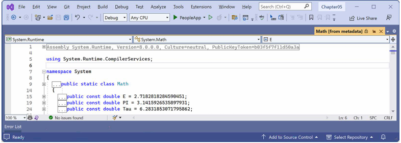
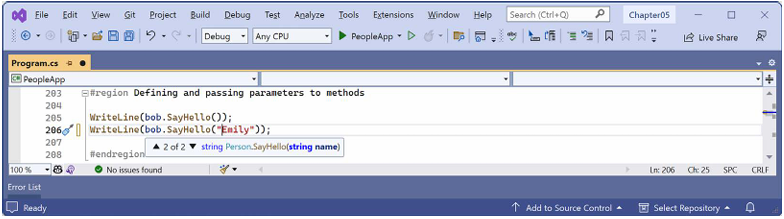
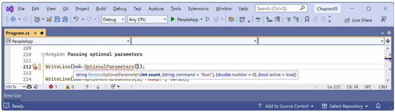

# فصل پنجم:ساختن انواع مخصوص به خود با برنامه‌نویسی شیءگرا

این فصل درباره ساختن **انواع (Types)** مخصوص به خود با استفاده از **برنامه‌نویسی شیءگرا (OOP)** است.  
در این فصل یاد می‌گیرید که یک Type چه دسته‌های مختلفی از اعضا (Members) می‌تواند داشته باشد، از جمله **فیلدها** برای ذخیره داده و **متدها** برای انجام عملیات.  
همچنین از مفاهیم شیءگرایی مانند **تجمیع (Aggregation)** و **کپسوله‌سازی (Encapsulation)** استفاده خواهید کرد.

در ادامه، با ویژگی‌های زبانی مفیدی مثل **نحو مرتبط با Tupleها**، استفاده از **متغیرهای out**، **نام‌های استنباط‌شده‌ی Tupleها** و **مقادیر پیش‌فرض (default literals)** آشنا می‌شوید.  
در نهایت، با **الگوگیری (Pattern Matching)** و **تعریف رکوردها (Records)** کار خواهید کرد تا پیاده‌سازی **برابری (Equality)** و **غیرقابل‌تغییر بودن (Immutability)** ساده‌تر شود.

این فصل موضوعات زیر را پوشش می‌دهد:
• صحبت درباره OOP  
• ساخت کتابخانه‌های کلاس  
• ذخیره‌سازی داده در فیلدها  
• کار با متدها و tupleها  
• کنترل دسترسی با ویژگی‌ها (Properties) و اندیسرها (Indexers)  
• الگوگیری (Pattern Matching) روی اشیا  
• کار با انواع رکورد (Record Types)

---

## درک مفاهیم برنامه‌نویسی شیءگرا (OOP)

یک شیء در دنیای واقعی، یک چیز است، مانند یک خودرو یا یک شخص، در حالی که یک شیء در برنامه‌نویسی اغلب نمایانگر چیزی در دنیای واقعی است، مانند یک محصول یا حساب بانکی، اما می‌تواند انتزاعی‌تر نیز باشد.
در C#، ما از کلمات کلیدی C# مانند `class`، `record` و `struct` برای تعریف یک نوع شیء استفاده می‌کنیم. شما در فصل ۶، «پیاده‌سازی رابط‌ها و ارث‌بری کلاس‌ها»، با انواع `struct` آشنا خواهید شد. شما می‌توانید یک نوع را به عنوان یک نقشه یا الگو برای یک شیء در نظر بگیرید.
ساختن انواع خودتان با برنامه‌نویسی شیءگرا
مفاهیم OOP در اینجا به طور خلاصه شرح داده شده‌اند:

* **کپسوله‌سازی (Encapsulation):** ترکیب داده‌ها و اقداماتی است که مربوط به یک شیء هستند. به عنوان مثال، یک نوع `BankAccount` ممکن است داده‌هایی مانند `Balance` و `AccountName` و همچنین اقداماتی مانند `Deposit` و `Withdraw` داشته باشد. هنگام کپسوله‌سازی، شما اغلب می‌خواهید کنترل کنید چه چیزی به آن اقدامات و داده‌ها دسترسی دارد، به عنوان مثال، محدود کردن نحوه دسترسی یا اصلاح وضعیت داخلی یک شیء از بیرون.
* **ترکیب (Composition):** در مورد اینکه یک شیء از چه چیزی ساخته شده است. به عنوان مثال، یک `Car` از اجزای مختلفی مانند چهار `Wheel`، چندین `Seat` و یک `Engine` تشکیل شده است.
* **تجمیع (Aggregation):** در مورد اینکه چه چیزی می‌تواند با یک شیء ترکیب شود. به عنوان مثال، یک `Person` بخشی از یک شیء `Car` نیست، اما می‌تواند در `Seat` راننده بنشیند و سپس راننده خودرو شود — دو شیء جداگانه که با هم ترکیب شده‌اند تا یک جزء جدید را تشکیل دهند.
* **وراثت (Inheritance):** مربوط به استفاده مجدد از کد با داشتن یک زیرکلاس که از یک کلاس پایه یا سوپرکلاس مشتق شده است. تمام قابلیت‌های کلاس پایه توسط کلاس مشتق شده به ارث برده شده و در آن در دسترس قرار می‌گیرد. به عنوان مثال، کلاس پایه یا سوپر `Exception` دارای اعضایی است که پیاده‌سازی یکسانی در تمام استثناها دارند، و کلاس زیر یا مشتق شده `SqlException` این اعضا را به ارث می‌برد و دارای اعضای اضافی است که فقط در هنگام وقوع استثنای پایگاه داده SQL، مانند یک ویژگی برای اتصال به پایگاه داده، مرتبط هستند.
* **انتزاع (Abstraction):** مربوط به ثبت ایده اصلی یک شیء و نادیده گرفتن جزئیات یا مشخصات است. C# دارای کلیدواژه `abstract` است که این مفهوم را رسمی می‌کند اما مفهوم انتزاع را با استفاده از کلیدواژه `abstract` اشتباه نگیرید زیرا این مفهوم فراتر از آن است. مفهوم انتزاع را می‌توان با استفاده از رابط‌ها نیز به دست آورد. اگر کلاسی به طور صریح انتزاعی نباشد، آنگاه می‌توان آن را بتنی توصیف کرد. کلاس‌های پایه یا سوپرکلاس‌ها اغلب انتزاعی هستند؛ به عنوان مثال، سوپرکلاس `Stream` انتزاعی است و زیرکلاس‌های آن، مانند `FileStream` و `MemoryStream`، بتنی هستند. تنها کلاس‌های بتنی را می‌توان برای ایجاد اشیاء استفاده کرد؛ کلاس‌های انتزاعی فقط می‌توانند به عنوان پایه برای کلاس‌های دیگر استفاده شوند زیرا فاقد برخی پیاده‌سازی‌ها هستند. انتزاع یک توازن دشوار است. اگر کلاسی را انتزاعی‌تر کنید، کلاس‌های بیشتری قادر به ارث بری از آن خواهند بود، اما در عین حال، قابلیت‌های کمتری برای اشتراک‌گذاری وجود خواهد داشت. یک مثال واقعی از انتزاع، رویکردی است که تولیدکنندگان خودرو نسبت به خودروهای برقی (EV) اتخاذ کرده‌اند. آن‌ها یک "پلتفرم" مشترک (اساساً فقط باتری و چرخ‌ها) ایجاد می‌کنند که انتزاعی از آنچه همه EVها نیاز دارند است، و سپس بر اساس آن، وسایل نقلیه مختلفی مانند خودروها، کامیون‌ها، ون‌ها و غیره را می‌سازند. پلتفرم به تنهایی یک محصول کامل نیست، مانند یک کلاس انتزاعی.
* **چندریختی (Polymorphism):** اجازه دادن به یک کلاس مشتق شده برای بازنویسی یک عمل ارث بری شده برای ارائه رفتار سفارشی.

در دو فصل آینده (فصل ۵ و ۶) به طور مفصل به مباحث OOP پرداخته خواهد شد. در انتهای فصل ۶، «پیاده‌سازی رابط‌ها و ارث‌بری کلاس‌ها»، خلاصه‌ای از دسته‌بندی انواع سفارشی و قابلیت‌های آن‌ها به همراه کد مثال آورده شده است تا به مرور حقایق مهم و تفاوت‌های بین انتخاب‌هایی مانند کلاس انتزاعی یا رابط کمک کند.

---

## ساخت کتابخانه‌های کلاس (Class Libraries)

اسمبلی‌های کتابخانه کلاس، نوع‌ها را در واحدهای قابل استقرار آسان (فایل‌های DLL) گروه‌بندی می‌کنند. جدا از زمانی که در مورد تست واحد آموختید، شما فقط اپلیکیشن‌های کنسولی برای نگهداری کد خود ایجاد کرده‌اید. برای اینکه کدی که می‌نویسید در پروژه‌های متعدد قابل استفاده باشد، باید آن را در اسمبلی‌های کتابخانه کلاس قرار دهید، درست همانطور که مایکروسافت انجام می‌دهد.

### ایجاد یک کتابخانه کلاس

اولین وظیفه، ایجاد یک کتابخانه کلاس .NET قابل استفاده مجدد است:

۱.  **از ابزار کدنویسی مورد علاقه خود برای ایجاد یک پروژه جدید استفاده کنید، همانطور که در لیست زیر تعریف شده است:**
    *قالب پروژه: `Class Library` / `classlib`
    *   فایل و پوشه پروژه: `PacktLibraryNetStandard2`
    *   فایل و پوشه Solution: `Chapter05`
۲.  **فایل `PacktLibraryNetStandard2.csproj` را باز کنید و توجه داشته باشید که به طور پیش‌فرض، کتابخانه‌های کلاسی که توسط SDK .NET 8 ایجاد می‌شوند، .NET 8 را هدف قرار می‌دهند و بنابراین فقط می‌توانند توسط اسمبلی‌های سازگار با .NET 8 ارجاع داده شوند، همانطور که در کد زیر برجسته شده است:**
    ```xml
    <Project Sdk="Microsoft.NET.Sdk">
      <PropertyGroup>
        <TargetFramework>net8.0</TargetFramework>
        <ImplicitUsings>enable</ImplicitUsings>
        <Nullable>enable</Nullable>
      </PropertyGroup>
    </Project>
    ```
۳.  **فریم‌ورک را برای هدف قرار دادن .NET Standard 2.0 اصلاح کنید، یک ورودی برای استفاده صریح از کامپایلر C# 12 اضافه کنید و کلاس `System.Console` را به صورت ایستا برای تمام فایل‌های C# وارد کنید، همانطور که در کد زیر برجسته شده است:**
    ```xml
    <Project Sdk="Microsoft.NET.Sdk">
      <PropertyGroup>
        <!-- کتابخانه کلاس .NET Standard 2.0 می‌تواند توسط موارد زیر استفاده شود:
             .NET Framework، Xamarin، .NET مدرن. -->
        <TargetFramework>netstandard2.0</TargetFramework>
        <!-- این کتابخانه را با استفاده از C# 12 کامپایل کنید تا بتوانیم از اکثر
             ویژگی‌های مدرن کامپایلر استفاده کنیم. -->
        <LangVersion>12</LangVersion>
    Building Your Own Types with Object-Oriented Programming 234
        <Nullable>enable</Nullable>
        <ImplicitUsings>enable</ImplicitUsings>
      </PropertyGroup>
      <ItemGroup>
        <Using Include="System.Console" Static="true" />
      </ItemGroup>
    </Project>
    ```

اگرچه می‌توانیم از کامپایلر #C 12 استفاده کنیم، برخی از ویژگی‌های مدرن کامپایلر نیازمند یک ران‌تایم (زمان اجرا) مدرن .NET هستند. برای مثال، ما نمی‌توانیم از پیاده‌سازی‌های پیش‌فرض در یک اینترفیس (که در #C 8 معرفی شد) استفاده کنیم زیرا نیازمند .NET Standard 2.1 است. ما نمی‌توانیم از کلمه کلیدی `required` (که در #C 11 معرفی شد) استفاده کنیم زیرا نیازمند ویژگی (Attribute) معرفی شده در .NET 7 است. اما بسیاری از ویژگی‌های مفید و مدرن کامپایلر، مانند رشته‌های تحت‌اللفظی خام (raw literal strings)، در دسترس ما خواهند بود.

۴. فایل را ذخیره و بسته کنید.
۵. فایلی که نام آن `Class1.cs` است را حذف کنید.
۶. پروژه را کامپایل کنید تا پروژه‌های دیگر بتوانند بعداً به آن ارجاع دهند:
• در ویژوال استودیو ۲۰۲۲، به مسیر Build | Build PacktLibraryNetStandard2 بروید.
• در ویژوال استودیو کد، دستور زیر را وارد کنید: `dotnet build`.

عملکرد خوب: برای استفاده از تمام جدیدترین ویژگی‌های زبان #C و پلتفرم دات‌نت، نوع‌ها را در یک کتابخانه کلاس دات‌نت ۸ قرار دهید. برای پشتیبانی از پلتفرم‌های قدیمی دات‌نت مانند دات‌نت کور، دات‌نت فریم‌ورک و زامارین، نوع‌هایی که ممکن است دوباره استفاده کنید را در یک کتابخانه کلاس دات‌نت استاندارد ۲.۰ قرار دهید. به‌طور پیش‌فرض، هدف قرار دادن دات‌نت استاندارد ۲.۰ از کامپایلر #C ۷ استفاده می‌کند، اما این مورد می‌تواند نادیده گرفته شود (overridden) تا از مزایای SDK و کامپایلر جدیدتر بهره‌مند شوید، حتی اگر محدود به APIهای دات‌نت استاندارد ۲.۰ باشید.

### درک فضاهای نام با محدوده فایل (File-scoped namespaces)

به‌طور سنتی، شما نوع‌هایی مانند یک کلاس را در یک فضای نام (namespace) قرار می‌دهید، همانطور که در کد زیر نشان داده شده است:

```csharp
namespace Packt.Shared
{
  public class Person
  {
  }
}
```

اگر چندین نوع را در یک فایل کد تعریف کنید، می‌توانند در فضاهای نام متفاوتی باشند، زیرا نوع‌ها باید به‌صورت صریح داخل آکولادهای هر فضای نام قرار بگیرند.

اگر از #C 10 یا بالاتر استفاده می‌کنید، می‌توانید با پایان دادن به اعلان فضای نام با یک نقطه-ویرگول (سیمیکولون) و حذف آکولادها، کد خود را ساده کنید؛ بنابراین تعاریف نوع نیازی به تورفتگی ندارند، همانطور که در کد زیر نشان داده شده است:

```csharp
// تمام نوع‌های موجود در این فایل، در این فضای نامِ با محدوده فایل تعریف خواهند شد.
namespace Packt.Shared;
public class Person
{
{
}
```

این روش، اعلان فضای نام با محدوده فایل (file-scoped namespace declaration) نامیده می‌شود. شما در هر فایل فقط می‌توانید یک فضای نام با محدوده فایل داشته باشید. این ویژگی به‌ویژه برای نویسندگان کتاب که فضای افقی محدودی دارند، مفید است.

**عملکرد خوب:** هر نوعی که ایجاد می‌کنید را در فایل کد مخصوص به خودش قرار دهید، یا حداقل نوع‌های موجود در یک فضای نام را در یک فایل کد بگذارید تا بتوانید از اعلان‌های فضای نام با محدوده فایل استفاده کنید.

### تعریف کلاس در یک فضای نام

وظیفه بعدی تعریف کلاسی است که نمایانگر یک شخص باشد:

۱. در پروژه `PacktLibraryNetStandard2`، یک فایل کلاس جدید به نام `Person.cs` اضافه کنید.
۲. در `Person.cs`، هرگونه دستورالعمل موجود را حذف کنید، فضای نام را به `Packt.Shared` تغییر دهید و برای کلاس `Person`، اصلاح‌کننده دسترسی (access modifier) را روی `public` تنظیم کنید، همانطور که در کد زیر نشان داده شده است:

```csharp
// تمام نوع‌های موجود در این فایل، در این فضای نامِ با محدوده فایل تعریف خواهند شد.
namespace Packt.Shared;

public class Person
{
}
```

**عملکرد خوب:** ما این کار را انجام می‌دهیم زیرا قرار دادن کلاس‌هایتان در یک فضای نام با نام منطقی اهمیت دارد. یک نام فضای نام بهتر، خاص دامنه (domain-specific) خواهد بود، به عنوان مثال، `System.Numerics` برای نوع‌های مرتبط با اعداد پیشرفته. در این مورد، نوع‌هایی که ایجاد خواهیم کرد `Person`، `BankAccount` و `WondersOfTheWorld` هستند و آن‌ها دامنه معمول (typical domain) ندارند، بنابراین از `Packt.Shared` عمومی‌تر استفاده خواهیم کرد.

### درک اصلاح‌کننده‌های دسترسی نوع (Type Access Modifiers)

توجه داشته باشید که کلمه کلیدی `public` سی‌شارپ قبل از `class` اعمال شده است. این کلمه کلیدی یک اصلاح‌کننده دسترسی است و به هر کد دیگری اجازه می‌دهد تا به این کلاس، حتی خارج از این کتابخانه کلاس، دسترسی داشته باشد.

اگر کلمه کلیدی `public` را به‌طور صریح اعمال نکنید، این کلاس فقط در اسمبلی‌ای که آن را تعریف کرده است قابل دسترسی خواهد بود. این به این دلیل است که اصلاح‌کننده دسترسی ضمنی (implicit access modifier) برای یک کلاس، `internal` است. ما به این کلاس نیاز داریم تا خارج از اسمبلی قابل دسترسی باشد، بنابراین باید اطمینان حاصل کنیم که `public` است.

اگر کلاس‌های تو در تو (nested classes) دارید، یعنی کلاسی که در کلاس دیگری تعریف شده است، کلاس داخلی می‌تواند اصلاح‌کننده دسترسی `private` داشته باشد، به این معنی که خارج از کلاس والد خود قابل دسترسی نخواهد بود.

اصلاح‌کننده دسترسی `file` که با .NET 7 معرفی شد و به یک نوع اعمال می‌شود، به این معنی است که آن نوع فقط در فایل کد خود قابل استفاده است. این تنها در صورتی مفید خواهد بود که چندین کلاس را در یک فایل کد تعریف کنید، که به ندرت یک رویه خوب است اما با تولیدکننده‌های منبع (source generators) استفاده می‌شود.

**اطلاعات بیشتر:** می‌توانید درباره اصلاح‌کننده دسترسی `file` در لینک زیر بیشتر بخوانید:
<https://learn.microsoft.com/en-us/dotnet/csharp/language-reference/keywords/file>

**عملکرد خوب:** دو اصلاح‌کننده دسترسی رایج برای یک کلاس، `public` و `internal` (اصلاح‌کننده دسترسی پیش‌فرض برای کلاس در صورت عدم تعیین) هستند. همیشه اصلاح‌کننده دسترسی را برای یک کلاس به‌طور صریح مشخص کنید تا سطح دسترسی آن مشخص باشد. سایر اصلاح‌کننده‌های دسترسی شامل `private` و `file` هستند، اما به ندرت استفاده می‌شوند.

### درک اعضا (Members)

نوع `Person` هنوز هیچ عضوی (member) را در خود کپسوله نکرده است. در صفحات بعدی برخی از آن‌ها را ایجاد خواهیم کرد. اعضا می‌توانند **فیلد (fields)** یا **متد (methods)** یا نسخه‌های تخصصی‌شده‌ای از هر دو باشند. در اینجا توضیحی از آن‌ها آورده شده است:

* **فیلدها (Fields)** برای ذخیره داده‌ها استفاده می‌شوند. می‌توانید فیلدها را به عنوان متغیرهایی در نظر بگیرید که متعلق به یک نوع هستند. همچنین سه دسته تخصصی از فیلد وجود دارد:
  * **ثابت (Constant):** داده‌ها هرگز تغییر نمی‌کنند. کامپایلر به معنای واقعی کلمه داده‌ها را در هر کدی که آن‌ها را می‌خواند کپی می‌کند. به عنوان مثال، `byte.MaxValue` همیشه برابر با ۲۵۵ است.
  * **فقط خواندنی (Read-only):** داده‌ها پس از ایجاد نمونه (instantiate) از کلاس، قابل تغییر نیستند، اما داده‌ها می‌توانند در زمان ایجاد نمونه، محاسبه یا از یک منبع خارجی بارگیری شوند. به عنوان مثال، `DateTime.UnixEpoch` اول ژانویه ۱۹۷۰ است.
  * **رویداد (Event):** داده‌ها به یک یا چند متد ارجاع می‌دهند که می‌خواهید هنگام وقوع اتفاقی، مانند کلیک کردن روی یک دکمه یا پاسخ به درخواستی از کد دیگر، اجرا شوند. رویدادها در فصل ۶، پیاده‌سازی اینترفیس‌ها و ارث‌بری کلاس‌ها پوشش داده خواهند شد. به عنوان مثال، `Console.CancelKeyPress` زمانی اتفاق می‌افتد که Ctrl+C یا Ctrl+Break در یک برنامه کنسولی فشرده شوند.

* **متدها (Methods)** برای اجرای دستورالعمل‌ها استفاده می‌شوند. شما نمونه‌هایی از آن‌ها را هنگام یادگیری توابع در فصل ۴، نوشتن، اشکال‌زدایی و تست توابع، مشاهده کردید. چهار دسته تخصصی از متدها نیز وجود دارد:
  * **سازنده (Constructor):** دستورالعمل‌ها هنگام استفاده از کلمه کلیدی `new` برای تخصیص حافظه جهت ایجاد نمونه‌ای از یک کلاس، اجرا می‌شوند. به عنوان مثال، برای ایجاد نمونه‌ای از روز کریسمس ۲۰۲۳، می‌توانید کد زیر را بنویسید: `new DateTime(2023, 12, 25)`.
  * **ویژگی (Property):** دستورالعمل‌ها هنگام دریافت یا تنظیم داده‌ها اجرا می‌شوند. داده‌ها معمولاً در یک فیلد ذخیره می‌شوند، اما می‌توانند به‌صورت خارجی ذخیره شوند یا در زمان اجرا محاسبه شوند. ویژگی‌ها روش ارجح برای کپسوله‌سازی فیلدها هستند، مگر اینکه نیاز باشد آدرس حافظه فیلد در معرض دید قرار گیرد. به عنوان مثال، `Console.ForegroundColor` برای تنظیم رنگ فعلی متن در یک برنامه کنسولی.
  * **ایندکسر (Indexer):** دستورالعمل‌ها هنگام دریافت یا تنظیم داده‌ها با استفاده از سینتکس "آرایه" `[]` اجرا می‌شوند. به عنوان مثال، از `name[0]` برای دریافت اولین کاراکتر در متغیر `name` که یک رشته است، استفاده کنید.
  * **عملگر (Operator):** دستورالعمل‌ها هنگام اعمال یک عملگر مانند `+` و `/` به عملوندها (operands) از نوع شما اجرا می‌شوند. به عنوان مثال، از `a + b` برای جمع کردن دو متغیر استفاده کنید.

### وارد کردن یک فضای نام برای استفاده از یک نوع (Type)

در این بخش، نمونه‌ای از کلاس `Person` را ایجاد خواهیم کرد.

قبل از اینکه بتوانیم کلاسی را نمونه‌سازی (instantiate) کنیم، باید ارجاع (reference) به اسمبلی (assembly) که آن را در بر دارد، از یک پروژه دیگر اضافه کنیم. ما از این کلاس در یک برنامه کنسولی استفاده خواهیم کرد:

**مراحل:**

1. **ایجاد پروژه برنامه کنسولی:**
    * با استفاده از ابزار کدنویسی دلخواه خود، یک برنامه کنسولی جدید با نام `PeopleApp` به راه‌حل (solution) `Chapter05` اضافه کنید. اطمینان حاصل کنید که پروژه جدید را به راه‌حل موجود اضافه می‌کنید، زیرا قرار است از برنامه کنسولی به پروژه کتابخانه کلاس موجود ارجاع دهید، بنابراین هر دو پروژه باید در یک راه‌حل باشند.

2. **اگر از Visual Studio 2022 استفاده می‌کنید:**
    * پروژه راه‌انداز (startup project) برای راه‌حل را روی انتخاب فعلی پیکربندی کنید.
    * در Solution Explorer، پروژه `PeopleApp` را انتخاب کنید، به مسیر `Project | Add Project Reference…` بروید، کادر کنار پروژه `PacktLibraryNetStandard2` را علامت بزنید و سپس روی OK کلیک کنید.
    * در فایل `PeopleApp.csproj`، ورودی زیر را برای وارد کردن ایستا (statically import) کلاس `System.Console` اضافه کنید:

        ```xml
        <ItemGroup>
          <Using Include="System.Console" Static="true" />
        </ItemGroup>
        ```

    * به مسیر `Build | Build PeopleApp` بروید.

3. **اگر از Visual Studio Code استفاده می‌کنید:**
    * فایل `PeopleApp.csproj` را ویرایش کنید تا ارجاع پروژه به `PacktLibraryNetStandard2` اضافه شود و ورودی زیر برای وارد کردن ایستا (statically import) کلاس `System.Console` را اضافه کنید:

        ```xml
        <Project Sdk="Microsoft.NET.Sdk">
          <PropertyGroup>
            <OutputType>Exe</OutputType>
            <TargetFramework>net8.0</TargetFramework>
            <Nullable>enable</Nullable>
            <ImplicitUsings>enable</ImplicitUsings>
          </PropertyGroup>
          <ItemGroup>
            <ProjectReference Include="../PacktLibraryNetStandard2/PacktLibraryNetStandard2.csproj" />
          </ItemGroup>
          <ItemGroup>
            <Using Include="System.Console" Static="true" />
          </ItemGroup>
        </Project>
        ```

    * در ترمینال، پروژه `PeopleApp` و وابستگی (dependency) آن، پروژه `PacktLibraryNetStandard2` را کامپایل کنید:

        ```bash
        dotnet build
        ```

4. **ایجاد فایل کمکی:**
    * در پروژه `PeopleApp`، یک فایل کلاس جدید با نام `Program.Helpers.cs` اضافه کنید.

5. **تعریف متد `ConfigureConsole`:**
    * در فایل `Program.Helpers.cs`، هرگونه دستورالعمل موجود را حذف کنید و یک کلاس جزئی (partial class) `Program` با متدی برای پیکربندی کنسول تعریف کنید تا نمادهای ویژه (مانند نماد ارز یورو) را فعال کند و فرهنگ (culture) فعلی را کنترل کند:

    ```csharp
    using System.Globalization; // برای استفاده از CultureInfo

    partial class Program
    {
        private static void ConfigureConsole(
            string culture = "en-US",
            bool useComputerCulture = false,
            bool showCulture = true)
        {
            OutputEncoding = System.Text.Encoding.UTF8;
            if (!useComputerCulture)
            {
                CultureInfo.CurrentCulture = CultureInfo.GetCultureInfo(culture);
            }
            if (showCulture)
            {
                WriteLine($"Current culture: {CultureInfo.CurrentCulture.DisplayName}.");
            }
        }
    }
    ```

با پایان این فصل، درک خواهید کرد که متد بالا چگونه از ویژگی‌های سی‌شارپ مانند کلاس‌های جزئی، پارامترهای اختیاری و غیره استفاده می‌کند. اگر مایلید درباره کار با زبان‌ها و فرهنگ‌ها، و همچنین تاریخ‌ها، زمان‌ها و مناطق زمانی بیشتر بدانید، فصلی درباره جهانی‌شدن (globalization) و بومی‌سازی (localization) در کتاب همراه من، «Apps and Services with .NET 8»، وجود دارد.

### نمونه‌سازی یک کلاس (Instantiating a Class)

اکنون آماده نوشتن دستورالعمل‌هایی برای نمونه‌سازی کلاس `Person` هستیم:

1. **پیکربندی کنسول:**
    * در پروژه `PeopleApp`، فایل `Program.cs` را باز کنید. تمام دستورالعمل‌های موجود را حذف کرده و سپس دستورالعمل‌های زیر را برای وارد کردن فضای نام (namespace) کلاس `Person` و فراخوانی متد `ConfigureConsole` بدون هیچ آرگومانی اضافه کنید. این کار فرهنگ فعلی را روی انگلیسی ایالات متحده تنظیم می‌کند و اطمینان می‌دهد که همه خوانندگان خروجی یکسانی را مشاهده می‌کنند:

    ```csharp
    using Packt.Shared; // برای استفاده از Person

    ConfigureConsole(); // فرهنگ فعلی را روی انگلیسی ایالات متحده تنظیم می‌کند.

    // گزینه‌های جایگزین:
    // ConfigureConsole(useComputerCulture: true); // از فرهنگ رایانه شما استفاده می‌کند.
    // ConfigureConsole(culture: "fr-FR"); // از فرهنگ فرانسوی استفاده می‌کند.
    ```

    اگرچه می‌توانستیم فضای نام `Packt.Shared` را به صورت سراسری (globally) وارد کنیم، اما با قرار دادن دستورالعمل وارد کردن در بالای فایل، برای هر کسی که این کد را می‌خواند، واضح‌تر خواهد بود که انواع (types) مورد استفاده از کجا وارد شده‌اند. علاوه بر این، پروژه `PeopleApp` فقط همین یک فایل `Program.cs` را دارد که نیاز به وارد کردن این فضای نام دارد.

2. **ایجاد نمونه و نمایش خروجی:**
    * در فایل `Program.cs`، دستورالعمل‌های زیر را برای ایجاد نمونه‌ای از نوع `Person` و نمایش آن با یک توصیف متنی از خود، اضافه کنید:

    کلمه کلیدی `new` حافظه را برای شیء (object) تخصیص می‌دهد و هر داده داخلی را مقداردهی اولیه می‌کند.

    ```csharp
    // Person bob = new Person(); // C# 1 یا جدیدتر
    // var bob = new Person(); // C# 3 یا جدیدتر
    Person bob = new(); // C# 9 یا جدیدتر

    WriteLine(bob); // فراخوانی ضمنی ToString().
    // WriteLine(bob.ToString()); // همین کار را انجام می‌دهد.
    ```

3. **اجرای پروژه و مشاهده نتیجه:**
    * پروژه `PeopleApp` را اجرا کنید و نتیجه را مشاهده کنید. خروجی باید به شکل زیر باشد:

    ```
    Current culture: English (United States).
    Packt.Shared.Person
    ```

ممکن است بپرسید: "چرا متغیر `bob` متدی به نام `ToString` دارد؟ کلاس `Person` که خالی است!" نگران نباشید، به زودی دلیل آن را خواهیم فهمید!

---

#### ارث‌بری از System.Object

اگرچه کلاس `Person` ما به صراحت انتخاب نکرده بود که از چه نوعی ارث‌بری کند، اما همه انواع (Types) در نهایت مستقیماً یا غیرمستقیم از یک نوع خاص به نام `System.Object` ارث‌بری می‌کنند. پیاده‌سازی متد `ToString` در نوع `System.Object`، نام کامل فضای نام (Namespace) و نام نوع را خروجی می‌دهد.

در کلاس اصلی `Person`، ما می‌توانستیم به صراحت به کامپایلر بگوییم که `Person` از نوع `System.Object` ارث‌بری می‌کند، همان‌طور که در کد زیر دیده می‌شود:

```csharp
public class Person : System.Object
```

وقتی کلاس B از کلاس A ارث‌بری می‌کند، می‌گوییم که A پایه (Base) یا سوپرکلاس (Superclass) است و B مشتق (Derived) یا زیرکلاس (Subclass) محسوب می‌شود. در این مورد، `System.Object` نقش پایه یا سوپرکلاس را دارد و `Person` نیز نقش مشتق یا زیرکلاس را ایفا می‌کند. همچنین می‌توانید از کلمه کلیدی `object` در زبان C# استفاده کنید.

بیایید کلاس خود را طوری تغییر دهیم که صراحتاً از `object` ارث‌بری کند و سپس بررسی کنیم که تمام اشیاء چه اعضایی دارند:

1. کلاس `Person` خود را طوری اصلاح کنید که صراحتاً از `object` ارث‌بری کند، همان‌طور که در کد زیر آمده است:

```csharp
public class Person : object
```

1. کلیک داخل کلمه کلیدی `object` را انجام دهید و کلید F12 را فشار دهید، یا روی آن راست‌کلیک کرده و گزینه «Go to Definition» (رفتن به تعریف) را انتخاب کنید.

شما نوع `System.Object` تعریف شده توسط مایکروسافت و اعضای آن را مشاهده خواهید کرد. لازم نیست در حال حاضر جزئیات آن را عمیقاً درک کنید، اما توجه داشته باشید که این کلاس در مجموعه‌ای (Assembly) کتابخانه استاندارد .NET نسخه ۲.۰ قرار دارد و دارای متدی به نام `ToString` است، همان‌طور که در شکل ۵-۱ نشان داده شده است:

 <div align="center">


</div>

**عملکرد خوب (Good Practice):** فرض کنید برنامه‌نویسان دیگر می‌دانند که اگر ارث‌بری (inheritance) مشخص نشده باشد، کلاس از `System.Object` ارث می‌برد.

#### اجتناب از تداخل فضای نام با استفاده از نام مستعار  

ما باید کمی بیشتر دربارهٔ فضای نام و نوع‌های آن‌ها یاد بگیریم. ممکن است دو فضای نام وجود داشته باشند که دارای نام نوع یکسانی باشند و وارد کردن هر دو فضای نام باعث ایجاد ابهام شود. برای مثال، `JsonOptions` در چندین فضای نام تعریف‌شده توسط مایکروسافت وجود دارد. اگر نوع اشتباهی را برای پیکربندی سریال‌سازی JSON استفاده کنید، نادیده گرفته می‌شود و شما سردرگم خواهید شد که چرا!  

بیایید یک مثال فرضی را مرور کنیم:  

```csharp
// در فایل France.Paris.cs
namespace France
{
    public class Paris
    {
    }
}

// در فایل Texas.Paris.cs
namespace Texas
{
    public class Paris
    {
    }
}

// در فایل Program.cs
using France;
using Texas;

Paris p = new();
```

اگر این پروژه را بسازیم، کامپایلر با خطای زیر مواجه می‌شود:  

```
Error CS0104: 'Paris' is an ambiguous reference between 'France.Paris' and 'Texas.Paris'
```

می‌توانیم یک نام مستعار برای یکی از فضای‌های نام تعریف کنیم تا آن‌ها را از یکدیگر متمایز کنیم، همان‌طور که در کد زیر نشان داده شده است:  

```csharp
using France; // برای استفاده از Paris.
using Tx = Texas; // Tx نام مستعار برای فضای نام می‌شود و وارد نمی‌شود.

Paris p1 = new(); // نمونه‌ای از France.Paris ایجاد می‌کند.
Tx.Paris p2 = new(); // نمونه‌ای از Texas.Paris ایجاد می‌کند.
```

#### تغییر نام یک نوع با استفاده از نام مستعار  

وضعیت دیگری که ممکن است بخواهید از یک نام مستعار استفاده کنید زمانی است که بخواهید **نام یک نوع را تغییر دهید**. برای مثال، اگر زیاد از کلاس `Environment` در فضای نام `System` استفاده می‌کنید، می‌توانید آن را با یک نام مستعار کوتاه‌تر کنید، همان‌طور که در کد زیر نشان داده شده است:

```csharp
using Env = System.Environment;

WriteLine(Env.OSVersion);
WriteLine(Env.MachineName);
WriteLine(Env.CurrentDirectory);
```

از نسخه‌ی C# 12 به بعد، می‌توانید **برای هر نوعی** نام مستعار تعریف کنید. این یعنی می‌توانید نام انواع موجود را تغییر دهید یا حتی برای انواع بدون‌نام مانند **تاپل‌ها** نام تعریف کنید؛ همان‌طور که بعداً در این فصل خواهید دید.

#### ذخیره‌سازی داده در فیلدها  

در این بخش، مجموعه‌ای از فیلدها را در یک کلاس تعریف می‌کنیم تا اطلاعات مربوط به یک شخص ذخیره شوند.

#### تعریف فیلدها  

فرض کنید تصمیم گرفته‌ایم که یک شخص از یک نام و یک تاریخ‌و‌زمان تولد تشکیل شده است. ما این دو مقدار را در یک شخص **کپسوله** می‌کنیم، و این مقادیر از بیرون قابل‌مشاهده خواهند بود.

* داخل کلاس `Person`، دستوراتی برای تعریف دو فیلد عمومی بنویسید تا نام فرد و تاریخ تولد او را ذخیره کنند، همان‌طور که در کد زیر مشخص شده است:

```csharp
public class Person : object
{
    #region Fields: Data or state for this person.
    public string? Name; // ? یعنی می‌تواند null باشد.
    public DateTimeOffset Born;
    #endregion
}
```

برای نوع داده‌ی فیلد `Born` گزینه‌های مختلفی وجود دارد.  
در .NET 6 نوع `DateOnly` معرفی شد که فقط تاریخ را بدون زمان ذخیره می‌کند.  
نوع `DateTime` تاریخ و زمان تولد را ذخیره می‌کند، اما ممکن است بین زمان محلی و UTC متفاوت باشد.  
بهترین گزینه `DateTimeOffset` است، که تاریخ، زمان و اختلاف ساعت نسبت به UTC را ذخیره می‌کند، که مرتبط با منطقه زمانی است.  

انتخاب نهایی بستگی دارد به اینکه **چه سطحی از جزئیات** لازم دارید ذخیره کنید.

#### انواع داده برای فیلدها

از سی‌شارپ ۸ به بعد، کامپایلر توانایی هشدار دادن به شما را دارد در صورتی که یک نوع مرجع مانند رشته (string) می‌تواند مقدار null داشته باشد و در نتیجه، یک استثنای مرجع Null (NullReferenceException) پرتاب کند. از .NET ۶ به بعد، این SDK این هشدارها را به طور پیش‌فرض فعال می‌کند. شما می‌توانید نوع رشته را با یک علامت سؤال `?` پسوند دهید تا نشان دهید که این موضوع را می‌پذیرید، و در نتیجه هشدار ناپدید می‌شود. در فصل ۶ با عنوان «پیاده‌سازی اینترفیس‌ها و ارث‌بری کلاس‌ها»، اطلاعات بیشتری درباره قابلیت تهی‌پذیری (nullable) و نحوه مدیریت آن یاد خواهید گرفت.

شما می‌توانید از هر نوع داده‌ای برای یک فیلد استفاده کنید، از جمله آرایه‌ها و کلکسیون‌ها مانند لیست‌ها (Lists) و دیکشنری‌ها (Dictionaries). این موارد در صورتی استفاده می‌شوند که نیاز داشته باشید چندین مقدار را در یک فیلد نام‌گذاری شده واحد ذخیره کنید. در این مثال، یک شخص فقط یک نام و یک تاریخ و زمان تولد دارد.

**تعدیل‌کننده‌های دسترسی اعضا (Member Access Modifiers)**

بخشی از کپسوله‌سازی، انتخاب میزان قابل مشاهده بودن اعضا برای سایر کدها است. توجه داشته باشید که همان‌طور که در مورد کلاس انجام دادیم، به‌طور صریح از کلمه‌ی کلیدی `public` برای این فیلدها استفاده کردیم. اگر این کار را نمی‌کردیم، آن‌ها به‌طور ضمنی `private` می‌بودند، که یعنی فقط درون خود کلاس قابل دسترسی هستند.

چهار کلمه‌ی کلیدی برای تعدیل‌کننده‌های دسترسی عضو وجود دارد و دو ترکیب از کلمات کلیدی تعدیل‌کننده‌ی دسترسی که می‌توان آن‌ها را روی یک عضو کلاس، مانند فیلد یا متد، اعمال کرد. تعدیل‌کننده‌های دسترسی عضو به هر عضو جداگانه اعمال می‌شوند. آن‌ها مشابه تعدیل‌کننده‌های دسترسی نوع هستند که به کل نوع اعمال می‌شوند، اما از آن‌ها مستقل‌اند. شش ترکیب ممکن در جدول ۵.۱ نشان داده شده است:

| تعدیل‌کننده‌ی دسترسی عضو | توضیح |
| :-------------------------- | :------ |
| `private` | عضو فقط درون خود نوع قابل دسترسی است. این حالت پیش‌فرض است. |
| `internal` | عضو درون خود نوع و هر نوعی در همان اسمبلی قابل دسترسی است. |
| `protected` | عضو درون خود نوع و هر نوعی که از آن ارث‌بری کند قابل دسترسی است. |
| `public` | عضو در همه‌جا قابل دسترسی است. |
| `internal protected` | عضو درون خود نوع، هر نوعی در همان اسمبلی، و هر نوعی که از آن ارث‌بری می‌کند قابل دسترسی است. معادل یک تعدیل‌کننده‌ی فرضی به نام `internal_or_protected` است. |
| `private protected` | عضو درون خود نوع و هر نوعی که از آن ارث‌بری می‌کند و در همان اسمبلی است قابل دسترسی است. معادل یک تعدیل‌کننده‌ی فرضی به نام `internal_and_protected` است. این ترکیب فقط از نسخه‌ی C# 7.2 یا بالاتر در دسترس است. |

**جدول ۵.۱: شش تعدیل‌کننده‌ی دسترسی عضو**

**روش درست (Good Practice):**  
یکی از تعدیل‌کننده‌های دسترسی را به‌طور صریح روی همه‌ی اعضای نوع اعمال کنید، حتی اگر قصد دارید از تعدیل‌کننده‌ی ضمنی برای اعضا استفاده کنید، که `private` است. علاوه بر این، فیلدها معمولاً باید `private` یا `protected` باشند و سپس پراپرتی‌های عمومی برای گرفتن یا تنظیم مقادیر فیلدها ایجاد کنید، زیرا پراپرتی کنترل دسترسی را برعهده دارد. شما این کار را در ادامه‌ی فصل انجام خواهید داد.

**تنظیم و نمایش مقادیر فیلدها (Setting and outputting field values)**

حالا از آن فیلدها در کد خود استفاده خواهیم کرد:

1. در فایل **Program.cs**، بعد از ساخت شیء `bob`، دستوراتی برای تنظیم نام و تاریخ تولد او اضافه کنید و سپس آن فیلدها را با قالب‌بندی مناسب چاپ کنید، همان‌طور که در کد زیر نشان داده شده است:

```csharp
bob.Name = "Bob Smith";
bob.Born = new DateTimeOffset(
  year: 1965, month: 12, day: 22,
  hour: 16, minute: 28, second: 0, 
  offset: TimeSpan.FromHours(-5)); // زمان استاندارد شرق ایالات متحده (EST)

WriteLine(format: "{0} was born on {1:D}.",  // قالب تاریخ بلند (Long date)
  arg0: bob.Name, arg1: bob.Born);
```

کد قالب (format code) برای `arg1` یکی از قالب‌های استاندارد تاریخ و زمان است.  
`D` به معنی **قالب تاریخ بلند (long date)** است و اگر از `d` استفاده کنید، **تاریخ کوتاه (short date)** را نمایش می‌دهد.  
می‌توانید درباره‌ی قالب‌های استاندارد تاریخ و زمان بیشتر در لینک زیر بخوانید:

🔗 [Standard date and time format strings - Microsoft Learn](https://learn.microsoft.com/en-us/dotnet/standard/base-types/standard-date-and-time-format-strings)

---

1. پروژه‌ی **PeopleApp** را اجرا کنید و نتیجه را مشاهده کنید. خروجی باید مشابه زیر باشد:

```
Bob Smith was born on Wednesday, December 22, 1965.
```

اگر در فراخوانی تابع `ConfigureConsole` از فرهنگ محلی (local culture) سیستم خود یا فرهنگی دیگر مثل فرانسوی در فرانسه (`"fr-FR"`) استفاده کنید، خروجی شما متفاوت خواهد بود.  
برای مثال، در فرهنگ فرانسوی ممکن است تاریخ به‌صورت زیر نمایش داده شود:

```
Bob Smith est né le mercredi 22 décembre 1965.
```

**تنظیم مقدار فیلدها با استفاده از سینتکس مقداردهی اولیهٔ شیء (Object Initializer Syntax)**

شما می‌توانید فیلدها را با استفاده از سینتکس خلاصه‌تری به نام **Object Initializer** که از نسخه‌ی C# 3 معرفی شد، مقداردهی کنید. بیایید ببینیم چطور:

---

1. زیرِ کدهای موجود، دستورات لازم را اضافه کنید تا یک شخص جدید به نام **Alice** ایجاد شود. توجه کنید که در زمان چاپ تاریخ تولد او، از **کد قالب استاندارد متفاوتی** برای تاریخ استفاده شده است. نمونهٔ کد زیر را ببینید:

```csharp
Person alice = new()
{
  Name = "Alice Jones",
  Born = new(1998, 3, 7, 16, 28, 0,
    // این یک اختلاف اختیاری از منطقهٔ زمانی UTC است.
    TimeSpan.Zero)
};

WriteLine(format: "{0} was born on {1:d}.", // تاریخ کوتاه (short date)
  arg0: alice.Name, arg1: alice.Born);
```

ما می‌توانستیم از **interpolation رشته‌ای** برای قالب‌بندی خروجی استفاده کنیم،  
اما در رشته‌های طولانی، این کار باعث چندخطی شدن کد می‌شود و در یک کتاب چاپ‌شده خوانایی را کاهش می‌دهد.  

در مثال‌های این کتاب به خاطر داشته باشید که `{0}` جایگزین `arg0` است و به همین ترتیب `{1}` برای `arg1` و … .

---

1. پروژهٔ **PeopleApp** را اجرا کنید و خروجی مشابه زیر خواهید دید:

```
Alice Jones was born on 3/7/1998.
```

---

**روش درست (Good Practice):**  
برای خوانایی بیشتر، از **پارامترهای نام‌گذاری‌شده (named parameters)** هنگام ارسال آرگومان‌ها استفاده کنید، خصوصاً برای نوع‌هایی مثل `DateTimeOffset` که چندین عدد پشت سر هم دارند و تشخیص معنی هر کدام سخت‌تر می‌شود.

#### ذخیره‌سازی مقدار با استفاده از نوع enum  

گاهی لازم است یک مقدار فقط یکی از چند گزینهٔ محدود باشد. برای مثال، هفت شگفتی دنیای باستان وجود دارد و هر شخص ممکن است یکی را به‌عنوان مورد علاقه داشته باشد.  
در مواقع دیگر، یک مقدار باید ترکیبی از مجموعهٔ محدودی از گزینه‌ها باشد. برای مثال، یک شخص ممکن است فهرست آرزوهایی از شگفتی‌های دنیای باستان داشته باشد که می‌خواهد از آن‌ها بازدید کند. ما می‌توانیم این داده را با تعریف یک نوع enum ذخیره کنیم.  

یک نوع enum روشی بسیار کارآمد برای ذخیره‌سازی یک یا چند انتخاب است، زیرا درونی‌سازی آن با استفاده از مقادیر عدد صحیح همراه با یک جدول نگاشت رشته‌ای انجام می‌شود. بیایید یک مثال ببینیم:

1. یک فایل جدید به پروژهٔ **PacktLibraryNetStandard2** با نام **WondersOfTheAncientWorld.cs** اضافه کنید.

2. محتوای فایل **WondersOfTheAncientWorld.cs** را مطابق کد زیر تغییر دهید:

```csharp
namespace Packt.Shared;
public enum WondersOfTheAncientWorld
{
  GreatPyramidOfGiza,
  HangingGardensOfBabylon,
  StatueOfZeusAtOlympia,
  TempleOfArtemisAtEphesus,
  MausoleumAtHalicarnassus,
  ColossusOfRhodes,
  LighthouseOfAlexandria
}
```

1. در فایل **Person.cs** یک فیلد برای ذخیرهٔ شگفتی مورد علاقهٔ یک شخص تعریف کنید، همان‌طور که در کد زیر نشان داده شده است:

```csharp
public WondersOfTheAncientWorld FavoriteAncientWonder;
```

1. در فایل **Program.cs** شگفتی مورد علاقهٔ Bob را تنظیم کرده و آن را چاپ کنید، همان‌طور که در کد زیر آمده است:

```csharp
bob.FavoriteAncientWonder = WondersOfTheAncientWorld.
  StatueOfZeusAtOlympia;

WriteLine(
  format: "{0}'s favorite wonder is {1}. Its integer is {2}.",
  arg0: bob.Name,
  arg1: bob.FavoriteAncientWonder,
  arg2: (int)bob.FavoriteAncientWonder);
```

1. پروژهٔ **PeopleApp** را اجرا کنید و خروجی را ببینید، مانند زیر:

```
Bob Smith's favorite wonder is StatueOfZeusAtOlympia. Its integer is 2.
```

مقدار enum درونی‌سازی شده به‌صورت یک عدد صحیح ذخیره می‌شود. مقادیر int از ۰ شروع و به‌صورت خودکار تخصیص داده می‌شوند، بنابراین سومین شگفتی دنیای باستان در enum ما مقدار ۲ خواهد داشت.  
شما می‌توانید مقدار int ای تنظیم کنید که در enum تعریف نشده باشد. چنین مقداری به‌صورت عدد صحیح نمایش داده می‌شود، زیرا نامی مطابق با آن یافت نخواهد شد.

ذخیره‌سازی مقادیر متعدد با استفاده از نوع enum  
برای فهرست آرزوها (bucket list)، می‌توانیم یک آرایه یا مجموعه از نمونه‌های enum ایجاد کنیم و مجموعه‌ها به‌عنوان فیلدها بعداً در این فصل نشان داده خواهند شد، اما رویکرد بهتری برای این سناریو وجود دارد. ما می‌توانیم چندین انتخاب را با استفاده از **enum flags** در یک مقدار واحد ترکیب کنیم. بیایید ببینیم چطور:

1. enum را با اضافه کردن خصوصیت `[Flags]` ویرایش کنید و به‌طور صریح یک مقدار بایت (byte) برای هر شگفتی که ستون‌های بیت متفاوتی را نشان می‌دهد، تعیین کنید، همان‌طور که در کد زیر مشخص شده است:

```csharp
namespace Packt.Shared;

[Flags]
public enum WondersOfTheAncientWorld : byte
{
  None                     = 0b_0000_0000, // یعنی 0
  GreatPyramidOfGiza       = 0b_0000_0001, // یعنی 1
  HangingGardensOfBabylon  = 0b_0000_0010, // یعنی 2
  StatueOfZeusAtOlympia    = 0b_0000_0100, // یعنی 4
  TempleOfArtemisAtEphesus = 0b_0000_1000, // یعنی 8
  MausoleumAtHalicarnassus = 0b_0001_0000, // یعنی 16
  ColossusOfRhodes         = 0b_0010_0000, // یعنی 32
  LighthouseOfAlexandria   = 0b_0100_0000  // یعنی 64
}
```

ما مقادیر صریحی را برای هر انتخاب تعیین می‌کنیم که هنگام مشاهدهٔ بیت‌های ذخیره شده در حافظه، با هم تداخل نخواهند داشت. همچنین باید نوع enum را با خصوصیت `System.Flags` تزئین کنیم تا زمانی که مقدار بازگردانده می‌شود، بتواند به‌طور خودکار با چندین مقدار به‌عنوان رشته‌ای با جداکنندهٔ کاما مطابقت داده شود، به‌جای اینکه یک مقدار int را برگرداند.

به‌طور معمول، یک نوع enum از یک متغیر int درونی استفاده می‌کند، اما از آنجایی که به مقادیر بزرگ نیازی نداریم، می‌توانیم با تعیین اینکه از یک متغیر بایت استفاده کند، نیازمندی‌های حافظه را ۷۵٪ کاهش دهیم (یعنی ۱ بایت به ازای هر مقدار به‌جای ۴ بایت). به عنوان مثال دیگر، اگر می‌خواستید برای روزهای هفته یک enum تعریف کنید، فقط هفت گزینه وجود خواهد داشت.

اگر بخواهیم نشان دهیم که فهرست آرزوهای ما شامل باغ‌های معلق بابل و مقبرهٔ هالیکارناسوس از شگفتی‌های دنیای باستان است، آن‌گاه باید بیت‌های 16 و 2 را روی 1 تنظیم کنیم. به عبارت دیگر، مقدار 18 را ذخیره خواهیم کرد، همان‌طور که در جدول 5.2 نشان داده شده است:

| 64 | 32 | 16 | 8 | 4 | 2 | 1 |
|----|----|----|---|---|---|---|
| 0  | 0  | 1  | 0 | 0 | 1 | 0 |

جدول 5.2: ذخیرهٔ عدد 18 به صورت بیت‌ها در یک enum

1. در فایل **Person.cs**، فیلد موجود برای ذخیرهٔ یک شگفتیِ مورد علاقه را نگه دارید و دستور زیر را به فهرست فیلدها برای ذخیرهٔ چند شگفتی از دنیای باستان اضافه کنید، همان‌طور که در کد زیر نشان داده شده است:

```csharp
public WondersOfTheAncientWorld BucketList;
```

1. در فایل **Program.cs**، دستوراتی را اضافه کنید تا فهرست آرزوها را با استفاده از عملگر `|` (عملگر منطقی بیتی OR) تنظیم کند تا مقادیر enum ترکیب شوند. همچنین می‌توانیم مقدار را با عدد 18 و تبدیل آن به نوع enum تنظیم کنیم، همان‌طور که در توضیح کد آمده است، اما نباید این کار را انجام دهیم، زیرا باعث می‌شود کد سخت‌تر درک شود، همان‌طور که در کد زیر نشان داده شده است:

```csharp
bob.BucketList = 
  WondersOfTheAncientWorld.HangingGardensOfBabylon
  | WondersOfTheAncientWorld.MausoleumAtHalicarnassus;
// bob.BucketList = (WondersOfTheAncientWorld)18;
WriteLine($"{bob.Name}'s bucket list is {bob.BucketList}.");
```

1. پروژهٔ **PeopleApp** را اجرا کنید و نتیجه را مشاهده نمایید، همان‌طور که در خروجی زیر نشان داده شده است:

```
Bob Smith's bucket list is HangingGardensOfBabylon, 
MausoleumAtHalicarnassus.
```

**روش خوب:** از مقادیر enum برای ذخیرهٔ ترکیب گزینه‌های مجزا استفاده کنید. نوع enum را از `byte` مشتق کنید اگر حداکثر هشت گزینه وجود دارد، از `ushort` اگر تا شانزده گزینه وجود دارد، از `uint` اگر تا سی‌ودو گزینه وجود دارد، و از `ulong` اگر تا شصت‌وچهار گزینه وجود دارد.

اکنون که enum را با ویژگی `[Flags]` تزئین کرده‌ایم، ترکیب مقادیر می‌تواند در یک متغیر یا فیلد ذخیره شود. حالا یک برنامه‌نویس می‌تواند ترکیبی از مقادیر را در `FavoriteAncientWonder` هم ذخیره کند، در حالی که این فیلد باید فقط یک مقدار را ذخیره کند. برای اعمال این محدودیت، باید فیلد را به ویژگی (property) تبدیل کنیم تا بتوانیم کنترل کنیم سایر برنامه‌نویسان چگونه مقدار را دریافت و تنظیم می‌کنند. خواهید دید که چگونه این کار را در ادامهٔ این فصل انجام دهید.

#### ذخیره‌سازی چند مقدار با استفاده از مجموعه‌ها  

اکنون بیایید یک فیلد برای ذخیرهٔ فرزندان یک شخص اضافه کنیم. این یک نمونه از **aggregation** است، زیرا فرزندان نمونه‌هایی از یک کلاس هستند که به شخص فعلی مرتبط‌اند، اما بخشی از خود شخص محسوب نمی‌شوند.  
ما از مجموعهٔ عمومی **`List<T>`** استفاده می‌کنیم که می‌تواند مجموعه‌ای مرتب از هر نوع داده‌ای را ذخیره کند. شما در فصل ۸ (کار با انواع رایج .NET) بیشتر دربارهٔ مجموعه‌ها یاد خواهید گرفت. فعلاً فقط مراحل زیر را دنبال کنید:

• در فایل **Person.cs**، یک فیلد جدید برای ذخیرهٔ چند نمونهٔ `Person` که نمایندهٔ فرزندان این شخص هستند، تعریف کنید، همان‌طور که در کد زیر آمده است:

```csharp
public List<Person> Children = new();
```

`List<Person>` به‌صورت «لیستِ پرسن» خوانده می‌شود، یعنی: «نوع ویژگی‌ای به نام Children یک لیست از نمونه‌های Person است.»

ما باید مطمئن شویم که مجموعه قبل از افزودن موارد جدید، به یک نمونهٔ جدید مقداردهی اولیه شده است؛ در غیر این صورت، مقدار آن `null` خواهد بود و هنگام تلاش برای استفاده از هر یک از اعضای آن، مانند `Add`، در زمان اجرا خطا ایجاد خواهد کرد.

---

#### فهمیدن مجموعه‌های Generic  

علامت‌های زاویه‌دار در نوع `List<T>`، ویژگی‌ای در C# به نام Generics است که در سال ۲۰۰۵ با C# 2 معرفی شد. این یک اصطلاح فانتزی برای ایجاد یک مجموعه با نوع‌دهی قوی (strongly typed) است؛ یعنی کامپایلر به طور مشخص می‌داند چه نوع شیئی می‌تواند در مجموعه ذخیره شود. Generics عملکرد و صحت کد شما را بهبود می‌بخشد.

«نوع‌دهی قوی» (Strongly typed) معنای متفاوتی نسبت به «نوع‌دهی ایستا» (statically typed) دارد. انواع قدیمی `System.Collection` برای نگهداری موارد `System.Object` با نوع‌دهی ضعیف (weakly typed) نوع‌دهی ایستا شده بودند. انواع جدیدتر `System.Collection.Generic` برای نگهداری نمونه‌های `<T>` با نوع‌دهی قوی (strongly typed) نوع‌دهی ایستا شده‌اند.

به‌طور کنایه‌آمیزی، اصطلاح Generics به این معنی است که ما می‌توانیم از یک نوع ایستا (static type) خاص‌تر استفاده کنیم!

۱. در `Program.cs`، دستوراتی را برای افزودن سه فرزند به Bob اضافه کنید و سپس نشان دهید که او چند فرزند دارد و نام آن‌ها چیست، همان‌طور که در کد زیر آمده است:

```csharp
// با تمام نسخه‌های C# کار می‌کند.
Person alfred = new Person();
alfred.Name = "Alfred";
bob.Children.Add(alfred);

// با C# 3 و نسخه‌های جدیدتر کار می‌کند.
bob.Children.Add(new Person { Name = "Bella" });

// با C# 9 و نسخه‌های جدیدتر کار می‌کند.
bob.Children.Add(new() { Name = "Zoe" });

WriteLine($"{bob.Name} has {bob.Children.Count} children:");

for (int childIndex = 0; childIndex < bob.Children.Count; childIndex++)
{
  WriteLine($"> {bob.Children[childIndex].Name}");
}
```

۲. پروژهٔ `PeopleApp` را اجرا کرده و نتیجه را مشاهده کنید، همان‌طور که در خروجی زیر آمده است:

```
Bob Smith has 3 children:
> Alfred
> Bella
> Zoe
```

ما همچنین می‌توانیم از دستور `foreach` برای پیمایش مجموعه استفاده کنیم. به عنوان یک چالش اختیاری، دستور `for` را برای نمایش همین اطلاعات با استفاده از `foreach` تغییر دهید.

---

## ساخت یک فیلد static

فیلدهایی که تا الآن ایجاد کرده‌ایم همگی عضوهای instance بوده‌اند، به این معنی که برای هر نمونه‌ای که از کلاس ایجاد می‌شود یک مقدار متفاوت از هر فیلد وجود دارد. متغیرهای alice و bob مقادیر Name متفاوتی دارند.

گاهی می‌خواهید فیلدی تعریف کنید که فقط یک مقدار داشته باشد که بین همهٔ نمونه‌ها مشترک است. این‌ها static members نامیده می‌شوند زیرا فیلدها تنها عضوهایی نیستند که می‌توانند static باشند. بیایید ببینیم با استفاده از static fields چه چیزی می‌توان به دست آورد، با استفاده از یک حساب بانکی به عنوان مثال. هر نمونهٔ BankAccount مقادیر مخصوص به خود را برای AccountName و Balance خواهد داشت، اما همهٔ نمونه‌ها یک مقدار مشترک InterestRate خواهند داشت.

بیایید انجام دهیم:

1. در پروژهٔ PacktLibraryNetStandard2، یک فایل کلاس جدید با نام BankAccount.cs اضافه کنید.

2. کلاس را طوری تغییر دهید که سه فیلد داشته باشد – دو فیلد instance و یک فیلد static – همان‌طور که در کد زیر آمده است:

```csharp
namespace Packt.Shared;
public class BankAccount
{
  public string? AccountName; // Instance member. It could be null.
  public decimal Balance; // Instance member. Defaults to zero.
  public static decimal InterestRate; // Shared member. Defaults to zero.
}
```

1. در Program.cs، دستوراتی اضافه کنید تا نرخ بهرهٔ مشترک تنظیم شود، و سپس دو نمونه از نوع BankAccount ایجاد کنید، همان‌طور که در کد زیر آمده است:

```csharp
BankAccount.InterestRate = 0.012M; // Store a shared value in static 
field.
BankAccount jonesAccount = new();
jonesAccount.AccountName = "Mrs. Jones"; 
jonesAccount.Balance = 2400;
WriteLine(format: "{0} earned {1:C} interest.",
  arg0: jonesAccount.AccountName,
  arg1: jonesAccount.Balance * BankAccount.InterestRate);
BankAccount gerrierAccount = new(); 
gerrierAccount.AccountName = "Ms. Gerrier"; 
gerrierAccount.Balance = 98;
WriteLine(format: "{0} earned {1:C} interest.",
  arg0: gerrierAccount.AccountName,
  arg1: gerrierAccount.Balance * BankAccount.InterestRate);
```

1. پروژهٔ PeopleApp را اجرا کنید و خروجی اضافه‌شده را مشاهده کنید:

```
Mrs. Jones earned $28.80 interest.
Ms. Gerrier earned $1.18 interest.
```

به یاد داشته باشید که C یک کد قالب‌بندی است که به .NET می‌گوید از قالب‌بندی ارز مربوط به فرهنگ فعلی برای اعداد اعشاری استفاده کند.

فیلدها تنها اعضایی نیستند که می‌توانند static باشند. سازنده‌ها، متدها، ویژگی‌ها، و سایر اعضا نیز می‌توانند static باشند.

#### ثابت کردن یک فیلد (Making a field constant)

اگر مقدار یک فیلد هرگز تغییر نخواهد کرد، می‌توانید از کلمهٔ کلیدی const استفاده کنید و یک مقدار literal در زمان کامپایل به آن اختصاص دهید. هر دستور که مقدار را تغییر دهد باعث یک خطای زمان کامپایل خواهد شد. بیایید یک مثال ساده ببینیم:

1. در Person.cs، یک ثابت رشته‌ای برای گونهٔ انسان اضافه کنید، همان‌طور که در کد زیر آمده است:

```csharp
// Constant fields: Values that are fixed at compilation.
public const string Species = "Homo Sapiens";
```

1. برای گرفتن مقدار یک فیلد ثابت، باید نام کلاس را بنویسید، نه نام یک نمونه از کلاس. در Program.cs، یک دستور اضافه کنید تا نام باب و گونهٔ او را در کنسول بنویسد، همان‌طور که در کد زیر آمده است:

```csharp
// Constant fields are accessible via the type.
WriteLine($"{bob.Name} is a {Person.Species}.");
```

1. پروژهٔ PeopleApp را اجرا کنید و نتیجه را مشاهده کنید، همان‌طور که در خروجی زیر آمده است:

```
Bob Smith is a Homo Sapiens.
```

مثال‌هایی از فیلدهای const در انواع مایکروسافت شامل System.Int32.MaxValue و System.Math.PI هستند زیرا هیچ‌کدام از این مقادیر هیچ‌گاه تغییر نخواهند کرد، همان‌طور که در شکل 5.2 می‌بینید.

 <div align="center">


</div>

### نکتهٔ کاربردی

ثابت‌ها همیشه بهترین انتخاب نیستند به دو دلیل مهم: مقدار باید در زمان کامپایل معلوم باشد، و باید بتوان آن را به‌صورت یک مقدار literal رشته‌ای، بولی، یا عددی بیان کرد. هر ارجاع به فیلد const در زمان کامپایل با مقدار literal جایگزین می‌شود، که بنابراین اگر مقدار در نسخهٔ آینده تغییر کند بازتاب داده نخواهد شد، مگر اینکه همهٔ اسمبلی‌هایی که به آن ارجاع داده‌اند را مجدداً کامپایل کنید تا مقدار جدید دریافت شود.

---

#### ساخت یک فیلد Read-Only

اغلب، انتخاب بهتر برای فیلدهایی که نباید تغییر کنند این است که آن‌ها را به‌صورت read-only علامت‌گذاری کنید:

1. در Person.cs، یک دستور اضافه کنید تا یک فیلد نمونهٔ read-only برای ذخیرهٔ سیارهٔ محل تولد شخص اعلام شود، همان‌طور که در کد زیر آمده است:

```csharp
// Read-only fields: Values that can be set at runtime.
public readonly string HomePlanet = "Earth";
```

1. در Program.cs، یک دستور اضافه کنید تا نام باب و سیارهٔ محل تولد او را در کنسول بنویسد، همان‌طور که در کد زیر آمده است:

```csharp
// Read-only fields are accessible via the variable.
WriteLine($"{bob.Name} was born on {bob.HomePlanet}.");
```

1. پروژهٔ PeopleApp را اجرا کنید و نتیجه را مشاهده کنید، همان‌طور که در خروجی زیر آمده است:

```
Bob Smith was born on Earth.
```

### نکتهٔ کاربردی

از فیلدهای read-only به‌جای فیلدهای ثابت استفاده کنید به دو دلیل مهم: مقدار می‌تواند در زمان اجرا محاسبه یا بارگذاری شود و می‌تواند با هر دستور اجرایی بیان شود. بنابراین، یک فیلد read-only می‌تواند با استفاده از سازنده یا انتساب فیلد تنظیم شود. هر ارجاع به فیلد read-only یک ارجاع زنده است، بنابراین هر تغییر آینده به‌درستی توسط کد فراخوان بازتاب داده خواهد شد.

شما همچنین می‌توانید فیلدهای static readonly اعلام کنید که مقادیر آن‌ها بین تمام نمونه‌های نوع مشترک خواهند بود.

---

## الزام به مقداردهی فیلدها هنگام نمونه‌سازی

زبان C# 11 اصلاح‌کننده‌ای به نام `required` معرفی کرده است. اگر از آن در یک فیلد یا ویژگی استفاده کنید، کامپایلر اطمینان حاصل می‌کند که هنگام نمونه‌سازی، آن فیلد یا ویژگی به مقداری تنظیم شده باشد. این قابلیت نیازمند هدف‌گیری نسخهٔ .NET 7 یا بالاتر است، بنابراین ابتدا باید یک کلاس‌لیبری جدید ایجاد کنیم:

1. در راه‌حل Chapter05، یک پروژهٔ کلاس‌لیبری جدید با نام `PacktLibraryModern` اضافه کنید که .NET 8 را هدف قرار دهد. (قدیمی‌ترین نسخهٔ پشتیبانی‌شده برای اصلاح‌کنندهٔ `required`، نسخهٔ .NET 7 است.)

2. در پروژهٔ `PacktLibraryModern`، فایل `Class1.cs` را به `Book.cs` تغییر نام دهید.

3. محتوای فایل کد را طوری تغییر دهید که کلاس شامل چهار فیلد باشد، و دو فیلد از آن‌ها به‌صورت `required` تنظیم شوند، همان‌طور که در کد زیر مشاهده می‌شود:

```csharp
namespace Packt.Shared;
public class Book
{
  // Needs .NET 7 or later as well as C# 11 or later.
  public required string? Isbn;
  public required string? Title;
  // Works with any version of .NET.
  public string? Author;
  public int PageCount;
}
```

توجه داشته باشید که هر سه ویژگی رشته‌ای nullable هستند. تنظیم یک ویژگی یا فیلد به‌صورت `required` به این معنا نیست که نمی‌تواند مقدار null داشته باشد؛ بلکه به این معناست که باید **صریحاً مقداردهی شود**، حتی اگر آن مقدار، `null` باشد.

---

## الزام به مقداردهی اعضای موردنیاز هنگام نمونه‌سازی (ادامه)

1. در پروژهٔ کنسول `PeopleApp`، یک **ارجاع (Reference)** به کلاس‌لیبری `PacktLibraryModern` اضافه کنید:

* اگر از **Visual Studio 2022** استفاده می‌کنید، در **Solution Explorer** پروژهٔ `PeopleApp` را انتخاب کنید، مسیر زیر را دنبال کنید:  
  `Project | Add Project Reference…`  
  سپس تیک مربوط به پروژهٔ `PacktLibraryModern` را فعال کرده و روی **OK** کلیک کنید.

* اگر از **Visual Studio Code** استفاده می‌کنید، فایل `PeopleApp.csproj` را ویرایش کنید تا یک ارجاع به پروژهٔ `PacktLibraryModern` اضافه شود، همان‌طور که در نشانه‌گذاری زیر مشخص است:

```xml
<ItemGroup>
  <ProjectReference Include=
    "..\PacktLibraryNetStandard2\PacktLibraryNetStandard2.csproj" />
  <ProjectReference Include=
    "..\PacktLibraryModern\PacktLibraryModern.csproj" />
</ItemGroup>
```

---

1. پروژهٔ `PeopleApp` را **بیلد (Build)** کنید تا وابستگی‌های ارجاع‌شده کامپایل شوند و فایل کلاس‌لیبری `.dll` در پوشهٔ محلی `bin` کپی گردد.

---

1. در پروژهٔ `PeopleApp`، در فایل `Program.cs`، تلاش کنید که یک شیء از نوع `Book` **بدون تنظیم فیلدهای Isbn و Title** ایجاد کنید، همان‌طور که در کد زیر آمده است:

```csharp
Book book = new();
```

---

1. توجه کنید که خطای کامپایلر ظاهر خواهد شد، همان‌طور که در خروجی زیر دیده می‌شود:

```
C:\cs12dotnet8\Chapter05\PeopleApp\Program.cs(137,13): error CS9035:
Required member 'Book.Isbn' must be set in the object initializer or
attribute constructor. [C:\cs12dotnet8\Chapter05\PeopleApp\PeopleApp.csproj]
C:\cs12dotnet8\Chapter05\PeopleApp\Program.cs(137,13): error CS9035:
Required member 'Book.Title' must be set in the object initializer or
attribute constructor. [C:\cs12dotnet8\Chapter05\PeopleApp\PeopleApp.csproj]
    0 Warning(s)
    2 Error(s)
```

---

1. در فایل `Program.cs`، دستور ایجاد شیء را تغییر دهید تا دو ویژگی الزامی با استفاده از **سینتکس مقداردهی شیء (object initialization syntax)** تنظیم شوند، همان‌طور که در کد زیر مشخص است:

```csharp
Book book = new()
{
  Isbn = "978-1803237800",
  Title = "C# 12 and .NET 8 - Modern Cross-Platform Development Fundamentals"
};
```

---

1. توجه کنید که حالا این دستور بدون هیچ خطایی کامپایل می‌شود.

---

1. در فایل `Program.cs`، یک دستور اضافه کنید تا اطلاعات مربوط به کتاب را چاپ کند، همان‌طور که در کد زیر آمده است:

```csharp
WriteLine("{0}: {1} written by {2} has {3:N0} pages.",
  book.Isbn, book.Title, book.Author, book.PageCount);
```

---

پیش از آنکه پروژه را اجرا کرده و خروجی را مشاهده کنیم، بیایید دربارهٔ **روش جایگزینی برای مقداردهی اولیهٔ فیلدها (یا ویژگی‌ها)** صحبت کنیم.

#### مقداردهی فیلدها با سازنده‌ها (Constructors)

اغلب اوقات نیاز است که فیلدها در زمان اجرا (Runtime) مقداردهی اولیه شوند. این کار را می‌توانید در یک سازنده انجام دهید که هنگام ایجاد نمونه‌ای از یک کلاس با استفاده از کلمه کلیدی `new` فراخوانی می‌شود. سازنده‌ها قبل از اینکه هرگونه فیلدی توسط کدی که از نوع استفاده می‌کند، تنظیم شوند، اجرا می‌گردند:

۱. در فایل `Person.cs`، دستوراتی را پس از فیلد موجود `HomePlanet` که readonly است اضافه کنید تا یک فیلد readonly دوم را تعریف کنید، و سپس فیلدهای `Name` و `Instantiated` را در یک سازنده مقداردهی کنید، همان‌طور که در کد زیر مشخص شده است:

```csharp
// فیلدهای readonly: مقادیری که می‌توانند در زمان اجرا تنظیم شوند.
public readonly string HomePlanet = "Earth";
public readonly DateTime Instantiated;
#endregion

#region سازنده‌ها: زمانی که از new برای ایجاد نمونه از یک نوع استفاده می‌شود، فراخوانی می‌شوند.
public Person()
{
    // سازنده‌ها می‌توانند مقادیر پیش‌فرض را برای فیلدها از جمله
    // هر فیلد readonly مانند Instantiated تنظیم کنند.
    Name = "Unknown";
    Instantiated = DateTime.Now;
}
#endregion
```

۲. در فایل `Program.cs`، دستوراتی را اضافه کنید تا یک شخص جدید را ایجاد کنید و سپس مقادیر اولیه فیلدهای آن را خروجی بگیرید، همان‌طور که در کد زیر نشان داده شده است:

```csharp
Person blankPerson = new();
WriteLine(format: "{0} of {1} was created at {2:hh:mm:ss} on a {2:dddd}.",
    arg0: blankPerson.Name,
    arg1: blankPerson.HomePlanet,
    arg2: blankPerson.Instantiated);
```

۳. پروژه `PeopleApp` را اجرا کنید و نتیجه را هم از کد مربوط به کتاب و هم از شخص خالی (blank person) مشاهده کنید، همان‌طور که در خروجی زیر نشان داده شده است:

```
978-1803237800: C# 12 and .NET 8 - Modern Cross-Platform Development Fundamentals written by has 0 pages.
Unknown of Earth was created at 11:58:12 on a Sunday
```

#### تعریف چندین سازنده

شما می‌توانید چندین سازنده در یک نوع (Type) داشته باشید. این موضوع به ویژه برای تشویق توسعه‌دهندگان به تنظیم مقادیر اولیه برای فیلدها مفید است:

۱. در فایل `Person.cs`، دستوراتی را اضافه کنید تا یک سازنده دوم را تعریف کنید که به توسعه‌دهنده اجازه می‌دهد مقادیر اولیه برای نام شخص و سیاره مبدأ او را تنظیم کند، همان‌طور که در کد زیر نشان داده شده است:

```csharp
public Person(string initialName, string homePlanet)
{
    Name = initialName;
    HomePlanet = homePlanet;
    Instantiated = DateTime.Now;
}
```

۲. در فایل `Program.cs`، دستوراتی را اضافه کنید تا یک شخص دیگر را با استفاده از سازنده‌ای که دو پارامتر دارد ایجاد کنید، همان‌طور که در کد زیر نشان داده شده است:

```csharp
Person gunny = new(initialName: "Gunny", homePlanet: "Mars");
WriteLine(format: "{0} of {1} was created at {2:hh:mm:ss} on a {2:dddd}.",
    arg0: gunny.Name,
    arg1: gunny.HomePlanet,
    arg2: gunny.Instantiated);
```

۳. پروژه `PeopleApp` را اجرا کنید و نتیجه را مشاهده کنید:

```
Gunny of Mars was created at 11:59:25 on a Sunday
```

#### تنظیم فیلدهای ضروری با استفاده از سازنده

حال بیایید به مثال کلاس `Book` با فیلدهای ضروری آن بازگردیم:

۱. در پروژه `PacktLibraryModern`، در فایل `Book.cs`، دستوراتی را اضافه کنید تا یک جفت سازنده تعریف کنید: یکی که از نحو مقداردهی شیء (object initializer syntax) پشتیبانی می‌کند و دیگری که دو ویژگی ضروری را تنظیم می‌کند، همان‌طور که در کد زیر مشخص شده است:

```csharp
Chapter 5 257
public class Book
{
    // سازنده برای استفاده با نحو مقداردهی شیء.
    public Book()
    {
    }

    // سازنده با پارامترها برای تنظیم فیلدهای ضروری.
    public Book(string? isbn, string? title)
    {
        Isbn = isbn;
        Title = title;
    }
}
```

۲. در فایل `Program.cs`، دستور Instantiate کردن کتاب با استفاده از نحو مقداردهی شیء را کامنت کنید، یک دستور برای Instantiate کردن کتاب با استفاده از سازنده اضافه کنید و سپس ویژگی‌های غیرضروری کتاب را تنظیم کنید، همان‌طور که در کد زیر مشخص شده است:

```csharp
/* // Instantiate a book using object initializer syntax.
Book book = new() { Isbn = "978-1803237800", Title = "C# 12 and .NET 8 - Modern Cross-Platform Development Fundamentals" }; */

Book book = new(isbn: "978-1803237800", title: "C# 12 and .NET 8 - Modern Cross-Platform Development Fundamentals")
{
    Author = "Mark J. Price",
    PageCount = 821
};
```

۳. توجه داشته باشید که همانند قبل، یک خطای کامپایلر مشاهده خواهید کرد، زیرا کامپایلر نمی‌تواند به طور خودکار تشخیص دهد که فراخوانی سازنده باعث تنظیم دو ویژگی ضروری شده است.

۴. در پروژه `PacktLibraryModern`، در فایل `Book.cs`، فضای نام را برای انجام تحلیل کد وارد کنید و سپس سازنده را با ویژگی (Attribute) تزئین کنید تا به کامپایلر بگوید که تمام ویژگی‌ها و فیلدهای ضروری را تنظیم می‌کند، همان‌طور که در کد زیر مشخص شده است:

```csharp
using System.Diagnostics.CodeAnalysis; // To use [SetsRequiredMembers].

namespace Packt.Shared;

// Building Your Own Types with Object-Oriented Programming 258
public class Book
{
    public Book() { } // For use with initialization syntax.

    [SetsRequiredMembers]
    public Book(string isbn, string title)
    {
        Isbn = isbn;
        Title = title;
    }
}
```

۵. در فایل `Program.cs`، توجه کنید که دستور فراخوانی سازنده اکنون بدون خطا کامپایل می‌شود.

۶. اختیاری است، پروژه `PeopleApp` را اجرا کنید تا تأیید کنید که رفتار آن مطابق انتظار است، همان‌طور که در خروجی زیر نشان داده شده است:

```
978-1803237800: C# 12 and .NET 8 - Modern Cross-Platform Development Fundamentals written by Mark J. Price has 821 pages.
```

**اطلاعات بیشتر:**
می‌توانید اطلاعات بیشتری درباره فیلدهای ضروری (Required Fields) و نحوه تنظیم آن‌ها با استفاده از سازنده در لینک زیر کسب کنید:
<https://learn.microsoft.com/en-us/dotnet/csharp/language-reference/keywords/required>

سازنده‌ها دسته‌ای ویژه از متدها هستند. بیایید متدها را با جزئیات بیشتری بررسی کنیم.

#### کار با متدها و تاپل‌ها

متدها اعضای یک نوع هستند که بلوکی از دستورات را اجرا می‌کنند. آن‌ها توابعی هستند که متعلق به یک نوع می‌باشند.

#### برگرداندن مقادیر از متدها

متدها می‌توانند یک مقدار واحد یا هیچ مقداری را برگردانند:

* متدی که برخی عملیات را انجام می‌دهد اما مقداری را برنمی‌گرداند، این موضوع را با استفاده از نوع `void` قبل از نام متد نشان می‌دهد.
* متدی که برخی عملیات را انجام می‌دهد و مقداری را برمی‌گرداند، این موضوع را با استفاده از نوع مقدار برگشتی قبل از نام متد نشان می‌دهد.

برای مثال، در مرحله بعدی، شما دو متد ایجاد خواهید کرد:

* `WriteToConsole`: این متد یک عملیات را انجام می‌دهد (نوشتن متنی در کنسول)، اما مقداری را از متد برنمی‌گرداند که با کلمه کلیدی `void` نشان داده می‌شود.
* `GetOrigin`: این متد یک مقدار متنی را برمی‌گرداند که با کلمه کلیدی `string` نشان داده می‌شود.

بیایید کد را بنویسیم:

۱. در فایل `Person.cs`، دستوراتی را اضافه کنید تا دو متدی که در بالا توصیف کردم را تعریف کنید، همان‌طور که در کد زیر نشان داده شده است:

```csharp
#region Methods: Actions the type can perform.
// More Information: You can learn more about required fields and how to set them using a constructor at the following link:
// https://learn.microsoft.com/en-us/dotnet/csharp/language-reference/keywords/required.

public void WriteToConsole()
{
    WriteLine($"{Name} was born on a {Born:dddd}.");
}

public string GetOrigin()
{
    return $"{Name} was born on {HomePlanet}.";
}
#endregion
```

۲. در فایل `Program.cs`، دستوراتی را اضافه کنید تا دو متد را فراخوانی کنید، همان‌طور که در کد زیر نشان داده شده است:

```csharp
bob.WriteToConsole();
WriteLine(bob.GetOrigin());
```

۳. پروژه `PeopleApp` را اجرا کنید و نتیجه را مشاهده کنید، همان‌طور که در خروجی زیر نشان داده شده است:

```
Bob Smith was born on a Wednesday.
Bob Smith was born on Earth.
```

#### تعریف و پاس دادن پارامترها به متدها

متدها می‌توانند پارامترهایی دریافت کنند تا رفتار آن‌ها تغییر کند. پارامترها کمی مانند تعاریف متغیر هستند، اما در داخل پرانتزهای اعلامیه متد تعریف می‌شوند، همان‌طور که در این فصل با سازنده‌ها مشاهده کردید. بیایید مثال‌های بیشتری ببینیم:

۱. در فایل `Person.cs`، دستوراتی را اضافه کنید تا دو متد را تعریف کنید: متد اول بدون پارامتر و متد دوم با یک پارامتر، همان‌طور که در کد زیر نشان داده شده است:

```csharp
public string SayHello()
{
    return $"{Name} says 'Hello!'";
}

public string SayHelloTo(string name)
{
    return $"{Name} says 'Hello, {name}!'";
}
```

۲. در فایل `Program.cs`، دستوراتی را اضافه کنید تا دو متد را فراخوانی کنید و مقدار برگشتی را در کنسول بنویسید، همان‌طور که در کد زیر نشان داده شده است:

```csharp
WriteLine(bob.SayHello());
WriteLine(bob.SayHelloTo("Emily"));
```

۳. پروژه `PeopleApp` را اجرا کنید و نتیجه را مشاهده کنید:

```
Bob Smith says 'Hello!'
Bob Smith says 'Hello, Emily!'
```

هنگام تایپ کردن دستوری که یک متد را فراخوانی می‌کند، IntelliSense یک راهنمای ابزار (Tooltip) با نام، نوع هر پارامتر و نوع بازگشتی متد نشان می‌دهد.

#### بارگذاری بیش از حد متدها (Method Overloading)

به جای داشتن دو نام متد متفاوت، می‌توانیم به هر دو متد نام یکسانی بدهیم. این کار مجاز است زیرا هر متد دارای یک امضای (Signature) متفاوت است. امضای متد، فهرستی از انواع پارامترهایی است که هنگام فراخوانی متد می‌توانند پاس داده شوند. متدهای بارگذاری شده باید در فهرست انواع پارامترهای خود تفاوت داشته باشند. دو متد بارگذاری شده نمی‌توانند فهرست یکسانی از انواع پارامترها داشته باشند و تنها در انواع بازگشتی آن‌ها تفاوت وجود داشته باشد.

بیایید یک مثال کدنویسی کنیم:

۱. در فایل `Person.cs`، نام متد `SayHelloTo` را به `SayHello` تغییر دهید.

۲. در فایل `Program.cs`، فراخوانی متد را تغییر دهید تا از متد `SayHello` استفاده کند و توجه کنید که اطلاعات سریع (Quick Info) برای متد به شما می‌گوید که این متد یک بارگذاری بیش از حد اضافی دارد (۱ از ۲)، و همچنین (۲ از ۲) در Visual Studio 2022، اگرچه سایر ویرایشگرهای کد ممکن است متفاوت باشند، همان‌طور که در شکل ۵.۳ نشان داده شده است:

 <div align="center">


</div>

**توصیه خوب:** از متدهای بارگذاری شده برای ساده‌سازی کلاس خود استفاده کنید تا به نظر برسد کلاس دارای متدهای کمتری است.

#### پاس دادن پارامترهای اختیاری

روش دیگری برای ساده‌سازی متدها، اختیاری کردن پارامترها است. شما یک پارامتر را با اختصاص دادن یک مقدار پیش‌فرض در داخل فهرست پارامترهای متد، اختیاری می‌کنید. پارامترهای اختیاری همیشه باید در آخر فهرست پارامترها قرار گیرند.

ما اکنون یک متد با سه پارامتر اختیاری ایجاد خواهیم کرد:

۱. در فایل `Person.cs`، دستوراتی را اضافه کنید تا متد را تعریف کنید، همان‌طور که در کد زیر نشان داده شده است:

```csharp
public string OptionalParameters(string command = "Run!", double number = 0.0, bool active = true)
{
    return string.Format(
        format: "command is {0}, number is {1}, active is {2}",
        arg0: command,
        arg1: number,
        arg2: active);
}
```

۲. در فایل `Program.cs`، یک دستور را اضافه کنید تا متد را فراخوانی کنید و مقدار برگشتی آن را در کنسول بنویسید، همان‌طور که در کد زیر نشان داده شده است:

```csharp
WriteLine(bob.OptionalParameters());
```

۳. هنگام تایپ کد، ظاهر شدن IntelliSense را مشاهده کنید. شما یک راهنمای ابزار (Tooltip) خواهید دید که سه پارامتر اختیاری را به همراه مقادیر پیش‌فرض آن‌ها نشان می‌دهد.

۴. پروژه `PeopleApp` را اجرا کنید و نتیجه را مشاهده کنید، همان‌طور که در خروجی زیر نشان داده شده است:

```
command is Run!, number is 0, active is True
```

۵. در فایل `Program.cs`، یک دستور را اضافه کنید تا یک مقدار رشته‌ای برای پارامتر `command` و یک مقدار اعشاری (double) برای پارامتر `number` پاس دهید، همان‌طور که در کد زیر نشان داده شده است:

```csharp
WriteLine(bob.OptionalParameters("Jump!", 98.5));
```

۶. پروژه `PeopleApp` را اجرا کنید و نتیجه را ببینید، همان‌طور که در خروجی زیر نشان داده شده است:

```
command is Jump!, number is 98.5, active is True
```

مقادیر پیش‌فرض برای پارامترهای `command` و `number` جایگزین شده‌اند، اما مقدار پیش‌فرض برای `active` همچنان `true` باقی مانده است.

#### نام‌گذاری مقادیر پارامترها هنگام فراخوانی متدها

پارامترهای اختیاری اغلب با نام‌گذاری پارامترها هنگام فراخوانی متد ترکیب می‌شوند، زیرا نام‌گذاری یک پارامتر اجازه می‌دهد مقادیر به ترتیبی متفاوت از نحوه اعلام آن‌ها پاس داده شوند:

۱. در فایل `Program.cs`، یک دستور را اضافه کنید تا یک مقدار رشته‌ای برای پارامتر `command` و یک مقدار اعشاری (double) برای پارامتر `number` پاس دهید، اما با استفاده از پارامترهای نام‌گذاری شده، به طوری که ترتیب پاس داده شدن آن‌ها قابل تغییر باشد، همان‌طور که در کد زیر نشان داده شده است:

```csharp
WriteLine(bob.OptionalParameters(number: 52.7, command: "Hide!"));
```

۲. پروژه `PeopleApp` را اجرا کنید و نتیجه را مشاهده کنید، همان‌طور که در خروجی زیر نشان داده شده است:

```
command is Hide!, number is 52.7, active is True
```

شما حتی می‌توانید از پارامترهای نام‌گذاری شده برای رد کردن (پرش) پارامترهای اختیاری استفاده کنید.

۳. در فایل `Program.cs`، یک دستور را اضافه کنید تا یک مقدار رشته‌ای برای پارامتر `command` با استفاده از ترتیب مکانی (Positional Order) پاس دهید، پارامتر `number` را رد کنید و از پارامتر نام‌گذاری شده `active` استفاده کنید، همان‌طور که در کد زیر نشان داده شده است:

```csharp
WriteLine(bob.OptionalParameters("Poke!", active: false));
```

۴. پروژه `PeopleApp` را اجرا کنید و نتیجه را مشاهده کنید، همان‌طور که در خروجی زیر نشان داده شده است:

```
command is Poke!, number is 0, active is False
```

**توصیه خوب:** اگرچه شما می‌توانید مقادیر پارامترهای نام‌گذاری شده و مکانی را ترکیب کنید، اما بیشتر توسعه‌دهندگان کدی را ترجیح می‌دهند که در همان فراخوانی متد از یکی از آن‌ها (یا نام‌گذاری یا مکانی) استفاده کند.

ترکیب پارامترهای اختیاری و ضروری

در حال حاضر، تمام پارامترهای موجود در متد `OptionalParameters` اختیاری هستند. اگر یکی از آن‌ها ضروری باشد چه می‌شود؟

۱. در فایل `Person.cs`، یک پارامتر چهارم بدون مقدار پیش‌فرض به متد `OptionalParameters` اضافه کنید، همان‌طور که در کد زیر مشخص شده است:

```csharp
public string OptionalParameters(string command = "Run!", double number = 0.0, bool active = true, int count)
```

۲. پروژه را بسازید و خطای کامپایلر را مشاهده کنید:
`Error CS1737: Optional parameters must appear after all required parameters.`
(خطای ۱۷۳۷: پارامترهای اختیاری باید پس از تمام پارامترهای ضروری ظاهر شوند.)

۳. در متد `OptionalParameters`، پارامتر `count` را قبل از پارامترهای اختیاری جابجا کنید، همان‌طور که در کد زیر نشان داده شده است:

```csharp
public string OptionalParameters(int count, string command = "Run!", double number = 0.0, bool active = true)
```

۴. در فایل `Program.cs`، تمام فراخوانی‌های متد `OptionalParameters` را اصلاح کنید تا یک مقدار `int` را به عنوان اولین آرگومان پاس دهید، برای مثال، همان‌طور که در کد زیر نشان داده شده است:

```csharp
WriteLine(bob.OptionalParameters(3));
WriteLine(bob.OptionalParameters(3, "Jump!", 98.5));
WriteLine(bob.OptionalParameters(3, number: 52.7, command: "Hide!"));
WriteLine(bob.OptionalParameters(3, "Poke!", active: false));
```

به یاد داشته باشید که اگر آرگومان‌ها را نام‌گذاری کنید، می‌توانید جایگاه آن‌ها را تغییر دهید، برای مثال:
`bob.OptionalParameters(number: 52.7, command: "Hide!", count: 3).`

۵. هنگام فراخوانی متد `OptionalParameters`، به راهنمای ابزار (Tooltip) که یکی از پارامترهای ضروری، سه پارامتر اختیاری و مقادیر پیش‌فرض آن‌ها را در Visual Studio 2022 نشان می‌دهد، توجه کنید، همان‌طور که در شکل ۵.۴ نشان داده شده است:

 <div align="center">


</div>

کنترل نحوه‌ی ارسال پارامترها  
وقتی یک پارامتر به یک متد ارسال می‌شود، می‌تواند به یکی از چند روش زیر ارسال شود:  
• **By value (حالت پیش‌فرض)**: می‌توانید این حالت را فقط-ورودی در نظر بگیرید. اگرچه مقدار آن می‌تواند تغییر کند، این تغییر فقط روی پارامتر داخل متد تأثیر می‌گذارد.  
• **به‌صورت out parameter**: می‌توانید این حالت را فقط-خروجی در نظر بگیرید. پارامترهای out نمی‌توانند در اعلان خود مقدار پیش‌فرض داشته باشند و نمی‌توانند بدون مقدار رها شوند. آن‌ها باید داخل متد مقداردهی شوند؛ در غیر این صورت، کامپایلر خطا می‌دهد.  
• **By reference به‌صورت ref parameter**: می‌توانید این حالت را ورودی-و-خروجی در نظر بگیرید. مانند پارامترهای out، پارامترهای ref هم نمی‌توانند مقدار پیش‌فرض داشته باشند، اما چون می‌توانند از بیرون متد از قبل مقدار داشته باشند، لازم نیست حتماً داخل متد مقداردهی شوند.  
• **به‌صورت in parameter**: می‌توانید این حالت را یک پارامتر مرجع فقط‌خواندنی در نظر بگیرید. پارامترهای in نمی‌توانند مقدارشان را تغییر دهند و اگر تلاش کنید، کامپایلر خطا نشان خواهد داد.  

بیایید چند مثال از ارسال پارامترها به داخل و خارج یک متد ببینیم:  

1. در فایل `Person.cs`، دستوراتی برای تعریف یک متد با سه پارامتر اضافه کنید: یک پارامتر in، یک پارامتر ref و یک پارامتر out، همان‌طور که در متد زیر نشان داده شده است:

```csharp
public void PassingParameters(int w, in int x, ref int y, out int z)
{
  // out parameters cannot have a default and they
  // must be initialized inside the method.
  z = 100;
  // Increment each parameter except the read-only x.
  w++;
  // x++; // Gives a compiler error!
  y++; 
  z++;
  WriteLine($"In the method: w={w}, x={x}, y={y}, z={z}");
}
```

1. در فایل `Program.cs`، دستوراتی برای اعلان چند متغیر از نوع `int` و ارسال آن‌ها به متد اضافه کنید، همان‌طور که در کد زیر نشان داده شده است:

```csharp
int a = 10; 
int b = 20; 
int c = 30;
int d = 40;
WriteLine($"Before: a={a}, b={b}, c={c}, d={d}"); 
bob.PassingParameters(a, b, ref c, out d);
WriteLine($"After: a={a}, b={b}, c={c}, d={d}");
```

1. پروژه‌ی `PeopleApp` را اجرا کنید و نتیجه را ببینید، همان‌طور که در خروجی زیر نشان داده شده است:

```text
Before: a=10, b=20, c=30, d=40
In the method: w=11, x=20, y=31, z=101
After: a=10, b=20, c=31, d=101
```

• وقتی یک متغیر را به‌صورت پیش‌فرض (by value) به‌عنوان پارامتر ارسال می‌کنید، مقدار فعلی آن ارسال می‌شود، نه خود متغیر. بنابراین، `w` یک کپی از مقدار متغیر `a` است. متغیر `a` مقدار اصلی خود یعنی 10 را حفظ می‌کند، حتی بعد از این‌که `w` به 11 افزایش داده می‌شود.  

• وقتی یک متغیر را به‌صورت `in` به‌عنوان پارامتر ارسال می‌کنید، یک ارجاع به متغیر به داخل متد ارسال می‌شود. بنابراین، `x` یک ارجاع به `b` است. اگر متغیر `b` در هنگام اجرای متد توسط فرایند دیگری افزایش یابد، پارامتر `x` آن را نشان خواهد داد.  

• وقتی یک متغیر را به‌صورت `ref` به‌عنوان پارامتر ارسال می‌کنید، یک ارجاع به متغیر به داخل متد ارسال می‌شود. بنابراین، `y` یک ارجاع به `c` است. متغیر `c` هنگامی افزایش می‌یابد که پارامتر `y` افزایش داده شود.  

• وقتی یک متغیر را به‌صورت `out` به‌عنوان پارامتر ارسال می‌کنید، یک ارجاع به متغیر به داخل متد ارسال می‌شود. بنابراین، `z` یک ارجاع به `d` است. مقدار متغیر `d` با هر مقداری که کد داخل متد تنظیم کند جایگزین می‌شود.  

Chapter 5  
265  

ما می‌توانیم کد موجود در متد `Main` را با این کار ساده‌تر کنیم که مقدار 40 را به متغیر `d` اختصاص ندهیم، چون این مقدار در هر صورت جایگزین خواهد شد. در C# 7 و نسخه‌های بعد، می‌توانیم کدی را که از پارامتر `out` استفاده می‌کند ساده‌تر کنیم.  

1. در فایل `Program.cs`، دستوراتی برای اعلان چند متغیر دیگر اضافه کنید، از جمله یک پارامتر `out` به نام `f` که به‌صورت inline اعلان شده است، همان‌طور که در کد زیر نشان داده شده است:

```csharp
int e = 50;
int f = 60;
int g = 70;
WriteLine($"Before: e={e}, f={f}, g={g}, h doesn't exist yet!");
// Simplified C# 7 or later syntax for the out parameter.
bob.PassingParameters(e, f, ref g, out int h);
WriteLine($"After: e={e}, f={f}, g={g}, h={h}");
```

1. پروژه‌ی `PeopleApp` را اجرا کنید و نتیجه را ببینید، همان‌طور که در خروجی زیر نشان داده شده است:

```text
Before: e=50, f=60, g=70, h doesn't exist yet!
In the method: w=51, x=60, y=71, z=101
After: e=50, f=60, g=71, h=101
```

درک بازگشت‌های ارجاعی (Ref Returns)

در سی‌شارپ ۷ یا نسخه‌های بعدی، کلمه کلیدی `ref` تنها برای پاس دادن پارامترها به داخل یک متد نیست؛ بلکه می‌تواند به مقدار بازگشتی نیز اعمال شود. این امکان را فراهم می‌آورد تا یک متغیر خارجی به یک متغیر داخلی ارجاع داده شده و پس از فراخوانی متد، بتواند مقدار آن را تغییر دهد. این ویژگی ممکن است در سناریوهای پیشرفته مفید باشد، برای مثال، هنگام پاس دادن جایگاه‌های خالی (Placeholders) به درون ساختارهای داده‌ای بزرگ؛ اما بررسی این موضوع خارج از حیطه این کتاب است. اگر مایل به یادگیری بیشتر هستید، می‌توانید به لینک زیر مراجعه کنید:

<https://learn.microsoft.com/en-us/dotnet/csharp/language-reference/keywords/ref#reference-return-values>

اکنون بیایید به بررسی سناریوهای پیشرفته‌تری از متدهایی که مقادیر را برمی‌گردانند، بازگردیم.

#### ترکیب چندین مقدار بازگشتی با استفاده از تاپل‌ها (Tuples)

هر متد تنها می‌تواند یک مقدار با یک نوع خاص را بازگرداند. این نوع می‌تواند یک نوع ساده (مانند `string` در مثال قبلی)، یک نوع پیچیده (مانند `Person`) یا یک نوع مجموعه (مانند `List`) باشد. تصور کنید می‌خواهیم متدی به نام `GetTheData` تعریف کنیم که نیاز دارد هم یک مقدار رشته‌ای و هم یک مقدار صحیح (`int`) را بازگرداند. ما می‌توانیم یک کلاس جدید به نام `TextAndNumber` با یک فیلد رشته‌ای و یک فیلد صحیح تعریف کرده و یک نمونه از آن نوع پیچیده را بازگردانیم، همان‌طور که در کد زیر نشان داده شده است:

```csharp
public class TextAndNumber
{
    public string Text;
    public int Number;
}

public class LifeTheUniverseAndEverything
{
    public TextAndNumber GetTheData()
    {
        return new TextAndNumber { Text = "What's the meaning of life?", Number = 42 };
    }
}
```

اما تعریف یک کلاس صرفاً برای ترکیب دو مقدار با هم، ضروری نیست؛ زیرا در نسخه‌های مدرن سی‌شارپ، می‌توانیم از تاپل‌ها استفاده کنیم. تاپل‌ها روشی کارآمد برای ترکیب دو یا چند مقدار در یک واحد هستند. من آن‌ها را "تاپل" (Tuh-ples) تلفظ می‌کنم، اما شنیده‌ام که برخی از توسعه‌دهندگان دیگر آن‌ها را "توپل" (Too-ples) تلفظ می‌کنند. مهم نیست! (تلفظ‌های مختلف مثل تفاوت‌های منطقه‌ای در انگلیسی).

تاپل‌ها بخشی از برخی زبان‌ها، مانند F#، از نسخه اول آن‌ها بوده‌اند، اما .NET تنها در سال ۲۰۱۰ با اضافه کردن پشتیبانی در نسخه ۴ (با استفاده از نوع `System.Tuple`) از آن‌ها پشتیبانی کرد. تنها در سال ۲۰۱۷ با سی‌شارپ ۷ بود که سی‌شارپ پشتیبانی سینتکسی برای تاپل‌ها را با استفاده از کاراکترهای پرانتز `()` اضافه کرد و در همان زمان، .NET نوع جدیدی به نام `System.ValueTuple` را اضافه کرد که در برخی سناریوهای رایج، کارآمدتر از نوع قدیمی `System.Tuple` در .NET 4 است. سینتکس تاپل در سی‌شارپ از نوع کارآمدتر استفاده می‌کند.

بیایید تاپل‌ها را بررسی کنیم:

۱. در فایل `Person.cs`، دستوراتی را اضافه کنید تا متدی را تعریف کنید که یک تاپل ترکیبی از یک رشته و یک صحیح را بازگرداند، همان‌طور که در کد زیر نشان داده شده است:

```csharp
// متدی که یک تاپل بازگردانی می‌کند: (string, int).
public (string, int) GetFruit()
{
    return ("Apples", 5);
}
```

۲. در فایل `Program.cs`، دستوراتی را اضافه کنید تا متد `GetFruit` را فراخوانی کرده و سپس فیلدهای تاپل را که به طور خودکار به نام‌های `Item1` و `Item2` نام‌گذاری شده‌اند، خروجی بگیرید، همان‌طور که در کد زیر نشان داده شده است:

```csharp
(string, int) fruit = bob.GetFruit();
WriteLine($"{fruit.Item1}, {fruit.Item2} there are.");
```

۳. پروژه `PeopleApp` را اجرا کنید و نتیجه را مشاهده کنید، همان‌طور که در خروجی زیر نشان داده شده است:

```
Apples, 5 there are.
```

#### نام‌گذاری فیلدهای یک تاپل (Tuple)

برای دسترسی به فیلدهای یک تاپل، نام‌های پیش‌فرض عبارتند از `Item1`، `Item2` و به همین ترتیب. شما می‌توانید نام فیلدها را به صراحت مشخص کنید:

۱. در فایل `Person.cs`، دستورالعمل‌هایی برای تعریف متدی که یک تاپل با فیلدهای نام‌گذاری‌شده را برمی‌گرداند، اضافه کنید، همان‌طور که در کد زیر نشان داده شده است:

```csharp
// متدی که یک تاپل با فیلدهای نام‌گذاری‌شده را برمی‌گرداند.
public (string Name, int Number) GetNamedFruit()
{
    return (Name: "Apples", Number: 5);
}
```

۲. در فایل `Program.cs`، دستورالعمل‌هایی برای فراخوانی متد و خروجی گرفتن از فیلدهای نام‌گذاری‌شده تاپل، اضافه کنید، همان‌طور که در کد زیر نشان داده شده است:

```csharp
var fruitNamed = bob.GetNamedFruit();
WriteLine($"There are {fruitNamed.Number} {fruitNamed.Name}.");
```

ما از `var` برای کوتاه کردن سینتکس کامل زیر استفاده می‌کنیم:

```csharp
(string Name, int Number) fruitNamed = bob.GetNamedFruit();
```

۳. پروژه `PeopleApp` را اجرا کنید و نتیجه را مشاهده کنید، همان‌طور که در خروجی زیر نشان داده شده است:

```
There are 5 Apples.
```

اگر یک تاپل را از یک شیء دیگر بسازید، می‌توانید از ویژگی‌ای استفاده کنید که در C# 7.1 معرفی شد و «استنتاج نام تاپل» (Tuple Name Inference) نامیده می‌شود.

۴. در فایل `Program.cs`، دو تاپل ایجاد کنید، که هر کدام از یک مقدار رشته‌ای (string) و یک مقدار صحیح (int) تشکیل شده‌اند، همان‌طور که در کد زیر نشان داده شده است:

```csharp
var thing1 = ("Neville", 4);
WriteLine($"{thing1.Item1} has {thing1.Item2} children.");

var thing2 = (bob.Name, bob.Children.Count);
WriteLine($"{thing2.Name} has {thing2.Count} children.");
```

در C# 7، هر دو مورد (`thing1` و `thing2`) از طرح نام‌گذاری `Item1` و `Item2` استفاده می‌کردند. اما در C# 7.1 و نسخه‌های بعدی، `thing2` می‌تواند نام‌های `Name` و `Count` را استنتاج کند.

#### نام‌گذاری مستعار (Alias) برای تاپل‌ها

قابلیت ایجاد مستعار (Alias) برای یک تاپل در C# 12 معرفی شد، تا بتوانید برای نوع (Type) نام تعیین کنید و از آن نام به عنوان نام نوع هنگام تعریف متغیرها و پارامترها استفاده کنید. برای مثال، همان‌طور که در کد زیر نشان داده شده است:

```csharp
using UnnamedParameters = (string, int); // ایجاد مستعار برای یک نوع تاپل.
// ایجاد مستعار برای یک نوع تاپل همراه با نام پارامترها.
using Fruit = (string Name, int Number);
```

هنگام ایجاد مستعار برای تاپل‌ها، از قرارداد نام‌گذاری Capitalized (حرف بزرگ در ابتدای کلمات) برای پارامترهای آن استفاده کنید؛ برای مثال: `Name`، `Number` و `BirthDate`.

بیایید یک مثال را مشاهده کنیم:

۱. در فایل `Program.cs`، در بالای فایل، یک نوع تاپل نام‌گذاری‌شده (Named Tuple Type) تعریف کنید، همان‌طور که در کد زیر نشان داده شده است:

```csharp
using Fruit = (string Name, int Number); // ایجاد مستعار برای یک نوع تاپل.
```

۲. در فایل `Program.cs`، دستورالعملی که متد `GetNamedFruit` را فراخوانی می‌کند، کپی و جای‌گذاری کنید و `var` را به `Fruit` تغییر دهید، همان‌طور که در کد زیر نشان داده شده است:

```csharp
// بدون استفاده از نوع تاپل مستعار (Aliased).
//var fruitNamed = bob.GetNamedFruit();

// با استفاده از نوع تاپل مستعار (Aliased).
Fruit fruitNamed = bob.GetNamedFruit();
```

۳. پروژه `PeopleApp` را اجرا کنید و متوجه شوید که نتیجه یکسان است.

#### تخلیه (Deconstructing) تاپل‌ها

شما همچنین می‌توانید تاپل‌ها را به متغیرهای جداگانه تخلیه (Deconstruct) کنید. اعلامیه تخلیه همان سینتکس تاپل‌های دارای نام فیلد را دارد، اما بدون متغیر نام‌گذاری شده برای خود تاپل، همان‌طور که در کد زیر نشان داده شده است:

```csharp
// ذخیره مقدار بازگشتی در یک متغیر تاپل با دو فیلد نام‌گذاری شده.
(string name, int number) namedFields = bob.GetNamedFruit();
// سپس می‌توانید به فیلدهای نام‌گذاری شده دسترسی پیدا کنید.
WriteLine($"{namedFields.name}, {namedFields.number}");

// تخلیه مقدار بازگشتی به دو متغیر جداگانه.
(string name, int number) = bob.GetNamedFruit();
// سپس می‌توانید به متغیرهای جداگانه دسترسی پیدا کنید.
WriteLine($"{name}, {number}");
```

تخلیه باعث تقسیم تاپل به اجزای آن شده و آن اجزا را به متغیرهای جدید اختصاص می‌دهد. بیایید آن را در عمل ببینیم:

۱. در فایل `Program.cs`، دستوراتی را اضافه کنید تا تاپل بازگشتی از متد `GetFruit` تخلیه شود، همان‌طور که در کد زیر نشان داده شده است:

```csharp
(string fruitName, int fruitNumber) = bob.GetFruit();
WriteLine($"Deconstructed tuple: {fruitName}, {fruitNumber}");
```

۲. پروژه `PeopleApp` را اجرا کنید و نتیجه را مشاهده کنید، همان‌طور که در خروجی زیر نشان داده شده است:

```
Deconstructed tuple: Apples, 5
```

#### تخلیه انواع دیگر با استفاده از تاپل‌ها

تاپل‌ها تنها نوعی نیستند که بتوان آن‌ها را تخلیه کرد. هر نوعی می‌تواند دارای روش‌های خاصی به نام `Deconstruct` باشد که یک شیء را به اجزای آن تجزیه می‌کنند. شما می‌توانید به تعداد دلخواه متد `Deconstruct` داشته باشید، به شرطی که امضاهای (Signatures) متفاوتی داشته باشند. بیایید برخی را برای کلاس `Person` پیاده‌سازی کنیم:

۱. در فایل `Person.cs`، دو متد `Deconstruct` با پارامترهای `out` که برای بخش‌هایی که می‌خواهیم تخلیه شوند تعریف شده‌اند، اضافه کنید، همان‌طور که در کد زیر نشان داده شده است:

```csharp
// سازنده‌های تخلیه: این شیء را به اجزای آن تجزیه می‌کنند.
public void Deconstruct(out string? name, out DateTimeOffset dob)
{
    name = Name;
    dob = Born;
}

public void Deconstruct(out string? name, out DateTimeOffset dob, out WondersOfTheAncientWorld fav)
{
    name = Name;
    dob = Born;
    fav = FavoriteAncientWonder;
}
```

۲. در فایل `Program.cs`، دستوراتی را اضافه کنید تا `bob` را تخلیه کنید، همان‌طور که در کد زیر نشان داده شده است:

```csharp
var (name1, dob1) = bob; // به طور ضمنی متد Deconstruct را فراخوانی می‌کند.
WriteLine($"Deconstructed person: {name1}, {dob1}");

var (name2, dob2, fav2) = bob;
WriteLine($"Deconstructed person: {name2}, {dob2}, {fav2}");
```

شما متد `Deconstruct` را به صراحت فراخوانی نمی‌کنید. این متد به صورت ضمنی زمانی که یک شیء را به یک متغیر تاپل اختصاص می‌دهید، فراخوانی می‌شود.

۳. پروژه `PeopleApp` را اجرا کنید و نتیجه را مشاهده کنید، همان‌طور که در خروجی زیر نشان داده شده است:

```
Deconstructed person: Bob Smith, 12/22/1965 4:28:00 PM -05:00
Deconstructed person: Bob Smith, 12/22/1965 4:28:00 PM -05:00, StatueOfZeusAtOlympia
```

#### پیاده‌سازی عملکرد (functionality) با استفاده از توابع محلی (local functions)

یکی از ویژگی‌های زبانی (language feature) معرفی‌شده در C# 7، قابلیت تعریف **تابع محلی** است.

توابع محلی، معادل متدیِ متغیرهای محلی (local variables) هستند. به عبارت دیگر، توابعی هستند که فقط از داخل **متد حاوی (containing method)** که در آن تعریف شده‌اند، قابل دسترسی می‌باشند. در زبان‌های دیگر، گاهی از آن‌ها با نام **توابع تو در تو (nested functions)** یا **توابع داخلی (inner functions)** یاد می‌شود.

توابع محلی را می‌توان در هر نقطه‌ای از داخل یک متد تعریف کرد: در ابتدا، در انتها، یا حتی جایی در میانه‌ی متد!

ما از یک تابع محلی برای پیاده‌سازی محاسبه‌ی فاکتوریل استفاده خواهیم کرد:

1. در فایل `Person.cs`، دستوراتی اضافه کنید تا یک تابع به نام `Factorial` تعریف شود که درون خود از یک تابع محلی برای محاسبه‌ی نتیجه استفاده کند، همان‌طور که در کد زیر نشان داده شده است:

```csharp
// متدی با یک تابع محلی
public static int Factorial(int number)
{
    if (number < 0)
    {
        throw new ArgumentException(
            $"{nameof(number)} نمی‌تواند کمتر از صفر باشد.");
    }
    return localFactorial(number);
    
    int localFactorial(int localNumber) // تابع محلی
    {
        if (localNumber == 0) return 1;
        return localNumber * localFactorial(localNumber - 1);
    }
}
```

شما متد `Deconstruct` را به‌طور مستقیم فراخوانی نمی‌کنید. این متد به‌طور **ضمنی** زمانی فراخوانی می‌شود که یک شیء را به یک **متغیر تاپل (tuple variable)** نسبت می‌دهید.

1. در فایل `Program.cs`، دستوراتی اضافه کنید تا تابع `Factorial` فراخوانی شود و مقدار بازگشتی آن به همراه **مدیریت استثنا (exception handling)** در کنسول نوشته شود، همان‌طور که در کد زیر نشان داده شده است:

```csharp
// عدد را به 1- تغییر دهید تا کد مدیریت استثنا اجرا شود
int number = 5;
try
{
    WriteLine($"{number}! برابر است با {Person.Factorial(number)}");
}
catch (Exception ex)
{
    WriteLine($"{ex.GetType()} می‌گوید: {ex.Message} عدد (number) برابر {number} بود.");
}
```

1. پروژه‌ی `PeopleApp` را اجرا کرده و نتیجه را مشاهده کنید، همان‌طور که در خروجی زیر نشان داده شده است:

```
5! برابر است با 120
```

1. عدد را به `1-` تغییر دهید تا مدیریت استثنا را بررسی کنیم.

2. پروژه‌ی `PeopleApp` را اجرا کرده و نتیجه را مشاهده کنید، همان‌طور که در خروجی زیر نشان داده شده است:

```
System.ArgumentException می‌گوید: number نمی‌تواند کمتر از صفر باشد. number برابر 1- بود.
```

---

#### تقسیم کلاس‌ها با استفاده از partial (جزئی)

هنگام کار روی پروژه‌های بزرگ با چندین عضو تیم، یا هنگام کار با پیاده‌سازی‌های کلاس به‌ویژه بزرگ و پیچیده، این قابلیت که بتوانید تعریف یک کلاس را در چندین فایل تقسیم کنید بسیار مفید است. این کار را با استفاده از کلیدواژه‌ی **partial** انجام می‌دهید.

تصور کنید که می‌خواهیم دستوراتی را به کلاس `Person` اضافه کنیم که به‌طور خودکار توسط یک ابزار تولید می‌شود، مثل یک **نگاشت‌گر شیء-به-پایگاه‌داده (object-relational mapper)** که اطلاعات **اسکیما (schema)** را از یک پایگاه‌داده می‌خواند. اگر کلاس به عنوان **partial** تعریف شده باشد، می‌توانیم کلاس را به یک فایل کد خودکار تولیدشده و یک فایل کد که به‌صورت دستی ویرایش می‌شود، تقسیم کنیم.

بیایید کدی بنویسیم که این مثال را شبیه‌سازی کند:

1. در فایل `Person.cs`، کلیدواژه‌ی `partial` را اضافه کنید، همان‌طور که در کد زیر مشخص شده است:

```csharp
public partial class Person
```

1. در پروژه/پوشه‌ی `PacktLibraryNetStandard2`، یک فایل کلاس جدید به نام `PersonAutoGen.cs` اضافه کنید.

2. دستوراتی را به فایل جدید اضافه کنید، همان‌طور که در کد زیر نشان داده شده است:

```csharp
namespace Packt.Shared;

// این فایل یک کلاس خودکار تولیدشده را شبیه‌سازی می‌کند
public partial class Person
{
}
```

1. پروژه‌ی `PacktLibraryNetStandard2` را **بیلد (build)** کنید. اگر خطای `CS0260 Missing partial modifier on declaration of type 'Person'; another partial declaration of this type exists` را مشاهده کردید، مطمئن شوید که کلیدواژه‌ی `partial` را روی هر دو کلاس `Person` اعمال کرده‌اید.

بقیه‌ی کدی که برای این فصل می‌نویسیم، در فایل `PersonAutoGen.cs` نوشته خواهد شد.

حالا که مثال‌های زیادی از فیلدها و متدها را دیده‌اید، به برخی از انواع تخصصی‌تر متدها خواهیم پرداخت که می‌توانند برای دسترسی به فیلدها به منظور فراهم کردن کنترل و بهبود تجربه‌ی برنامه‌نویس استفاده شوند.

---

#### کنترل دسترسی با properties و indexers

پیشتر، متدی به نام `GetOrigin` ایجاد کردید که یک string شامل نام و منشأ شخص را برمی‌گرداند. زبان‌هایی مانند جاوا این کار را زیاد انجام می‌دهند. اما C# راه بهتری دارد و آن **properties** نامیده می‌شوند.

یک property به زبان ساده، یک method (یا یک جفت method) است که وقتی می‌خواهید مقداری را get یا set کنید، مانند یک field رفتار کرده و به نظر می‌رسد، اما در باطن مانند یک method عمل می‌کند و در نتیجه syntax را ساده‌تر ساخته و قابلیت‌هایی مانند validation و calculation را هنگام set و get کردن مقدار فراهم می‌آورد.

یک تفاوت اساسی بین field و property این است که یک field آدرس حافظه‌ی data را در اختیار می‌گذارد. شما می‌توانید آن آدرس حافظه را به یک مؤلفه‌ی خارجی، مانند یک فراخوانی تابع به سبک C در Windows API، ارسال کنید و سپس آن مؤلفه بتواند data را تغییر دهد. یک property آدرس حافظه‌ی dataهای خود را در اختیار نمی‌گذارد و این امر کنترل بیشتری فراهم می‌کند. تمام کاری که می‌توانید انجام دهید این است که از property بخواهید data را get یا set کند. سپس property دستورات را اجرا کرده و می‌تواند تصمیم بگیرد که چگونه پاسخ دهد، از جمله رد کردن درخواست!

---

#### تعریف read-only properties

یک read-only property فقط یک پیاده‌سازی `get` دارد:

1. در فایل `PersonAutoGen.cs`، در کلاس `Person`، دستوراتی اضافه کنید تا سه property تعریف شود:
   * اولین property همان نقش متد `GetOrigin` را انجام می‌دهد، با استفاده از syntax property که با تمام نسخه‌های C# کار می‌کند.
   * دومین property یک پیام خوش‌آمدگویی برمی‌گرداند، با استفاده از syntax بدنه‌ی lambda expression با `=>` از C# 6 به بعد.
   * سومین property سن شخص را محاسبه می‌کند.

در اینجا کد آمده است:

```csharp
#region Properties: Methods to get and/or set data or state.
// یک read-only property که با استفاده از syntax C# 1 تا 5 تعریف شده است
public string Origin
{
    get
    {
        return string.Format("{0} was born on {1}.",
            arg0: Name, arg1: HomePlanet);
    }
}

// دو read-only property که با استفاده از syntax بدنه‌ی lambda expression
// در C# 6 یا جدیدتر تعریف شده‌اند
public string Greeting => $"{Name} says 'Hello!'";
public int Age => DateTime.Today.Year - Born.Year;
#endregion
```

**توصیه‌ی خوب:** این بهترین روش برای محاسبه‌ی سن کسی نیست، اما هدف ما یادگیری محاسبه‌ی سن از تاریخ و زمان تولد نیست. اگر نیاز دارید که این کار را به درستی انجام دهید، بحث موجود در لینک زیر را مطالعه کنید:  
<https://stackoverflow.com/questions/9/how-do-i-calculate-someones-age-in-c>

1. در فایل `Program.cs`، دستوراتی اضافه کنید تا properties را دریافت (get) کنید، همانطور که در کد زیر نشان داده شده است:

```csharp
Person sam = new()
{
    Name = "Sam",
    Born = new(1969, 6, 25, 0, 0, 0, TimeSpan.Zero)
};

WriteLine(sam.Origin);
WriteLine(sam.Greeting);
WriteLine(sam.Age);
```

1. پروژه‌ی `PeopleApp` را اجرا کرده و نتیجه را مشاهده کنید، همانطور که در خروجی زیر نشان داده شده است:

```
Sam was born on Earth
Sam says 'Hello!'
54
```

خروجی عدد 54 را نشان می‌دهد برنامه‌ی کنسول را در تاریخ ۵ ژوئیه‌ی ۲۰۲۳ اجرا کردم، زمانی که سم ۵۴ سال داشت.

---

#### تعریف settable properties

برای ایجاد یک settable property، باید از syntax قدیمی‌تر استفاده کنید و یک جفت method ارائه دهید — نه فقط یک بخش `get`، بلکه یک بخش `set` نیز داشته باشد:

1. در فایل `PersonAutoGen.cs`، دستوراتی اضافه کنید تا یک string property تعریف شود که هم `get` و هم `set` method داشته باشد (که با نام‌های getter و setter نیز شناخته می‌شوند)، همانطور که در کد زیر نشان داده شده است:

```csharp
// یک read-write property که با استفاده از syntax خودکار C# 3 تعریف شده است
public string? FavoriteIceCream { get; set; }
```

اگرچه شما به‌صورت دستی یک field برای ذخیره‌ی بستنی موردعلاقه‌ی شخص ایجاد نکرده‌اید، اما آن field وجود دارد و به‌طور خودکار توسط کامپایلر برای شما ایجاد شده است.

گاهی اوقات، شما به کنترل بیشتری بر آنچه هنگام set شدن یک property اتفاق می‌افتد نیاز دارید. در این سناریو، باید از syntax دقیق‌تری استفاده کنید و به‌صورت دستی یک private field برای ذخیره‌ی مقدار property ایجاد کنید.

1. در فایل `PersonAutoGen.cs`، دستوراتی اضافه کنید تا یک private string field تعریف شود که به عنوان backing field شناخته می‌شود، همانطور که در کد زیر نشان داده شده است:

```csharp
// یک private backing field برای ذخیره‌ی مقدار property
private string? _favoritePrimaryColor;
```

**توصیه‌ی خوب:** اگرچه هیچ استاندارد رسمی برای نام‌گذاری private fieldها وجود ندارد، اما رایج‌ترین روش استفاده از camel case با پیشوند underscore است.

1. در فایل `PersonAutoGen.cs`، دستوراتی اضافه کنید تا یک string property تعریف شود که هم `get` و هم `set` داشته باشد و منطق اعتبارسنجی در setter آن قرار گیرد، همانطور که در کد زیر نشان داده شده است:

```csharp
// یک public property برای خواندن و نوشتن در field
public string? FavoritePrimaryColor
{
    get
    {
        return _favoritePrimaryColor;
    }
    set
    {
        switch (value?.ToLower())
        {
            case "red":
            case "green":
            case "blue":
                _favoritePrimaryColor = value;
                break;
            default:
                throw new ArgumentException(
                    $"{value} is not a primary color. " +
                    "Choose from: red, green, blue.");
        }
    }
}
```

**توصیه‌ی خوب:** از اضافه کردن کد بیش از حد به getterها و setterهای خود اجتناب کنید. این می‌تواند نشان‌دهنده‌ی مشکلی در طراحی شما باشد. اضافه کردن private methodهایی که سپس در متدهای set و get فراخوانی می‌کنید تا پیاده‌سازی‌های خود را ساده‌تر کنید، در نظر بگیرید.

1. در فایل `Program.cs`، دستوراتی اضافه کنید تا بستنی و رنگ موردعلاقه‌ی سم را set کنید و سپس آن‌ها را چاپ کنید، همانطور که در کد زیر نشان داده شده است:

```csharp
sam.FavoriteIceCream = "Chocolate Fudge";
WriteLine($"Sam's favorite ice-cream flavor is {sam.FavoriteIceCream}.");

string color = "Red";
try
{
    sam.FavoritePrimaryColor = color;
    WriteLine($"Sam's favorite primary color is {sam.FavoritePrimaryColor}.");
}
catch (Exception ex)
{
    WriteLine("Tried to set {0} to '{1}': {2}",
        nameof(sam.FavoritePrimaryColor), color, ex.Message);
}
```

کتاب چاپی به حدود ۸۲۰ صفحه محدود شده است. اگر من کد مدیریت استثنا را به تمام مثال‌های کد اضافه می‌کردم همانطور که در اینجا انجام دادیم، احتمالاً مجبور می‌شدم حداقل یک فصل را از کتاب حذف کنم تا فضای کافی ایجاد شود. در آینده، من به‌طور صریح به شما نخواهم گفت که کد مدیریت استثنا اضافه کنید، اما خودتان عادت کنید که در مواقع نیاز آن را اضافه کنید.

1. پروژه‌ی `PeopleApp` را اجرا کرده و نتیجه را مشاهده کنید، همانطور که در خروجی زیر نشان داده شده است:

```
Sam's favorite ice-cream flavor is Chocolate Fudge.
Sam's favorite primary color is Red.
```

1. سعی کنید رنگ را به هر مقداری به جز قرمز، سبز یا آبی، مثلاً مشکی، تنظیم کنید.

2. پروژه‌ی `PeopleApp` را اجرا کرده و نتیجه را مشاهده کنید، همانطور که در خروجی زیر نشان داده شده است:

```
Tried to set FavoritePrimaryColor to 'Black': Black is not a primary color. Choose from: red, green, blue.
```

**توصیه‌ی خوب:** به جای fields از properties استفاده کنید زمانی که می‌خواهید در هنگام خواندن یا نوشتن بر روی یک field دستوراتی را بدون استفاده از یک جفت method مانند `GetAge` و `SetAge` اجرا کنید.
