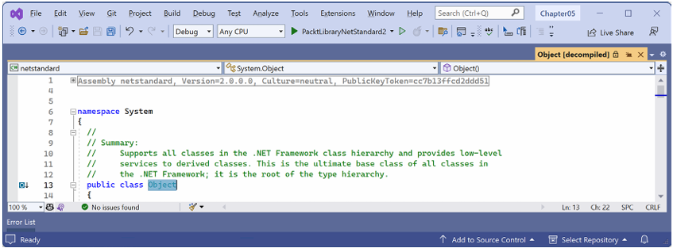

# فصل پنجم:ساختن انواع مخصوص به خود با برنامه‌نویسی شیءگرا

این فصل درباره ساختن **انواع (Types)** مخصوص به خود با استفاده از **برنامه‌نویسی شیءگرا (OOP)** است.  
در این فصل یاد می‌گیرید که یک Type چه دسته‌های مختلفی از اعضا (Members) می‌تواند داشته باشد، از جمله **فیلدها** برای ذخیره داده و **متدها** برای انجام عملیات.  
همچنین از مفاهیم شیءگرایی مانند **تجمیع (Aggregation)** و **کپسوله‌سازی (Encapsulation)** استفاده خواهید کرد.

در ادامه، با ویژگی‌های زبانی مفیدی مثل **نحو مرتبط با Tupleها**، استفاده از **متغیرهای out**، **نام‌های استنباط‌شده‌ی Tupleها** و **مقادیر پیش‌فرض (default literals)** آشنا می‌شوید.  
در نهایت، با **الگوگیری (Pattern Matching)** و **تعریف رکوردها (Records)** کار خواهید کرد تا پیاده‌سازی **برابری (Equality)** و **غیرقابل‌تغییر بودن (Immutability)** ساده‌تر شود.

این فصل موضوعات زیر را پوشش می‌دهد:
• صحبت درباره OOP  
• ساخت کتابخانه‌های کلاس  
• ذخیره‌سازی داده در فیلدها  
• کار با متدها و tupleها  
• کنترل دسترسی با ویژگی‌ها (Properties) و اندیسرها (Indexers)  
• الگوگیری (Pattern Matching) روی اشیا  
• کار با انواع رکورد (Record Types)

---

## درک مفاهیم برنامه‌نویسی شیءگرا (OOP)

یک شیء در دنیای واقعی، یک چیز است، مانند یک خودرو یا یک شخص، در حالی که یک شیء در برنامه‌نویسی اغلب نمایانگر چیزی در دنیای واقعی است، مانند یک محصول یا حساب بانکی، اما می‌تواند انتزاعی‌تر نیز باشد.
در C#، ما از کلمات کلیدی C# مانند `class`، `record` و `struct` برای تعریف یک نوع شیء استفاده می‌کنیم. شما در فصل ۶، «پیاده‌سازی رابط‌ها و ارث‌بری کلاس‌ها»، با انواع `struct` آشنا خواهید شد. شما می‌توانید یک نوع را به عنوان یک نقشه یا الگو برای یک شیء در نظر بگیرید.
ساختن انواع خودتان با برنامه‌نویسی شیءگرا
مفاهیم OOP در اینجا به طور خلاصه شرح داده شده‌اند:

* **کپسوله‌سازی (Encapsulation):** ترکیب داده‌ها و اقداماتی است که مربوط به یک شیء هستند. به عنوان مثال، یک نوع `BankAccount` ممکن است داده‌هایی مانند `Balance` و `AccountName` و همچنین اقداماتی مانند `Deposit` و `Withdraw` داشته باشد. هنگام کپسوله‌سازی، شما اغلب می‌خواهید کنترل کنید چه چیزی به آن اقدامات و داده‌ها دسترسی دارد، به عنوان مثال، محدود کردن نحوه دسترسی یا اصلاح وضعیت داخلی یک شیء از بیرون.
* **ترکیب (Composition):** در مورد اینکه یک شیء از چه چیزی ساخته شده است. به عنوان مثال، یک `Car` از اجزای مختلفی مانند چهار `Wheel`، چندین `Seat` و یک `Engine` تشکیل شده است.
* **تجمیع (Aggregation):** در مورد اینکه چه چیزی می‌تواند با یک شیء ترکیب شود. به عنوان مثال، یک `Person` بخشی از یک شیء `Car` نیست، اما می‌تواند در `Seat` راننده بنشیند و سپس راننده خودرو شود — دو شیء جداگانه که با هم ترکیب شده‌اند تا یک جزء جدید را تشکیل دهند.
* **وراثت (Inheritance):** مربوط به استفاده مجدد از کد با داشتن یک زیرکلاس که از یک کلاس پایه یا سوپرکلاس مشتق شده است. تمام قابلیت‌های کلاس پایه توسط کلاس مشتق شده به ارث برده شده و در آن در دسترس قرار می‌گیرد. به عنوان مثال، کلاس پایه یا سوپر `Exception` دارای اعضایی است که پیاده‌سازی یکسانی در تمام استثناها دارند، و کلاس زیر یا مشتق شده `SqlException` این اعضا را به ارث می‌برد و دارای اعضای اضافی است که فقط در هنگام وقوع استثنای پایگاه داده SQL، مانند یک ویژگی برای اتصال به پایگاه داده، مرتبط هستند.
* **انتزاع (Abstraction):** مربوط به ثبت ایده اصلی یک شیء و نادیده گرفتن جزئیات یا مشخصات است. C# دارای کلیدواژه `abstract` است که این مفهوم را رسمی می‌کند اما مفهوم انتزاع را با استفاده از کلیدواژه `abstract` اشتباه نگیرید زیرا این مفهوم فراتر از آن است. مفهوم انتزاع را می‌توان با استفاده از رابط‌ها نیز به دست آورد. اگر کلاسی به طور صریح انتزاعی نباشد، آنگاه می‌توان آن را بتنی توصیف کرد. کلاس‌های پایه یا سوپرکلاس‌ها اغلب انتزاعی هستند؛ به عنوان مثال، سوپرکلاس `Stream` انتزاعی است و زیرکلاس‌های آن، مانند `FileStream` و `MemoryStream`، بتنی هستند. تنها کلاس‌های بتنی را می‌توان برای ایجاد اشیاء استفاده کرد؛ کلاس‌های انتزاعی فقط می‌توانند به عنوان پایه برای کلاس‌های دیگر استفاده شوند زیرا فاقد برخی پیاده‌سازی‌ها هستند. انتزاع یک توازن دشوار است. اگر کلاسی را انتزاعی‌تر کنید، کلاس‌های بیشتری قادر به ارث بری از آن خواهند بود، اما در عین حال، قابلیت‌های کمتری برای اشتراک‌گذاری وجود خواهد داشت. یک مثال واقعی از انتزاع، رویکردی است که تولیدکنندگان خودرو نسبت به خودروهای برقی (EV) اتخاذ کرده‌اند. آن‌ها یک "پلتفرم" مشترک (اساساً فقط باتری و چرخ‌ها) ایجاد می‌کنند که انتزاعی از آنچه همه EVها نیاز دارند است، و سپس بر اساس آن، وسایل نقلیه مختلفی مانند خودروها، کامیون‌ها، ون‌ها و غیره را می‌سازند. پلتفرم به تنهایی یک محصول کامل نیست، مانند یک کلاس انتزاعی.
* **چندریختی (Polymorphism):** اجازه دادن به یک کلاس مشتق شده برای بازنویسی یک عمل ارث بری شده برای ارائه رفتار سفارشی.

در دو فصل آینده (فصل ۵ و ۶) به طور مفصل به مباحث OOP پرداخته خواهد شد. در انتهای فصل ۶، «پیاده‌سازی رابط‌ها و ارث‌بری کلاس‌ها»، خلاصه‌ای از دسته‌بندی انواع سفارشی و قابلیت‌های آن‌ها به همراه کد مثال آورده شده است تا به مرور حقایق مهم و تفاوت‌های بین انتخاب‌هایی مانند کلاس انتزاعی یا رابط کمک کند.

---

## ساخت کتابخانه‌های کلاس (Class Libraries)

اسمبلی‌های کتابخانه کلاس، نوع‌ها را در واحدهای قابل استقرار آسان (فایل‌های DLL) گروه‌بندی می‌کنند. جدا از زمانی که در مورد تست واحد آموختید، شما فقط اپلیکیشن‌های کنسولی برای نگهداری کد خود ایجاد کرده‌اید. برای اینکه کدی که می‌نویسید در پروژه‌های متعدد قابل استفاده باشد، باید آن را در اسمبلی‌های کتابخانه کلاس قرار دهید، درست همانطور که مایکروسافت انجام می‌دهد.

### ایجاد یک کتابخانه کلاس

اولین وظیفه، ایجاد یک کتابخانه کلاس .NET قابل استفاده مجدد است:

۱.  **از ابزار کدنویسی مورد علاقه خود برای ایجاد یک پروژه جدید استفاده کنید، همانطور که در لیست زیر تعریف شده است:**
    *قالب پروژه: `Class Library` / `classlib`
    *   فایل و پوشه پروژه: `PacktLibraryNetStandard2`
    *   فایل و پوشه Solution: `Chapter05`
۲.  **فایل `PacktLibraryNetStandard2.csproj` را باز کنید و توجه داشته باشید که به طور پیش‌فرض، کتابخانه‌های کلاسی که توسط SDK .NET 8 ایجاد می‌شوند، .NET 8 را هدف قرار می‌دهند و بنابراین فقط می‌توانند توسط اسمبلی‌های سازگار با .NET 8 ارجاع داده شوند، همانطور که در کد زیر برجسته شده است:**
    ```xml
    <Project Sdk="Microsoft.NET.Sdk">
      <PropertyGroup>
        <TargetFramework>net8.0</TargetFramework>
        <ImplicitUsings>enable</ImplicitUsings>
        <Nullable>enable</Nullable>
      </PropertyGroup>
    </Project>
    ```
۳.  **فریم‌ورک را برای هدف قرار دادن .NET Standard 2.0 اصلاح کنید، یک ورودی برای استفاده صریح از کامپایلر C# 12 اضافه کنید و کلاس `System.Console` را به صورت ایستا برای تمام فایل‌های C# وارد کنید، همانطور که در کد زیر برجسته شده است:**
    ```xml
    <Project Sdk="Microsoft.NET.Sdk">
      <PropertyGroup>
        <!-- کتابخانه کلاس .NET Standard 2.0 می‌تواند توسط موارد زیر استفاده شود:
             .NET Framework، Xamarin، .NET مدرن. -->
        <TargetFramework>netstandard2.0</TargetFramework>
        <!-- این کتابخانه را با استفاده از C# 12 کامپایل کنید تا بتوانیم از اکثر
             ویژگی‌های مدرن کامپایلر استفاده کنیم. -->
        <LangVersion>12</LangVersion>
    Building Your Own Types with Object-Oriented Programming 234
        <Nullable>enable</Nullable>
        <ImplicitUsings>enable</ImplicitUsings>
      </PropertyGroup>
      <ItemGroup>
        <Using Include="System.Console" Static="true" />
      </ItemGroup>
    </Project>
    ```

اگرچه می‌توانیم از کامپایلر #C 12 استفاده کنیم، برخی از ویژگی‌های مدرن کامپایلر نیازمند یک ران‌تایم (زمان اجرا) مدرن .NET هستند. برای مثال، ما نمی‌توانیم از پیاده‌سازی‌های پیش‌فرض در یک اینترفیس (که در #C 8 معرفی شد) استفاده کنیم زیرا نیازمند .NET Standard 2.1 است. ما نمی‌توانیم از کلمه کلیدی `required` (که در #C 11 معرفی شد) استفاده کنیم زیرا نیازمند ویژگی (Attribute) معرفی شده در .NET 7 است. اما بسیاری از ویژگی‌های مفید و مدرن کامپایلر، مانند رشته‌های تحت‌اللفظی خام (raw literal strings)، در دسترس ما خواهند بود.

۴. فایل را ذخیره و بسته کنید.
۵. فایلی که نام آن `Class1.cs` است را حذف کنید.
۶. پروژه را کامپایل کنید تا پروژه‌های دیگر بتوانند بعداً به آن ارجاع دهند:
• در ویژوال استودیو ۲۰۲۲، به مسیر Build | Build PacktLibraryNetStandard2 بروید.
• در ویژوال استودیو کد، دستور زیر را وارد کنید: `dotnet build`.

عملکرد خوب: برای استفاده از تمام جدیدترین ویژگی‌های زبان #C و پلتفرم دات‌نت، نوع‌ها را در یک کتابخانه کلاس دات‌نت ۸ قرار دهید. برای پشتیبانی از پلتفرم‌های قدیمی دات‌نت مانند دات‌نت کور، دات‌نت فریم‌ورک و زامارین، نوع‌هایی که ممکن است دوباره استفاده کنید را در یک کتابخانه کلاس دات‌نت استاندارد ۲.۰ قرار دهید. به‌طور پیش‌فرض، هدف قرار دادن دات‌نت استاندارد ۲.۰ از کامپایلر #C ۷ استفاده می‌کند، اما این مورد می‌تواند نادیده گرفته شود (overridden) تا از مزایای SDK و کامپایلر جدیدتر بهره‌مند شوید، حتی اگر محدود به APIهای دات‌نت استاندارد ۲.۰ باشید.

### درک فضاهای نام با محدوده فایل (File-scoped namespaces)

به‌طور سنتی، شما نوع‌هایی مانند یک کلاس را در یک فضای نام (namespace) قرار می‌دهید، همانطور که در کد زیر نشان داده شده است:

```csharp
namespace Packt.Shared
{
  public class Person
  {
  }
}
```

اگر چندین نوع را در یک فایل کد تعریف کنید، می‌توانند در فضاهای نام متفاوتی باشند، زیرا نوع‌ها باید به‌صورت صریح داخل آکولادهای هر فضای نام قرار بگیرند.

اگر از #C 10 یا بالاتر استفاده می‌کنید، می‌توانید با پایان دادن به اعلان فضای نام با یک نقطه-ویرگول (سیمیکولون) و حذف آکولادها، کد خود را ساده کنید؛ بنابراین تعاریف نوع نیازی به تورفتگی ندارند، همانطور که در کد زیر نشان داده شده است:

```csharp
// تمام نوع‌های موجود در این فایل، در این فضای نامِ با محدوده فایل تعریف خواهند شد.
namespace Packt.Shared;
public class Person
{
{
}
```

این روش، اعلان فضای نام با محدوده فایل (file-scoped namespace declaration) نامیده می‌شود. شما در هر فایل فقط می‌توانید یک فضای نام با محدوده فایل داشته باشید. این ویژگی به‌ویژه برای نویسندگان کتاب که فضای افقی محدودی دارند، مفید است.

**عملکرد خوب:** هر نوعی که ایجاد می‌کنید را در فایل کد مخصوص به خودش قرار دهید، یا حداقل نوع‌های موجود در یک فضای نام را در یک فایل کد بگذارید تا بتوانید از اعلان‌های فضای نام با محدوده فایل استفاده کنید.

### تعریف کلاس در یک فضای نام

وظیفه بعدی تعریف کلاسی است که نمایانگر یک شخص باشد:

۱. در پروژه `PacktLibraryNetStandard2`، یک فایل کلاس جدید به نام `Person.cs` اضافه کنید.
۲. در `Person.cs`، هرگونه دستورالعمل موجود را حذف کنید، فضای نام را به `Packt.Shared` تغییر دهید و برای کلاس `Person`، اصلاح‌کننده دسترسی (access modifier) را روی `public` تنظیم کنید، همانطور که در کد زیر نشان داده شده است:

```csharp
// تمام نوع‌های موجود در این فایل، در این فضای نامِ با محدوده فایل تعریف خواهند شد.
namespace Packt.Shared;

public class Person
{
}
```

**عملکرد خوب:** ما این کار را انجام می‌دهیم زیرا قرار دادن کلاس‌هایتان در یک فضای نام با نام منطقی اهمیت دارد. یک نام فضای نام بهتر، خاص دامنه (domain-specific) خواهد بود، به عنوان مثال، `System.Numerics` برای نوع‌های مرتبط با اعداد پیشرفته. در این مورد، نوع‌هایی که ایجاد خواهیم کرد `Person`، `BankAccount` و `WondersOfTheWorld` هستند و آن‌ها دامنه معمول (typical domain) ندارند، بنابراین از `Packt.Shared` عمومی‌تر استفاده خواهیم کرد.

### درک اصلاح‌کننده‌های دسترسی نوع (Type Access Modifiers)

توجه داشته باشید که کلمه کلیدی `public` سی‌شارپ قبل از `class` اعمال شده است. این کلمه کلیدی یک اصلاح‌کننده دسترسی است و به هر کد دیگری اجازه می‌دهد تا به این کلاس، حتی خارج از این کتابخانه کلاس، دسترسی داشته باشد.

اگر کلمه کلیدی `public` را به‌طور صریح اعمال نکنید، این کلاس فقط در اسمبلی‌ای که آن را تعریف کرده است قابل دسترسی خواهد بود. این به این دلیل است که اصلاح‌کننده دسترسی ضمنی (implicit access modifier) برای یک کلاس، `internal` است. ما به این کلاس نیاز داریم تا خارج از اسمبلی قابل دسترسی باشد، بنابراین باید اطمینان حاصل کنیم که `public` است.

اگر کلاس‌های تو در تو (nested classes) دارید، یعنی کلاسی که در کلاس دیگری تعریف شده است، کلاس داخلی می‌تواند اصلاح‌کننده دسترسی `private` داشته باشد، به این معنی که خارج از کلاس والد خود قابل دسترسی نخواهد بود.

اصلاح‌کننده دسترسی `file` که با .NET 7 معرفی شد و به یک نوع اعمال می‌شود، به این معنی است که آن نوع فقط در فایل کد خود قابل استفاده است. این تنها در صورتی مفید خواهد بود که چندین کلاس را در یک فایل کد تعریف کنید، که به ندرت یک رویه خوب است اما با تولیدکننده‌های منبع (source generators) استفاده می‌شود.

**اطلاعات بیشتر:** می‌توانید درباره اصلاح‌کننده دسترسی `file` در لینک زیر بیشتر بخوانید:
<https://learn.microsoft.com/en-us/dotnet/csharp/language-reference/keywords/file>

**عملکرد خوب:** دو اصلاح‌کننده دسترسی رایج برای یک کلاس، `public` و `internal` (اصلاح‌کننده دسترسی پیش‌فرض برای کلاس در صورت عدم تعیین) هستند. همیشه اصلاح‌کننده دسترسی را برای یک کلاس به‌طور صریح مشخص کنید تا سطح دسترسی آن مشخص باشد. سایر اصلاح‌کننده‌های دسترسی شامل `private` و `file` هستند، اما به ندرت استفاده می‌شوند.

### درک اعضا (Members)

نوع `Person` هنوز هیچ عضوی (member) را در خود کپسوله نکرده است. در صفحات بعدی برخی از آن‌ها را ایجاد خواهیم کرد. اعضا می‌توانند **فیلد (fields)** یا **متد (methods)** یا نسخه‌های تخصصی‌شده‌ای از هر دو باشند. در اینجا توضیحی از آن‌ها آورده شده است:

* **فیلدها (Fields)** برای ذخیره داده‌ها استفاده می‌شوند. می‌توانید فیلدها را به عنوان متغیرهایی در نظر بگیرید که متعلق به یک نوع هستند. همچنین سه دسته تخصصی از فیلد وجود دارد:
  * **ثابت (Constant):** داده‌ها هرگز تغییر نمی‌کنند. کامپایلر به معنای واقعی کلمه داده‌ها را در هر کدی که آن‌ها را می‌خواند کپی می‌کند. به عنوان مثال، `byte.MaxValue` همیشه برابر با ۲۵۵ است.
  * **فقط خواندنی (Read-only):** داده‌ها پس از ایجاد نمونه (instantiate) از کلاس، قابل تغییر نیستند، اما داده‌ها می‌توانند در زمان ایجاد نمونه، محاسبه یا از یک منبع خارجی بارگیری شوند. به عنوان مثال، `DateTime.UnixEpoch` اول ژانویه ۱۹۷۰ است.
  * **رویداد (Event):** داده‌ها به یک یا چند متد ارجاع می‌دهند که می‌خواهید هنگام وقوع اتفاقی، مانند کلیک کردن روی یک دکمه یا پاسخ به درخواستی از کد دیگر، اجرا شوند. رویدادها در فصل ۶، پیاده‌سازی اینترفیس‌ها و ارث‌بری کلاس‌ها پوشش داده خواهند شد. به عنوان مثال، `Console.CancelKeyPress` زمانی اتفاق می‌افتد که Ctrl+C یا Ctrl+Break در یک برنامه کنسولی فشرده شوند.

* **متدها (Methods)** برای اجرای دستورالعمل‌ها استفاده می‌شوند. شما نمونه‌هایی از آن‌ها را هنگام یادگیری توابع در فصل ۴، نوشتن، اشکال‌زدایی و تست توابع، مشاهده کردید. چهار دسته تخصصی از متدها نیز وجود دارد:
  * **سازنده (Constructor):** دستورالعمل‌ها هنگام استفاده از کلمه کلیدی `new` برای تخصیص حافظه جهت ایجاد نمونه‌ای از یک کلاس، اجرا می‌شوند. به عنوان مثال، برای ایجاد نمونه‌ای از روز کریسمس ۲۰۲۳، می‌توانید کد زیر را بنویسید: `new DateTime(2023, 12, 25)`.
  * **ویژگی (Property):** دستورالعمل‌ها هنگام دریافت یا تنظیم داده‌ها اجرا می‌شوند. داده‌ها معمولاً در یک فیلد ذخیره می‌شوند، اما می‌توانند به‌صورت خارجی ذخیره شوند یا در زمان اجرا محاسبه شوند. ویژگی‌ها روش ارجح برای کپسوله‌سازی فیلدها هستند، مگر اینکه نیاز باشد آدرس حافظه فیلد در معرض دید قرار گیرد. به عنوان مثال، `Console.ForegroundColor` برای تنظیم رنگ فعلی متن در یک برنامه کنسولی.
  * **ایندکسر (Indexer):** دستورالعمل‌ها هنگام دریافت یا تنظیم داده‌ها با استفاده از سینتکس "آرایه" `[]` اجرا می‌شوند. به عنوان مثال، از `name[0]` برای دریافت اولین کاراکتر در متغیر `name` که یک رشته است، استفاده کنید.
  * **عملگر (Operator):** دستورالعمل‌ها هنگام اعمال یک عملگر مانند `+` و `/` به عملوندها (operands) از نوع شما اجرا می‌شوند. به عنوان مثال، از `a + b` برای جمع کردن دو متغیر استفاده کنید.

### وارد کردن یک فضای نام برای استفاده از یک نوع (Type)

در این بخش، نمونه‌ای از کلاس `Person` را ایجاد خواهیم کرد.

قبل از اینکه بتوانیم کلاسی را نمونه‌سازی (instantiate) کنیم، باید ارجاع (reference) به اسمبلی (assembly) که آن را در بر دارد، از یک پروژه دیگر اضافه کنیم. ما از این کلاس در یک برنامه کنسولی استفاده خواهیم کرد:

**مراحل:**

1. **ایجاد پروژه برنامه کنسولی:**
    * با استفاده از ابزار کدنویسی دلخواه خود، یک برنامه کنسولی جدید با نام `PeopleApp` به راه‌حل (solution) `Chapter05` اضافه کنید. اطمینان حاصل کنید که پروژه جدید را به راه‌حل موجود اضافه می‌کنید، زیرا قرار است از برنامه کنسولی به پروژه کتابخانه کلاس موجود ارجاع دهید، بنابراین هر دو پروژه باید در یک راه‌حل باشند.

2. **اگر از Visual Studio 2022 استفاده می‌کنید:**
    * پروژه راه‌انداز (startup project) برای راه‌حل را روی انتخاب فعلی پیکربندی کنید.
    * در Solution Explorer، پروژه `PeopleApp` را انتخاب کنید، به مسیر `Project | Add Project Reference…` بروید، کادر کنار پروژه `PacktLibraryNetStandard2` را علامت بزنید و سپس روی OK کلیک کنید.
    * در فایل `PeopleApp.csproj`، ورودی زیر را برای وارد کردن ایستا (statically import) کلاس `System.Console` اضافه کنید:

        ```xml
        <ItemGroup>
          <Using Include="System.Console" Static="true" />
        </ItemGroup>
        ```

    * به مسیر `Build | Build PeopleApp` بروید.

3. **اگر از Visual Studio Code استفاده می‌کنید:**
    * فایل `PeopleApp.csproj` را ویرایش کنید تا ارجاع پروژه به `PacktLibraryNetStandard2` اضافه شود و ورودی زیر برای وارد کردن ایستا (statically import) کلاس `System.Console` را اضافه کنید:

        ```xml
        <Project Sdk="Microsoft.NET.Sdk">
          <PropertyGroup>
            <OutputType>Exe</OutputType>
            <TargetFramework>net8.0</TargetFramework>
            <Nullable>enable</Nullable>
            <ImplicitUsings>enable</ImplicitUsings>
          </PropertyGroup>
          <ItemGroup>
            <ProjectReference Include="../PacktLibraryNetStandard2/PacktLibraryNetStandard2.csproj" />
          </ItemGroup>
          <ItemGroup>
            <Using Include="System.Console" Static="true" />
          </ItemGroup>
        </Project>
        ```

    * در ترمینال، پروژه `PeopleApp` و وابستگی (dependency) آن، پروژه `PacktLibraryNetStandard2` را کامپایل کنید:

        ```bash
        dotnet build
        ```

4. **ایجاد فایل کمکی:**
    * در پروژه `PeopleApp`، یک فایل کلاس جدید با نام `Program.Helpers.cs` اضافه کنید.

5. **تعریف متد `ConfigureConsole`:**
    * در فایل `Program.Helpers.cs`، هرگونه دستورالعمل موجود را حذف کنید و یک کلاس جزئی (partial class) `Program` با متدی برای پیکربندی کنسول تعریف کنید تا نمادهای ویژه (مانند نماد ارز یورو) را فعال کند و فرهنگ (culture) فعلی را کنترل کند:

    ```csharp
    using System.Globalization; // برای استفاده از CultureInfo

    partial class Program
    {
        private static void ConfigureConsole(
            string culture = "en-US",
            bool useComputerCulture = false,
            bool showCulture = true)
        {
            OutputEncoding = System.Text.Encoding.UTF8;
            if (!useComputerCulture)
            {
                CultureInfo.CurrentCulture = CultureInfo.GetCultureInfo(culture);
            }
            if (showCulture)
            {
                WriteLine($"Current culture: {CultureInfo.CurrentCulture.DisplayName}.");
            }
        }
    }
    ```

با پایان این فصل، درک خواهید کرد که متد بالا چگونه از ویژگی‌های سی‌شارپ مانند کلاس‌های جزئی، پارامترهای اختیاری و غیره استفاده می‌کند. اگر مایلید درباره کار با زبان‌ها و فرهنگ‌ها، و همچنین تاریخ‌ها، زمان‌ها و مناطق زمانی بیشتر بدانید، فصلی درباره جهانی‌شدن (globalization) و بومی‌سازی (localization) در کتاب همراه من، «Apps and Services with .NET 8»، وجود دارد.

### نمونه‌سازی یک کلاس (Instantiating a Class)

اکنون آماده نوشتن دستورالعمل‌هایی برای نمونه‌سازی کلاس `Person` هستیم:

1. **پیکربندی کنسول:**
    * در پروژه `PeopleApp`، فایل `Program.cs` را باز کنید. تمام دستورالعمل‌های موجود را حذف کرده و سپس دستورالعمل‌های زیر را برای وارد کردن فضای نام (namespace) کلاس `Person` و فراخوانی متد `ConfigureConsole` بدون هیچ آرگومانی اضافه کنید. این کار فرهنگ فعلی را روی انگلیسی ایالات متحده تنظیم می‌کند و اطمینان می‌دهد که همه خوانندگان خروجی یکسانی را مشاهده می‌کنند:

    ```csharp
    using Packt.Shared; // برای استفاده از Person

    ConfigureConsole(); // فرهنگ فعلی را روی انگلیسی ایالات متحده تنظیم می‌کند.

    // گزینه‌های جایگزین:
    // ConfigureConsole(useComputerCulture: true); // از فرهنگ رایانه شما استفاده می‌کند.
    // ConfigureConsole(culture: "fr-FR"); // از فرهنگ فرانسوی استفاده می‌کند.
    ```

    اگرچه می‌توانستیم فضای نام `Packt.Shared` را به صورت سراسری (globally) وارد کنیم، اما با قرار دادن دستورالعمل وارد کردن در بالای فایل، برای هر کسی که این کد را می‌خواند، واضح‌تر خواهد بود که انواع (types) مورد استفاده از کجا وارد شده‌اند. علاوه بر این، پروژه `PeopleApp` فقط همین یک فایل `Program.cs` را دارد که نیاز به وارد کردن این فضای نام دارد.

2. **ایجاد نمونه و نمایش خروجی:**
    * در فایل `Program.cs`، دستورالعمل‌های زیر را برای ایجاد نمونه‌ای از نوع `Person` و نمایش آن با یک توصیف متنی از خود، اضافه کنید:

    کلمه کلیدی `new` حافظه را برای شیء (object) تخصیص می‌دهد و هر داده داخلی را مقداردهی اولیه می‌کند.

    ```csharp
    // Person bob = new Person(); // C# 1 یا جدیدتر
    // var bob = new Person(); // C# 3 یا جدیدتر
    Person bob = new(); // C# 9 یا جدیدتر

    WriteLine(bob); // فراخوانی ضمنی ToString().
    // WriteLine(bob.ToString()); // همین کار را انجام می‌دهد.
    ```

3. **اجرای پروژه و مشاهده نتیجه:**
    * پروژه `PeopleApp` را اجرا کنید و نتیجه را مشاهده کنید. خروجی باید به شکل زیر باشد:

    ```
    Current culture: English (United States).
    Packt.Shared.Person
    ```

ممکن است بپرسید: "چرا متغیر `bob` متدی به نام `ToString` دارد؟ کلاس `Person` که خالی است!" نگران نباشید، به زودی دلیل آن را خواهیم فهمید!

---

#### ارث‌بری از System.Object

اگرچه کلاس `Person` ما به صراحت انتخاب نکرده بود که از چه نوعی ارث‌بری کند، اما همه انواع (Types) در نهایت مستقیماً یا غیرمستقیم از یک نوع خاص به نام `System.Object` ارث‌بری می‌کنند. پیاده‌سازی متد `ToString` در نوع `System.Object`، نام کامل فضای نام (Namespace) و نام نوع را خروجی می‌دهد.

در کلاس اصلی `Person`، ما می‌توانستیم به صراحت به کامپایلر بگوییم که `Person` از نوع `System.Object` ارث‌بری می‌کند، همان‌طور که در کد زیر دیده می‌شود:

```csharp
public class Person : System.Object
```

وقتی کلاس B از کلاس A ارث‌بری می‌کند، می‌گوییم که A پایه (Base) یا سوپرکلاس (Superclass) است و B مشتق (Derived) یا زیرکلاس (Subclass) محسوب می‌شود. در این مورد، `System.Object` نقش پایه یا سوپرکلاس را دارد و `Person` نیز نقش مشتق یا زیرکلاس را ایفا می‌کند. همچنین می‌توانید از کلمه کلیدی `object` در زبان C# استفاده کنید.

بیایید کلاس خود را طوری تغییر دهیم که صراحتاً از `object` ارث‌بری کند و سپس بررسی کنیم که تمام اشیاء چه اعضایی دارند:

1. کلاس `Person` خود را طوری اصلاح کنید که صراحتاً از `object` ارث‌بری کند، همان‌طور که در کد زیر آمده است:

```csharp
public class Person : object
```

1. کلیک داخل کلمه کلیدی `object` را انجام دهید و کلید F12 را فشار دهید، یا روی آن راست‌کلیک کرده و گزینه «Go to Definition» (رفتن به تعریف) را انتخاب کنید.

شما نوع `System.Object` تعریف شده توسط مایکروسافت و اعضای آن را مشاهده خواهید کرد. لازم نیست در حال حاضر جزئیات آن را عمیقاً درک کنید، اما توجه داشته باشید که این کلاس در مجموعه‌ای (Assembly) کتابخانه استاندارد .NET نسخه ۲.۰ قرار دارد و دارای متدی به نام `ToString` است، همان‌طور که در شکل ۵-۱ نشان داده شده است:

 <div align="center">


</div>

**عملکرد خوب (Good Practice):** فرض کنید برنامه‌نویسان دیگر می‌دانند که اگر ارث‌بری (inheritance) مشخص نشده باشد، کلاس از `System.Object` ارث می‌برد.

#### اجتناب از تداخل فضای نام با استفاده از نام مستعار  

ما باید کمی بیشتر دربارهٔ فضای نام و نوع‌های آن‌ها یاد بگیریم. ممکن است دو فضای نام وجود داشته باشند که دارای نام نوع یکسانی باشند و وارد کردن هر دو فضای نام باعث ایجاد ابهام شود. برای مثال، `JsonOptions` در چندین فضای نام تعریف‌شده توسط مایکروسافت وجود دارد. اگر نوع اشتباهی را برای پیکربندی سریال‌سازی JSON استفاده کنید، نادیده گرفته می‌شود و شما سردرگم خواهید شد که چرا!  

بیایید یک مثال فرضی را مرور کنیم:  

```csharp
// در فایل France.Paris.cs
namespace France
{
    public class Paris
    {
    }
}

// در فایل Texas.Paris.cs
namespace Texas
{
    public class Paris
    {
    }
}

// در فایل Program.cs
using France;
using Texas;

Paris p = new();
```

اگر این پروژه را بسازیم، کامپایلر با خطای زیر مواجه می‌شود:  

```
Error CS0104: 'Paris' is an ambiguous reference between 'France.Paris' and 'Texas.Paris'
```

می‌توانیم یک نام مستعار برای یکی از فضای‌های نام تعریف کنیم تا آن‌ها را از یکدیگر متمایز کنیم، همان‌طور که در کد زیر نشان داده شده است:  

```csharp
using France; // برای استفاده از Paris.
using Tx = Texas; // Tx نام مستعار برای فضای نام می‌شود و وارد نمی‌شود.

Paris p1 = new(); // نمونه‌ای از France.Paris ایجاد می‌کند.
Tx.Paris p2 = new(); // نمونه‌ای از Texas.Paris ایجاد می‌کند.
```

#### تغییر نام یک نوع با استفاده از نام مستعار  

وضعیت دیگری که ممکن است بخواهید از یک نام مستعار استفاده کنید زمانی است که بخواهید **نام یک نوع را تغییر دهید**. برای مثال، اگر زیاد از کلاس `Environment` در فضای نام `System` استفاده می‌کنید، می‌توانید آن را با یک نام مستعار کوتاه‌تر کنید، همان‌طور که در کد زیر نشان داده شده است:

```csharp
using Env = System.Environment;

WriteLine(Env.OSVersion);
WriteLine(Env.MachineName);
WriteLine(Env.CurrentDirectory);
```

از نسخه‌ی C# 12 به بعد، می‌توانید **برای هر نوعی** نام مستعار تعریف کنید. این یعنی می‌توانید نام انواع موجود را تغییر دهید یا حتی برای انواع بدون‌نام مانند **تاپل‌ها** نام تعریف کنید؛ همان‌طور که بعداً در این فصل خواهید دید.

#### ذخیره‌سازی داده در فیلدها  

در این بخش، مجموعه‌ای از فیلدها را در یک کلاس تعریف می‌کنیم تا اطلاعات مربوط به یک شخص ذخیره شوند.

#### تعریف فیلدها  

فرض کنید تصمیم گرفته‌ایم که یک شخص از یک نام و یک تاریخ‌و‌زمان تولد تشکیل شده است. ما این دو مقدار را در یک شخص **کپسوله** می‌کنیم، و این مقادیر از بیرون قابل‌مشاهده خواهند بود.

* داخل کلاس `Person`، دستوراتی برای تعریف دو فیلد عمومی بنویسید تا نام فرد و تاریخ تولد او را ذخیره کنند، همان‌طور که در کد زیر مشخص شده است:

```csharp
public class Person : object
{
    #region Fields: Data or state for this person.
    public string? Name; // ? یعنی می‌تواند null باشد.
    public DateTimeOffset Born;
    #endregion
}
```

برای نوع داده‌ی فیلد `Born` گزینه‌های مختلفی وجود دارد.  
در .NET 6 نوع `DateOnly` معرفی شد که فقط تاریخ را بدون زمان ذخیره می‌کند.  
نوع `DateTime` تاریخ و زمان تولد را ذخیره می‌کند، اما ممکن است بین زمان محلی و UTC متفاوت باشد.  
بهترین گزینه `DateTimeOffset` است، که تاریخ، زمان و اختلاف ساعت نسبت به UTC را ذخیره می‌کند، که مرتبط با منطقه زمانی است.  

انتخاب نهایی بستگی دارد به اینکه **چه سطحی از جزئیات** لازم دارید ذخیره کنید.

#### انواع داده برای فیلدها

از سی‌شارپ ۸ به بعد، کامپایلر توانایی هشدار دادن به شما را دارد در صورتی که یک نوع مرجع مانند رشته (string) می‌تواند مقدار null داشته باشد و در نتیجه، یک استثنای مرجع Null (NullReferenceException) پرتاب کند. از .NET ۶ به بعد، این SDK این هشدارها را به طور پیش‌فرض فعال می‌کند. شما می‌توانید نوع رشته را با یک علامت سؤال `?` پسوند دهید تا نشان دهید که این موضوع را می‌پذیرید، و در نتیجه هشدار ناپدید می‌شود. در فصل ۶ با عنوان «پیاده‌سازی اینترفیس‌ها و ارث‌بری کلاس‌ها»، اطلاعات بیشتری درباره قابلیت تهی‌پذیری (nullable) و نحوه مدیریت آن یاد خواهید گرفت.

شما می‌توانید از هر نوع داده‌ای برای یک فیلد استفاده کنید، از جمله آرایه‌ها و کلکسیون‌ها مانند لیست‌ها (Lists) و دیکشنری‌ها (Dictionaries). این موارد در صورتی استفاده می‌شوند که نیاز داشته باشید چندین مقدار را در یک فیلد نام‌گذاری شده واحد ذخیره کنید. در این مثال، یک شخص فقط یک نام و یک تاریخ و زمان تولد دارد.

**تعدیل‌کننده‌های دسترسی اعضا (Member Access Modifiers)**

بخشی از کپسوله‌سازی، انتخاب میزان قابل مشاهده بودن اعضا برای سایر کدها است. توجه داشته باشید که همان‌طور که در مورد کلاس انجام دادیم، به‌طور صریح از کلمه‌ی کلیدی `public` برای این فیلدها استفاده کردیم. اگر این کار را نمی‌کردیم، آن‌ها به‌طور ضمنی `private` می‌بودند، که یعنی فقط درون خود کلاس قابل دسترسی هستند.

چهار کلمه‌ی کلیدی برای تعدیل‌کننده‌های دسترسی عضو وجود دارد و دو ترکیب از کلمات کلیدی تعدیل‌کننده‌ی دسترسی که می‌توان آن‌ها را روی یک عضو کلاس، مانند فیلد یا متد، اعمال کرد. تعدیل‌کننده‌های دسترسی عضو به هر عضو جداگانه اعمال می‌شوند. آن‌ها مشابه تعدیل‌کننده‌های دسترسی نوع هستند که به کل نوع اعمال می‌شوند، اما از آن‌ها مستقل‌اند. شش ترکیب ممکن در جدول ۵.۱ نشان داده شده است:

| تعدیل‌کننده‌ی دسترسی عضو | توضیح |
| :-------------------------- | :------ |
| `private` | عضو فقط درون خود نوع قابل دسترسی است. این حالت پیش‌فرض است. |
| `internal` | عضو درون خود نوع و هر نوعی در همان اسمبلی قابل دسترسی است. |
| `protected` | عضو درون خود نوع و هر نوعی که از آن ارث‌بری کند قابل دسترسی است. |
| `public` | عضو در همه‌جا قابل دسترسی است. |
| `internal protected` | عضو درون خود نوع، هر نوعی در همان اسمبلی، و هر نوعی که از آن ارث‌بری می‌کند قابل دسترسی است. معادل یک تعدیل‌کننده‌ی فرضی به نام `internal_or_protected` است. |
| `private protected` | عضو درون خود نوع و هر نوعی که از آن ارث‌بری می‌کند و در همان اسمبلی است قابل دسترسی است. معادل یک تعدیل‌کننده‌ی فرضی به نام `internal_and_protected` است. این ترکیب فقط از نسخه‌ی C# 7.2 یا بالاتر در دسترس است. |

**جدول ۵.۱: شش تعدیل‌کننده‌ی دسترسی عضو**

**روش درست (Good Practice):**  
یکی از تعدیل‌کننده‌های دسترسی را به‌طور صریح روی همه‌ی اعضای نوع اعمال کنید، حتی اگر قصد دارید از تعدیل‌کننده‌ی ضمنی برای اعضا استفاده کنید، که `private` است. علاوه بر این، فیلدها معمولاً باید `private` یا `protected` باشند و سپس پراپرتی‌های عمومی برای گرفتن یا تنظیم مقادیر فیلدها ایجاد کنید، زیرا پراپرتی کنترل دسترسی را برعهده دارد. شما این کار را در ادامه‌ی فصل انجام خواهید داد.

**تنظیم و نمایش مقادیر فیلدها (Setting and outputting field values)**

حالا از آن فیلدها در کد خود استفاده خواهیم کرد:

1. در فایل **Program.cs**، بعد از ساخت شیء `bob`، دستوراتی برای تنظیم نام و تاریخ تولد او اضافه کنید و سپس آن فیلدها را با قالب‌بندی مناسب چاپ کنید، همان‌طور که در کد زیر نشان داده شده است:

```csharp
bob.Name = "Bob Smith";
bob.Born = new DateTimeOffset(
  year: 1965, month: 12, day: 22,
  hour: 16, minute: 28, second: 0, 
  offset: TimeSpan.FromHours(-5)); // زمان استاندارد شرق ایالات متحده (EST)

WriteLine(format: "{0} was born on {1:D}.",  // قالب تاریخ بلند (Long date)
  arg0: bob.Name, arg1: bob.Born);
```

کد قالب (format code) برای `arg1` یکی از قالب‌های استاندارد تاریخ و زمان است.  
`D` به معنی **قالب تاریخ بلند (long date)** است و اگر از `d` استفاده کنید، **تاریخ کوتاه (short date)** را نمایش می‌دهد.  
می‌توانید درباره‌ی قالب‌های استاندارد تاریخ و زمان بیشتر در لینک زیر بخوانید:

🔗 [Standard date and time format strings - Microsoft Learn](https://learn.microsoft.com/en-us/dotnet/standard/base-types/standard-date-and-time-format-strings)

---

1. پروژه‌ی **PeopleApp** را اجرا کنید و نتیجه را مشاهده کنید. خروجی باید مشابه زیر باشد:

```
Bob Smith was born on Wednesday, December 22, 1965.
```

اگر در فراخوانی تابع `ConfigureConsole` از فرهنگ محلی (local culture) سیستم خود یا فرهنگی دیگر مثل فرانسوی در فرانسه (`"fr-FR"`) استفاده کنید، خروجی شما متفاوت خواهد بود.  
برای مثال، در فرهنگ فرانسوی ممکن است تاریخ به‌صورت زیر نمایش داده شود:

```
Bob Smith est né le mercredi 22 décembre 1965.
```

**تنظیم مقدار فیلدها با استفاده از سینتکس مقداردهی اولیهٔ شیء (Object Initializer Syntax)**

شما می‌توانید فیلدها را با استفاده از سینتکس خلاصه‌تری به نام **Object Initializer** که از نسخه‌ی C# 3 معرفی شد، مقداردهی کنید. بیایید ببینیم چطور:

---

1. زیرِ کدهای موجود، دستورات لازم را اضافه کنید تا یک شخص جدید به نام **Alice** ایجاد شود. توجه کنید که در زمان چاپ تاریخ تولد او، از **کد قالب استاندارد متفاوتی** برای تاریخ استفاده شده است. نمونهٔ کد زیر را ببینید:

```csharp
Person alice = new()
{
  Name = "Alice Jones",
  Born = new(1998, 3, 7, 16, 28, 0,
    // این یک اختلاف اختیاری از منطقهٔ زمانی UTC است.
    TimeSpan.Zero)
};

WriteLine(format: "{0} was born on {1:d}.", // تاریخ کوتاه (short date)
  arg0: alice.Name, arg1: alice.Born);
```

ما می‌توانستیم از **interpolation رشته‌ای** برای قالب‌بندی خروجی استفاده کنیم،  
اما در رشته‌های طولانی، این کار باعث چندخطی شدن کد می‌شود و در یک کتاب چاپ‌شده خوانایی را کاهش می‌دهد.  

در مثال‌های این کتاب به خاطر داشته باشید که `{0}` جایگزین `arg0` است و به همین ترتیب `{1}` برای `arg1` و … .

---

1. پروژهٔ **PeopleApp** را اجرا کنید و خروجی مشابه زیر خواهید دید:

```
Alice Jones was born on 3/7/1998.
```

---

**روش درست (Good Practice):**  
برای خوانایی بیشتر، از **پارامترهای نام‌گذاری‌شده (named parameters)** هنگام ارسال آرگومان‌ها استفاده کنید، خصوصاً برای نوع‌هایی مثل `DateTimeOffset` که چندین عدد پشت سر هم دارند و تشخیص معنی هر کدام سخت‌تر می‌شود.

#### ذخیره‌سازی مقدار با استفاده از نوع enum  

گاهی لازم است یک مقدار فقط یکی از چند گزینهٔ محدود باشد. برای مثال، هفت شگفتی دنیای باستان وجود دارد و هر شخص ممکن است یکی را به‌عنوان مورد علاقه داشته باشد.  
در مواقع دیگر، یک مقدار باید ترکیبی از مجموعهٔ محدودی از گزینه‌ها باشد. برای مثال، یک شخص ممکن است فهرست آرزوهایی از شگفتی‌های دنیای باستان داشته باشد که می‌خواهد از آن‌ها بازدید کند. ما می‌توانیم این داده را با تعریف یک نوع enum ذخیره کنیم.  

یک نوع enum روشی بسیار کارآمد برای ذخیره‌سازی یک یا چند انتخاب است، زیرا درونی‌سازی آن با استفاده از مقادیر عدد صحیح همراه با یک جدول نگاشت رشته‌ای انجام می‌شود. بیایید یک مثال ببینیم:

1. یک فایل جدید به پروژهٔ **PacktLibraryNetStandard2** با نام **WondersOfTheAncientWorld.cs** اضافه کنید.

2. محتوای فایل **WondersOfTheAncientWorld.cs** را مطابق کد زیر تغییر دهید:

```csharp
namespace Packt.Shared;
public enum WondersOfTheAncientWorld
{
  GreatPyramidOfGiza,
  HangingGardensOfBabylon,
  StatueOfZeusAtOlympia,
  TempleOfArtemisAtEphesus,
  MausoleumAtHalicarnassus,
  ColossusOfRhodes,
  LighthouseOfAlexandria
}
```

1. در فایل **Person.cs** یک فیلد برای ذخیرهٔ شگفتی مورد علاقهٔ یک شخص تعریف کنید، همان‌طور که در کد زیر نشان داده شده است:

```csharp
public WondersOfTheAncientWorld FavoriteAncientWonder;
```

1. در فایل **Program.cs** شگفتی مورد علاقهٔ Bob را تنظیم کرده و آن را چاپ کنید، همان‌طور که در کد زیر آمده است:

```csharp
bob.FavoriteAncientWonder = WondersOfTheAncientWorld.
  StatueOfZeusAtOlympia;

WriteLine(
  format: "{0}'s favorite wonder is {1}. Its integer is {2}.",
  arg0: bob.Name,
  arg1: bob.FavoriteAncientWonder,
  arg2: (int)bob.FavoriteAncientWonder);
```

1. پروژهٔ **PeopleApp** را اجرا کنید و خروجی را ببینید، مانند زیر:

```
Bob Smith's favorite wonder is StatueOfZeusAtOlympia. Its integer is 2.
```

مقدار enum درونی‌سازی شده به‌صورت یک عدد صحیح ذخیره می‌شود. مقادیر int از ۰ شروع و به‌صورت خودکار تخصیص داده می‌شوند، بنابراین سومین شگفتی دنیای باستان در enum ما مقدار ۲ خواهد داشت.  
شما می‌توانید مقدار int ای تنظیم کنید که در enum تعریف نشده باشد. چنین مقداری به‌صورت عدد صحیح نمایش داده می‌شود، زیرا نامی مطابق با آن یافت نخواهد شد.

ذخیره‌سازی مقادیر متعدد با استفاده از نوع enum  
برای فهرست آرزوها (bucket list)، می‌توانیم یک آرایه یا مجموعه از نمونه‌های enum ایجاد کنیم و مجموعه‌ها به‌عنوان فیلدها بعداً در این فصل نشان داده خواهند شد، اما رویکرد بهتری برای این سناریو وجود دارد. ما می‌توانیم چندین انتخاب را با استفاده از **enum flags** در یک مقدار واحد ترکیب کنیم. بیایید ببینیم چطور:

1. enum را با اضافه کردن خصوصیت `[Flags]` ویرایش کنید و به‌طور صریح یک مقدار بایت (byte) برای هر شگفتی که ستون‌های بیت متفاوتی را نشان می‌دهد، تعیین کنید، همان‌طور که در کد زیر مشخص شده است:

```csharp
namespace Packt.Shared;

[Flags]
public enum WondersOfTheAncientWorld : byte
{
  None                     = 0b_0000_0000, // یعنی 0
  GreatPyramidOfGiza       = 0b_0000_0001, // یعنی 1
  HangingGardensOfBabylon  = 0b_0000_0010, // یعنی 2
  StatueOfZeusAtOlympia    = 0b_0000_0100, // یعنی 4
  TempleOfArtemisAtEphesus = 0b_0000_1000, // یعنی 8
  MausoleumAtHalicarnassus = 0b_0001_0000, // یعنی 16
  ColossusOfRhodes         = 0b_0010_0000, // یعنی 32
  LighthouseOfAlexandria   = 0b_0100_0000  // یعنی 64
}
```

ما مقادیر صریحی را برای هر انتخاب تعیین می‌کنیم که هنگام مشاهدهٔ بیت‌های ذخیره شده در حافظه، با هم تداخل نخواهند داشت. همچنین باید نوع enum را با خصوصیت `System.Flags` تزئین کنیم تا زمانی که مقدار بازگردانده می‌شود، بتواند به‌طور خودکار با چندین مقدار به‌عنوان رشته‌ای با جداکنندهٔ کاما مطابقت داده شود، به‌جای اینکه یک مقدار int را برگرداند.

به‌طور معمول، یک نوع enum از یک متغیر int درونی استفاده می‌کند، اما از آنجایی که به مقادیر بزرگ نیازی نداریم، می‌توانیم با تعیین اینکه از یک متغیر بایت استفاده کند، نیازمندی‌های حافظه را ۷۵٪ کاهش دهیم (یعنی ۱ بایت به ازای هر مقدار به‌جای ۴ بایت). به عنوان مثال دیگر، اگر می‌خواستید برای روزهای هفته یک enum تعریف کنید، فقط هفت گزینه وجود خواهد داشت.

اگر بخواهیم نشان دهیم که فهرست آرزوهای ما شامل باغ‌های معلق بابل و مقبرهٔ هالیکارناسوس از شگفتی‌های دنیای باستان است، آن‌گاه باید بیت‌های 16 و 2 را روی 1 تنظیم کنیم. به عبارت دیگر، مقدار 18 را ذخیره خواهیم کرد، همان‌طور که در جدول 5.2 نشان داده شده است:

| 64 | 32 | 16 | 8 | 4 | 2 | 1 |
|----|----|----|---|---|---|---|
| 0  | 0  | 1  | 0 | 0 | 1 | 0 |

جدول 5.2: ذخیرهٔ عدد 18 به صورت بیت‌ها در یک enum

1. در فایل **Person.cs**، فیلد موجود برای ذخیرهٔ یک شگفتیِ مورد علاقه را نگه دارید و دستور زیر را به فهرست فیلدها برای ذخیرهٔ چند شگفتی از دنیای باستان اضافه کنید، همان‌طور که در کد زیر نشان داده شده است:

```csharp
public WondersOfTheAncientWorld BucketList;
```

1. در فایل **Program.cs**، دستوراتی را اضافه کنید تا فهرست آرزوها را با استفاده از عملگر `|` (عملگر منطقی بیتی OR) تنظیم کند تا مقادیر enum ترکیب شوند. همچنین می‌توانیم مقدار را با عدد 18 و تبدیل آن به نوع enum تنظیم کنیم، همان‌طور که در توضیح کد آمده است، اما نباید این کار را انجام دهیم، زیرا باعث می‌شود کد سخت‌تر درک شود، همان‌طور که در کد زیر نشان داده شده است:

```csharp
bob.BucketList = 
  WondersOfTheAncientWorld.HangingGardensOfBabylon
  | WondersOfTheAncientWorld.MausoleumAtHalicarnassus;
// bob.BucketList = (WondersOfTheAncientWorld)18;
WriteLine($"{bob.Name}'s bucket list is {bob.BucketList}.");
```

1. پروژهٔ **PeopleApp** را اجرا کنید و نتیجه را مشاهده نمایید، همان‌طور که در خروجی زیر نشان داده شده است:

```
Bob Smith's bucket list is HangingGardensOfBabylon, 
MausoleumAtHalicarnassus.
```

**روش خوب:** از مقادیر enum برای ذخیرهٔ ترکیب گزینه‌های مجزا استفاده کنید. نوع enum را از `byte` مشتق کنید اگر حداکثر هشت گزینه وجود دارد، از `ushort` اگر تا شانزده گزینه وجود دارد، از `uint` اگر تا سی‌ودو گزینه وجود دارد، و از `ulong` اگر تا شصت‌وچهار گزینه وجود دارد.

اکنون که enum را با ویژگی `[Flags]` تزئین کرده‌ایم، ترکیب مقادیر می‌تواند در یک متغیر یا فیلد ذخیره شود. حالا یک برنامه‌نویس می‌تواند ترکیبی از مقادیر را در `FavoriteAncientWonder` هم ذخیره کند، در حالی که این فیلد باید فقط یک مقدار را ذخیره کند. برای اعمال این محدودیت، باید فیلد را به ویژگی (property) تبدیل کنیم تا بتوانیم کنترل کنیم سایر برنامه‌نویسان چگونه مقدار را دریافت و تنظیم می‌کنند. خواهید دید که چگونه این کار را در ادامهٔ این فصل انجام دهید.

#### ذخیره‌سازی چند مقدار با استفاده از مجموعه‌ها  

اکنون بیایید یک فیلد برای ذخیرهٔ فرزندان یک شخص اضافه کنیم. این یک نمونه از **aggregation** است، زیرا فرزندان نمونه‌هایی از یک کلاس هستند که به شخص فعلی مرتبط‌اند، اما بخشی از خود شخص محسوب نمی‌شوند.  
ما از مجموعهٔ عمومی **`List<T>`** استفاده می‌کنیم که می‌تواند مجموعه‌ای مرتب از هر نوع داده‌ای را ذخیره کند. شما در فصل ۸ (کار با انواع رایج .NET) بیشتر دربارهٔ مجموعه‌ها یاد خواهید گرفت. فعلاً فقط مراحل زیر را دنبال کنید:

• در فایل **Person.cs**، یک فیلد جدید برای ذخیرهٔ چند نمونهٔ `Person` که نمایندهٔ فرزندان این شخص هستند، تعریف کنید، همان‌طور که در کد زیر آمده است:

```csharp
public List<Person> Children = new();
```

`List<Person>` به‌صورت «لیستِ پرسن» خوانده می‌شود، یعنی: «نوع ویژگی‌ای به نام Children یک لیست از نمونه‌های Person است.»

ما باید مطمئن شویم که مجموعه قبل از افزودن موارد جدید، به یک نمونهٔ جدید مقداردهی اولیه شده است؛ در غیر این صورت، مقدار آن `null` خواهد بود و هنگام تلاش برای استفاده از هر یک از اعضای آن، مانند `Add`، در زمان اجرا خطا ایجاد خواهد کرد.

---

#### فهمیدن مجموعه‌های Generic  

علامت‌های زاویه‌دار در نوع `List<T>`، ویژگی‌ای در C# به نام Generics است که در سال ۲۰۰۵ با C# 2 معرفی شد. این یک اصطلاح فانتزی برای ایجاد یک مجموعه با نوع‌دهی قوی (strongly typed) است؛ یعنی کامپایلر به طور مشخص می‌داند چه نوع شیئی می‌تواند در مجموعه ذخیره شود. Generics عملکرد و صحت کد شما را بهبود می‌بخشد.

«نوع‌دهی قوی» (Strongly typed) معنای متفاوتی نسبت به «نوع‌دهی ایستا» (statically typed) دارد. انواع قدیمی `System.Collection` برای نگهداری موارد `System.Object` با نوع‌دهی ضعیف (weakly typed) نوع‌دهی ایستا شده بودند. انواع جدیدتر `System.Collection.Generic` برای نگهداری نمونه‌های `<T>` با نوع‌دهی قوی (strongly typed) نوع‌دهی ایستا شده‌اند.

به‌طور کنایه‌آمیزی، اصطلاح Generics به این معنی است که ما می‌توانیم از یک نوع ایستا (static type) خاص‌تر استفاده کنیم!

۱. در `Program.cs`، دستوراتی را برای افزودن سه فرزند به Bob اضافه کنید و سپس نشان دهید که او چند فرزند دارد و نام آن‌ها چیست، همان‌طور که در کد زیر آمده است:

```csharp
// با تمام نسخه‌های C# کار می‌کند.
Person alfred = new Person();
alfred.Name = "Alfred";
bob.Children.Add(alfred);

// با C# 3 و نسخه‌های جدیدتر کار می‌کند.
bob.Children.Add(new Person { Name = "Bella" });

// با C# 9 و نسخه‌های جدیدتر کار می‌کند.
bob.Children.Add(new() { Name = "Zoe" });

WriteLine($"{bob.Name} has {bob.Children.Count} children:");

for (int childIndex = 0; childIndex < bob.Children.Count; childIndex++)
{
  WriteLine($"> {bob.Children[childIndex].Name}");
}
```

۲. پروژهٔ `PeopleApp` را اجرا کرده و نتیجه را مشاهده کنید، همان‌طور که در خروجی زیر آمده است:

```
Bob Smith has 3 children:
> Alfred
> Bella
> Zoe
```

ما همچنین می‌توانیم از دستور `foreach` برای پیمایش مجموعه استفاده کنیم. به عنوان یک چالش اختیاری، دستور `for` را برای نمایش همین اطلاعات با استفاده از `foreach` تغییر دهید.
